# 图论程序员简明实用指南

> 原文：<https://betterprogramming.pub/a-short-practical-programmers-guide-to-graph-theory-bfc87bc52581>

## 图论入门

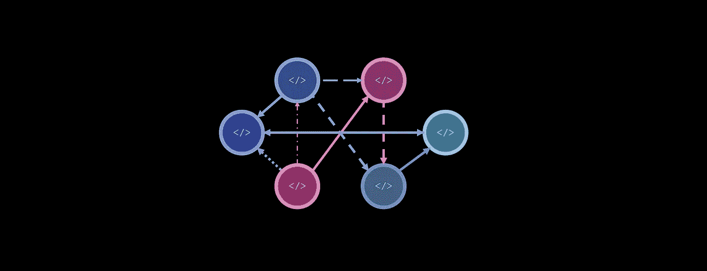

图片来源:作者

在编程中，图是非常有用的结构，因为计算机科学问题通常可以用图来表示，并用许多现有的图形技术来解决。此外，不一定直接使用图表，而是通过基于图表的思维和建模来处理问题，可以提高任务的清晰度和效率。

虽然图论是一个深奥而迷人的领域，但本文将使用以下部分来涵盖与程序员相关的图论的广泛部分:

*   基于图/节点的思想和搜索问题的方法
*   用面向对象编程实现一个图形
*   图形的不同表示(邻接表、邻接矩阵)
*   图的类型及其实现:无/有向图，无/加权图，循环图，a/循环图
*   Dijkstra 的算法、弱点和替代方案
*   图论的应用
*   总结/要点

无向无权重图是图的最简单形式(除了单个节点)。它只由两种类型的元素组成:节点，可以认为是点，以及连接这些点的边。没有距离/成本或方向的概念，这就是为什么它是无方向和无权重的。

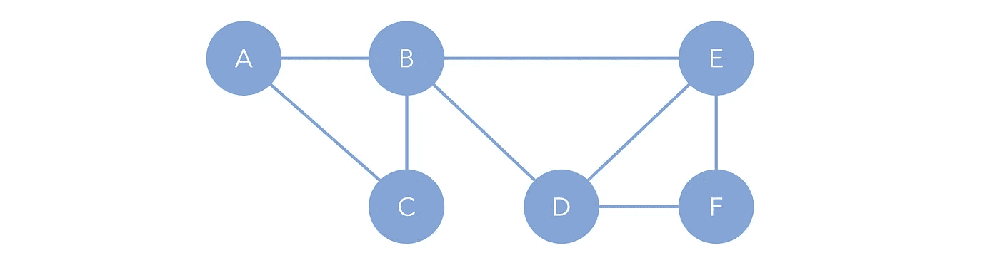

图片来源:作者

例如，考虑以下搜索问题，并将其表示为一个无向图和无权重图:

您有一个两位数的挂锁，初始化为 00。每次移动，您可以上下移动四个两个中的一个(向上移动 0 是 1，向下移动 0 是 9 —轮子是圆形的)。有“死组合”，如果组合等于这些值中的一个，挂锁将永久锁定。找到在不锁定的情况下达到目标组合所需的最少移动次数，或者如果可能的话。

死组合:[10，90，12]。目标:11。

首先，我们构建一个根，或者说图的头部，这在我们需要生成图的场景中是必要的。这是 00，或者是将从中生成分支事例的根事例。

节点 00 的四个邻居是 01、10、90 和 09，对应于上下移动轮子的各种组合。我们的图已经有五个节点和四条边。

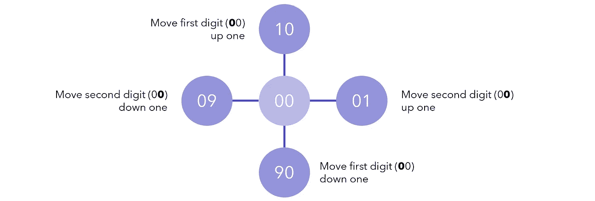

图片来源:作者

对于每个新添加的节点，我们将继续搜索它的邻居并将其添加到图中，除非它是死节点。

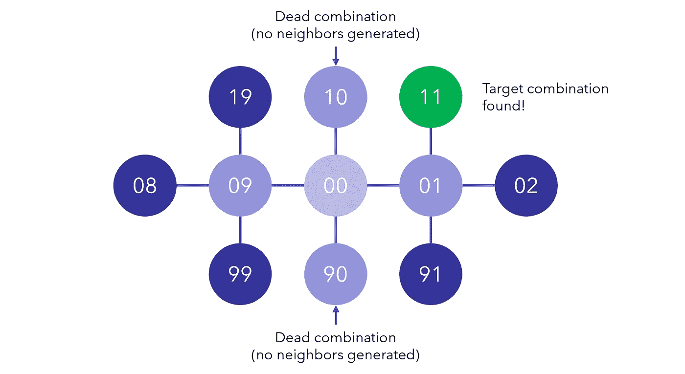

图片来源:作者

当我们找到目标组合时，我们可以返回我们的步骤，并计算再次到达根节点需要多少次。或者，我们可以在每次生成节点时跟踪这些步骤。


图片来源:作者

如果要实现这个问题的解决方案，可以使用队列和广度优先搜索，这比实际编码一个图更有效率。

这是使用基于图表的思维的一个例子。由于图是非常有序和清晰的结构，将可能性作为节点，将变量作为邻居来思考和实现，可以导致复杂但清晰和可理解的搜索。此外，使用图允许实现图论中的许多研究方法来加速搜索。

然而，在这个挂锁问题中，实际上并不需要实现图形。实现一个完整图的最常见方法是使用两个对象(类)，一个是主要构建块`Node`，另一个是由`Node`组成的`Graph`，它提供了一个接口来访问关于整个图的信息。

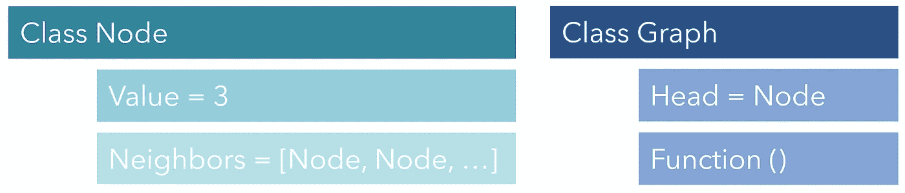

图片来源:作者

例如，下图中的每个元素都可以用代码表示为它们自己的`Node`。每个人都通过他们的`Neighbors`互相连接。如果我们调用类似于`NodeA.Neighbors[1].Neighbors[1].Value`的东西，我们应该得到 2。这是因为节点 A 的邻居的第二个索引是节点 C，节点 C 的邻居的第二个索引是节点 B，其值为 2。这种简单的连接允许简单的遍历。

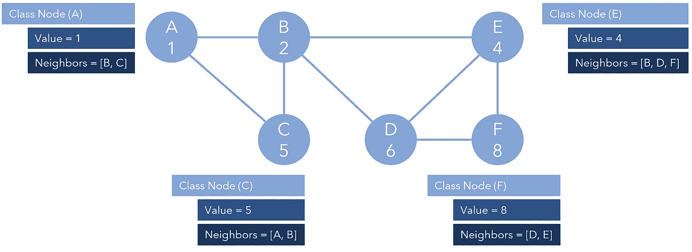

对于符号，“A 1”意味着“节点 A 的值为 1”。(图片来源:作者)

有向图，或者边只朝一个方向的图，用这种设计很容易实现。例如，如果单向边将节点 A 连接到节点 B，则节点 A 的邻居将是节点 B，但是节点 B 将没有邻居。换句话说，邻居仅指示*出站边缘*。请注意，双向边仍然可以存在于有向图中。

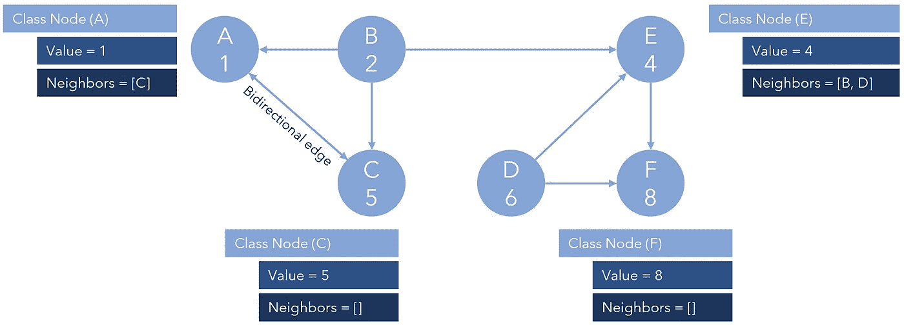

图片来源:作者

如果一个人根据邻居遍历图，并在节点 C 或节点 F 结束，他们将被卡住，因为这些节点没有邻居，因此没有出站方向。

或者，可以更简单地表示一个图，但代价是不容易遍历，用两个列表表示边和节点(顶点)。这些有时被称为*邻接表*，因为它们以列表格式表示边之间的邻接(邻接是边，相邻节点是邻居)。

```
V = [A, B, C, D, E, F]
E = [AB, AC, BC, CF, CE, DF, EA, FB, FD]
```

在上面的例子中，`V`声明存在的节点，E 声明从一个节点到另一个节点的边(`AC`表示`A` → `C`)。因为它是紧凑和简单的符号，所以图形经常以这种方式表示。

或者，它可以写成一个字典(map)，其中的键是一个起始节点，它的值是它所指向的元素列表。

```
adj_l = {A:[B,C], B:[C], C:[F,E], D:[F], E:[A], F:{B,D]}
```

有向图和无向图都可以包含回路。一个*循环图*是一个只包含一个循环的图，在这个图中没有终止节点，一个人可以无限地遍历整个图。*循环图*是由几个循环图组成的图，其中遍历仍然可以是无限的，但是更加复杂。

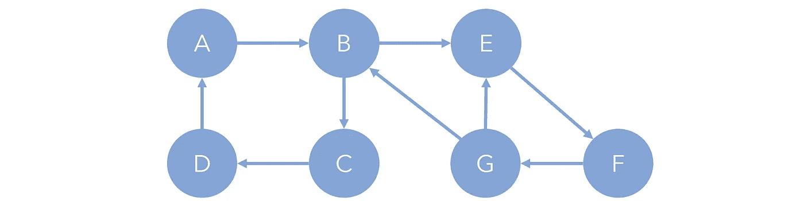

图片来源:作者

比如在完全循环图内，A→B→C→D→A 是四圈图，E→F→G→E 是三圈图。更隐蔽的是另一个四圈图，B→E→F→G→B。

循环图中的某些类型的圈，或者图中每个节点都与其他节点相连的其他组件，被称为*强连通组件*。例如，E→F→G→E 是一个强连通分量，因为每个节点{E，F，G}都有一条通向另一个节点的路径，而与方向无关。B→E→F→G→B 也是强连通分量。另一方面，A→B→C→D→A 不是因为组成成员 B 和 D 之间没有联系。

另一方面，顾名思义，非循环图是不存在循环的图，任何足够长的遍历最终都会终止。在下图中，无论从哪个节点开始，遍历总是会终止。

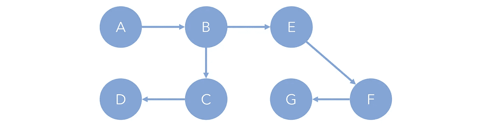

图片来源:作者

在更复杂的问题中，边并不总是被天真地视为等同于旅行。例如，如果您计划从起点到终点的最佳路线，您不仅要考虑路段数量，还要考虑距离和成本。

例如，从 S→E 的最短路径是 S→D→F→E，它只需要三次边遍历。然而，那条路线经过一条非常小、拥挤的街道。或者，S→A→B→C→E 取四条边，但大部分距离沿公路行驶，总成本减少。当距离和成本的概念被添加到一个图中时，它就变得有了权重。

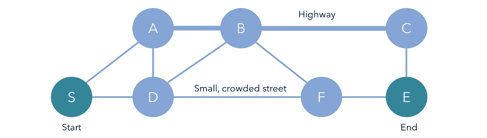

图片来源:作者

为了在我们现有的图结构框架中实现这一点，我们可以在`Neighbors`中为每个元素包含另一个描述到达该邻居的成本的数字。例如，它可以存储在元组`[(n, c), (n, c)]`中，其中`n`表示节点，`c`表示成本。

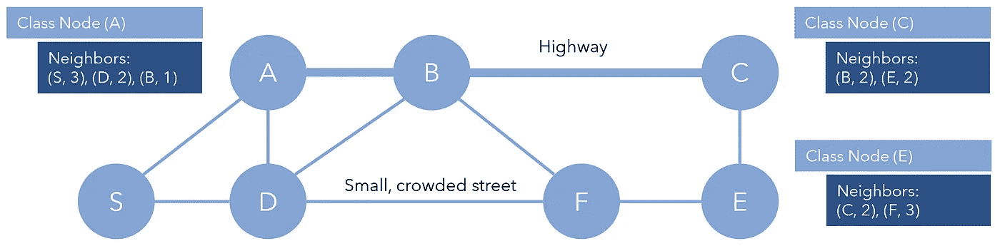

图片来源:作者

通常，图也会以矩阵的形式呈现，称为*邻接矩阵*。这不像邻接表那样紧凑，但是可以更自然地表示加权图。在矩阵中，每一行和每一列代表一个节点，位于( *x* ， *y* )的单元代表边 *y* → *x* (或者相反，这是一个符号问题)。如果没有边，则值为 0。如果有，这个值就是这条边的成本。

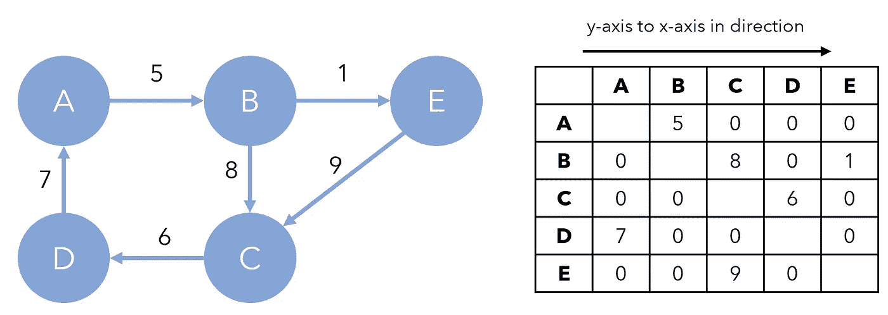

图片来源:作者

与邻接表和面向对象的表示相比，邻接矩阵还具有容易查找成本的优点，即使是没有权重的图。请注意，无向图将有对称的邻接矩阵。由于矩阵也更容易操作，许多图形操作和算法通常在邻接矩阵上实现。

人们创造了各种算法来寻找加权图的最短路径，比如 Dijkstra 的算法(读作 *dike-strah* )。从本质上讲，Dijkstra 的算法非常类似于前面讨论的挂锁问题的强力搜索，但它是以最符合逻辑的方式进行的。算法的大致轮廓如下:

1.  从起始节点开始，初始化一个列表(优先级队列)来跟踪要处理的节点。
2.  在算法的每次迭代中，找到列表的第一个元素。通过查找元素的所有相邻节点(之前没有浏览过的节点)来处理元素。
3.  对于每个邻居，计算从起始节点到该节点的总距离/开销。将这些邻居节点放入列表中，使得具有最低成本的节点位于前面。
4.  重复此操作，直到处理完结束节点。

关于 Dijkstra 算法有很多更深入的资源，但主要的是，它与强力搜索的主要区别是，它首先处理当前成本最小的节点，这在逻辑上是正确的。这可以通过考虑权重来加速冗余搜索。

虽然在许多情况下 Dijkstra 是强大的，但它是天真的，因为它只选择处理当前拥有最佳成本的节点，希望完整路径也拥有类似的小成本，而实际情况可能根本不是这样。在大型图表中，这可能是一个问题。

例如，考虑这个节点网格，其中每个连接都有相同的遍历成本；Dijkstra 的算法(根据实现略有不同)将在到达结束节点`E`之前搜索所有光节点。这就像在节点`S`的位置倒一桶水，希望它最终蔓延到目标节点。

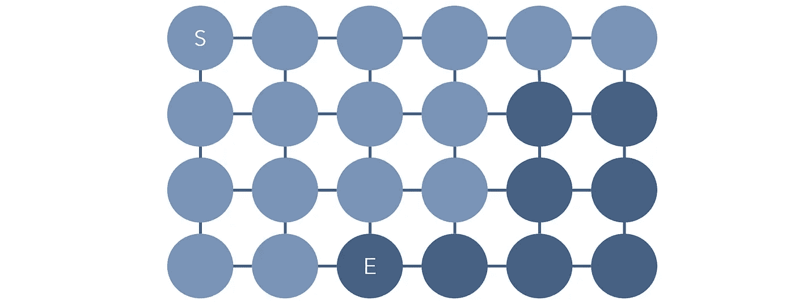

图片来源:作者

A Star 算法和许多其他变体考虑到了这些弱点，并添加了增强功能，如更强的内存和方向，以改善整个图形的遍历。机器学习，尤其是强化学习，是最近高效图遍历方法的核心。在强化学习中，概率和状态通常表示为代理遍历的图形。

图形和基于图形的思维可以用于许多其他计算机科学问题，即使在不明显的时候。每当你处理一个难题时，尝试用顶点和边来表示它可以激发新的想法，简化和减少问题，甚至是问题的一个解决方案。

图论在计算机科学中的一些应用包括:

*   复杂网络的建模，如社交网络或新型冠状病毒等疾病的模拟。每个节点可以代表一个人或一个群体，边可以代表传播的概率/容易程度。在这个模型中，我们可以尝试识别或形成圆形的封闭图形。
*   组织和任何等级制度。图表不必是多圈的和循环的；他们也可以表达一种等级制度。例如，如果您要为一个本地图书馆创建一个 API 来访问各种内容的书籍，那么您会想要创建一个图表。如果你想为你的网站创建一个站点地图，你可以使用图表。[图形数据库](https://en.wikipedia.org/wiki/Graph_database)是专门依靠图形的有组织层次来存储数据的数据库类型。
*   任何涉及一个代理在许多地点或州之间旅行的问题都很可能用一个图来很好地表示。使用图形有助于降低几乎所有编程问题的复杂性。
*   像谷歌地图这样的服务，它告诉你最佳路线，不仅考虑距离，还考虑交通时间、海拔、通行费等。本质上，这是在一个巨大的加权图中寻找最佳路径(想象每隔几英尺左右有一个节点，一个跨越地球的图)。
*   图论被用于证明[四色定理](https://en.wikipedia.org/wiki/Four_color_theorem)，这成为第一个被接受的在计算机上运行的数学证明。
*   在自然语言处理中，机器学习的一个分支处理语言的建模，单词和文本的加权[图形表示非常有价值，因为它们可以提供对例如属于相似聚类(*苹果*、*橙子*)或通过距离表示相似事物的单词的洞察。](https://towardsdatascience.com/mining-order-from-chaos-the-ingenious-and-creative-fusion-of-nlp-graph-theory-954b10e2f976)

# 要点

*   图由一组节点(也称为顶点)和边(或节点之间的连接)组成。
*   图的两种表示法包括邻接表和邻接矩阵。后者支持更容易的索引和操作，但比前者占用更多的空间。
*   完整的图形可以使用`Node`对象来实现，这些对象有一个值和一组邻居。
*   有向图有方向。加权图将距离或成本的概念应用于每条边。循环图包含可以无限遍历的圈。
*   Dijkstra 算法用于查找加权图中两个节点之间的最短距离。它通常是有效的，但有些天真，这就是为什么有许多其他算法致力于寻找最佳的图遍历。
*   无论是在实现上还是在思维范式上，图都可以应用于非常广泛的计算机科学和编程问题。