# 两个伟大的 iOS 视图调试工具的并排比较

> 原文：<https://betterprogramming.pub/a-side-by-side-comparison-of-two-great-ios-views-debugging-tools-85fefbf69881>

## RevealApp vs. Lookin

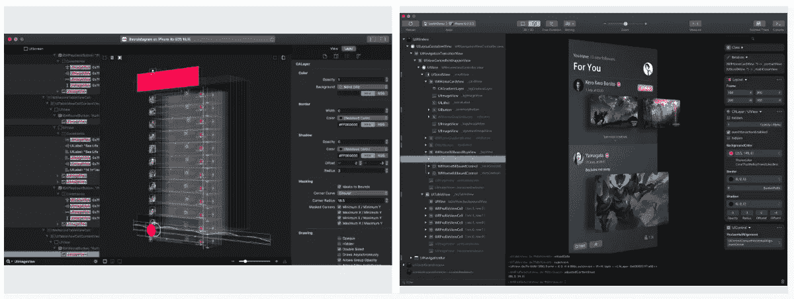

RevealApp vs. Lookin

有许多工具和应用程序使我们的软件开发任务变得稍微容易一些。我们通常专注于帮助我们编写更好的代码或者节省新功能开发时间的工具。我们通常使用库、类和各种使我们的工作更容易的东西。

但是，我们还必须注意我们在应用程序中提供的用户界面的质量，在某些时候，我们会花很多时间猜测我们的视图实现、我们的约束或者我们的视图实际上是如何工作的。

# 为什么是调试视图的工具？

我喜欢干净的代码，但我也喜欢我的视图完全符合设计规范，没有任何视觉错误(我讨厌看起来糟糕的应用程序)。我尽量不要有约束警告或大量的嵌套视图，并且我想知道我的代码是如何运行的。但是我如何知道代码生成的视图是如何工作的呢？

这就是帮助我检查应用程序视图的工具的用武之地。它们开启了一个全新的调试世界。现在我不必猜测我的观点如何表现。

这些应用程序使我们能够动态修改应用程序。您将在几秒钟内调试视图设计和呈现问题。

有两个我经常使用的主要应用程序。

## RevealApp

这是一个相当强大的应用程序，由澳大利亚的 Itty Bitty Apps 公司提供支持。该应用程序不断更新，非常稳定。

地点:[https://revealapp.com/](https://revealapp.com/)

业主:【https://www.ittybittyapps.com/ 

**价格:**起价 **$59** 年

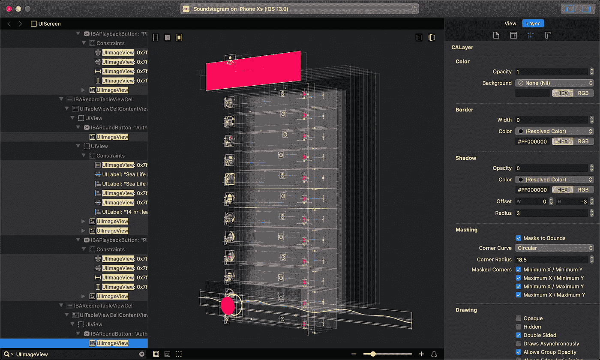

## 看着

这是由 QMUI 团队创建和维护的，QMUI 团队是一个亚洲团队，有一些有趣的开源项目。

地点:[https://lookin.work/](https://lookin.work/)

业主:[https://qmuiteam.com/web/page/index.html](https://qmuiteam.com/web/page/index.html)

**价格:**免费

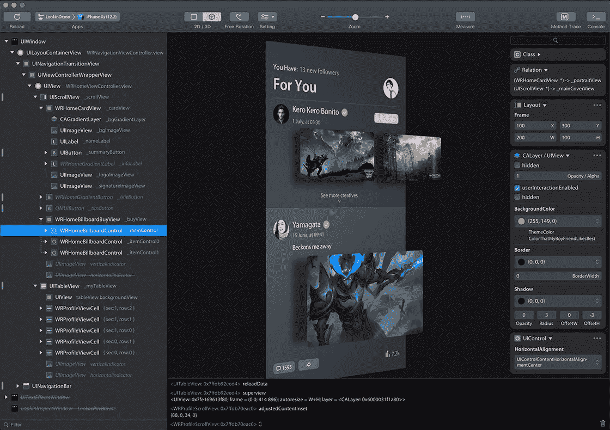

这两个应用程序的主要区别在于，一个是开源的，另一个不是。也就是说，一个应用程序比另一个功能更强大，但它们都有工具来调试我们的视图，并停止浪费时间猜测我们的视图中到底发生了什么。

# 功能比较

**但是这些特征中的每一个意味着什么呢？我想向大家展示这些物品的含义、用途以及外观。**

# 功能详情

## **手势调试**

检查您附加到所有视图的手势识别器，以及 iOS 添加的识别器。你可以更新和修改他们的行为。

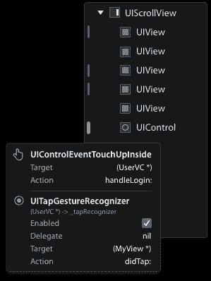

## 测量工具

这允许您测量两个视图之间的距离。

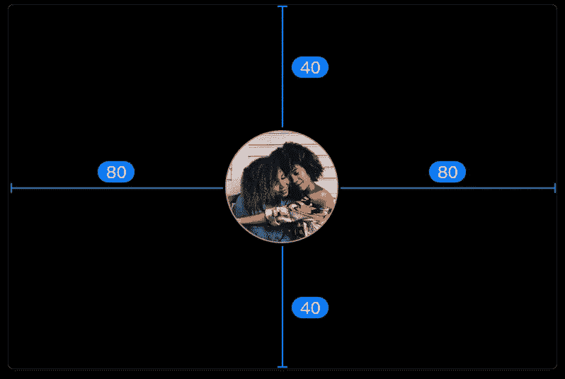

## 3D 视图层

此工具为您的视图提供了漂亮的 3D 可视化效果。

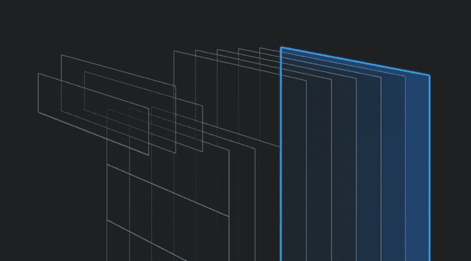

## 实时编辑

你可以实时编辑大小、颜色、文本和许多东西，这些变化会立即反映在你的应用程序中。(它们只是视觉上的变化，代码中没有任何变化。)

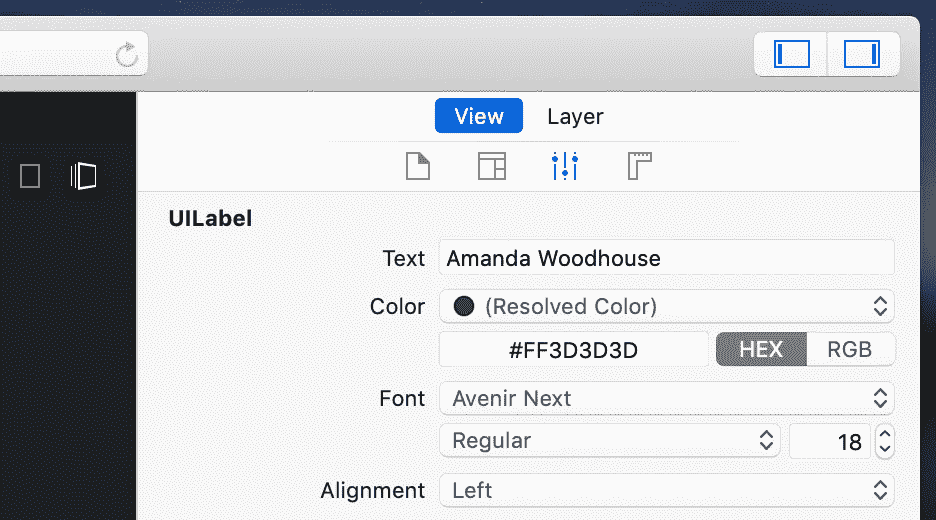

## 视图/布局检查器

检查每个视图、它们的层次结构、组件和属性。

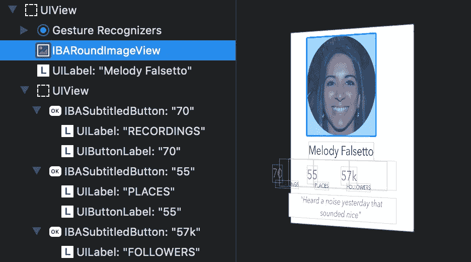

## 可视化约束

直接在画布上查找和发现视图和约束之间的关系。

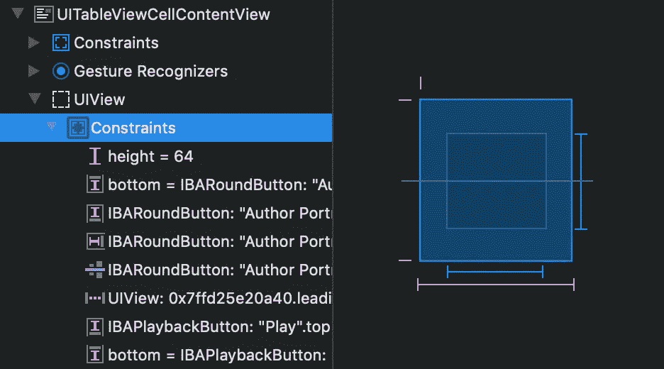

## 管理约束

快速编辑或导航到影响视图布局的约束，在大纲中查看视图拥有的约束，并识别由系统创建的约束。

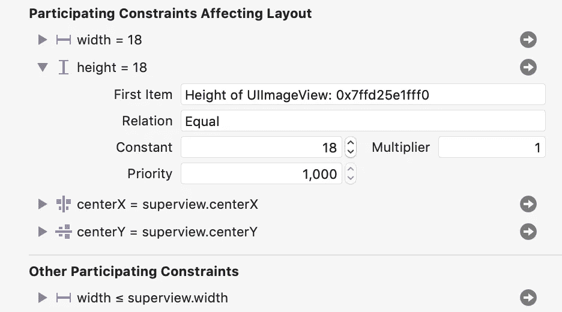

## 应用扩展检查器

检查您的应用程序的扩展，并调试甚至 Xcode 看不到的问题。

## 共享快照

在开发过程中，与您的团队共享快照或将其用作时间点参考。(我喜欢这个功能。它可以帮助你分享整个视图，而无需编译你的应用程序。对于设计团队的评审来说很棒。)

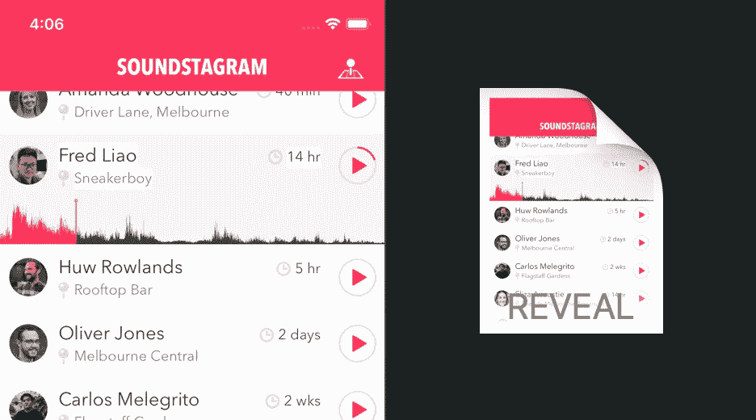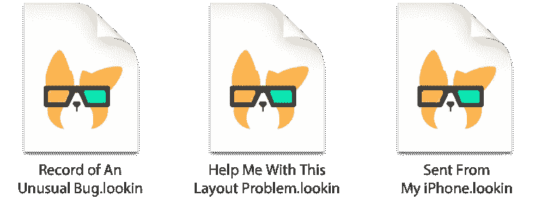

## 应用内检查器

这个功能很有意思。它可以帮助您从同一台设备上检查视图，而无需 Mac 或安装任何额外的应用程序(需要额外配置)。

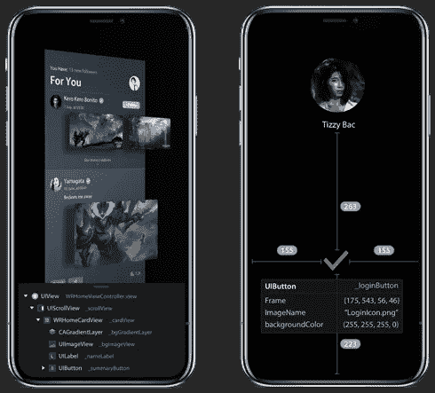

## 安慰

获取属性值或调用应用程序中任何`NSObject`的方法。

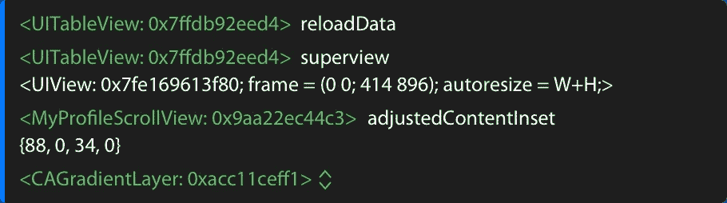

## 自动布局警告和错误

这突出显示了受常见自动布局问题影响的视图和约束，有助于您更快地修复布局问题。

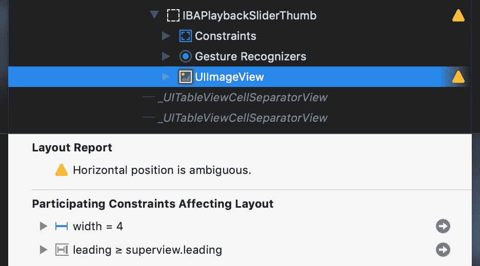

还有许多其他功能，如黑暗模式模拟、tvOS 支持、方法跟踪和过滤器。我邀请您看一看每个应用程序，了解它们所提供的一切。

# **结论**

这些应用程序使我们能够动态修改应用程序。您将在几秒钟内调试视图设计和呈现问题。

正如我之前所说，这两个工具都很棒。一个有更强大的功能，但两者都达到了视图调试的目的，在我看来。你可以从 Lookin 开始，因为它是免费的，如果你需要更多的功能或者对你的业务的某种支持，你需要使用 RevealApp。

我用另一个应用程序作为 Lookin 的插件，它叫做[夏洛克](https://sherlock.inspiredcode.io/)。你应该看看它。后面我会讲这个 app。

感谢阅读。