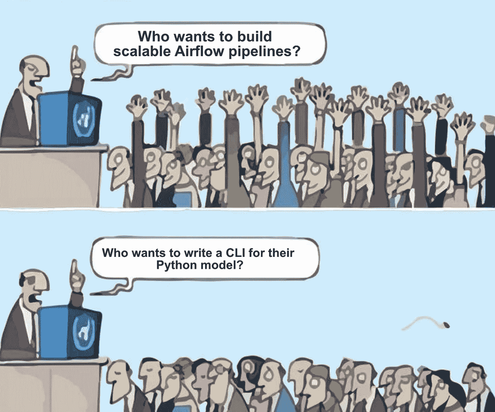

# 简单的气流设计模式—使用 Python Fire 构建更具可扩展性的管道

> 原文：<https://betterprogramming.pub/a-simple-airflow-design-pattern-to-avoid-a-cardinal-sin-cebeafd19a99>

## 构建强大的 CLI

由[伊恩·杜利](https://unsplash.com/@sadswim?utm_source=medium&utm_medium=referral)在 [Unsplash](https://unsplash.com?utm_source=medium&utm_medium=referral) 上拍摄

# 为什么不应该使用 Python 运算符

Airflow 是一个无处不在的开源平台，用于以声明方式和编程方式定义复杂的工作流。重要的是，使用一个丰富的[操作符](https://airflow.apache.org/docs/apache-airflow/stable/howto/operator/index.html)生态系统，工作单元几乎可以在任何地方被分派和执行；这个生态系统包括 Airflow 的工人节点本身，如果你利用所有操作者中最卑微的，PythonOperator。

这是一种应该避免的反模式，原因如下:任务相互竞争资源，会使集群资源匮乏；依赖关系必须安装在工作节点上，并且可能会发生冲突；并且所有代码都必须部署到 Airflow，这使得很难为每个模型建立一个单一用途的部署管道。

将模型打包到 Docker 容器中听起来很棒，但是从 DAG 与这些容器进行接口，尤其是在有动态输入的情况下，是一件令人头疼的事情，并且需要一定程度的 CLI 编程。这也是数据科学家和工程师急于推出 PythonOperator 的原因之一:*从 Python 调用 Python 函数很容易；从命令行调用 Python 函数很难。*

如果我告诉你你可以鱼与熊掌兼得呢…

图片作者。通过[https://www.kapwing.com/](https://www.kapwing.com/)生成

# 模式

在深入到一个更具体的例子之前，我想在一个高层次上布局设计模式。

1.  在一个单一用途的存储库中构建您的模型(或者至少是`submodule`)。
2.  在模型的主文件中实例化 Fire(如下例)。
3.  在 Airflow 中，使用 python-CLI 并用您想要调用的任何类、方法和参数覆盖 Docker 入口点。

# 不可缩放的 DAG

让我们以一个简单的机器学习 DAG 为例，它有两个步骤。训练和推理任务都需要几个参数，这些参数可以由环境变量、运行时触发器或其他动态输入来配置。由于模型是用 Python 编写的，我们只需使用`PythonOperator`调用这两个步骤。

不是为了强调这一点，而是为了使上面指出的一般问题具体化:训练或得分任务可能会耗尽大量资源，使集群陷入饥饿状态；以及连接到特征和模型存储层的逻辑都必须与 DAG 紧密耦合，鼓励意大利面条式代码。

不可扩展的 DAG 利用 Python 运算符进行训练和评分

# 在火中包裹模型代码

如果我们试图以正确的方式做事，通过将模型容器化，并使用在一些计算服务(Kubernetes、AWS Batch 等)上启动工作流的操作符。)，我们必须通过环境变量或 CLI 将这些运行时参数传递到容器中，并对该接口进行编程。任何工程师都不想花费时间来构建一个具有良好错误处理能力的健壮 CLI。

进入谷歌的 [Python 火了](https://github.com/google/python-fire)。这个库将任何 Python 对象(读取函数、类等。)转换成一个直观的参数化 CLI，并且给你一个更少的借口来打击你的气流工作者。下面的示例代码不包含关于如何从命令行与它交互的显式参考，但是(正如您在下一个 DAG 中看到的)您可以使用您想要的任何参数调用`CustomerModel`类中的任何方法。

面向对象的机器学习模型代码的框架

# 从气流 DAG 调用 CLI

为了探究在 Fire 中包装建模代码的能力，让我们看一个 DAG，它使用自动生成的 CLI 接口在 Docker 容器中启动模型。

这里的`KubernetesPodOperator`只是任何可能运行`my_model_image`中打包的模型代码的计算服务运营商的替身。

CLI 允许 DAG 的两个任务调用不同的方法并以 Python 方式传递参数，因此您不必像调用 Python 函数那样深入考虑接口！

Kubernetes 吊舱中的气流 DAG 启动任务

通过为您的 Python 对象自动生成一个健壮的 CLI，Python Fire 显著降低了外包计算的障碍，并让 Airflow 做它最擅长的事情。