# 用 React Hooks、Firebase、Nodemailer 和 Axios 构建一个简单的联系表单

> 原文：<https://betterprogramming.pub/a-simple-and-easy-contact-form-step-by-step-tutorial-react-js-1532bc025980>

## 循序渐进的教程


React、Firebase、Gmail、Nodemailer 走进一家酒吧……(作者供图)。

你可以想象当我在网上使用 React 和 Firebase 寻找一个简单的联系人表单实现，却找不到时，我有多惊讶。我想让它在有人试图通过我的网站联系我时，向我的收件箱发送一封电子邮件。哦，我有没有提到我想让它把电子邮件数据存储在我的 Firebase 数据库里？我也能得到有钩子的东西吗？也许上面有颗樱桃。请和谢谢你。

为什么这个不存在？

哦好吧。入乡随俗，做好记录。那是谚语，对吗？

很多时候，你希望快速简单的答案集中在好的方面。在这里，为了避免你一根一根地撕扯你的头发，我会给你一个超级简单的教程。

# 我能得到什么？

当有人点击“提交”按钮时，为您的站点发送电子邮件通知的联系表单。你在收件箱里收到一封电子邮件，上面写着这样的话，“嘿嘿，某某人刚刚给你发了一条消息，上面写着这个和那个。赶紧回复。”您将在收件箱中看到他们的姓名、电子邮件和消息。

你想要一个少一些专业术语，多一些普通英语的教程吗？完了，完了。

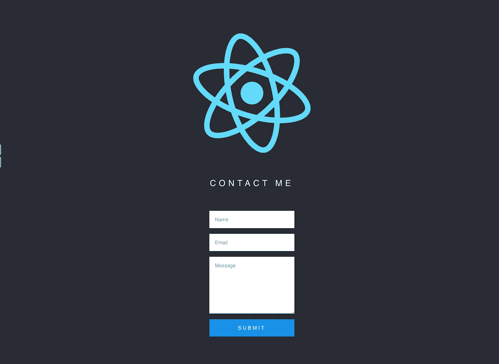

哇，哇，哇

# 使用的技术和软件包

*   反应
*   反应钩
*   [燃烧基地](https://firebase.google.com/)
*   [节点邮件](https://nodemailer.com/about/)
*   [Axios](https://github.com/axios/axios)
*   克-奥二氏分级量表
*   谷歌邮箱

# 步骤 1:打开 React 应用程序终端，安装将用于这个项目的依赖项

```
$ npm install firebase axios node-sass
$ npm install -g firebase-tools
```

现在，您应该已经在您的`package.json`文件中列出了 Firebase。

# 步骤 2:在 Firebase 中添加您的项目

1.去 [Firebase 网站](https://firebase.google.com/)。单击“创建项目”并完成所需步骤。

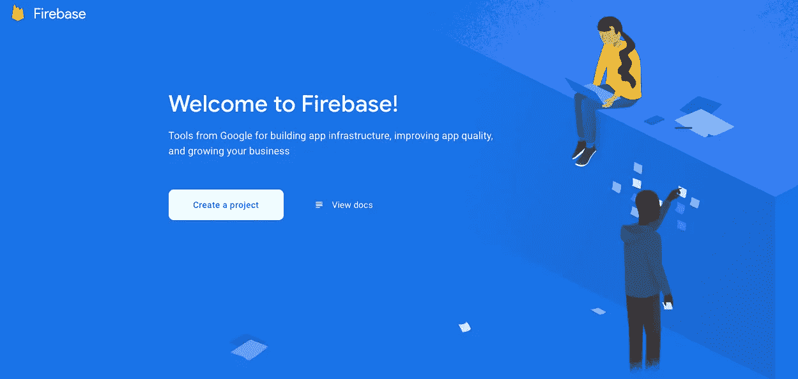

2.单击 web 图标。


3.单击“将 Firebase 添加到您的 web 应用程序”选项，获取您的配置变量并复制您的配置代码。单击“继续到控制台”在本教程的后面部分，您将需要在您的`.env`文件中使用这些值。

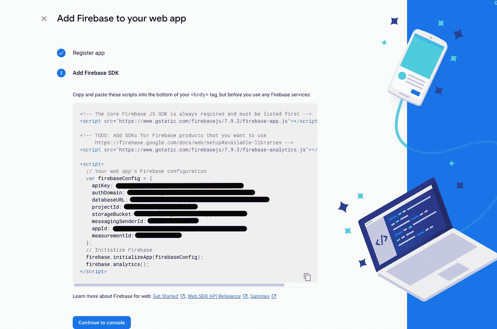

# 步骤 3:使用云 Firestore 设置您的数据库

*注意:如果您不想将您的电子邮件数据添加到数据库中，可以跳过这一步。使用它的好处是可以看到联系人提交的记录。*

1.点击“创建数据库”

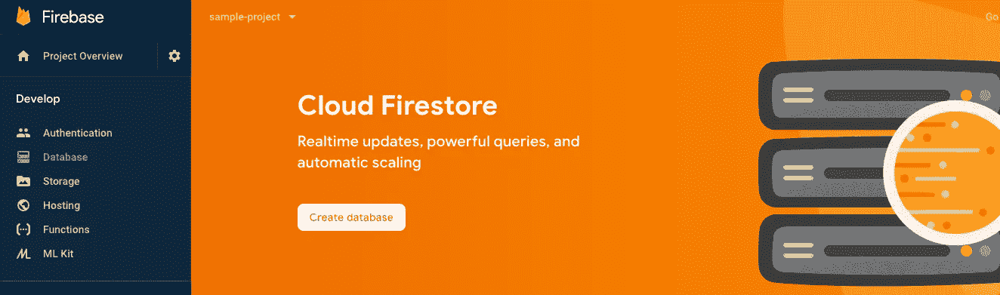

2.暂时以测试模式开始，如果你愿意，以后再改变。

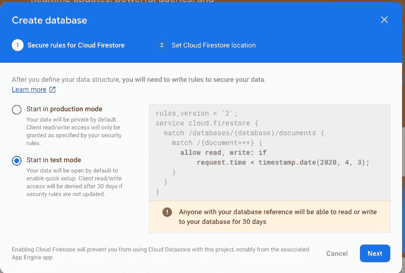

3.点击“开始收集”你可以称这个集合为“电子邮件”

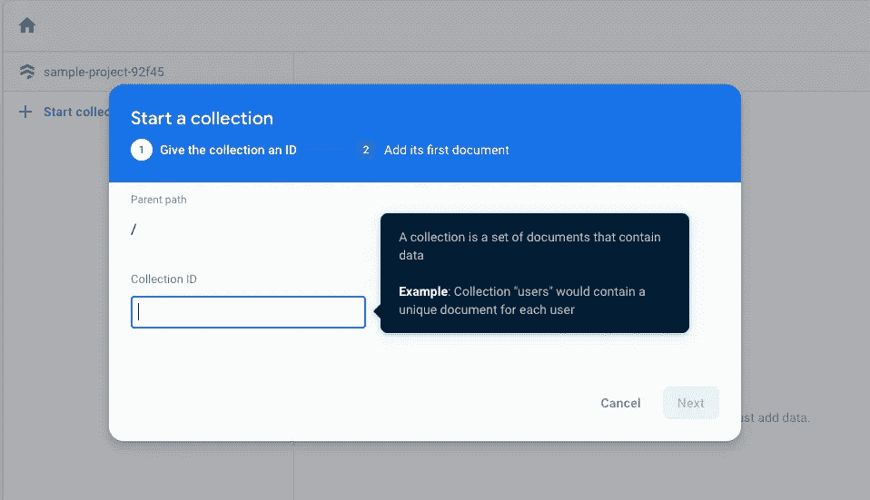

4.手动插入您的第一个条目(不确定为什么需要这样做，但是如果您愿意，可以稍后删除您的条目)。

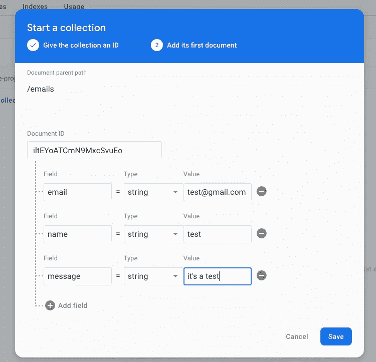

# 步骤 4:初始化 Firebase

1.使用以下命令初始化 Firebase:

```
$firebase init
```

系统将提示您进行以下操作:

*   您想为此文件夹设置哪些 Firebase CLI 功能？按空格键选择功能，然后回车确认您的选择。→功能:配置和部署云功能。
*   你想用什么语言写云函数？→ JavaScript
*   你想使用 ESLint 来捕捉可能的错误并加强风格吗？→ n
*   您想现在安装与 npm 的依赖关系吗？→ y

# 第 5 步:添加您的。环境变量

1.在项目的根目录下创建一个`.env`文件(如果这个`.gitignore`文件不在这里，不要忘记添加它)。这是您将存储所有配置值的地方。

```
REACT_APP_FIREBASE_API_KEY=<yourapikey>
REACT_APP_FIREBASE_AUTH_DOMAIN=<authdomain>
REACT_APP_FIREBASE_DATABASE_URL=<databbase>
REACT_APP_FIREBASE_PROJECT_ID=<projectid>
REACT_APP_FIREBASE_STORAGE_BUCKET=<storage bucket>
REACT_APP_FIREBASE_MESSAGING_SENDER_ID=<messagingsender>
```

# 步骤 6:将 Firebase 配置添加到项目中

1.在您的`/src`文件夹中，添加一个名为`/firebase`的子文件夹和一个名为`/firebaseConfig.js`的文件。

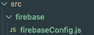

2.在`firebaseConfig.js`中，添加以下代码:

注意:我在这里导入 Axios 是为了保持整洁，但是你可以直接从 ContactForm 组件导入。如果您不打算使用 db，也可以省略它。

# 步骤 7:在项目中添加 Firebase 函数

1.  在您的`/functions/index.js`中，添加下面的代码。要创建 Firebase 函数，您需要选择一个触发器。这里，我们将使用一个 [HTTP 触发器](https://firebase.google.com/docs/functions/http-events)。Firebase 会创建一个唯一的 URL，您可以在 Firebase 控制台的功能页面上看到它:

# 步骤 8:配置您的 Gmail 电子邮件和密码

1.进入您的`functions`目录:

```
$cd functions/
```

2.安装 Cors 和节点邮件程序依赖关系:

```
$npm install cors nodemailer
```

3.设置您的 Gmail 电子邮件和密码:

```
$firebase functions:config:set gmail.email=”<[youremail@gmail.com](mailto:youremail@gmail.com)>” gmail.password=”<yourgmailpassword>”
```

4.这将创建一个对象。您可以通过运行以下命令来检查其配置是否正确:

```
{
 “gmail”: {
   “email”: “youremail@gmail.com”,
   “password”: “yourpassword”
   }
}$firebase functions:config:get //make sure to run this in your functions directory
```

5.部署 Firebase:

```
$firebase deployor$firebase deploy --only functions
```

6.现在，您应该能够在 Firebase 控制台上看到您的功能了:

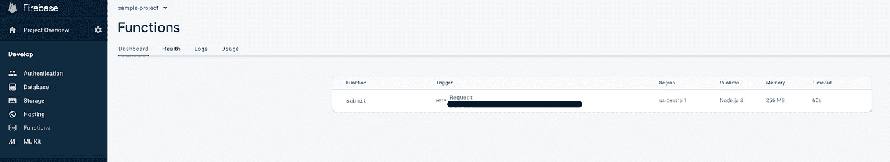

# 步骤 9:在 Gmail 上启用不太安全的应用程序访问

1.  打开“[不太安全的应用程序访问](https://myaccount.google.com/lesssecureapps)”，以便能够在您的 Gmail 帐户中收到通知。Gmail 希望用户是真实的用户，而不是机器人，所以它会对每次登录尝试进行大量的试探，并阻止任何看起来可疑的事情。

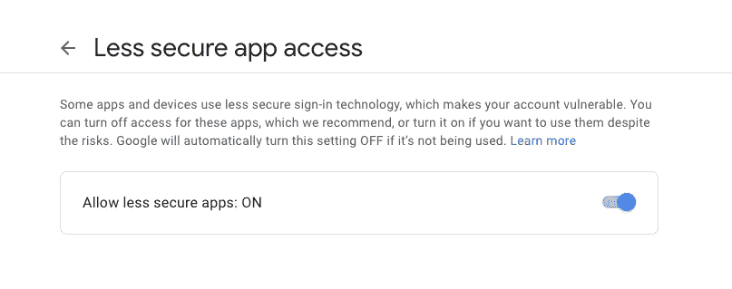

2.[允许访问](https://accounts.google.com/DisplayUnlockCaptcha)您的 Google 帐户。

# 步骤 10:在 React 应用程序中创建联系人组件

1.通过运行以下命令执行您的构建:

```
$npm run start
```

2.在您的`/src`目录中，添加一个带有`index.js`文件的`contact`文件夹:

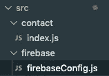

3.添加以下代码。这是我们放置接触组件的地方。将 Axios 方法中的 URL 更改为上图所示的 URL(第 8 步中图像中涂黑的部分):

您可以`console.log(formData)`查看 updateInput()的运行情况。

4.添加一些 SASS，这样看起来很好看:

```
$npm install node-sass
```

5.在`/contact/styled.scss`中，添加:

6.在`App.js`中，添加`<ContactForm/>`组件:

下面是第一个文件正在做的事情(如果您只想吃肉和土豆，请跳过这一步):

*   `updateInput()`正在用`onChange`更新输入的状态，当元素的值失去焦点时触发*改变*。您可以做一点点`console.log(formData)`来看看这是怎么回事。扩展操作符(`...`)将前一个状态与当前状态合并。在钩子中，当前状态没有与旧值合并，这就是为什么它是必需的。
*   `handleSubmit()`将首先阻止页面在提交表单时刷新。然后它将调用`sendEmail()`并重置表单数据。
*   `sendEmail()`将使用`Axios.post`触发您的 Firebase 函数(这将处理电子邮件通知)。`.then`会将您的电子邮件数据添加到数据库中(如果您不想在数据库中引用该数据，您可以将其排除在外)。
*   最后，使用 JSX 渲染表单。

# 瞧吧！现在让我们提交表单！

您应该会在数据库中看到:

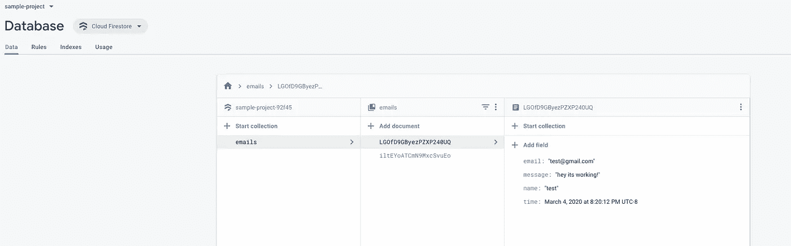

# 终点终于来了

我真的很兴奋把这个教程带到了这个世界上！希望对你有所帮助！

有什么问题吗？让我知道！