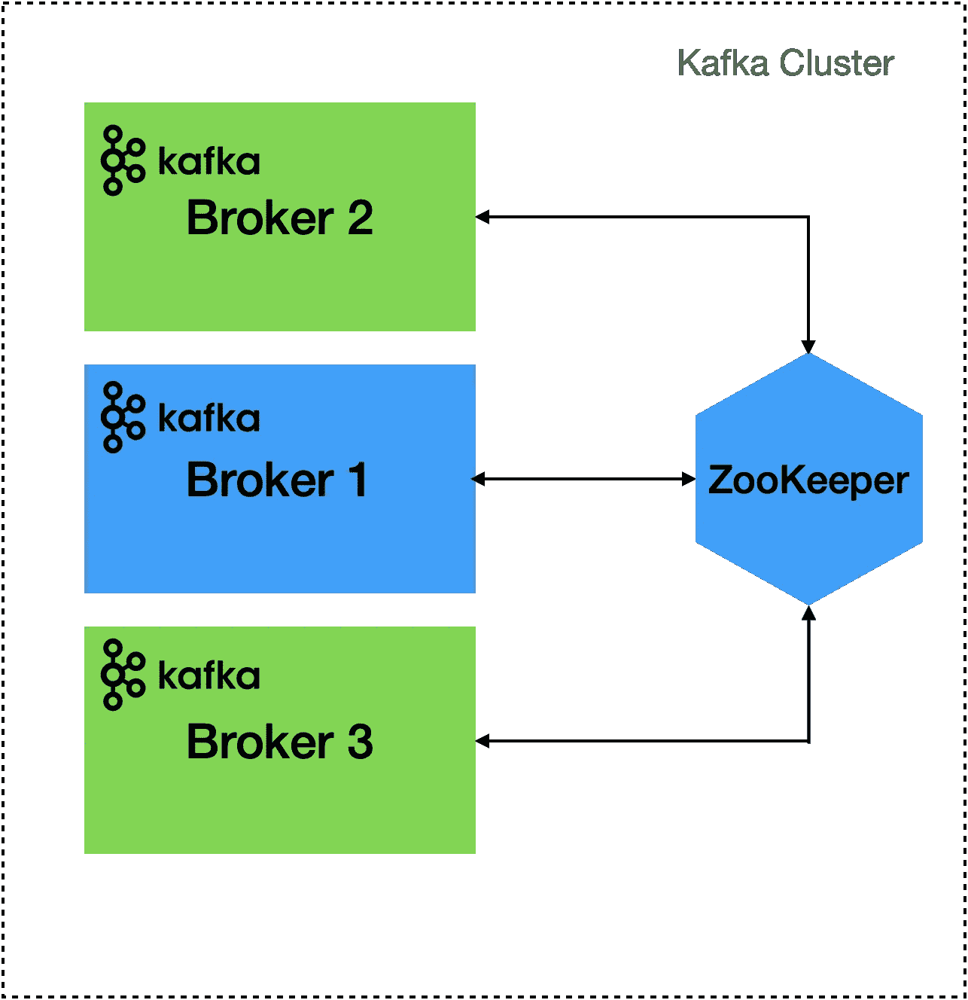
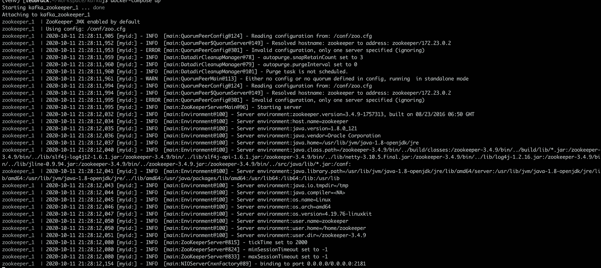
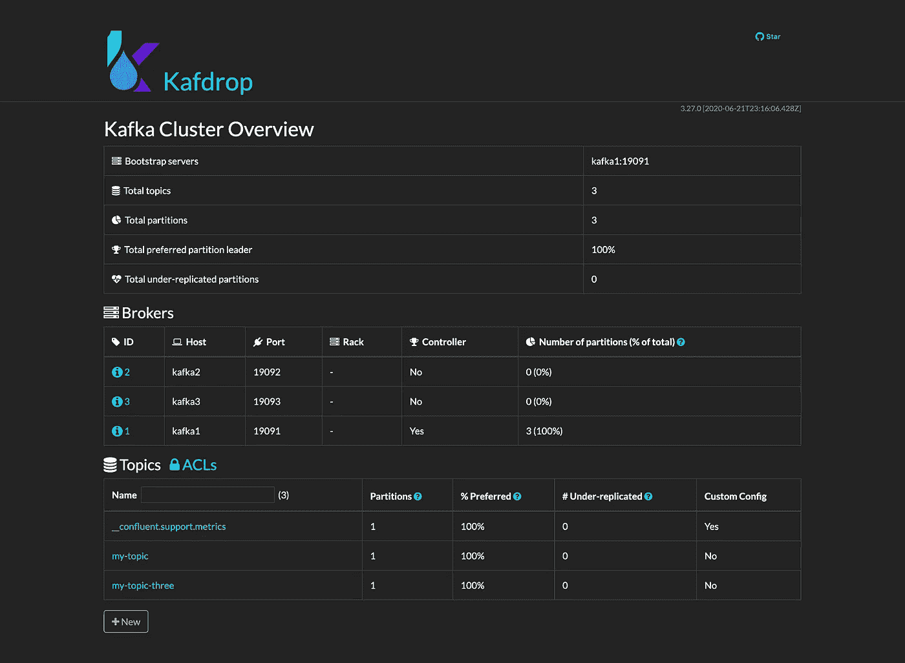
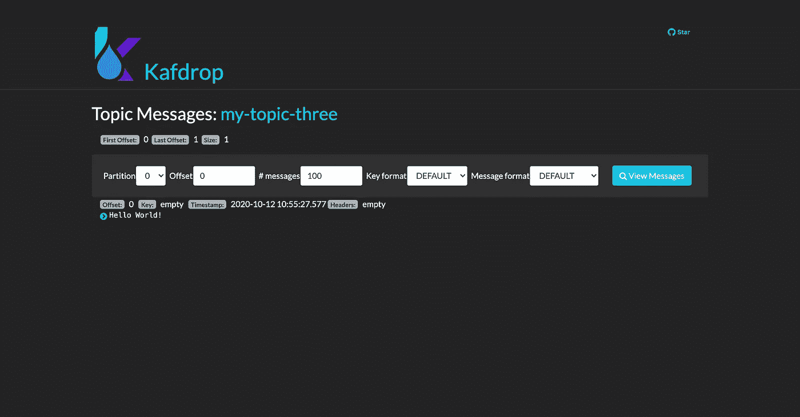

# 一个简单的 Apache Kafka 集群，包含 Docker、Kafdrop 和 Python

> 原文：<https://betterprogramming.pub/a-simple-apache-kafka-cluster-with-docker-kafdrop-and-python-cf45ab99e2b9>

## 在带有生产者和消费者的 Docker 上部署一个最小的 Kafka 集群


乔·斯塔布斯在 [Unsplash](https://unsplash.com?utm_source=medium&utm_medium=referral) 上的照片

本指南将演示如何在 Docker 上部署一个最小的 Apache Kafka 集群，并使用 Python 设置生产者和消费者。我们还将部署 Kafdrop 的一个实例，以便于集群监控。

> “Apache Kafka 是一个开源的分布式事件流平台，被数千家公司用于高性能数据管道、流分析、数据集成和任务关键型应用。”——[阿帕奇卡夫卡](https://kafka.apache.org/)

## 先决条件

本教程希望您有一个安装了 [Docker Compose](https://docs.docker.com/compose/) 的 Unix 系统(Mac 或 Linux)。你可以通过遵循 Docker [官方文档](https://docs.docker.com/get-docker/])找到安装 Docker 和 Docker Compose 的说明。

本教程的完整代码可以在 GitHub 上找到。

# 阿帕奇卡夫卡建筑

与 RabbitMQ 或 ActiveMQ 等其他消息代理相比，Apache Kafka 的架构相对简单。

Kafka 本质上是一个提交日志，具有非常简单的数据结构。它恰好是异常容错的、水平可伸缩的，并且能够处理巨大的吞吐量。这使得 Kafka 非常受许多大型企业组织的欢迎，其应用范围从发布-订阅消息到日志聚合。

我们将部署一个简单的 Kafka 设置，由以下组件组成:

*   **Kafka 集群:**Kafka 经纪人的分布式系统
*   **Kafka broker:** 负责在生产者和消费者之间传递数据的消息代理。它们负责集群中的大量 I/O 操作和持久存储。
*   **ZooKeeper:** 管理集群中的整体控制器状态。它充当配置存储库，维护集群元数据，还实现集群的实际机制。
*   **Kafka 生产者:**负责将记录附加到 Kafka 主题的客户端应用程序
*   **Kafka 消费者:**从主题中读取的客户端应用程序

下图描述了我们将要部署的最小 Apache Kafka 集群的架构。最基本的设置只包含一个代理和一个 ZooKeeper 节点(蓝色)；但是，为了增加弹性，我们将在集群中部署两个额外的代理(绿色)。



# 在 Docker 中运行 ZooKeeper

验证是否已成功安装 Docker 和 Docker Compose:

太好了，我们准备好开始了！让我们从部署 ZooKeeper 开始。首先，创建一个新的工作目录来存储我们将在教程中使用的文件和数据:

```
mkdir kafka
cd kafka
```

接下来，创建一个名为`docker-compose.yml`的新文件。这包含使用 Docker Compose 进行部署的配置。

```
touch docker-compose.yml
```

现在，在你最喜欢的文本编辑器中打开这个文件。我们准备添加配置来部署 ZooKeeper。

逐行检查配置:

*   第 1 行: [Docker 编写文件](https://docs.docker.com/compose/compose-file/)的版本号
*   第 2 行:开始[服务](https://docs.docker.com/compose/compose-file/#service-configuration-reference)定义
*   第 3 行:启动 ZooKeeper 配置
*   第 4 行:用于 ZooKeeper 的 Docker 图像，从 [Docker Hub](https://hub.docker.com/) 下载
*   第 5 行:Docker 容器将使用的主机名
*   第 6-7 行:将端口 2181 暴露给主机。这是默认的 ZooKeeper 端口。
*   第 9 行:这个 ZooKeeper 实例的唯一 ID
*   第 10 行:动物园管理员将继续运行
*   第 11 行:ZooKeeper 服务器列表。我们只部署了一个。
*   第 12–14 行:将主机上的目录映射到容器中的目录，以便持久存储数据

现在我们可以通过运行 Docker Compose 来启动 ZooKeeper:

```
docker-compose up
```

这将下载 ZooKeeper Docker 容器并启动一个 ZooKeeper 实例。您将看到以`binding to port 0.0.0.0/0.0.0.0:2181`结尾的日志消息。这意味着 ZooKeeper 正在运行并绑定到港口`2181`。



用 Docker 编写启动 ZooKeeper 的日志输出

# 在 Docker 中运行卡夫卡

接下来，让我们加入阿帕奇卡夫卡。我们将把第一个`kafka`服务添加到配置文件中:

再次，逐行检查配置:

*   第 5 行:Docker Hub 中用于 Kafka 的图像
*   第 6 行:容器的主机名
*   第 7-8 行:要公开的端口，设置为`9091`
*   第十行:卡夫卡的广告听众。罗宾·莫法特有一篇关于这个的很棒的博文。
*   第 11 行:每个监听器使用的安全协议
*   第 12 行:interbroker 监听器名称(用于内部通信)
*   第 13 行:卡夫卡应该使用的动物园管理员节点列表
*   第 14 行:这个 Kafka 经纪人的经纪人 ID
*   第 15 行:消费者补偿主题的复制因子
*   第 16-17 行:映射主机上的卷以存储 Kafka 数据
*   第 19-20 行:确保动物园管理员在卡夫卡之前启动

要启动 Kafka broker，您可以在工作目录中启动一个新的终端窗口并运行`docker-compose up`。

如果 ZooKeeper 仍然从上一步开始运行，你可以使用`ctrl + c` / `cmd + c`来停止它。Docker compose 会在必要的时候同时启动 ZooKeeper 和 Kafka。

**提示:**使用`docker-compose up -d`在终端窗口的后台启动容器

启动容器后，您应该看到 Kafka 和 ZooKeeper 正在运行。让我们通过创建一个新主题来验证一切都已成功启动:

不错！现在，我们在 Docker 的本地机器上部署并运行了一个最小的 Kafka 集群。

# 部署多个 Kafka 代理

接下来，我们将在集群中再添加两个 Kafka 代理。拥有多个代理使我们能够构建更具弹性的集群，因为我们可以从复制、容错和额外资源中受益。

为此，我们需要在我们的`docker-compose.yml`中添加更多的`kafka`服务。让我们再添加两个经纪人:

要向集群添加额外的代理，我们只需要更新代理 ID、主机名和数据量。这里我们添加了 ID 为`2`和端口为`9092`的代理 2 和 ID 为`3`和端口为`9093`的代理 3。

我们可以通过创建另一个主题来验证这三个代理是否成功运行，这次使用的复制因子是`3`。

成功！我们现在有一个由三个代理运行的 Kafka 集群！

# 部署 Kafdrop

能够可视化您的部署的关键指标总是好的；然而，Kafka 并没有提供开箱即用的监控接口。幸运的是，我们可以使用一个名为 [Kafdrop](https://github.com/obsidiandynamics/kafdrop) 的免费开源产品。

> “Kafdrop 是一个用于查看 Kafka 主题和浏览消费群体的 web UI。该工具显示信息，如经纪人，主题，分区，消费者，并让您查看消息。”—[GitHub 上的 Kafdrop](https://github.com/obsidiandynamics/kafdrop)

让我们为 Kafdrop 实例添加另一个容器到我们的`docker-compose.yml`:

然后。使用`docker-compose down`和`docker-compose up -v`重新部署。一旦它完成预热，在你的浏览器中导航到`localhost:9000`。您应该会看到 Kafdrop 登录屏幕。



请注意，我们现在可以看到关于 Kafka 集群的一些信息，包括我们已经作为本教程的一部分创建的两个主题。

# 添加 Python 生成器

是时候给卡夫卡发些消息了。我们将使用 Python 构建一个简单的生成器。首先安装 Python 的 Kafka 库:

```
pip install kafka
```

接下来，在您的工作目录中创建一个名为`producer.py`的新 Python 文件。这里，我们需要定义 Kafka 服务器的列表和发布消息的主题名。我们已经创建了`my-topic-three`，所以让我们使用它。

最后给题目发消息，我们叫`producer.send`。尝试在新的终端窗口中运行以下 Python 代码:

```
python3 producer.py
```

如果一切顺利，您应该能够看到消息出现在 Kafdrop UI 中。



# 添加 Python 消费者

拼图的最后一块是添加一个 Python 消费者来接收来自 Kafka 的消息。创建一个名为`consumer.py`的文件，并添加以下代码:

导入`KafkaConsumer`后，我们需要提供 bootstrap 服务器 ID 和主题名来建立与 Kafka 服务器的连接。

在新的终端窗口中，运行`python consumer.py`，然后再次触发您的 producer 脚本。消费者将从主题中读取消息，并将数据打印到控制台。您应该会看到这样的消息:

```
ConsumerRecord(topic='my-topic-three', partition=0, offset=0, timestamp=1602500127577, timestamp_type=0, key=None, value=b'Hello World!', headers=[], checksum=None, serialized_key_size=-1, serialized_value_size=12, serialized_header_size=-1)
```

# 结论

不错！您已经使用 Docker 和 Docker Compose 成功启动了一个本地 Kafka 集群。数据保存在本地机器上的容器之外，这意味着您可以删除容器并重新启动它们，而不会丢失数据。

您还添加了一些主题，并使用 Python Kafka 库为这些主题设置了基本的生产者和消费者。此外，您已经部署了 Kafdrop 的一个实例，为监控您的集群提供了一个接口。

我们只是触及了阿帕奇卡夫卡的可能性的表面。如果你刚刚开始，还有很多东西要学。你已经有了必要的基础和工具，网上也不缺少信息。毫无疑问，最好的学习方法是卷起袖子去做点什么。

感谢您的阅读，祝您编码愉快！