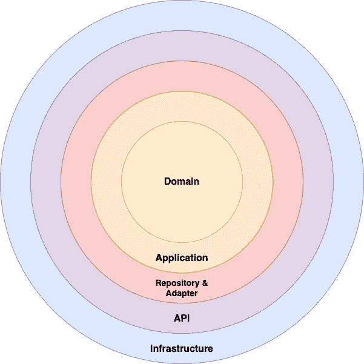
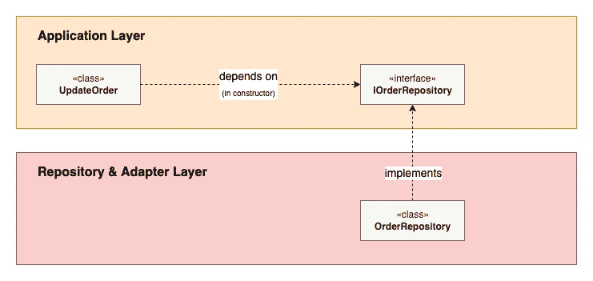

# 构建可持续 API 的简单蓝图

> 原文：<https://betterprogramming.pub/a-simple-blueprint-for-building-sustainable-apis-f683724df003>

## 易于理解、松散耦合和高度可测试只是这种以 API 为中心的架构的几个好处


布拉德·韦斯特在 [Unsplash](https://unsplash.com?utm_source=medium&utm_medium=referral) 上的照片

当您构建一个新的应用程序时，您必须做出的最重要的决定之一是如何构建它的体系结构。做出错误的决定，或者更糟糕的是，根本没有概述任何架构，可能真的会让您在未来倒退。

从可测试性到可伸缩性再到可读性，考虑的因素那么多，怎么决定用什么架构呢？

让我向您介绍一下可持续 API 架构，它被设计成一个适合大多数 API 用例的解决方案，并确保您的 API 有一个坚实的架构基础。

# 问题是

在我深入研究可持续 API 架构的细节之前，有必要理解我试图解决的问题。如果您想直接进入架构的细节，跳过这一部分不会失去对架构本身的理解。

有许多用于构建软件的架构。比如[分层建筑](https://www.oreilly.com/library/view/software-architecture-patterns/9781491971437/ch01.html)、[洁净建筑](https://blog.cleancoder.com/uncle-bob/2012/08/13/the-clean-architecture.html)或者[六边形建筑](https://en.wikipedia.org/wiki/Hexagonal_architecture_(software))——这些是好的建筑吗？是的，但它们都非常通用，旨在涵盖您能想象到的所有类型的应用程序。

再者，你挑哪个？例如，分层体系结构确实适用于小型服务，但不适用于大型服务。Hexagonal 擅长于确保您的特定于应用程序的知识与外界保持隔离，但是为核心应用程序逻辑留下了很大程度上未定义的架构。

这并不意味着它们不适合 API，我的架构无疑借鉴了几种现有的架构——包括上面概述的那些。然而，很难将它们放在上下文中并应用到您自己的应用程序中。

# 可持续的 API 架构

我想创建一个易于理解并适用于几乎所有 API 的架构。特别是，我想确保使用该架构的任何人都有一个坚实的蓝图用于他们的 API，以确保它不会变得混乱不堪，从而成为维护的噩梦。

它是高度可测试的、解耦的，并且将焦点放在领域上。

如果你在理解任何部分有困难，请评论任何问题，我很乐意尝试并帮助回答它们。此外，本文末尾提供了一个使用这种架构构建的虚拟 API 的完整工作示例。

## 架构的层次



图片来源:阿什莉·皮科克

这最终是体系结构在各层上的样子。外层被认为是底层细节，在您企业的所有应用程序中可能都是相似的。而内层包含使您的应用程序独一无二的东西。中间是*存储库&适配器*层，它保护应用程序的核心(两个中心层)不受 API 本身的变化以及服务运行所需的任何基础设施的影响。

每一层可能只依赖于它自己那一层的东西和它里面那几层的东西(不包括接口，后面会很重要)。因此，域本身必须不依赖于域层之外的任何东西。*应用*层可能依赖于自身和*域*层，以此类推。

在本文的后面，我们将详细讨论每一层的一些关键点，但是现在，这里是每一层的概述:

*   **基础设施—** 这一层将包含应用程序外部的任何东西。示例包括负载平衡器、任何数据库以及消息队列。
*   **API—***API*层纯粹负责定义 API 的端点，同时也是应用程序的入口&出口点。这一层主要包含控制器，以及支持 API 响应的认证、验证和表示的任何支持类。
*   **存储库&适配器—** 一个关键层，用于确保应用程序外部的*不会影响*内部的*。虽然存储库通常充当适配器，但我希望特别提到存储库，以突出同名的模式(稍后我们将详细介绍)。*
*   **应用**——两个核心层中的第一层，*应用*层是*特定于应用的*业务规则所在的地方。它不应该包含任何域逻辑，并在您的域和应用程序的其余部分之间提供粘合剂。在很大程度上，这一层将由服务类组成。
*   **域** —最后是*域*。这一层包含域实体、值对象和域服务(如果需要的话)。它可能会很小，这取决于您的域的大小，一旦完全实现，不会有太大的变化。

选择这些层的基本原理是基于多年使用 API 的经验——至少，每个 API 都需要这些层。每一层都有一个重要的角色要做，想象一下你的 API 代码如何嵌入这些层是相对容易的。

虽然我建议从这些层开始，但是如果您的应用程序需要，没有理由不能添加更多的层。这种架构的下一个常见步骤是添加异步功能，这种架构将能够通过对层进行调整来处理(例如，API 层扩展到消费者)。

## 这些层给了我们什么好处？

这是一个很好的问题，因为如果你不习惯在架构中使用层，它可能不会立即变得明显——我花了很长时间才真正看到它们的价值。

工程中一个常见的原理是*单责任原理*—[固体](https://en.wikipedia.org/wiki/SOLID)中的“S”。它通常在设计类时使用，但也适用于更大的构造，如库和应用程序。

在可持续 API 架构的情况下，每一层都有一个单独的职责，我在上面已经描述过了。此外，我们不希望职责交叉。我们希望将他们各自的关注点分开，因此*基础设施*层中的任何东西都不应该影响任何其他层。

这个原则被称为*关注点分离*，这本身就是一个完整的主题——我已经在本文的[中详细介绍了它。](/why-adopting-separation-of-concerns-leads-to-better-application-design-1e9b79504baa)

对于我们的架构来说，违反这个原则的一个典型例子是将对象从一层传递到另一层。例如，您正在使用的框架可能会在您的控制器中将 HTTP 请求自动解析为一个对象。这本身不是问题，我们不应该反对框架，但我们不应该将这个对象传递到下面的任何层，否则他们现在会知道你正在使用的框架的所有信息——违反了原则。

在我们的应用程序中引入层的主要原因是将任何更改的范围限制在尽可能少的层。如果我们决定改变构建 API 的框架，或者升级我们现有的框架，我们不希望这种改变影响我们的核心应用程序。假设我们有正确的分层，这个变化可能**只影响最外层**。

## 使用依赖倒置跨越边界

虽然我们希望将我们的层按照它们的关注点分开，但是我们的应用程序确实需要跨越边界才能运行，否则对我们的 API 的请求将永远不会通过负载平衡器！

然而，请记住，一个内部圈子可能对自身以外的任何事情一无所知。例如， *API* 层一定不知道关于*基础设施*层的任何事情，*应用*层也不知道关于*存储库&适配器*、 *API* 或*基础设施*层的任何事情。

为了实现这一点，我们再次依赖 SOLID 这一次我们使用“D ”,它代表依赖倒置原则。它指出我们应该依赖抽象，而不是具体。简单地说，我们的类应该依赖于接口，而不是具体的类。

这支持层的松散耦合，并进一步支持关注点的分离。如果一个类依赖于一个接口，我们可以使用依赖注入来注入任何给定的在运行时实现该接口的类。因此，我们的类不知道任何关于具体类的事情，它只是知道它将被给定一个类，可能来自任何层，它遵循它需要运行的接口。

我们将在下一节更详细地讨论如何利用依赖反转。

## 存储库模式和适配器

该架构的另一个关键部分是保护最里面的两层免受外部因素的影响，包括客户端用来与应用程序交互的 API 的变化。

我们需要两个方面来促进这一点:*存储库*和*适配器*。存储库是适配器的一种*类型*，但是由于[存储库模式](https://docs.microsoft.com/en-us/dotnet/architecture/microservices/microservice-ddd-cqrs-patterns/infrastructure-persistence-layer-design)，我特别地调用了存储库。

上面链接的文章中有很多细节，所以一定要读一读。简而言之，存储库负责在*应用*层和*基础设施*层的数据库之间进行转换。我们可以使用依赖反转来实现这一点，这在前一节中已经介绍过了。

依赖倒置的存储库模式是这样工作的:

1.  我们定义一个接口，通常是在*应用*层(你也可以把它放在*域*层，关于存储库接口应该在哪里存在不同的意见)
2.  在*应用程序*层中，任何需要持久化数据的类都可以通过使用我们在第一步中在类的构造函数中创建的接口来实现。
3.  存储库的具体实现在*存储库&适配器*层中创建，并在运行时注入到需要它的类中。

对于那些喜欢视觉表现的人来说，这就是它看起来的样子:



图片来源:阿什莉·皮科克

在上面的第三步中，我们将在运行时将 OrderRepository 注入 UpdateOrder 类。

一旦这些步骤完成，我们的*应用*层只知道它将被赋予一个遵循其所需接口的类——它不知道数据是如何被持久化的。例如，如果数据库从 MySQL 更改为 MongoDB，应用层永远不会知道，因为 MongoDB 的具体实现将被注入而不是 MySQL。

最后一个要考虑的问题是传递到存储库的数据，尤其是来自存储库的数据。大多数与数据库交互的库(例如 ORM)都有自己的返回数据的类——这些类不应该**直接从存储库传递回来**。相反，您应该返回域实体和值对象。如果我们从数据库中返回对象，那么如果我们更改数据库，甚至更改数据库中的模式，应用程序层都会受到影响。

以上所有内容也适用于适配器。如前所述，存储库是一种适配器，但是我们也可以为其他交互创建适配器。一些例子包括:

*   从 S3 等自动气象站服务中检索/存储数据
*   将消息发布到消息代理，如 Kafka
*   调用企业内部或外部的其他 API

我们为存储库定义的相同步骤仍然适用于适配器。

## 领域驱动设计

领域是可持续 API 架构的中心，不触及领域驱动设计是错误的(DDD)。

这不是一个新概念，但是如果你还没有阅读过《T4》实现领域驱动设计，我强烈推荐你阅读。虽然这个架构不需要深入了解 DDD 就可以工作，但是在同意了应用程序的域模型之后，它肯定会更加强大。

首先，考虑使您的服务在您的企业中独一无二的类，并将它们放在您的*域*层中。它们通常是简单的数据类，以及包含领域逻辑的类。这极大地简化了 DDD，这就是为什么我建议如果你还没有了解它的话，多了解一些。

领域驱动的设计在我目前的工作中已经变得如此受人尊敬，以至于主要的领域模型被利益相关者，甚至是 CEO 所了解和理解。我无法高度描述每个人都说同一种无处不在的语言的力量。

# 可持续 API 架构的一个例子

我已经使用可持续 API 架构构建了一个全功能的虚拟 API，作为任何想要使用它的人的指南。请随意复制代码，并根据您的用例进行修改！

它是在。NET 核心框架，但该架构将适用于任何语言和框架。它可以在 GitHub [这里](https://github.com/apeacock1991/sustainable-api-architecture/)获得，带有一个包含在 README 中的代码导航指南。此外，代码本身散布着解释它如何与架构相关的注释，并且每个类都有一个标识其层的注释。

如果你做到了这一步，非常感谢你的阅读！我希望这些架构和信息对您有所帮助，我很乐意听到您对架构的任何评论、想法或问题。

```
**Want to Connect With the Author?**Looking to expand your technical knowledge but not sure what to read? I run a free newsletter providing fortnightly technical book recommendations, including my key takeaways from the books. Interested? [Sign up here!](https://subscribe.technicalbookclub.com/?utm_source=medium&utm_medium=article&utm_campaign=sustainableapi)
```