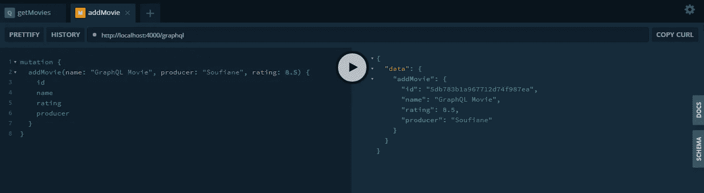
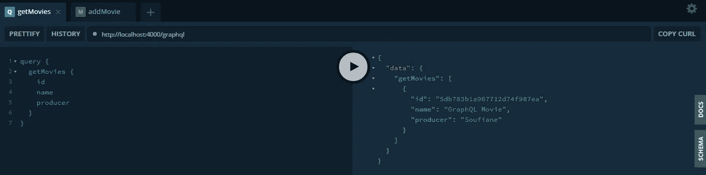

# 使用 GraphQL、NodeJS 和 MongoDB 的简单 CRUD 应用程序

> 原文：<https://betterprogramming.pub/a-simple-crud-app-using-graphql-nodejs-mongodb-78319908f563>


照片由[雅各布·欧文](https://unsplash.com/@jakobowens1?utm_source=unsplash&utm_medium=referral&utm_content=creditCopyText)在 [Unsplash](https://unsplash.com/s/photos/movie?utm_source=unsplash&utm_medium=referral&utm_content=creditCopyText) 上拍摄

在我的[上一篇文章](https://medium.com/@soufianecharkaoui98/what-is-graphql-f001d35c4737)中，我对 GraphQL 做了一个全球性的介绍。我将它与 REST 进行了比较，因为两者倾向于做相同的工作，但是在质量和性能方面存在一些差异。

因此，在本文中，我们将构建一个简单的电影应用程序，我们可以在其中显示、添加、编辑和删除电影。这样，我们将了解 GraphQL 的基础知识，这也是本文的主要目标——因为我假设阅读本文的每个人都已经使用过 NodeJS 和 MongoDB。

## 要求:

*   对 NodeJS 有很好的理解
*   MongoDB 和 Mongoose 也是如此
*   MongoDB 已经在您的计算机上设置好了，因为我不会进行环境设置

# 创建项目和安装依赖项

首先，在本地磁盘上创建一个新的项目文件夹。比如，我给我的取名为`graphql-tuto`。在节点命令提示符下，输入:

```
cd graphql-tuto
npm install express mongoose body-parser cors --save
```

现在我们已经安装了 Express、Mongoose、body-parser 和 CORS。我不打算详述这一点，因为这不是本教程的主要目标。

```
npm install apollo-server-express --save
```

从 Apollo 文档中，我发现“Apollo Server 是一个社区维护的开源 GraphQL 服务器，可以与所有 Node.js HTTP 服务器框架一起工作”，比如 Express。

所以创建一个名为`app.js`的文件。向其中添加以下代码，以设置 Apollo Express 服务器和 MongoDB 数据库。

```
const express = require('express');
const mongoose = require('mongoose');
const schema = require('./schema');
const bodyParser = require('body-parser');
const cors = require('cors');const { ApolloServer } = require('apollo-server-express');const url = "mongodb://localhost:27017/moviesdb";const connect = mongoose.connect(url, { useNewUrlParser: true });
connect.then((db) => {
      console.log('Connected correctly to server!');
}, (err) => {
      console.log(err);
});const server = new ApolloServer({
      typeDefs: schema.typeDefs,
      resolvers: schema.resolvers
});const app = express();app.use(bodyParser.json());app.use('*', cors());server.applyMiddleware({ app });app.listen({ port: 4000 }, () =>
  console.log(`🚀 Server ready at [http://localhost:4000${server.graphqlPath}](http://localhost:4000${server.graphqlPath})`));
```

GraphQL 有两个主要工作原理:类型和解析器。我在阿波罗服务器中定义了它们。我们将从稍后创建的文件中导入它们。

现在，让我们创建一个包含电影猫鼬模型的文件`models/movie.js` 。

```
const mongoose = require('mongoose');const Schema = mongoose.Schema;
const movieSchema = new Schema({
    name: {
       type: String,
       required: true
    },
    rating: {
       type: Number,
       required: true
    },
    producer: {
       type: String,
       required: true
   }
}, {
    timestamps: true
});var Movies = mongoose.model('Movie', movieSchema);
module.exports = {Movies, movieSchema};
```

每部电影都有一个名字和一个类型为`String`的制片人，以及一个类型为`Number`的分级。

所以现在我们添加一个新文件`schema.js`，在这里我们将构建我们的 GraphQL API。

```
const { gql } = require('apollo-server-express');
const Movie = require('./models/movie').Movies;
```

首先，我们从 Apollo 服务器和我们的 movie-mongose 模型导入 GraphQL 作为`gql`。

GraphQL APIs 由*类型*和*解析器*组成。

类型是我们定义我们想要表示的实体的模型或模式的地方(在我们的例子中是`Movie`)。在 type 中，我们还声明了我们的查询(例如，获取电影列表)和变化(例如，添加电影)。GraphQL 类型仅限于 id 的`ID`、整数的`Int`、浮点数的`Float`、`String`和`Boolean`。因此，在我们的模式文件中，我们添加了以下代码行:

```
const typeDefs = gql ` type Movie {
     id: ID!
     name: String!
     producer: String!
     rating: Float!
   } type Query {
     getMovies: [Movie]
     getMovie(id: ID!): Movie
   } type Mutation {
     addMovie(name: String!, producer: String!, rating: Float!): Movie
     updateMovie(name: String!, producer: String!, rating: Float): Movie
     deleteMovie(id: ID!): Movie
   }
`
```

我们定义了`Movie` 类型，当然，每部电影都会有一个`id`。我们将`!`放在类型(例如`String!`)的旁边，表示这个属性是必需的。在我们的例子中，一切都是必需的。在`Query`类型中，我们有查询(GET 操作)。

在`Mutation` 类型中，我们有其他的操作来修改我们的数据库。在`getMovies`、**、**中，我们返回一个电影列表——这就是为什么我们有括号、`[Movie]`。

这就是我们的 GraphQL API 的第一部分。现在，我们将这与直接影响数据库的 Mongoose 数据库查询联系起来。这就是解决方案的用武之地。

```
const resolvers = {
  Query: {
    getMovies: (parent, args) => {
      return Movie.find({});
    },
    getMovie: (parent, args) => {
      return Movie.findById(args.id);
    }
  },
  Mutation: {
    addMovie: (parent, args) => {
      let Movie = new Movie({
        name: args.name,
        producer: args.producer,
        rating: args.rating,
      });
      return Movie.save();
    },
    updateMovie: (parent, args) => {
      if (!args.id) return;
        return Movie.findOneAndUpdate(
         {
           _id: args.id
         },
         {
           $set: {
             name: args.name,
             producer: args.producer,
             rating: args.rating,
           }
         }, {new: true}, (err, Movie) => {
           if (err) {
             console.log('Something went wrong when updating the movie');
           } else {
           }
         }
      );
    }
  }
}
```

我们在类型定义中声明的查询和变异被详细描述为与数据库交互的操作。我假设您熟悉 Mongoose，因为这不是本文的重点，本文主要是为 GraphQL 编写的。

现在我们将在 GraphQL Playground 中测试我们的 API。所以在你的导航器中，转到 http://localhost:4000/graphql。

我们首先向数据库中添加一部电影:



现在，我们列出我们的电影，因为我只添加了一个，我们将得到一个元素(电影)的列表作为输出。



因此，您可以看到，当我们在所有操作都汇聚到一个单一端点时，端点的痛苦就消失了。我会让你用和我一样的方法测试其他操作。

我希望你学到了新的或有用的东西。我将很快制作另一个关于 GraphQL 中嵌套对象的教程。