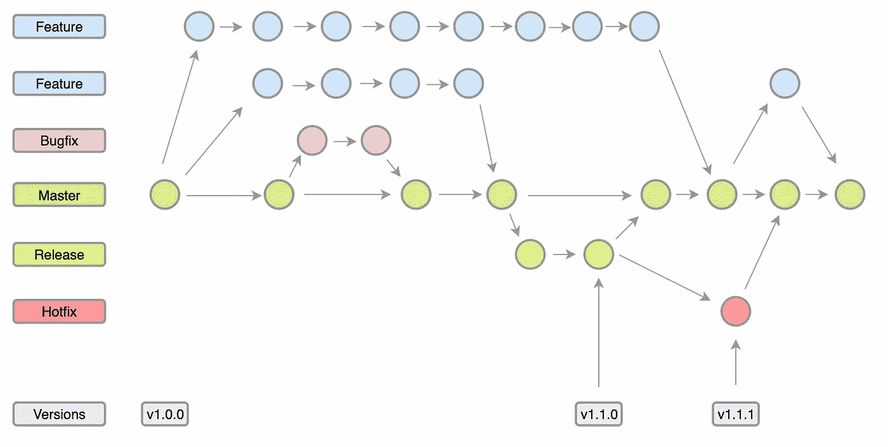

# GitHub 流与 OneFlow:哪种 Git 工作流最适合你？

> 原文：<https://betterprogramming.pub/a-simple-git-repository-strategy-93a0c7450f23>

## 我在团队中使用的一个简单的 Git 存储库策略

# 介绍

多年来，我一直在使用大家所说的 [Git Flow](https://nvie.com/posts/a-successful-git-branching-model/) 模型来组织代码分支、环境和部署。虽然这不是作者的本意，但我遇到的许多人对此已经变得相当教条。作者自己在 2020 年的“回顾”笔记中指出了这一点。

接受教条的问题在于，当我们认为这是唯一可行的方法时，我们会停止寻找替代方案或可能的改进。

# 问题

尽管 Git Flow 对于它所创建的软件类型来说仍然非常有用。正如它的作者 Vincent Driessen 在 2020 年所说:*“如果(…)你正在构建明确版本化的软件，或者如果你需要在野外支持你的软件的多个版本，那么 Git Flow 可能仍然像过去 10 年对人们一样适合你的团队”*。

我领导的团队更专注于开发 Web 应用和 API，Git 流模型增加了不必要的复杂性。在大多数这些项目中，分支 master 和 develop 是高度冗余的，在分支之间产生了许多合并问题，并且产生了难以跟踪的意大利面条 git 历史。更不用说有多少团队甚至在此基础上增加了一个舞台分支。

如果我们考虑当前的 CI / CD 实践，很明显所有这些额外的努力和问题都变成了不必要的文书工作，偷走了任何开发人员的快乐和生产力。

# 我走过的路

我对不断的合并冲突(以及由此产生的开发人员冲突)感到有些厌倦，并决定研究一下其他团队在做什么。

我从大的开始，惊讶地发现 Google 使用的是只有一个长期分支的 mono 库:master。对于真正的 CI / CD，每次提交都是一次释放！

这让我质疑为什么我要使用如此复杂的模型。我第一次向我的一个团队提到这件事时，有一种“这不可能是真的！”“如果我们那样做，我们的产品就会一直坏掉！”。它让我意识到，我们创建步骤越来越多的复杂系统的主要原因是恐惧！许多项目没有必要的故障保险(自动测试、代码审查等)。

那时我开始做更多的调查，很多基于 [OneFlow](https://www.endoflineblog.com/oneflow-a-git-branching-model-and-workflow) 模型的人决定找到一个适合大多数团队的中间地带。对于简单的项目，我使用的是 [GitHub Flow](https://docs.github.com/en/get-started/quickstart/github-flow) 模型，有一个真正的 CI / CD 过程:只有一个主分支和为特性和 bug 修复创建的分支，在完成时直接合并到主分支。

当团队越来越大，项目越来越复杂时(任何人？)，然后我应用我的简化版 OneFlow 模型，每周发布一次。这就是我在这里描述的模型。

# 单流模型

当项目很复杂和/或公司/客户希望或需要对发布的内容有更大的控制权时，我会使用这种模型。这通常与以下一个或多个因素有关:

*   没有适当的自动化测试，并且依赖于 QA 团队(最常见的情况)的旧系统。
*   由于过去发生的事情，业务团队缺乏信任(通常与大型企业或缺乏经验、薪酬低的团队有关)。
*   如果出现问题，后果会非常严重的产品(例如银行、医院、军队等)。

## 分支

你可能不需要所有这些类型的分支，但主要的一点是，只有一个长寿的分支:主人。

*   `master`:唯一永恒的分支。主分支被认为是主要分支，应该总是处于发布就绪和生产就绪状态。
*   `release/x.y.z`:准备推出的版本。一旦标记了版本，它就被发布。然后它被合并到主文件。
*   `feature/XYZ-1234:`链接到故事或任务单的功能。一旦完成，它就被合并到主文件中。
*   `bugfix/XYZ-1234`:链接到高、中、低或最低 Bug 单的修复。一旦完成，它就被合并到主文件中。
*   `hotfix/XYZ-1234`:链接到最高 Bug 票的修复。它取自带有最新版本标签的提交。一旦标记了版本，它就被发布。然后它被合并到主文件。

## 拉取请求

在一个特性或者一个 bug 分支被合并到 master 之前，一个 Pull 请求必须由开发人员创建，并且只有当这个 Pull 请求被至少两个开发人员批准后，它才应该被合并。

在合并之前对代码进行良好的测试是很重要的，这意味着具有高代码覆盖率的自动测试，并且依赖于团队，可能得到产品所有者和 QA 团队的批准。

## 环境

我们有更少的分支机构并不意味着我们有更少的环境。根据您的团队是如何组织的，您可能需要或不需要所有这些环境。检查真正的需求。而是自动化整个过程。

*   **生产**:现场环境，客户在这里使用产品。
*   **准备**:用于发布前 QA 测试的类似生产的环境。如果我们在做真正的 CI / CD，就不需要这个了。
*   **开发**:当不可能或不希望在本地启动完整的环境时用于开发。一个很好的例子是前端开发人员想要使用一个刚刚开发的 API 端点。也可由 QAs 或 POs 用于特殊测试。
*   **测试**:用于运行自动测试。在每次提交时创建、运行和销毁。通常作为 CI / CD 流程的一部分。
*   **特性**:更大的特性，需要单独测试。可由 PO 用于验证。它会在需要时按需创建，并在不再需要时销毁。

# GitHub 流量模型

当团队和/或项目很小时，我使用 [Github 流](https://docs.github.com/en/get-started/quickstart/github-flow)模型。这意味着 master 上的每次合并都变成了一次发布，同时发生实时 CI / CD。

与上面的 OneFlow 模型相比，我消除了对发布分支的需求以及与之相关的版本标记复杂性。我仍然添加版本标签，但它们是直接在 master 上完成的。

每当你合并到 master 时，没有什么比在生产中直接发布某些东西的感觉更能唤醒你了。YOLO:)

# 结果

那么，这对我和我的团队有什么作用呢？很好，我不得不说。每当我提出这个建议时，团队中总会有一些恐惧和抵制，但结果非常好:

*   更快乐的开发人员觉得他们可以更专注于开发，而不是官僚主义和问题。
*   合并冲突导致的个人冲突更少。
*   更少的人为错误(更少的机会合并到错误的分支并产生合并冲突)。
*   对于 DevOps 团队来说，流程更容易自动化。
*   业务部门更容易理解流程。

但它总是从与人们交谈开始，并展示替代方案的好处。然后邀请他们勇敢尝试。害怕是正常的，但不要让恐惧阻止你向对你和你的团队更好的方向前进。

从 OneFlow 开始，每周或每两周发布一次。你在那里仍然是 100%安全的，除非你决定，否则什么都不会被释放。随着你和你的团队在这个过程中获得信任，并越来越好地自动化，有一天你将能够决定使用 GitHub Flow 完全自动地发布你的一些产品。没必要着急。

# 参考

 [## 一个成功的 Git 分支模型

### 这个模型是在 10 多年前的 2010 年构思的，当时 Git 刚刚诞生不久。在…

nvie.com](https://nvie.com/posts/a-successful-git-branching-model/)  [## one flow-Git 分支模型和工作流

### 在“GitFlow 被认为是有害的”一文中，我概述了我成功使用的另一种 Git 版本控制工作流…

www.endoflineblog.com](https://www.endoflineblog.com/oneflow-a-git-branching-model-and-workflow)  [## GitHub 流- GitHub 文档

### GitHub flow 是一个轻量级的、基于分支的工作流。GitHub 流对每个人都有用，不仅仅是开发者。对于…

docs.github.com](https://docs.github.com/en/get-started/quickstart/github-flow)