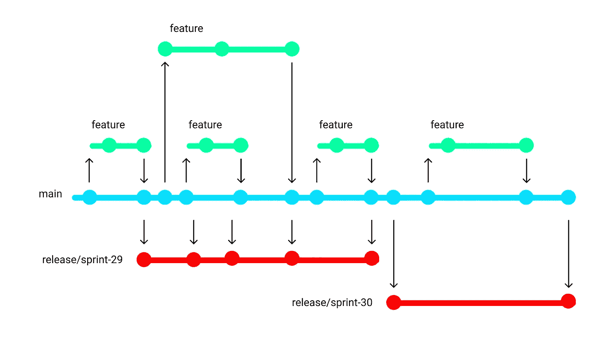
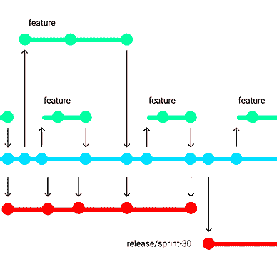
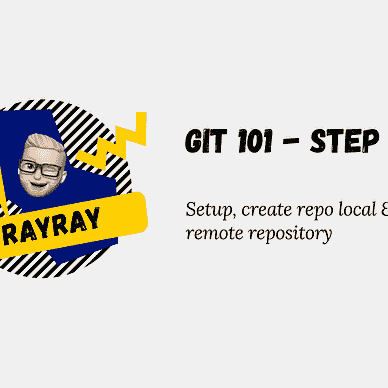

# 一个简单的 Git 工作流:Releaseflow

> 原文：<https://betterprogramming.pub/a-simple-git-workflow-releaseflow-1d036539ac44>

## 让我们简化 Git 工作流程吧！



Git Releaseflow 的可视化(作者)

我见过很多组织使用 Gitflow 策略来使用 Git。这不是一个糟糕的策略，但它可以更简单。这就是我很高兴找到 Releaseflow 的原因。在这篇文章中，我想告诉你它是如何工作的，以及为什么它会给你的组织带来好处。

> [“Git release flow](https://devblogs.microsoft.com/devops/release-flow-how-we-do-branching-on-the-vsts-team/)”这个工作流的名字来自微软。(看 [Youtube](https://youtu.be/t_4lLR6F_yk?t=924) 上的演讲)发布流程比 [gitflow](https://www.atlassian.com/git/tutorials/comparing-workflows/gitflow-workflow) 简单多了。gitflow 有许多不同类型的分支，而 release flow 只有 4 个分支。

# Git 发布流支持

*   真理的一个来源(主要分支)
*   以简单的方式管理版本
*   从特征分支直接到主分支
*   每次冲刺后的发布

# 分支

在发布流程中，我们有两种类型的分支。

1.  长寿树枝
2.  短寿命分支

# 1.长寿树枝

git 发布流程中的长期分支是`main`或`master`分支。每个功能、修补程序或发布分支都将从主分支中创建。此外，这些分支将通过一个拉请求合并到主分支中。

假设您需要部署不同的环境，但是这些环境不同于生产版本。在后端或前端应用程序中引入特性标志是一个好主意。

# 2.短寿命分支

这些短期分支看起来类似于 git-flow。但在这种情况下，我们只有 3 个。

1.  特征
2.  修补程序
3.  释放；排放；发布

## 2.1 功能

每当一个开发者需要创建一个新的特性时，就会有一个分支`feature/{PBI-number}-descriptive-name`。( *PBI =产品 Backlog Item* )在开发阶段，需要定期与主分支更新，防止不同步。

当特性被开发和测试时，在所有注释被解决之后，一个拉请求将被创建并合并到主分支中。

## 2.2 修补程序

构建不引入 bug 的软件是一个梦想，所以 bug 要尽快修复。

在 scrum 板上尽可能好地描述了 bug 之后，就创建了一个热修复分支。hotfix 分支将看起来像这个`hotfix/{PBI-number}-descriptive-name`，并且将通过一个 pull 请求合并回主分支。因此，所有未来的版本也会得到该缺陷修复。

## 2.3 发布

在每个 sprint 的末尾，都会有一个新的发布分支，就像这个` release/{ prefix }-{ sprint-number }。这个分支是从主分支创建的，并部署到生产环境中。

比如 sprint 29 结束了。我们创建一个分支`release/sprint-29`。该分支将被部署到生产中。几周后，我们完成了 sprint 30。我们做一个分支`release/sprint-30`。将这个分支部署到生产环境中，如果需要的话，删除以前的发布分支。这样可以保持树枝干净。

## 2.4 生产中的高优先级错误

有时我们在生产中会遇到严重的问题。如果我们需要修复它，我们可以创建一个修复分支。通过主分支机构的拉取请求进行合并。在合并之后，我们可以创建一个拉请求，并将其合并到发布分支中。

通过这种方式，我们确保我们的主分支总是有错误修正。

# 承诺

以获得更多正在开发和发布的工作的跟踪信息。必须有明确的提交消息，其中包括对 PBI 或任务的引用。例如，在下面的提交消息中(用 000000 代替 PBI 或任务号)。

```
Changed the if statement to conditionally load a new feature on test environment #000000
```

如果你使用 Azure DevOps，你会在开发标题下面看到参考。Github 也有和这个一样的功能。

# 不同的环境

许多公司出于多种目的使用不同的环境。不要试图通过发布多种版本来解决这个问题。尝试通过创建功能标志在代码中解决这个问题。

例如，通过特性标志，您可以确保在测试环境中，打开一个新开发的特性，而生产用户还不能看到它。

# 谢谢！


读完这个故事后，我希望你学到了一些新的东西，或者受到启发去创造一些新的东西！🤗

如果我给你留下了问题或一些要说的话作为回应，向下滚动并给我键入一条消息。如果你想保密，请在 Twitter @DevByRayRay 上给我发一条 [DM。我的 DM 永远是开放的😁](https://twitter.com/@devbyrayray)

[**通过电子邮件获取我的文章点击这里**](https://byrayray.medium.com/subscribe) **|** [**购买 5 美元中等会员**](https://byrayray.medium.com/membership)

# 阅读更多


[雷雷](https://byrayray.medium.com/?source=post_page-----1d036539ac44--------------------------------)

## 饭桶

[View list](https://byrayray.medium.com/list/git-3319a5048fc7?source=post_page-----1d036539ac44--------------------------------)5 stories