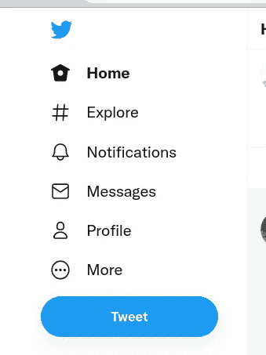
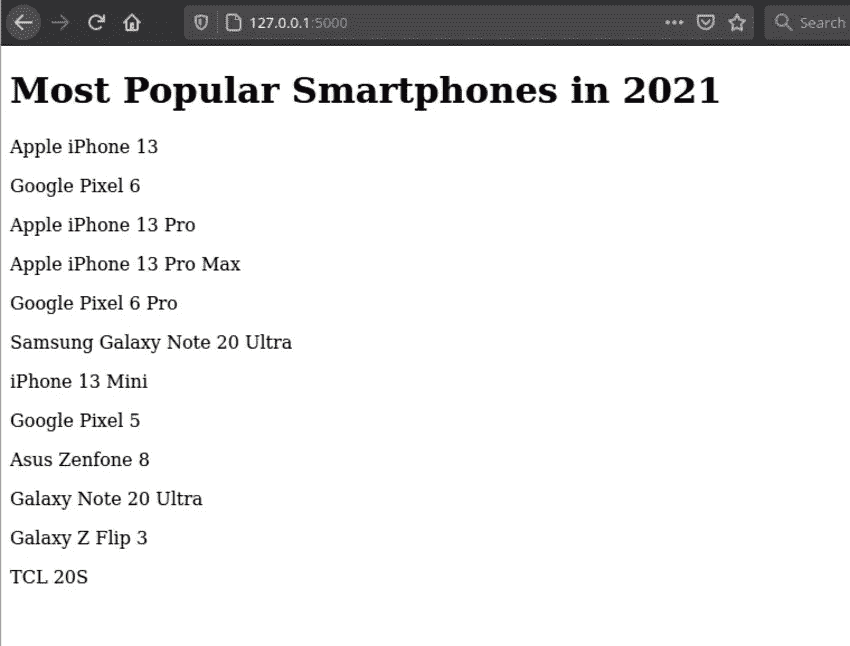
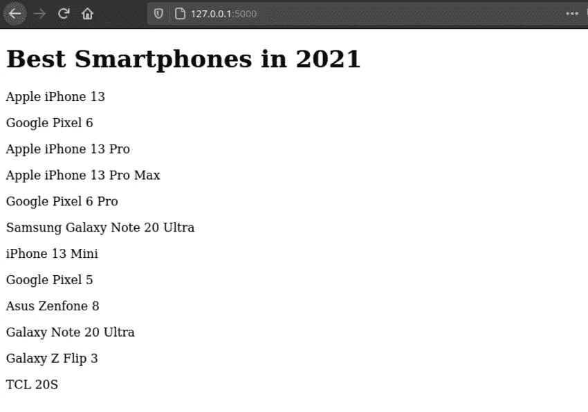
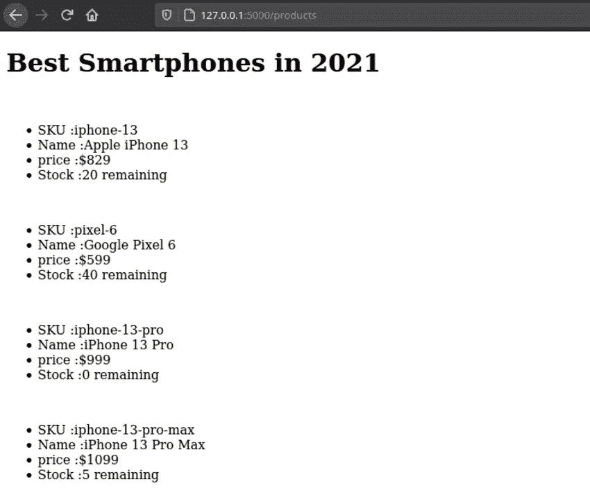
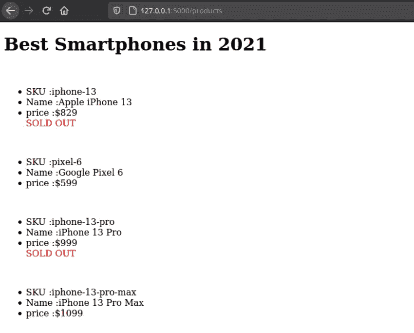
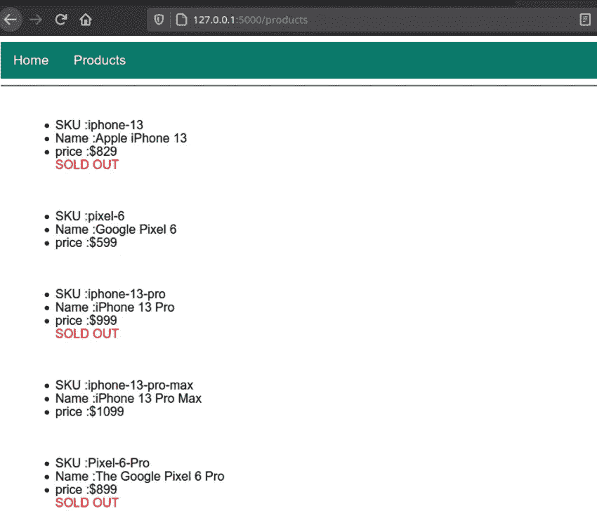

# Flask 中模板的简单指南

> 原文：<https://betterprogramming.pub/a-simple-guide-to-templates-in-flask-477a1cc527bd>

## 了解 Flask 中的 Jinja 模板引擎


照片由[哈尔·盖特伍德](https://unsplash.com/@halacious?utm_source=unsplash&utm_medium=referral&utm_content=creditCopyText)在 [Unsplash](https://unsplash.com/s/photos/website?utm_source=unsplash&utm_medium=referral&utm_content=creditCopyText) 上拍摄

你访问过的任何网站都包含一定的布局。以 Twitter 网站为例，



推特网站截图

从上图中，你可以看到网站被组织成不同的页面。即主页、浏览、通知、个人资料等。这些页面中包含的内容是借助模板呈现的。模板是指页面的布局和设计。
在本教程中，您将创建一个 Flask 应用程序，使用 Jinja 模板引擎显示 2021 年最流行的智能手机。

根据文件:

> Jinja 是一个快速、富于表现力、可扩展的模板引擎。模板中的特殊占位符允许编写类似 Python 语法的代码。然后向模板传递数据以呈现最终文档。

本教程结束时，您将学会:

*   如何在 Flask 应用程序中呈现模板
*   如何将变量或数据传递给模板？
*   如何访问模板中的数据
*   可变过滤器
*   模板中的条件，例如循环和 if 语句
*   模板继承

# 入门指南

创建一个包含所有应用文件和文件夹的文件夹`flaskr`。在`flaskr`文件夹中，创建一个文件`app.py`:

```
mkdir flaskr
touch app.py
```

在`app.py` 中导入`Flask`并创建一个 Flask 应用实例:

```
from flask import Flask
app = Flask(__name__)
```

创建返回简单网页的路由索引:

用`flask run`命令运行服务器，应该会看到您的应用程序在 [127.0.0.1:5000/](http://127.0.0.1:5000/) 运行:



索引页

一种更有组织的方式是用模板呈现 HTML 内容，而不是将内容作为 HTML 字符串显示给浏览器。为了渲染模板，Flask 提供了`render_template`方法:

```
@app.route('/') def index(): title = 'Most Popular Smartphones in 2021' return render_template('index.html', title =title)
```

在这里，您提供模板的名称和任何变量作为关键字参数。

Flask 自动在模板目录中查找模板。创建一个名为`templates`的文件夹，并在文件夹中创建`index.html`文件。该目录应该如下所示:

```
/flaskr
  /templates
    /index.html
```

将以下代码添加到`index.html`文件中:

# 模板变量

一旦进入模板，就可以显示我们在索引路径中定义的变量`title`的值，使用一个特殊的分隔符`{{ }}`，如下所示:用`{{title}}`替换`h1`标签之间的所有内容:

# 可变过滤器

您也可以使用过滤器来修改变量。要给一个变量添加一个过滤器，你可以使用管道符号`(|)` 来分隔变量和过滤器。例如，`replace()` filter 会用一个新的字符串替换一部分字符串:

```
<h1>{{title | replace("Most Popular", 'Best')}}</h1>
```

这里我们用标题中的`Best`替换字符串`Most popular`。刷新索引页面，标题就会改变。`replace()`取两个参数；第一个参数是将被替换的子字符串，而第二个参数是替换字符串。

该页面现在应该如下所示:



其他常用的过滤器包括:

*   `truncate()` —用于截断变量
*   `wordcount()` —用于统计字符串中的字数
*   `round()` —用于舍入数字
*   `reverse()` —反转变量的顺序
*   `title()` —将每个单词的第一个字母大写。
*   `float()` —将值转换为浮点数
*   `first()` —返回值的第一项
*   `dictsort()` -将字典中的键、值对按特定顺序排序。

# 模板中的条件:用于循环

在模板中使用条件可以让您控制如何处理数据。在`app.py`中创建一条路线`‘/products’`并添加一个函数，该函数定义了包含智能手机详细信息的字典列表，如下所示:

如果我们需要单独显示每个产品，我们必须使用`render_template`传递产品列表，然后在模板中使用 for 循环遍历每个产品。

创建`products.html`模板并添加以下代码:

这里我们使用 Jinja for 循环``来循环遍历产品列表，然后使用 python `dot`符号来显示产品 sku、名称、价格以及使用段落标签的数量。为了关闭循环，我们使用``

您可能已经注意到 for 循环的分隔符是``

页面现在看起来像这样:



产品页面

# 模板中的条件句:If 语句

条件 if 语句使用与 for 循环相同的逻辑。一个简单的 if 条件逻辑遵循以下模式:

```

  <p>Result if condition is true</p> 

```

假设您只想在数量为 0 的产品上显示`SOLD OUT`。在产品价格段落下面写一个 if 语句:

这里我们加一个 if 语句``。

if 语句检查产品的数量是否等于 0，然后不显示剩余的数量，而是用红色显示`SOLD OUT`。

刷新产品页面，您应该会看到类似这样的内容:



# 模板继承

网站的通用元素在每个页面上都保持不变，比如导航栏、页脚等等

为了避免在所有页面中重复元素的单调，jinja 提供了模板继承。

例如，通过拥有包含公共元素的基础模板，其他模板可以继承基础模板的内容。使用以下代码在 templates 文件夹中添加一个文件`base.html`:

` ` 将用于标题:这使得为每个页面提供自定义标题变得容易。` `将用于页面的内容。

要继承基本模板的内容，更新 `products.html`如下。

这里我们使用`extends`来继承基本模板的内容。应该在主体中的代码将在`content`块之间。下图显示了产品页面是如何从基础模板继承而来的。



**网址链接**

以上链接还不行。这是因为我们没有提供网址。让我们使用`[url_for()](https://flask.palletsprojects.com/en/2.0.x/api/#flask.url_for)`函数来完成。

```
<div class="nav"> <a href="{{url_for('index')}}"">Home</a> <a href="{{url_for('products')}}"">Products</a></div>
```

URL 以路由的功能命名。即`index`和`products`。

# 结论

在本文中，您已经学习了如何使用模板显示变量中的数据。如果你想在 Flask 中构建一个真实的应用程序来巩固你的知识，请参阅以下关于在 Flask 中创建用户帐户的指南:

[](/a-detailed-guide-to-user-registration-login-and-logout-in-flask-e86535665c07) [## Flask 中用户注册、登录和注销的详细指南

### 如何在 Flask 中设置用户帐户

better 编程. pub](/a-detailed-guide-to-user-registration-login-and-logout-in-flask-e86535665c07)