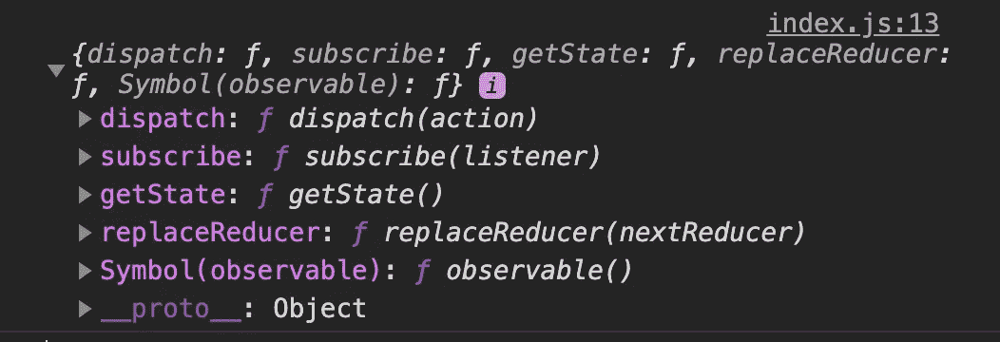
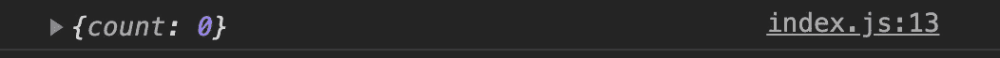
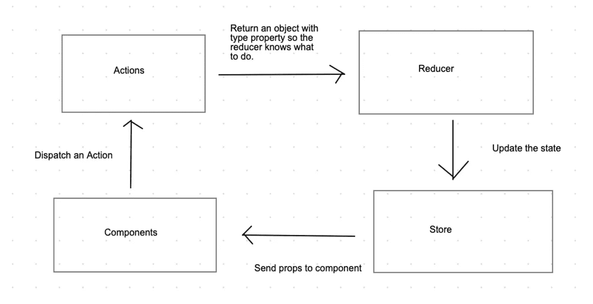

# Redux 的简单介绍

> 原文：<https://betterprogramming.pub/a-simple-introduction-to-redux-387e6b232760>

## Redux 如何管理复杂状态


图片来自 https://chriscourses.com/blog/redux[克里斯托弗·里斯](https://chriscourses.com/blog/redux)

Redux 是一个用于管理和维护应用程序状态的 JavaScript 库，可以和其他框架一起使用，比如 React。理解 Redux 的工作原理可能很棘手。本指南的目的是分解我们从 Redux 获得的一些资源，并解释与之相关的术语。

# 安装**凌和实现 Redux**

让我们首先用下面的代码生成一个名为`redux-practice`的 React 应用程序:

```
npx create-react-app "redux-practice"
```

这个生成的应用程序的目的是测试 Redux，主要来自`src/index.js`。

我们还需要安装 Redux，包括以下内容:

```
npm install redux
```

安装完成后，我们现在可以从 Redux 导入一些资源。

# 创建 Redux 存储

Redux store 是一个普通的 JavaScript 对象，它提供了一些可以调用的方法。应用程序的状态包含在 Redux 存储中。从存储中，我们将能够读取和更改状态数据。

Redux 存储必须在应用程序的最开始创建。在我们的例子中，那是在`ReactDOM`提交应用程序之前。在`src/index.js`中，我们可以使用来自 Redux 的命名导出开始创建商店:

```
import {createStore} from 'redux'
```

## createStore()

`createStore`是创建商店时需要调用一次的函数。没有任何参数就不能调用它。它接受的参数是一个名为`reducer`的函数，该函数将返回一个对象，即包含应用程序数据的状态。对于这个例子，我们将在变量`reducerFunction`中定义`reducer`。

```
const reducerFunction = () => {} const store = createStore(reducerFunction)
```

在`reducerFunction`中，它接受的第一个参数将代表状态，一个对象。理想的情况是在参数中设置一个默认状态，在本例中是一个键为 count、值为 0 的对象。

```
const reducerFunction = (state = {count: 0}) => { return state}
```

创建 Redux 存储后，让我们将存储变量注销到控制台，看看我们可以访问哪些方法。



console.log(存储)

对于本指南，我们将只关注`getState`和`dispatch`。

# 与 Redux Store 交互

为了从存储中访问当前状态对象，我们调用存储上的方法`store.getState()`，类似于 reader 方法。如果我们去`console.log(store.getState()`，我们将得到我们在`reducerFunction`中定义的状态。



在`reducerFunction`中定义的默认状态

## 行动

要更改 Redux store 上的属性，我们首先必须创建一个所谓的*动作*。动作只不过是被发送到存储的对象。

在对象上，第一个必需的属性是`type`。分配给它的值表示它将采取的操作。对于此操作，它将增加我们状态中的计数。按照惯例，该值是一个全大写的字符串。该对象可以具有附加属性。对于这个例子，它可以使用`amount`属性，该属性将计数增加 5。

让我们创建一个函数，它将返回一个具有这些属性的对象，并将它赋给一个变量`actionIncrement`。

```
const actionIncrement = () => { return { type: "INCREMENT", amount: 5     
   }}
```

## 派遣

现在，我们该怎么做呢？简单地呼叫`actionIncrement()`不会改变我们商店的状态。为此，我们需要在我们的存储上调用另一个方法`store.dispatch(actionIncrement())`，传入从`actionIncrement()`返回的对象。`.dispatch()`方法允许我们发送一个动作对象，商店可以用这个信息做一些事情。

当派单发送到商店时，`createStore()`功能再次运行。dispatch 动作作为 reducer 中的第二个参数传入，`reducerFunction`。

```
const reducerFunction = (state = {count: 0}, action) => { console.log(action) // {type: "INCREMENT", amount: 5} return state}
```

## 还原剂

根据传入的操作，可以更改返回的对象。在 reducer 中设置了一个条件来确定返回哪个对象。通常，使用 switch 语句。在`“INCREMENT”`的例子中，我们想返回一个对象，它的 count 属性加上了传递的数量。

减速器是纯函数，其输出仅由输入决定。它不使用或改变函数范围之外的任何东西。千万不要直接操纵国家的价值观！使用状态值计算新状态的值。

```
const reducerFunction = (state = {count: 0}, action) => { switch(action.type){ case "INCREMENT": return { count: state.count + action.amount } default: return state }}
```

## 使用多个减速器

随着应用程序的扩展，需要更多的属性和信息。假设我们想要在我们的州中包含另一个属性，`comments`。让另一个 reducer 函数来管理这些信息会更有效。现在，让我们创建这个函数并将状态设置为一个空数组。

```
const commentReducer = (state= []) => { return state
}
```

然而，`createStore`功能只能取一个减速器功能。除了传入一个 reducer 函数，还可以传入另一个负责将多个 reducer 函数组合成一个状态的方法。

这是 Redux 的另一个命名导出，名为`combineReducers`。这个函数接受一个参数，一个定义了键值对的对象。在我们的例子中，我们希望将`countObject`和`commentsArray`的键设置为各自的值。

```
import {createStore, combineReducers} from 'redux'const store = createStore( combineReducers({ countObj: reducerFunction,
      commentsArray: commentReducer }))
```

最后，`combineReducers`将返回一个对象，这就是`createStore`所期望的参数。`combineReducers`返回的对象就是现在的状态。

# Redux 流程概述

Redux 存储是应用程序状态存在的地方。一个动作包含一些识别状态变化的信息。一个应用程序将一个动作分派给缩减器。reducer 是基于动作实际改变状态的方法。缩减器接受之前的状态，并将之后的状态返回给 Redux 存储。然后，Redux store 将更新后的状态发送给应用程序中的组件。



运动中的还原

# 资源

[https://rangle.github.io/react-training/redux-intro/](https://rangle.github.io/react-training/redux-intro/)

[https://gist . github . com/Alex Griff/0e 247 dee 73 e 9125177d 9 c 04 CEC 159 cc 6](https://gist.github.com/alexgriff/0e247dee73e9125177d9c04cec159cc6)

以下是代码的要点:

# 结束语

Redux 是一个库，随着应用程序规模的增长，它可以管理更复杂的状态。Redux 的思想是只有一个状态管理所有的数据。可以从该状态中读取信息，更新信息的唯一方法是通过 reducer 函数。本指南涵盖了 Redux 的基础知识以及 Redux 能为我们的应用程序提供什么。感谢您的阅读！