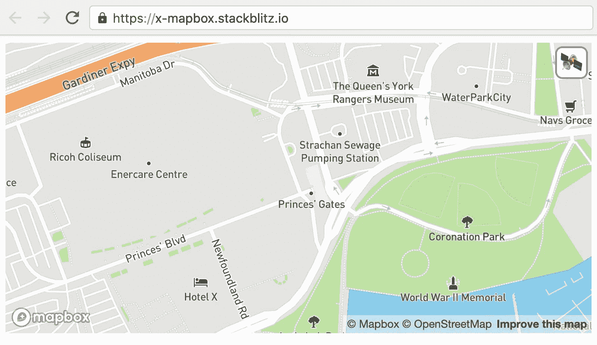
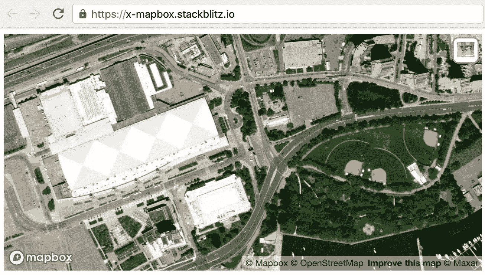
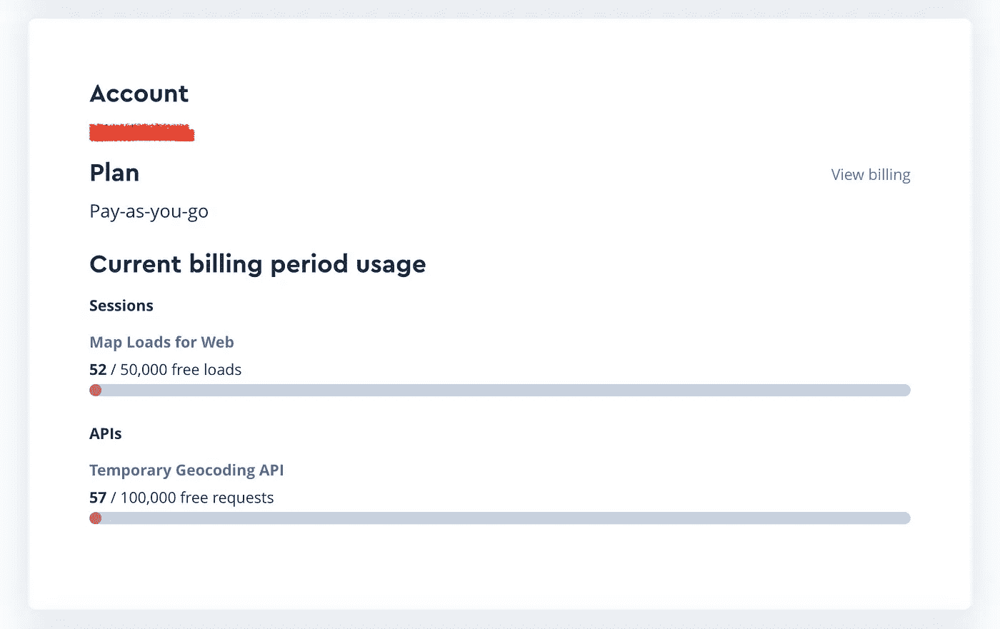
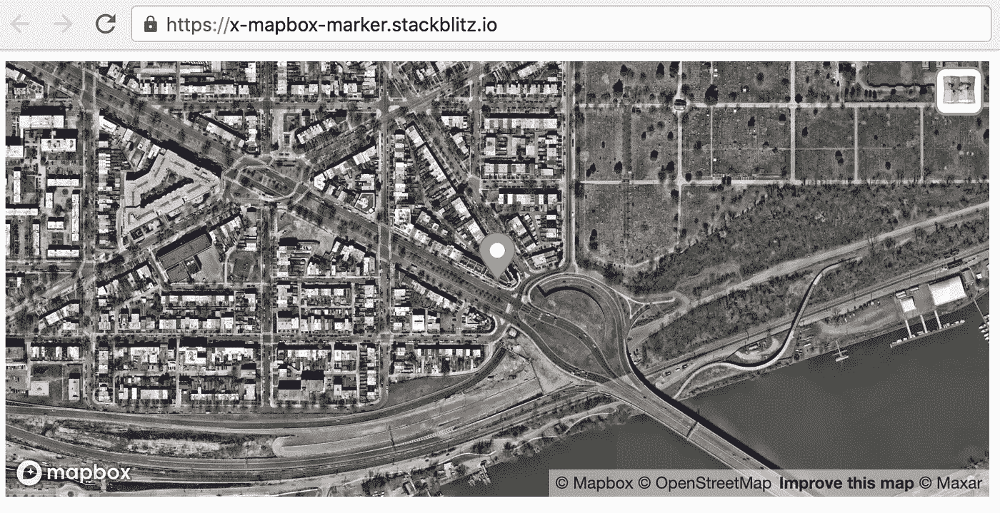
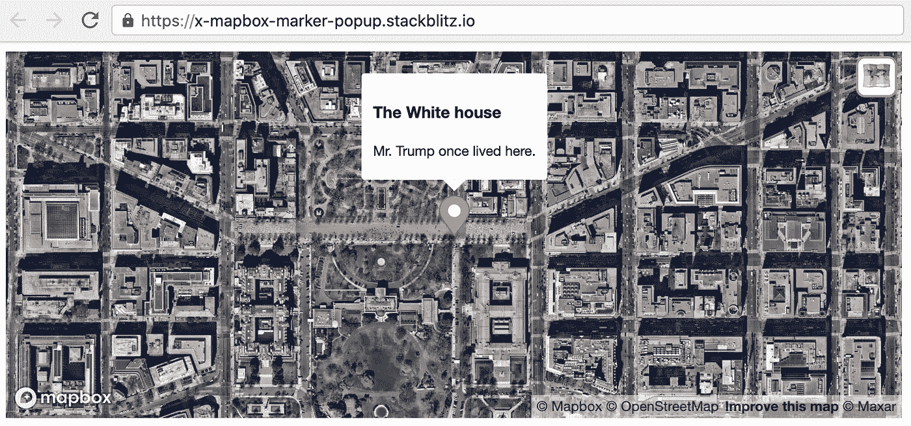
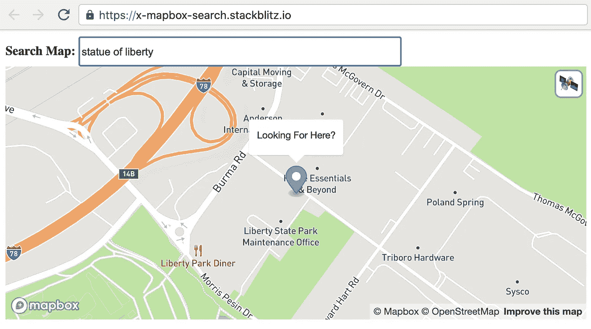

# 使用较少的 HTML 在 Web 应用程序上显示地图

> 原文：<https://betterprogramming.pub/a-simple-map-with-less-html-cda03679ea18>

## 使用自定义元素用几行 HTML 显示地图


[安德鲁·尼尔](https://unsplash.com/@andrewtneel?utm_source=medium&utm_medium=referral)在 [Unsplash](https://unsplash.com?utm_source=medium&utm_medium=referral) 上拍照。

本文将向您介绍一种在网页上创建地图的简单方法。为此，请将这两行 HTML 添加到您的网页中:

```
<script src="//unpkg.com/elements-x@1.4.4/dist/mapbox"></script>
<x-mapbox center="Toronto, Canada" access-token="xxxyyy"></x-mapbox>
```

要在卫星模式和地形模式之间切换，请单击右上角的方形图标。



[StackBlitz](https://stackblitz.com/edit/x-mapbox?file=index.html)



[StackBlitz](https://stackblitz.com/edit/x-mapbox?file=index.html)

Mapbox 使用访问令牌将 API 请求与您的帐户相关联。这个令牌将防止滥用地图，并且当你每月超过 50，000 次请求时，它也用于向你收费。

可以向`<x-mapbox>`提供访问令牌作为属性:`access-token`。虽然可以提供一个访问令牌作为属性，但是强烈建议从 JS 代码中以`window.xKeys.mapbpx`的形式提供它，它将在内部用于`window.mapboxgl.accessToken`。

```
<script>window.xKeys = {mapbox: 'pk.xxxyyyzzz' }</script>
<script src="//unpkg.com/elements-x@1.4.5/dist/mapbox"></script>
<x-mapbox center="Toronto, Canada"></x-mapbox>
```

创建帐户后，您可以从[地图框](https://accounts.mapbox.com)获得一个访问令牌。Mapbox 是免费的，除非你的地图流量很高(每月超过 50，000 次请求)。



来源:[https://account.mapbox.com/](https://account.mapbox.com/)

# 什么是<x-mapbox>？</x-mapbox>

`<x-mapbox>`是来自[元素-X](https://elements-x.com) 的自定义元素之一。默认情况下，地图以地形模式显示，但您可以通过单击右上角的图标切换到卫星模式。只要导入`elements-x/dist/mapbox`就很好用。

`<x-mapbox>`有更多功能:

*   显示标记(有或没有弹出窗口)。
*   通过提供地址而不是经度和纬度进行内置地理编码。
*   使用`<x-div>`和`<input>`标签搜索地图。

# 用标记显示地图

通过在`<x-mapbox>`中添加`<x-marker>`，您可以看到一个标记:

```
<x-mapbox>
  **<x-marker** lnglat="1600 pennsilvania ave, ashington DC" center>
  </**x-marker**>
</x-mapbox>
```



[斯塔克布里兹](https://stackblitz.com/edit/x-mapbox-marker?file=index.html)

# 显示带有标记/弹出窗口的地图

通过在`<x-marker>`中添加任何 HTML，您可以看到一个弹出窗口:

```
<x-mapbox>
  <x-marker lnglat="1600 pennsilvania ave, washington DC" center>
    **<h3>White House</h3> Trump once lived here.**
  </x-marker>
</x-mapbox>
```



[StackBlitz](https://stackblitz.com/edit/x-mapbox-marker?file=index.html)

# 搜索地图

为了让你的地图具有搜索功能，你需要用`<x-div>`来包装你的`<input>`和`<x-mapbox>`:



[StackBlitz](https://stackblitz.com/edit/x-mapbox-search?file=index.html)

我希望这能帮助你在你的网页上有一个更好的地图显示。

[**elements-x**](https://elements-x.com/) 是一个定制元素的集合，可以定制样式，并且独立于框架。要了解更多 elements-x，请访问 [Github 资源库](https://github.com/elements-x/elements-x/)。

```
**Want to Connect?**[Follow Allen on Twitter (@allenhwkim)](https://twitter.com/allenhwkim)
```