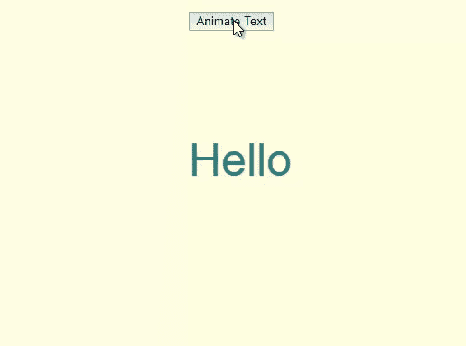
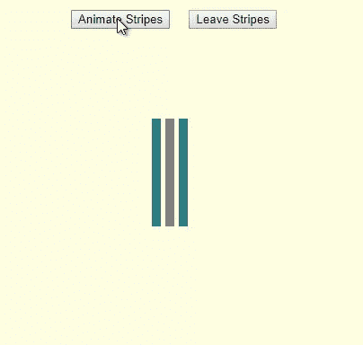
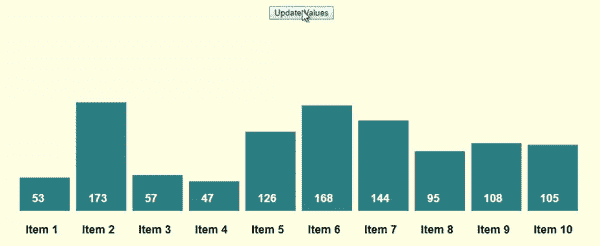
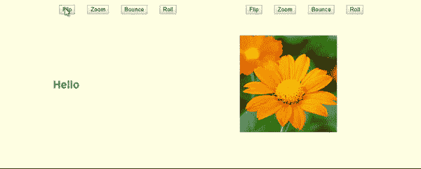

# 反应动画快速入门指南

> 原文：<https://betterprogramming.pub/a-simple-quick-start-guide-to-react-animations-57a9a97c63e2>

## 这里有四个简单的项目，向您展示如何使用反应-移动和反应-显示来构建好看的动画效果


[法托斯 Bytyqi](https://unsplash.com/@fatosi?utm_source=unsplash&utm_medium=referral&utm_content=creditCopyText) 在 [Unsplash](https://unsplash.com/search/photos/programmer?utm_source=unsplash&utm_medium=referral&utm_content=creditCopyText) 上的照片

动画可以让你给你的网站增加一些趣味，帮助你使你的网站脱颖而出，它们在获得额外的点击和转化方面可以发挥重要作用。

不幸的是，创作令人印象深刻和引人注目的动画并不容易。这需要花费大量的时间和精力——如果你自己写所有的代码。但幸运的是，已经有很多令人惊叹的库，它们会让你的工作变得更加容易，让你在几分钟内就能创作出令人瞠目结舌的动画。

但是现在我们有了另一个问题:有成千上万的优秀的图书馆可供使用。你应该选哪一个？你可能没有时间去测试 20 个不同的动画库来找出哪一个最适合你。

一些最著名的动画库有:Pose，React-anime，GSAP，React-motion，Velocity，React-spring…但是因为已经有很多关于这些库的很棒的文章，我在这里就不讨论它们了。

最近偶然发现一个叫 React-move 的动画库，很喜欢。我想分享一些概念和想法，应该可以帮助你立即开始用 React-move 创建自己的精彩动画。

React-move 是一个非常强大的库，它允许你做很多有趣的事情，这篇文章的大部分都是关于这个库的。然而，有时那些简单的动画可以在不到三分钟的时间内完成，也很好…

这就是为什么我想在这篇文章的结尾花几分钟时间向你介绍一个叫做 React-reveal 的动画库。React-reveal 是一个很棒的库，它允许你用两三行代码创建简单而有吸引力的动画。

# **让我们开始吧……**

我们将使用上面提到的库创建四个简单的动画项目。你可以从我的 [Github 仓库](https://github.com/rspadinger/AnimationsReactMove)获得源代码，或者在 CodeSandbox 上玩玩项目。

我不会将所有源代码复制粘贴到本文中，也不会解释任何基本的 React 概念。我们将只关注动画部分。我还保持了项目的样式(CSS)简单明了，并且我主要使用内嵌样式(在大型项目中不应该这样做)。

# **反应-移动的基础知识**

React-move 包含两个组件:Animate 和 NodeGroup。如果您需要动画显示单个项目，如文本、图像、SVG 元素……如果您想要动画显示多个项目(如条形图中的单个条),您可以使用 NodeGroup 组件。

首先，我建议您使用 create-react-app 创建一个名为“animations”的新项目，命令如下:

```
npx create-react-app animations
```

然后，我们将使用以下命令安装另外三个库(d3、react-move 和 react-reveal ):

```
npm install react-move react-reveal d3 — save
```

您还可以从我的 [Github 库](https://github.com/rspadinger/AnimationsReactMove)中克隆项目，并执行 npm install 来安装所有需要的库和依赖项。

# 动画#1:动画显示一个短文本字符串的大小、不透明度和旋转角度

完成后的示例如下所示:



在 CodeSandbox 上签出项目:

我们首先导入几个库，并创建一个简单的组件来保存动画文本的初始状态。render 方法返回一个按钮，允许我们用一组不同的随机生成的参数来制作文本动画。

## **React-move 最重要属性的快速概述**

React-move 的动画组件只包含几个属性，所以让我们快速浏览一下:

**show** :一个布尔值，它决定子组件(在我们的例子中，应该是动画的文本)是否应该被渲染。

**start** :这个属性返回一个对象，定义我们动画的开始状态(例如，初始大小，不透明度…)。

**enter、update、**和 **leave** :这些属性返回描述当前状态(大小、不透明度……)在 enter、update 或 leave(我们的大小、不透明度……的最终值应该是什么)时应该如何转换的对象。

**插值**:这是一个强大的功能，但是在很多情况下你不会需要它。React-move 允许您将组件关联到不同类型的插值。数值插值是默认设置，如果这就是你所需要的(例如，将文本字符串的大小从起始值插值到结束值)，那么你不需要做任何事情-只需忽略插值属性。
interpolation 属性根据您提供的各种属性返回特定的插值器(由您根据需要选择)。

有关所有可用属性和功能的详细描述，请查看 [React-move GitHub 页面](https://github.com/react-tools/react-move)。

## 最后，这是我们的动画代码

现在，我们将实现在“Hello”文本字符串上执行实际动画的方法`animateText()`:

我们的`<Animate>`组件的子组件是一个接收定义动画的(变化的)状态值的函数，该函数返回动画元素——在我们的例子中是一个带有文本“Hello”的`<div>`。

我们将`<Animate>`组件的 show 属性设置为 true，以表明我们想要显示我们的动画`<div>`元素。然后我们用各种道具的初始值定义一个开始对象。

我们还定义了一个为这些属性提供最终值的 enter 对象，以及一个带有动画持续时间和渐变属性的 timing 对象。在我们的例子中，我们使用了 d3-ease 的 easePolyOut 函数，但是您也可以使用其他的缓动函数。

这意味着，当页面被加载时，我们的文本字符串使用 easePolyOut 函数在 2 秒钟内从字体大小= 0 到字体大小= 50，从不透明度= 0 到不透明度= 1…动画。

## **让我们添加 handleUpdate 函数，当我们点击“动画文本”按钮**时会调用该函数

在这里，我们只是为我们的动画属性创建随机值，并更新状态以重新呈现我们的组件。当这种情况发生时，`<Animate>`组件将带有“Hello”文本的`<div>`从其当前状态激活为 update 属性中提供的值。

需要注意的一件重要事情是，需要将 enter、update 和 leave(本例中未使用)属性中的属性值放在方括号中，以便根据提供的从开始值到结束值的时间进行转换。否则，您将获得从起始值到结束值的即时转换。

当然，您可以用任何其他 HTML 或 SVG 元素来替换文本“Hello ”,并且可以选择想要制作动画的元素的任何属性。

# 动画#2:制作一组 3 条条纹的旋转角度动画

完成后的示例如下所示:



在 CodeSandbox 上签出项目:

这个例子与第一个非常相似，所以我将只复制和粘贴描述新特性的代码部分。

首先，我们定义了一个由 3 个条纹组成的数组，其中包含了我们想要制作动画的各种属性的初始值。

和前面的例子一样，我们创建了一个函数`<animateStripes()>`，它定义了三个动画矩形条的行为。

这里，我们看到了与上一个示例的代码相比的一些有趣的变化:

首先，我们调用 stripes 数组上的 map 来创建一个由三个单独的`<Animate>`对象组成的新数组。是的，正如我已经提到的，`<Animate>`用于动画单个元素，但是没有什么可以阻止我们创建一组`<Animate>`对象来动画具有相同属性值的几个元素。

其次，我们利用了`<Animate>`组件的 leave 属性。这定义了当我们将`<Animate>`组件的 show 属性设置为 false 时的动画行为。

下面是相应的`handleLeave()`功能:

# 动画#3:使用 React-Move 的节点组组件制作的动画条

完成后的示例如下所示:



在 CodeSandbox 上签出项目:

我们需要导入`<NodeGroup>`组件，然后创建我们的`<BarChart>`组件，并用类构造函数中十个小节的一些随机数据初始化状态。

在`render()`方法中，我们设置了我们的`<NodeGroup>`组件。这类似于我们使用`<Animate>`组件的前一个例子，但是还有一些额外的属性:

**数据**:包含一个或多个定义我们动画的属性的结束值的对象数组。在我们的示例中，我们希望显示一个包含十个随机高度的条形的图表。因此，我们定义了一个由十个对象组成的数组，其中每个对象包含一个 id、值(40 到 200 之间的随机整数)和一个名称属性。

**keyAccessor** :这是一个为每个节点元素返回唯一键的函数。这需要跟踪哪些节点正在进入、更新和离开。

start、enter 和 update 属性的工作方式与我们用于`<Animate>`组件的类似。这些函数接收组中每个元素(条形)的数据(要制作动画的属性的结束值),并返回一个描述状态应该如何转换的对象。

`<NodeGroup>`的子元素是一个函数，它接收所有单个节点元素的数组，并为每个节点元素返回一个动画`<Bar>`组件。

`<Bar>`组件由用于矩形杆的`<div>`和用于接收杆高度和各种其他支撑的`<label>`元件组成。

# 动画#4:反应-揭示——一个快速简单的方法来创造一些令人惊叹的动画

写完这篇文章，我想快速向大家介绍一下 React-reveal。这是一个非常易于使用的动画库，允许你用几行代码创建简单而专业的动画。

你可以在 [React-reveal 主页](https://www.react-reveal.com/)查看所有细节。

在我们简短的编码示例中，我们将为文本字符串和图像制作各种效果的动画，如翻转、缩放、弹跳和滚动。

完成后的示例如下所示:



在 CodeSandbox 上签出项目:

首先，我们从 React-reveal 导入一些组件，在`render()`方法中，我们返回一个动画文本字符串(封装在具有各种样式属性的`<div>`中)。

因此，每当我们单击其中一个按钮时，我们调用`handleAnimation()`函数并更新状态，以便重新呈现组件。所有的神奇都发生在下面这种类型的语句中:

```
comp = <Zoom>{this.getText()}</Zoom>;
```

在这里，封装的元素(在我们的例子中是一个文本字符串)以缩放效果显示出来。它实际上只需要一行代码就可以创建各种好看的动画效果。

# **遗言**

非常感谢你的阅读，我希望你喜欢这篇文章，并学到一些新的东西。

同样，您可以从 [GitHub](https://github.com/rspadinger/AnimationsReactMove) 下载整个项目代码。

如果您有任何意见或问题，请在下面告诉我。