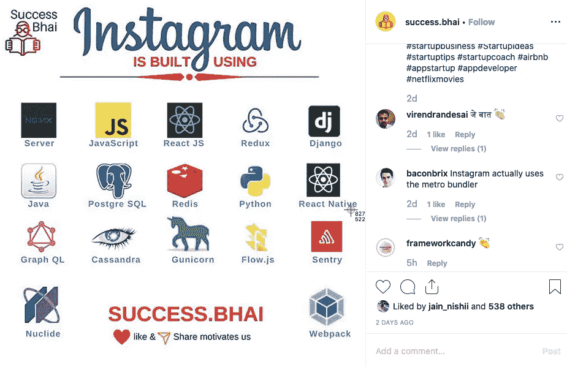
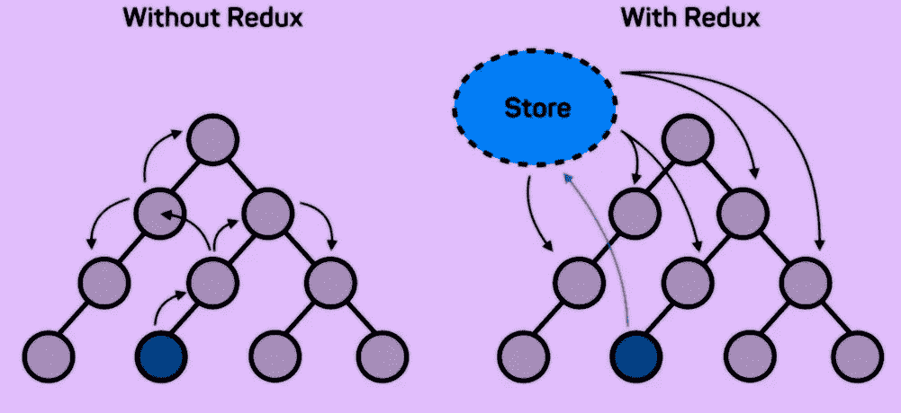
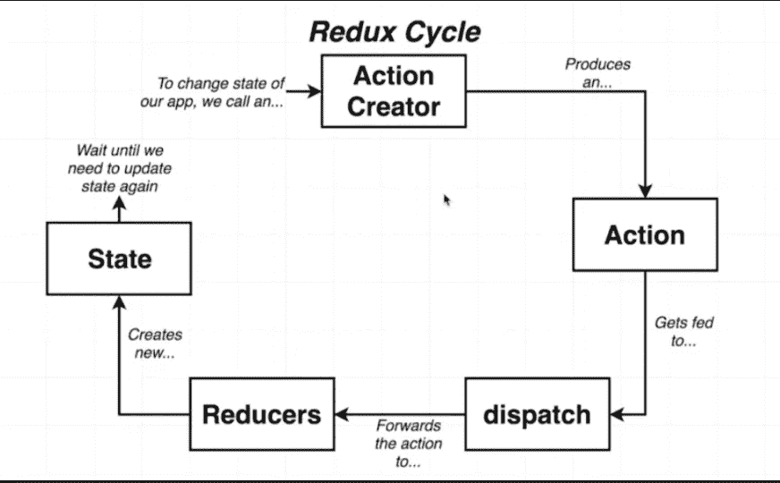
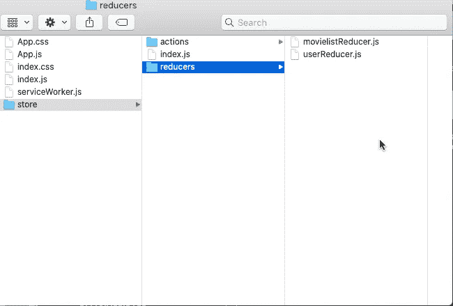
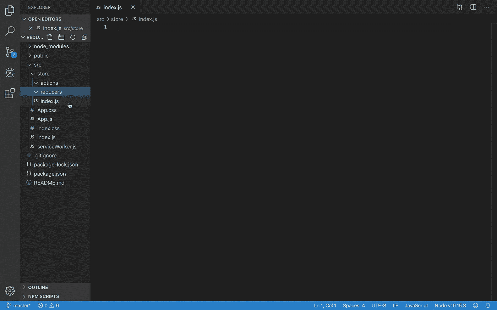
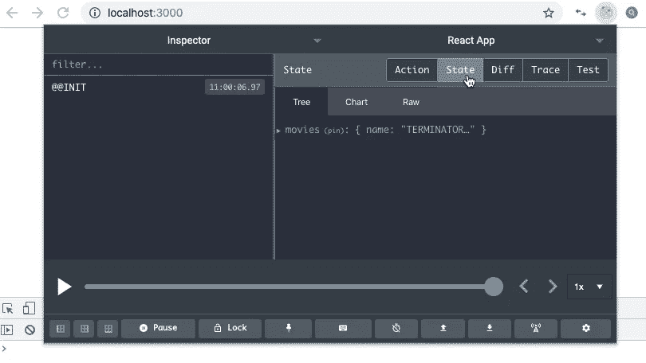
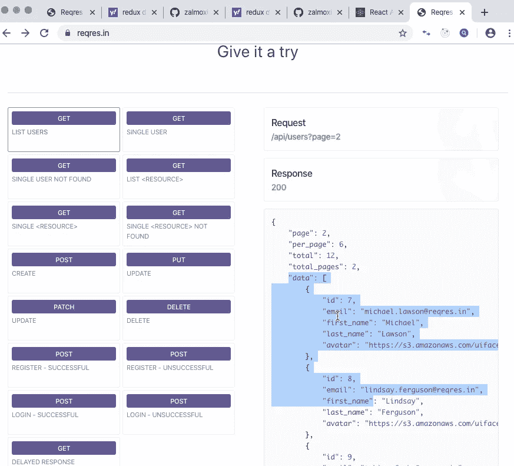
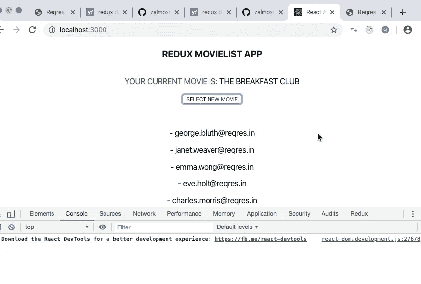

# 一个简单的 Redux 教程:初学者和完整的代码示例

> 原文：<https://betterprogramming.pub/a-simple-redux-tutorial-starter-complete-code-example-9b2923572d71>

## React 和 Redux 前端电影应用程序演示与 API 获取


克里斯托夫·高尔在 [Unsplash](https://unsplash.com/s/photos/computer?utm_source=unsplash&utm_medium=referral&utm_content=creditCopyText) 上拍摄的照片

公平地说，现在有许多流行的 JavaScript 库可以增强 React 的潜在工作流，尽管 [Redux](https://redux.js.org/) 一开始可能会带来相当大的实现开销，但它也不例外！

最近的统计数据表明，据报道，超过 1000 家公司在他们的技术堆栈中使用 Redux，包括 Instagram、Intuit 和 Swat.io。



也就是说，我们不需要实现 Instagram 大小的架构，也不需要克隆它的庞大本质来掌握 Redux 的基本概念(所以不要担心，我们不会有这些)...

通过关注使 Redux 强大的一些主要原则，以及它的设计系统和模式，我们可以为开始使用 Redux 打下坚实的基础，而不会迷失方向和迷失在开销中。

如果您直接从初学者的角度开始使用 Redux 学习状态和钩子，那么在我们思考一种高效和轻量级(总大小为 2kb)状态管理的新底层架构时，踩下刹车并减速可能是明智的。

在我们开始之前，我们应该问自己的第一个重要问题是:“为什么 Redux？”

# **为什么是 Redux？**

观察下图:



组件传递状态的两个应用示例

啊，我们左边臭名昭著的 Redux 模型表明，我们的应用程序越复杂，在子-父状态关系模型中跟踪和与其他组件共享状态就可能变得越混乱。

我们可以很容易地看到，对于大型应用程序，当我们有 bug 或者只是对数据进行组织时，这会变得非常棘手。

然而，说明“使用 Redux”的模型显示了我们可以如何解决这个问题。通过创建一个处理我们的状态管理的存储，数据流可以更容易地呈现可跟踪性，并且组件可以监听它们感兴趣的数据。更好，也更容易预测。

在 Redux 环境中使用全面的、可定制的中间件和花哨的 shmancy Redux DevTools，Redux 在简化大型应用程序中的状态管理过程方面的价值变得显而易见。

# React-Redux“流量”与建筑

这使我们在深入研究 Redux 核心概念之前到达了第二个里程碑:Redux 的循环模式。



超级英雄 Grider 的“现代反应与 Redux”的屏幕帽

总结一下:

## **动作**

一个对象，设置关于我们的数据进入状态的信息。

## **调度**

在我们的动作和 reducers 之间充当桥梁的函数，将信息发送到我们的应用程序。

## **减速器**

一个函数，它以类型和有效负载的形式从我们的操作中接收数据信息，并根据额外提供的数据修改状态。

## **状态**

所有来自减速器的数据都被传送到一个中央数据源。

我们现在可以看到，实现一个系统来设计我们的数据将使我们对我们的数据流有更清晰的控制和权力。这种循环，就像生命的循环一样，是这个可爱的小宝贝四处走动的原因。(好吧，这有点戏剧性，只是为了好玩)。

# 商店、提供商和连接

## ■撕*撕*

一旦我们设置好行动和减少措施，我们的商店就会保持一切正常。商店是我们可以设置初始状态、组合我们的 reducers、应用中间件和保存我们的信息的地方。

## *供应商*

然后，我们可以使用提供者将我们的存储包装到我们的应用程序中，并通过这样做来传递和呈现我们的状态。然后，我们可以使用*将*与一个组件连接起来，并使它能够从提供者那里接收存储状态。

因此，我们的存储文件体系结构将如下所示:



Redux 在构建设置时非常灵活。我们将一如既往地通过创建一个包含一个 actions 文件夹和一个 reducers 文件夹的 store 文件夹来实现隔离和干净的文件结构。

我们还将在我们的存储文件夹中有一个索引来连接我们的存储并传递 reducers。

开始编码吧！

# 电影列表 React-Redux 应用程序代码

让我们从在我们的终端中使用 Node(对于 MAC)开始，并创建我们的 React 应用程序，标题为`redux-movielist`和 [create-react-app](https://github.com/facebook/create-react-app) 。

```
cd desktop
npx create-react-app redux-movielist 
```

接下来，让我们进入目录并安装一些我们将用来启用 Redux 库的包。

其中包括 Redux、 [React-Redux](https://react-redux.js.org/) 将 React 连接到 Redux，以及 [redux-thunk](https://github.com/reduxjs/redux-thunk) ，我们将使用它们作为异步操作的定制中间件。

```
cd redux-movielist
npm i redux react-redux redux-thunk
```

现在，让我们打开我们的文本编辑器，通过删除徽标和`app.test.js`来设置/清理我们的应用程序，并为我们的 Redux store 创建我们的文件结构。这将包括我们的 actions 和 reducers 文件夹，以及一个保存我们数据的`index.js`。

所以，现在我们的文本编辑器应该是这样的:



store / actions 和 reducers 以及 index.js

现在我们已经为我们的商店建立了初始文件，让我们继续创建我们的第一个 action 和 reducer。

我们的动作将获取数据，将我们的电影更新为我们选择的带有类型和有效负载的电影，而我们的 reducer 将接收信息并返回有效负载。

在我们的 action 文件夹中，我们将创建`updateMovies.js`，在 reducers 文件夹中，我们将创建`movielistReducer.js`。

`updateMovies.js`:

```
export const UPDATE_MOVIES = "UPDATE_MOVIES";const updateMovies = { type: UPDATE_MOVIES, payload: "THE BREAKFAST CLUB"};export default updateMovies;
```

请注意，我们已经将`UPDATE_MOVIES`变成了一个 const，以避免以后出现错误。

接下来，让我们为电影列表编写 reducer 函数，并从 action 接收数据，然后像这样返回有效载荷。到目前为止还不错。

`movielistReducer.js`:

```
import {UPDATE_MOVIES} from '../actions/updateMovies';const movielistReducer = (state ={}, {type, payload}) => { switch(type) { case UPDATE_MOVIES : return {name: payload} default : return state};};export default movielistReducer;
```

注意，我们的 reducer 有两个参数，一个是设置为空对象的 state，另一个是我们用 type 和 payload 构造的 action。

现在我们已经为动作和 reducer 编写了更新电影列表的逻辑，让我们在 store 文件夹中的`index.js`文件中设置我们的商店。

我们还将添加我们的 Redux DevTools 扩展，*基本存储* **，**，我们可以从 [GitHub](https://github.com/zalmoxisus/redux-devtools-extension) 中获取。

`index.js` (在本店文件夹中):

```
import {createStore, combineReducers} from 'redux';import movielistReducer from './reducers/movielistReducer';const reducer = combineReducers({movies: movielistReducer});const initialState = {movies: {name: "TERMINATOR 2"}};const store = createStore(reducer, initialState, window.__REDUX_DEVTOOLS_EXTENSION__ && window.__REDUX_DEVTOOLS_EXTENSION__());export default store;
```

现在，让我们连接我们的商店以做出反应，并将我们的应用程序包装在我们的 *source* 文件夹`index.js`中的提供者周围。

`index.js` (src 文件夹):

```
import React from 'react';import ReactDOM from 'react-dom';import './index.css';import App from './App';import * as serviceWorker from './serviceWorker';import store from './store/index'import {Provider} from 'react-redux'ReactDOM.render(<Provider store={store}><App /></Provider>, document.getElementById('root'));// If you want your app to work offline and load faster, you can change
// unregister() to register() below. Note this comes with some pitfalls.// Learn more about service workers: https://bit.ly/CRA-PWAserviceWorker.unregister();
```

我们应该在控制台中得到一个错误，说找不到`logo.svg`。不要担心，这是一个好迹象，意味着我们的应用程序现在与我们的 Redux 商店相连。为了消除这些错误，让我们最后进入`App.js`并清理它。

`App.js`:

```
import React from 'react';import './App.css';function App() { return ( <div className="App">
       REDUX MOVIELIST APP
       </div>);};export default App;
```

当我们在浏览器中返回到我们的应用程序时，我们应该能够通过点击右上角点亮的图标(针对 Chrome)来访问我们的 Redux DevTools。

这将打开我们的 GUI，如果我们单击 state，我们现在可以看到我们的电影列表状态正在初始化！非常酷。



好吧，太棒了。让我们回到我们的文本编辑器，设置我们的`App.js`,以便它连接到我们的商店。我们将通过导入我们的操作、连接、状态和调度，以及设置道具来实现这一点。

之后，我们将呈现电影列表的显示，并创建一个可以调度新状态的按钮！所以，现在你的`App.js`应该是这样的:

`App.js`:

```
import React from 'react';import './App.css';import {connect} from 'react-redux';import updateMovies from './store/actions/updateMovies';function App(props) {return ( <div className="App"> <h3>REDUX MOVIELIST APP</h3><br/><spanstyle={{color:'green'}}>YOUR CURRENT MOVIE IS: </span>{props.movies.name}<br/><button onClick={props.updateMovies}>SELECT NEW MOVIE</button></div>);};const MapStateToProps = (state) => { return { movies: state.movies};};const MapDispatchToProps = (dispatch) => {return {updateMovies: ()=> dispatch(updateMovies)}};export default connect(MapStateToProps, MapDispatchToProps)(App);
```

唷！好了，现在我们应该让我们的整个 Redux 循环完全连接并运行，我们的应用程序将状态更新为我们的新电影选择。

是的，是的，我知道…这不是有史以来最时尚的应用程序，但考虑到 Redux 的样板设置，让我们只坚持概念，并根据您的喜好随意设计。但是现在，拍拍自己的背，喝一口咖啡。干得好。

我们的下一个挑战将是为用户数据信息实现一个异步动作 API 获取。准备好了吗？

我们将使用来自[https://reqres.in/](https://reqres.in/)的数据。如果你访问该网站，你会看到我们可以从 [/api/users 获取用户数据？page=2](https://reqres.in/api/users?page=2) 。



好了，让我们回到文本编辑器中的 actions 文件夹，在一个名为`fetchUsers.js`的新文件中写出我们的 fetch API 代码。

`fetchUsers.js`:

```
export const FETCH_USERS = "FETCH_USERS";const fetchUsers = (dispatch) => { fetch('https://reqres.in/api/users') .then(res => res.json()) .then(res => dispatch({type:FETCH_USERS,payload:res.data}))};export default fetchUsers;
```

让我们在名为`userReducer.js`的 reducer 文件夹中创建一个新的 reducer，并将其编码为:

`userReducer.js`:

```
import {FETCH_USERS} from '../actions/fetchUsers';const userReducer = (state = {}, {type, payload}) => { switch(type) { case FETCH_USERS : return payload default : return state};};export default userReducer;
```

回到我们商店文件夹中的`index.js`文件，我们现在可以导入`userReducer`，将其添加到我们的`combineUsers`，将其设置为用户，并设置其初始状态，这将是一个数组。

我们还需要导入 Thunk 和`applyMiddleWare`,这样我们就可以使用定制中间件执行异步操作。

最后，我们还需要导入`compose`，这样我们就可以同时使用我们的 DevTools 扩展和中间件。

`index.js` (存储文件夹):

```
import {createStore, combineReducers, compose, applyMiddleware} from 'redux';import movielistReducer from './reducers/movielistReducer';import userReducer from './reducers/userReducer';import thunk from 'redux-thunk';const middleware = [thunk];const allReducers = combineReducers({movies: movielistReducer, users: userReducer});const initialState = { users: [], movies: {name: "TERMINATOR 2"}};const store = createStore(allReducers, initialState, compose( applyMiddleware(...middleware), window.__REDUX_DEVTOOLS_EXTENSION__ && window.__REDUX_DEVTOOLS_EXTENSION__()));export default store;
```

注意，我们使用 spread 操作符来应用我们的中间件，并将 Thunk 设置为一个 const(中间件)数组。同样，我们已经将我们的常量从减速器更改为`Allreducers`。

好吧！现在，让我们回到我们的`App.js`并导入我们的获取动作。我们可以使用 map 方法来映射我们的用户，并通过用一个按钮调度我们的获取来显示相关的数据。您的`App.js`现在应该是这样的:

`App.js`:

```
import React from 'react';import './App.css';import {connect} from 'react-redux';import updateMovies from './store/actions/updateMovies';import fetchUsers from './store/actions/fetchUsers';function App(props) { return ( <div className="App"> <h3>REDUX MOVIELIST APP</h3> <br/> <span style={{color:'green'}} >YOUR CURRENT MOVIE IS: </span>{props.movies.name} <br/> <p><button onClick={props.updateMovies}>SELECT NEW     MOVIE</button></p> <br/> {props.users.length === 0 ? <p>THERE ARE NO USERS</p> : props.users.map(user=> <p key={user.id}>{user.first_name} -    {user.email}</p>)} <br/> <button onClick={props.fetchUsers}>FETCH USERS</button> </div>);};const MapStateToProps = (state) => { return { movies: state.movies, users: state.users};};const MapDispatchToProps = (dispatch) => { return { updateMovies: ()=> dispatch(updateMovies), fetchUsers: ()=> dispatch(fetchUsers)};};export default connect(MapStateToProps, MapDispatchToProps)(App);
```

厉害！现在，如果我们检查我们的应用程序，并点击我们的按钮来获取用户，我们应该看到我们的用户被获取。



我们做到了！我们刚刚在真人表演中观察到了两个 Redux 循环。

一个电影列表，我们在分派到新电影时更新它；一个异步动作，我们为用户获取数据。你绝对可以停下来喝点庆祝咖啡。干得漂亮。

# 结论

我意识到这里涉及到一点设置，但是一旦我们启动了轮子，并且我们以一种我们可以观察我们的数据管理和拥有一个存储的方式设置了事情，并且看到我们的组件如何被包装并且相互倾听，Redux 的基础开始变得更有意义。这是一个很好的起点。

这只是 Redux 的一个开始示例，希望现在我们已经了解了一些核心概念，并看到了它们的实际应用，这可以帮助澄清一些事情，并为进一步了解我们的知识打下一个良好的基础。

如果您对概念或代码有任何疑问，请给我留言或评论，我会尽快回复您。

您还可以在下面的 Git 上找到源代码，以及更广泛的代码和我的频道上的视频，在这里我们可以更详细地了解所有内容:

GitHub 回购:[https://github.com/01Clarian/ReduxMovieAppTutorial](https://github.com/01Clarian/ReduxMovieAppTutorial)

最后，我想分享一些链接，链接到我认为启发了这篇文章的 Redux 的伟大解释和教程。

1.  [https://www . udemy . com/course/complete-react-developer-zero-to-mastery/](https://www.udemy.com/course/the-complete-web-developer-zero-to-mastery/)(虽然这是一个完整的网络课程，但是 Andrei 的 Redux 部分很牛逼)。

2.

有趣和简单的分解 Redux 值得花时间！

好了，就这样。感谢您的检查，我希望这是有帮助的！