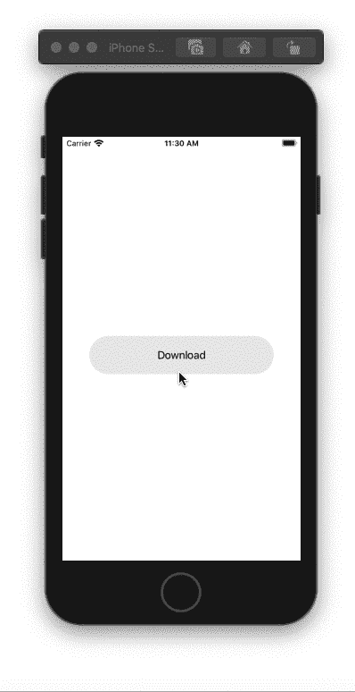
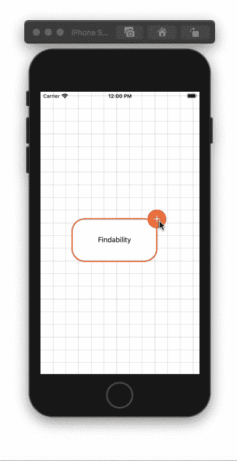
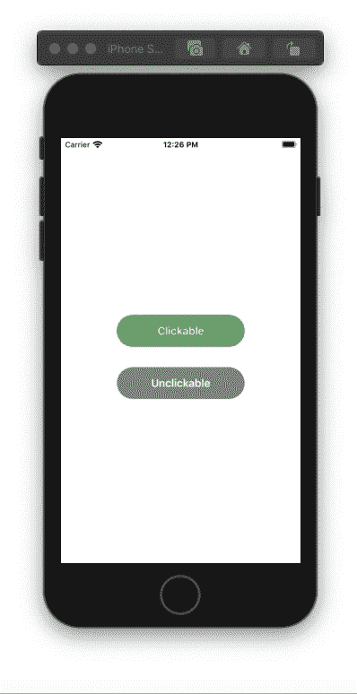
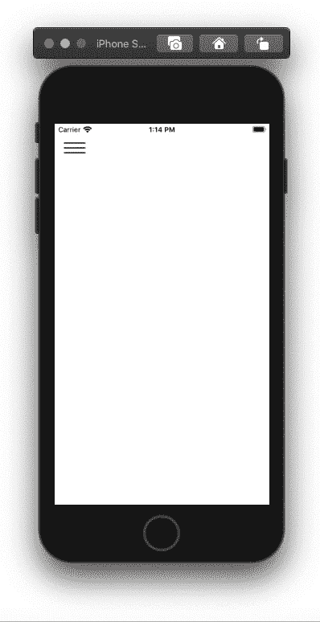

# 通用设计原则的简化版本

> 原文：<https://betterprogramming.pub/a-simplified-revision-of-common-design-principles-1db065bea0ae>

## **每个人的交互设计注意事项**

[的照片](https://unsplash.com/@halacious?utm_source=medium&utm_medium=referral)在[的 Unsplash](https://unsplash.com?utm_source=medium&utm_medium=referral) 上。

设计原则有助于设计用户体验。这些是广义的抽象概念，有助于思考设计的不同方面。设计原则源自基于理论的知识、经验或常识。许多原则决定了用户在执行任务时应该看什么和做什么。

# **反馈**

确认用户的操作并显示结果，让用户随时了解情况。向用户提供足够的反馈，确保他们知道下一步该做什么。让您的设计响应迅速，并实时更新界面。例如，如果您正在制作一个绘图应用程序，请让用户实时看到笔画，而不是在用户抬起手后才显示。

反馈—下载指示器

# **可发现性**

使设计中的对象容易被发现。创建一个易于导航的设计。例如，如果您正在创建一个编辑工具，请确保所有工具都在一个地方可用。

可查找性—编辑工具

# **可见度**

创造一个直观的设计。使用户更容易找到手头任务的适当控件。比如在 iOS 中，开关使用起来很直观。

可视性—开关

# **约束**

限制在特定时刻不能发生的互动。例如，通过使按钮变成灰色来停用按钮。

约束—按钮使用限制

# **一致性**

不一致使用户更容易出错。使用相似的元素完成相似的任务。遵循通用规则。让你的设计更容易学习和使用。例如，屏幕两侧的三条水平线总是表示有一个侧面菜单，一个人符号通常表示一个配置文件。利用众所周知的图标。如果你是 iOS 开发者，使用 SF 符号，尽量避免自定义符号。

一致性—侧菜单和符号

# **启示**

付得起意味着提供线索。让用户明白应该如何使用你的设计。您的设计将需要一些属性，使用户能够理解它。例如，智能手机中滚动视图的设计表明了视图的开始、结束和长度。

启示—滚动视图

感谢阅读！