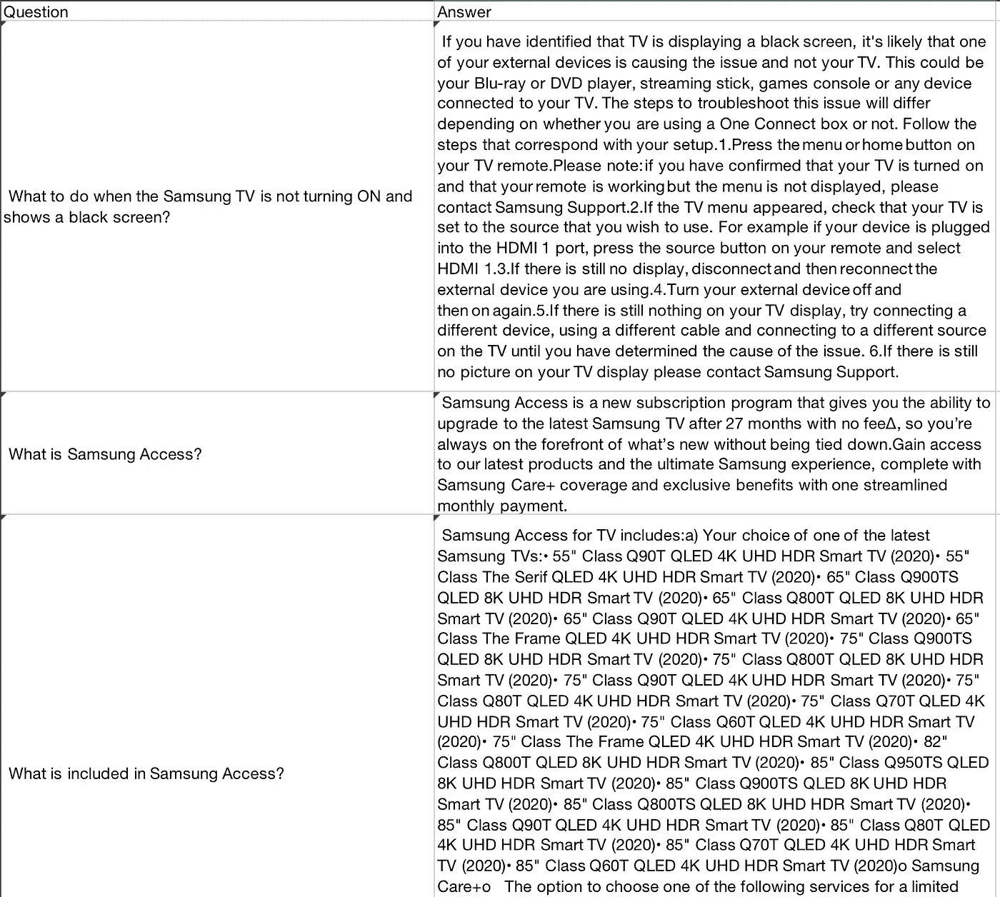
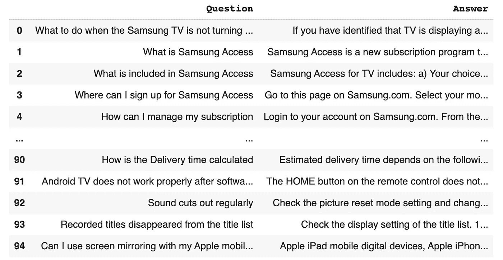
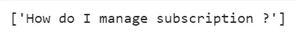

# 构建一个稍微好一点的基于人工智能的语义搜索机器人

> 原文：<https://betterprogramming.pub/a-slightly-better-ai-based-semantic-search-bot-c806703236fd>

## 用罗伯塔句子标记器


作者照片。

# 要求

我最近在探索多种模式来构建一个用于开放领域问答的认知搜索机器人。机器人应该能够对用户提出的问题返回适当的答案。当然，机器人的功效受到训练数据集内容的限制。然而，这个机器人应该足够健壮，能够处理拼写错误的单词——尤其是命名的实体(专有名词，如名称、地点、动物、事物)。

对于我的原型，我选择了微软研究院的 WikiQA 数据集。由于 WikiQA 有关于多个主题的问题，并且一些问题有不止一个答案，所以机器人必须能够处理模糊性。

最终处理后的输入数据文件如下所示:



样本数据集

# 头脑风暴

所以考虑到需求，我必须考虑数据和模型。该模型是专门为问题而构建的。当用户键入问题时，系统会检查问题的拼写错误并进行更正。将纠正的问题与数据集中的问题进行比较。识别与其最相似的问题，并向用户提供相应的答案。

有了这个想法，我从基本的 NLP 处理管道和分类模型开始。对于基本的 NLP 处理，我指的是标记化、停用词移除、词干提取和词条匹配，然后创建单词嵌入。正如你们可能已经猜到的，机器人性能最关键的方面是单词嵌入的选择。

在头脑风暴寻找合适的嵌入方法时，我从基础做起。我选择了 Tf-IDF 矢量器，因为它可以提升一些关键词在文档中的重要性，同时抑制高频、低上下文术语(典型的“a”、“the”、“so”等)的重要性。).我将 Tf-IDf 矢量器与 DeepPavlov 库中的余弦相似性分类器配对。你可以在[这篇文章](https://cervio.medium.com/build-a-quick-and-customised-faq-bot-d41d502711ce)中查看实现代码。

然而，这种模式有缺点。它不能有效地消除歧义。大多数情况下，它会返回数据库中最接近的问题的答案(所谓最接近，我指的是具有最高余弦相似性得分的问题)。

下一个尝试是使用手套嵌入的迁移学习。与基于单个术语创建单词嵌入的 Tf-IDF 不同，GloVe 使用单词对来实现嵌入。要了解更多关于 GloVe 的工作原理，你可以看看斯坦福 NLP 网站上的[这篇文章](https://nlp.stanford.edu/projects/glove/)。

那也不顺利。尽管新管道的准确性与早期管道相当，但其消除模糊性的能力却没有丝毫提高。

所以我最终决定使用高级语言模型进行标记化。我选的句子——变形金刚[库](https://www.sbert.net/)。现在有这么多这样的工具，你基本上可以使用它们中的任何一个，因为它们有相同的方法和类。这个库是基于一篇名为“[句子-伯特:使用暹罗伯特网络的句子嵌入](https://arxiv.org/abs/1908.10084)”的论文的思想构建的这些嵌入特别适合句子相似性任务，如语义搜索，这是这个机器人的目标。所以我直接选择了基于 RoBERTa 的嵌入式系统。

# 履行

我安装了 Sbert 的句子转换库。您可以使用以下命令在您的系统中安装它:

```
pip install -U sentence-transformers
```

在我的项目中，我导入了 CSV 格式的文件:

```
data = pd.read_csv('/content/data.csv')
data
```



将数据导入数据框架

我跳过了早期的数据预处理管道(标记化、停用词移除和词条匹配),将问题列放入我下载的 RoBETRa 标记化器中。

导入库、预训练的标记器，并根据数据拟合模型

检查嵌入

嵌入的示例输出如下所示:

```
Sentence: How can I manage my subscription Embedding: [ 1.4550637   1.2323413  -0.26948562 ...  0.6683803  -1.5374827   1.1315558 ]
```

现在我们已经有了输入嵌入，让我们看看如何比较用户的输入。

为了便于说明，我们使用一个与上面显示的订阅问题相关的问题。现在，我将篡改我的问题的拼写，以便可以在上面演示自动更正功能。所以我的问题是:

```
How do I mabage subription?
```

用户给定输入的生产管道与培训管道略有不同。在生产流水线中有一个拼写检查和纠正步骤。对于我的管道，我使用了自动更正库。为了检查类似的问题，我们使用空间库:

```
!pip install autocorrect
!pip install spacy
```

这个过程纠正问题中拼写错误的术语。因此，上面的用户输入被纠正，输出如下:



自动更正的查询

现在，这个被纠正的问题通过我们的余弦相似性算法来识别用户的查询在语义上与数据库中的哪个问题最相似。

找到最接近的问题后，模型给出相应的答案:

```
**Semantic Search Results with RoBERTa** 
**Query:** How do I manage subscription ? 
**Answer:** Login to your account on Samsung.com. From there you can perform actions such as upgrade and return or cancellation. Regarding payment transactions, you can check your TD Bank account online here to:...
```

瞧啊。我们拿到了。一个稍微更智能的语义搜索机器人。

# 提高

尽管前面提到的逻辑通过实验看起来很棒，但它需要处理所有的极端情况。文档可以包含跨主题的类似问题。在这种情况下，会有很高的模糊性。在这种情况下，我们有两个选择:我们可以返回具有最高余弦相似性得分的答案(就像我们上面做的那样),或者我们可以返回与用户最接近的前 *n* 个问题。可以给用户消除歧义的选项。理想的机器人不需要用户输入来消除歧义，但是我们还没有 100%做到这一点。

但是如果我真的想出了怎么做，我一定会分享的！