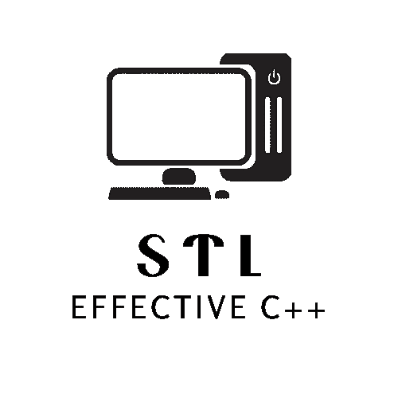
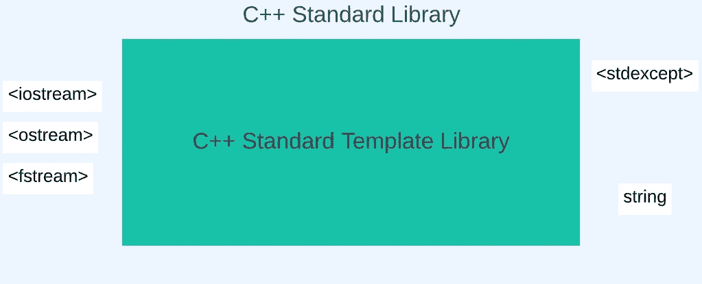
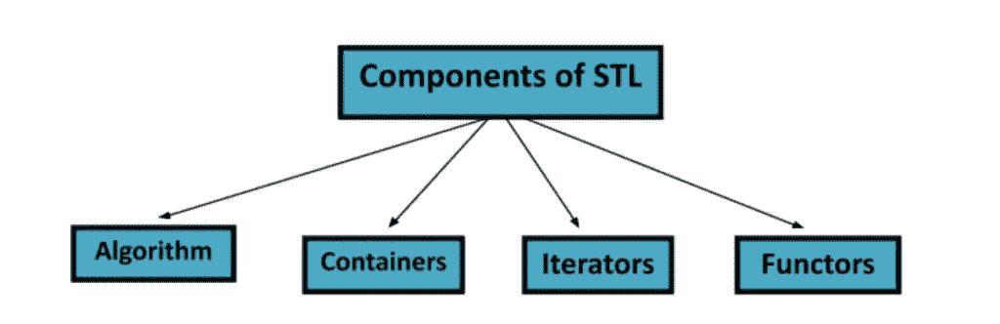
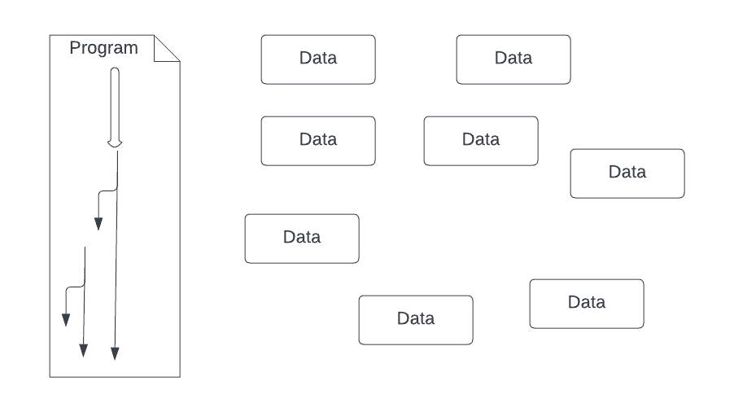
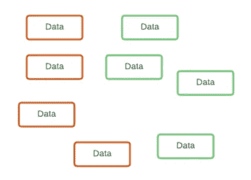
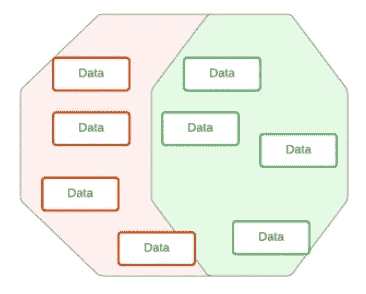
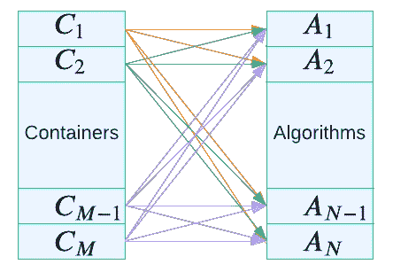
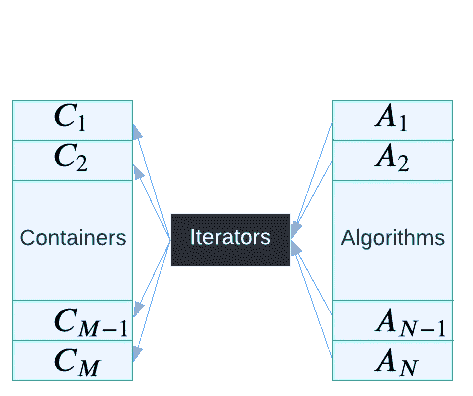

# 标准模板库(STL)教程系列

> 原文：<https://betterprogramming.pub/a-standard-template-library-stl-tutorial-series-9379bcbcd2fb>

## 现代有效的 C++

## 第 1 部分:概述和动机



作者图片

几个部分中的第一部分介绍了标准模板库(STL)。

```
· [The C++ Standard Library (SL)](#872b)
  ∘ [What does SL offer?](#16ac)
  ∘ [Why use the C++ SL?](#dc1c)
· [A Brief Overview of STL](#0ef8)
  ∘ [Why STL?](#d522)
· [In Summary](#cd59)
  ∘ [What's Next?](#6b88)
· [References](#65b1)
```

# C++标准库(SL)

作为一名开发人员，尤其是在像 C++这样非常成熟和稳定的软件语言中，为其核心库打下坚实的基础是非常重要的。在 C++中，这是标准库，已经持续集成到从 C++98 到 C++23 的主要版本中[1]。

## SL 提供什么？

如图 1 所示，C++ SL 的核心是 STL。正如我们将在几篇博客中深入讨论的，STL 是一个通用库，它提供了有效的算法解决方案来管理数据集合。



图 1 C++标准库( *SL* )大多由 STL 组成。作者创作的插图。

注意，STL 之外的其他组件是 SL 的一部分。综上所述，SL 还提供了[2]:

*   字符串类
*   数字类
*   流 I/O 类的标准版本
*   基本内存分配
*   异常类
*   运行时类型信息

接下来让我们专注于 STL。

## 为什么要使用 C++ SL？

底线是，对 C++的基本理解——尤其是有效的现代代码库——取决于对它的 SL 和不同头文件的了解，因此也是部分提供的接口。

使用 C++标准库的理由:

1.  代码重用。没有必要重新发明轮子。
2.  高效—更快，同时使用更少的资源:现代 C++编译器通常针对 C++标准库代码进行优化。
3.  准确，更少的错误。
4.  简洁、可读的代码；减少控制流。
5.  标准化，保证可用性。
6.  编写库的角色模型。
7.  良好的数据结构和算法知识。

# STL 概述



STL 的组成部分。来源:[3]

数据结构和算法如上所述(参见第 7 项)。这些构成了 STL 的大部分。让我们先来看看 STL 的组件。



**图 3** A 是所有数据科学中的典型场景。作者创作的插图。

正如以前关于内存管理的博客系列(c.f .，[4]和[5])所述，我们有程序(例如，导入、控制流、i/o)，还有外部资源(例如，数据)。由于数据读入内存时没有任何结构，我们希望将数据点组织在一个容器中(即数据结构)。

例如，让我们假设在这个简单的例子中有两种数据类型。因此，我们想知道每个数据点的类型，是通过关联还是分组(图 4)。



**图 4。**左边是按类型排列的数据点(如名义标签)，右边是组关联(如聚类)。作者创作了插图。

参见图 4，考虑以下内容。对于这两种情况，理想的数据结构是如何操作的？我们需要更多的信息吗？

因此，我们只暗示了 STL 提供的主要组件之一，容器(即数据结构)。算法呢？因此，回头看图 3，现在回到左侧(即，程序本身)。我们想用算法来操作数据集。STL 的另一个主要部分。

## **为什么是 STL？**

好了，我们已经确定了容器和算法的需求和实际意义。让我们观察一下`M`容器在`N`算法上运行的情况。如图 5 所示，这将花费`M*N`运行。



图 5`M`N 个算法的容器花费 M*N 个不同的脚本需要实现。作者创作的插图。

STL 通过迭代器将两个高度配对的组件之间的接口一般化，以桥接这两个高度配对的组件。我们将在本系列的第 4 部分深入研究，`Iterators`提供了一种只需要实现`N+M`不同代码片段的方法(图 6)。



图 6 用于 N 个算法的 M 个容器花费 M+N 个不同的脚本需要被实现。作者创作的插图。

通常，如果我们想要支持`A`算法和`C`容器，我们需要`A × C`实现。我们必须为每个容器`C`实现`A`算法。

*   解决这个问题的一个方法是使用多态性。但这会降低效率。
*   STL 用迭代器解决了这个问题。容器为实现的算法工作提供迭代器。因此，STL 只需要为`A`算法和`C`容器提供`A + C`实现。

# **总之**

*   STL 的主要组件是算法和容器。
*   通常，如果我们想要支持`A`算法和`C` 容器，我们需要`A × C`实现。我们必须为每个容器`C`实现`A`算法。
*   使用 STL 有很多原因，所以在 C++中尽可能使用它！
*   它允许重用已经发明的代码。没有必要重新发明轮子！
*   它已经过优化，可能比你的算法和数据结构的实现更有效。
*   它可能比您(最初)编写的代码更少错误。
*   STL 是标准化的，并保证可以通过 C++标准库获得。
*   同样，使用它将为您提供数据结构和算法的良好知识。

# 下一步是什么？

接下来，我们将深入研究 STL 容器。然后，我们将讨论算法，之后将讨论迭代器。此外，最后一部分涵盖函子(在图 2 中，但超出了范围…现在)。

# 参考

[1][https://en.cppreference.com/w/cpp](https://en.cppreference.com/w/cpp)

 [## C++参考

### 基本概念关键字预处理表达式声明初始化函数语句类重载…

en.cppreference.com](https://en.cppreference.com/w/cpp) 

[2]https://docs.oracle.com/cd/E19957-01/806-3569/Standard.html

 [## C++标准库

### 当在默认(标准)模式下编译时，编译器可以访问 C++…

docs.oracle.com](https://docs.oracle.com/cd/E19957-01/806-3569/Standard.html) 

[3][https://www . mygreatlearning . com/blog/standard-template-library-in-c/](https://www.mygreatlearning.com/blog/standard-template-library-in-c/)

[](https://www.mygreatlearning.com/blog/standard-template-library-in-c/) [## C++中的标准模板库

### 标准模板库是 C++的最新版本。STL 为程序员提供了有效存储数据的方法，并实现了数据的存储。

www.mygreatlearning.com](https://www.mygreatlearning.com/blog/standard-template-library-in-c/) 

[4][https://better programming . pub/understanding-smart-pointers-in-CPP-6c 3854593503](/understanding-smart-pointers-in-cpp-6c3854593503)

[](/understanding-smart-pointers-in-cpp-6c3854593503) [## 现代 C++:智能指针的近距离观察

### 《理解智能指针》续集 betterprogramming.pub](/understanding-smart-pointers-in-cpp-6c3854593503) 

[5][https://better programming . pub/understanding-smart-pointer-iii-909512 a5 EB 05](/understanding-smart-pointer-iii-909512a5eb05)

[](/understanding-smart-pointer-iii-909512a5eb05) [## 通过直观的视觉效果解释 C++智能指针

### 我的 C++指针系列的第 3 部分

better 编程. pub](/understanding-smart-pointer-iii-909512a5eb05) 

```
**Want to Connect?**Follow Dr. Robinson on [LinkedIn](https://www.linkedin.com/company/superannotate/).
```