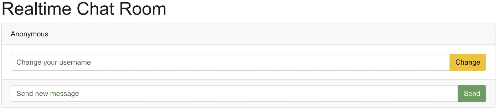
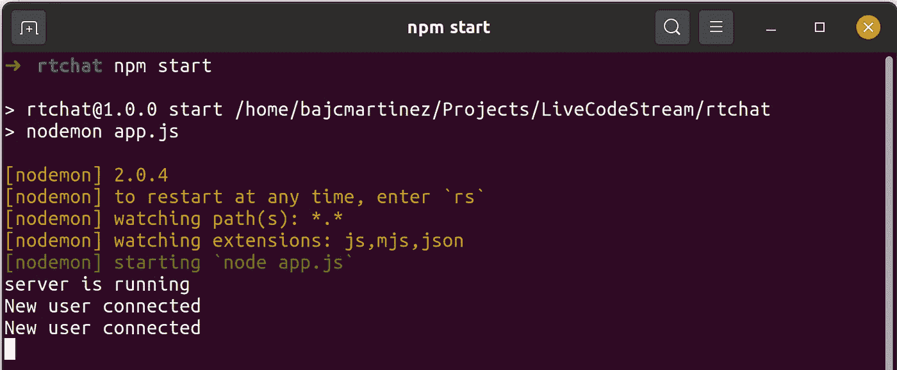
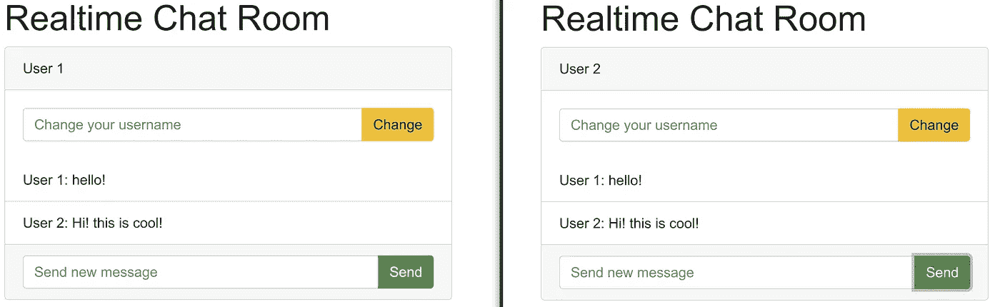
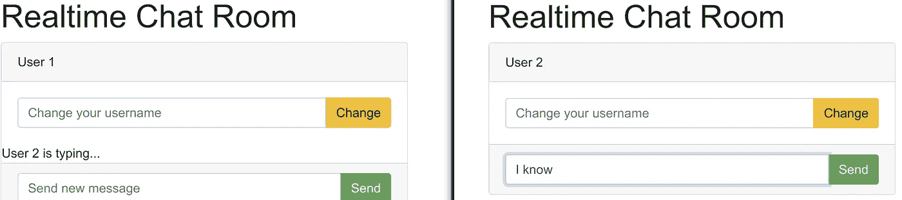

# 使用 Node.js 构建实时应用程序的入门指南

> 原文：<https://betterprogramming.pub/a-starter-guide-to-building-real-time-apps-with-node-js-a2a7b31944f2>

## 通过构建聊天应用了解实时应用


[JESHOOTS.COM](https://unsplash.com/@jeshoots?utm_source=unsplash&utm_medium=referral&utm_content=creditCopyText)在 [Unsplash](https://unsplash.com/s/photos/chat?utm_source=unsplash&utm_medium=referral&utm_content=creditCopyText) 上拍照

在一个时间价值稳步增长的世界里，构建用户可以实时交互的应用程序已经成为大多数开发人员的准则。我们今天看到的大多数应用程序，无论是移动、桌面还是 web 应用程序，都至少包含一个实时功能。例如，实时消息和通知是应用程序中最常用的两种实时功能。

在本文中，我们将通过构建一个实时聊天，向您介绍使用 [Node.js](https://nodejs.org/en/) 开发实时应用程序。虽然本文将关注这个特定的用例，但是这里教授的概念可以应用于其他场景。

事实上，由于其事件驱动和异步的特性，Node 是构建实时应用程序的最佳编程语言之一。在开始构建实时应用程序之前，我们先来看看使用 Node.js 可以构建什么样的实时应用程序。

# 我们如何构建实时应用程序？

构建实时应用程序与构建普通的 web 应用程序有什么不同吗？答案是肯定的。

想象一个用户可以实时发送消息的消息应用程序。这些消息应该在发送后立即出现在其他用户的应用程序中。如果我们像普通的 web 应用程序一样实现这个应用程序，其中只有客户端可以向服务器发起接收数据的请求，用户必须定期刷新网页以查看最新的消息，或者客户端必须在很短的时间间隔内向服务器发送 Ajax 请求以检索最新的消息。前者对用户不太友好，后者浪费应用程序资源。那么，很明显，我们必须有一种不同的方法来构建更有意义的实时应用程序。

WebSocket 提供了我们需要的解决方案。WebSocket 是一种允许客户端和服务器发起通信的通信协议。换句话说，使用 WebSocket，服务器可以随时向客户端发送数据，而无需客户端先请求数据。在前面的消息应用程序中，我们可以使用 WebSockets 通过服务器向所有用户即时发送消息。我们可以使用 WebSocket API，在构建应用程序时使用 WebSockets 进行通信。

# 用 Node.js 建立一个实时聊天室

现在我们已经介绍了实时应用程序开发的背景，我们可以开始创建我们自己的实时应用程序了。在本教程中，我们将建立一个简单的聊天室，用户可以使用它与其他连接的用户进行交流。任何数量的用户都可以连接到聊天室，一个用户发送的消息可以被所有连接到聊天室的用户立即看到。

我们的简单聊天室将具有以下功能:

*   更改用户的用户名
*   发送消息
*   显示另一个用户是否正在输入消息

酷毙了。现在我们有了我们的需求，让我们开始构建环境和设置结构。

# 设置应用程序环境

首先，为应用程序创建一个新目录。然后，运行`the npm init`来设置`package.json`文件。确保在这一步，你指定`app.js`作为你的主脚本。如果你没有，不要担心，你随时可以在你的`package.json`中改变它。

## 安装依赖项

在本教程中，我们将使用 express、ejs、socket.io 和 nodemon 包来构建应用程序。

*   ejs 是一个流行的 js 模板引擎
*   socket.io 允许我们建立 WebSocket 连接
*   Nodemon 是一个包，每当我们对应用程序代码进行更改时，它都会重新启动服务器。它消除了我们每次进行更改时手动停止和启动服务器的需要。与其他包不同，我们将 nodemon 作为开发依赖项安装，因为我们仅将它用于开发目的。

使用以下命令安装 express、ejs 和 socket.io。

```
npm install express ejs socket.io --save
```

使用以下命令将 nodemon 作为开发依赖项安装。

```
npm install nodemon --save-dev
```

要用 nodemon 启动应用程序，我们应该向我们的`package.json`文件添加一个启动脚本。

```
"scripts": {
    "start": "nodemon app.js",
 },
```

然后，我们可以通过在命令行上运行以下命令来启动应用程序。

```
npm run start
```

如果失败了，不要担心，那基本上是因为我们还没有任何代码文件。

## 设置应用程序结构

安装了这个项目所需的所有依赖项后，让我们构建项目结构。为此，您需要创建几个目录，现在，创建一个名为`app.js`的文件。让我们完成这项工作，使您的应用程序结构如下所示:

```
|--app.js
|--views
|--node_modules
|--package.json
|--public
   |--css
   |--js
```

我认为结构非常清楚，但让我们快速浏览一遍:

*   `app.js`:我们将用来存放服务器端代码的文件
*   `views`:包含视图(ejs)的文件夹
*   `node_modules`:我们安装依赖项的地方
*   `package.json` : npm 配置文件
*   `public`:我们将用来存储资产的目录，比如 CSS 文件、JavaScript 文件(用于客户端)和图像。

# 构建服务器的第一步

在我们考虑进行实时连接之前，我们需要做的第一件事就是启动并运行`express`。为此，让我们打开我们的`app.js`文件并粘贴以下代码:

一旦我们配置了`express`并使用`ejs`作为模板系统，我们就可以开始 sockets.io 初始化工作了。为此，在您的`app.js`文件的末尾添加以下代码。

```
//initialize socket for the server
const io = socketio(server)io.on('connection', socket => {
    console.log("New user connected")
})
```

代码非常简单。我们正在从我们的`server`连接(express)初始化`socket.io`，然后我们使用`io.on()`设置一个事件，该事件将在每次建立到套接字的新连接时被触发。

如果您现在使用`npm start`运行您的服务器，您将能够接收新的套接字连接。所以让我们开始构建我们的前端。

# 构建您的前端

我们不会花太多时间来使我们的前端看起来令人惊叹，但是我们将解释如何连接到服务器以及如何`emit`和`capture`套接字事件。我们还会将所有这些应用到我们的聊天示例中。

让我们首先在视图文件夹中创建一个模板。为此，创建一个`index.ejs`文件并粘贴以下代码:

请注意我们是如何包含客户端 socket.io 库的脚本以及我们将在这段代码中使用的自定义 JavaScript 文件的。

```
<script src="https://cdnjs.cloudflare.com/ajax/libs/socket.io/2.0.4/socket.io.js"></script>
<script src="/js/chatroom.js"></script>
```

我们还有一个 ID 为`messageBtn`的按钮来发送新消息，还有一个 ID 为`usernameBtn`的按钮来提交新用户名。用户名和消息输入分别具有 id`username`和`message`。所有用户消息都应该出现在 ID 为`message-list`的无序列表中。如果用户绑定了一条消息，该信息将出现在带有类`info`的 div 中。

如果您打开我们的浏览器并前往`http://localhost:3000/`，您的应用程序将如下所示:



实时聊天室布局

但它什么也没做。按钮不起作用，它将是一个非常静态的应用程序。接下来，让我们开始将前端连接到服务器。

为此，在公共目录的`js`文件夹中创建一个名为`chatroom.js`的新 JavaScript 文件(注意，在上面的 HTML 中，我已经引用了这个文件)。在 JavaScript 文件内部，我们需要从前端连接到套接字。我们可以这样做:

```
(function connect(){
    let socket = io.connect('http://localhost:3000')
})()
```

再次访问您的网站，在您的终端(在服务器端)中，您将会看到类似如下的内容:



终端日志示例

厉害！你的应用已经在工作了，尽管它做的不多。接下来让我们构建功能。

# 更改用户名

我们用于每个连接的默认用户名是“匿名”我们为用户提供了更改用户名的选项。我们将设置后端在前端发出一个`change_username`事件时改变用户名。回到您的服务器端代码(`app.js`)并编辑您的`connection`事件以添加新代码。

```
io.on('connection', socket => {
    console.log("New user connected") socket.username = "Anonymous" socket.on('change_username', data => {
        socket.username = data.username
    })
})
```

接下来，我们需要调整我们的前端，以便当我们按下“更改用户名”按钮时，它向服务器发出一个名为`change_username`的事件。看看我们是如何通过发射和捕获相同的事件名称来构建名称的？

在`chatroom.js`内部，我们将为`usernameBtn`添加一个事件监听器，以便在按钮被点击时发出一个`change_username`事件。

现在，如果您重新加载网页并提交新的用户名，您将看到您当前的用户名更改为新的用户名。接下来，让我们开始发送消息。

# 发送消息

我们要实现的下一个特性是发送消息。在这里，事情开始变得有点不同。到目前为止，我们说前端每发出一条消息，服务器都会收到。然而，在我们的新例子中，前端需要发出一个`new_message`事件，然后需要将该事件发送给所有连接的客户端，以便它们可以打印新消息。

首先，我们将设置前端在提交新消息时发出一个`new_message`事件。由于客户端也应该配置为接收其他用户从服务器发送的新消息，应用程序也应该在前端监听`receive_message`事件，并在网页上适当地显示新消息。我们可以使用下面的代码来完成这两项任务，这些代码位于前面的`chatroom.js`中的`connect`函数内。

每次客户端发生`receive_message`事件时，我们都会更改 DOM 来在屏幕上显示消息。

在后端，当我们接收到一个`new_message`事件时，我们需要向所有客户端发出一个新事件。为此，我们使用了`io.sockets.emit()`函数。将`app.js`文件中的`connection`事件更改如下:

当处理`new_message`事件时，服务器本身向连接的客户端发出一个`receive_message`事件，其中包含关于新消息的数据。所有连接到服务器的用户都会收到这个事件，包括发送消息的用户，这样新消息就会显示在他们的聊天室界面上。

如果您现在在浏览器中打开您的 web 应用程序(您可以有多个实例)，您可以开始聊天(与您自己？:p)

您可以使用两个不同的浏览器连接到聊天室，并体验发送消息的功能。查看一个用户发送的消息如何立即出现在两个用户的应用程序界面上。



实时聊天室—发送消息

# 我在打字…

在我们今天使用的大多数实时消息应用程序中，每当另一个用户正在输入消息时，我们都会看到一条简单的文本，上面写着“用户 X 正在输入…”。这给了应用程序更实时的感觉，并改善了用户体验。我们将把这个特性添加到我们的应用程序中。

首先，我们来考虑前端实现。我们在消息输入框中添加了一个新的事件监听器，以便在按键发生时发出一个`typing`事件。因为消息输入框上的按键指示用户正在键入消息，所以`typing`事件告诉服务器用户正在键入消息。客户端还监听服务器发出的`typing`事件，以了解另一个用户是否正在输入消息，并将其显示在用户界面上。

同样，在`chatroom.js`的 connect 函数中，我们添加了以下代码。

```
let info = document.querySelector('.info')message.addEventListener('keypress', e => {
    socket.emit('typing')
})socket.on('typing', data => {
    info.textContent = data.username + " is typing..."
    setTimeout(() => {info.textContent=''}, 5000)
})
```

如果一个用户正在键入一条消息，其他用户会看到文本“用户 X 正在键入…”五秒钟。

现在我们需要设置后端来处理输入事件。我们这里使用的代码是这样的:

```
socket.on('typing', data => {
    socket.broadcast.emit('typing', {username: socket.username})
})
```

这里，socket.io 使用`broadcast`函数来通知连接的客户端。当我们使用`broadcast`时，除了正在键入消息的用户之外的每个用户都从服务器接收到键入事件，因此除了正在键入消息的用户之外的每个用户都被显示文本“用户 X 正在键入…”。

同样，你可以从两个浏览器连接到聊天室，看看这是如何实时工作的。



实时聊天室—打字

厉害！

# 摘要

今天，在桌面、移动和 web 应用程序中使用实时功能几乎已经成为一种必然。在本文中，我们讨论了一些实时应用程序的应用程序，并学习了如何在 Node.js 和 Socket.io 的帮助下创建实时聊天室。从这里继续，您可以尝试通过添加更多功能和使用数据库来保存旧消息来改进这个聊天室，或者您可以实现另一个具有不同用例的实时应用程序。

感谢阅读！