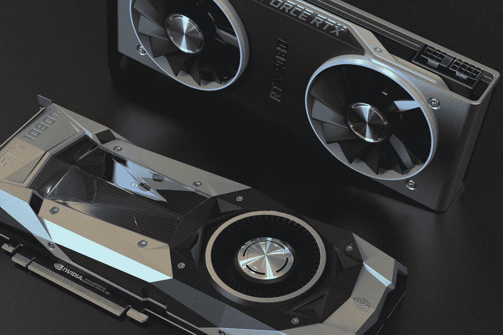
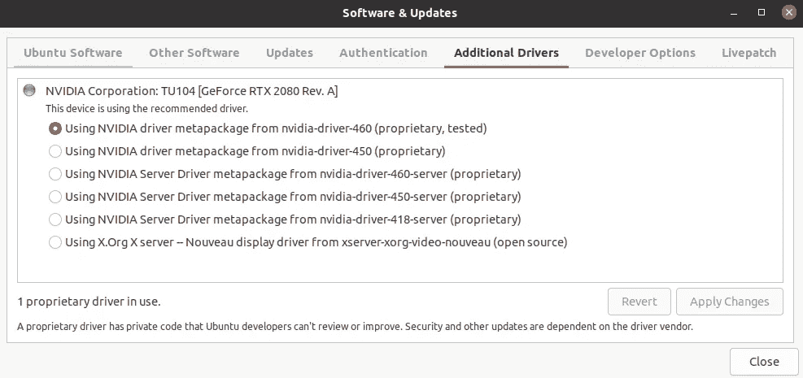
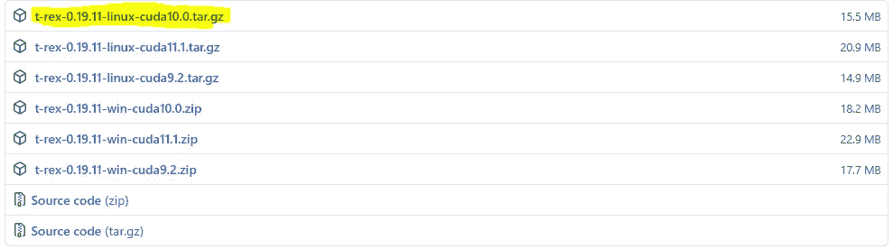
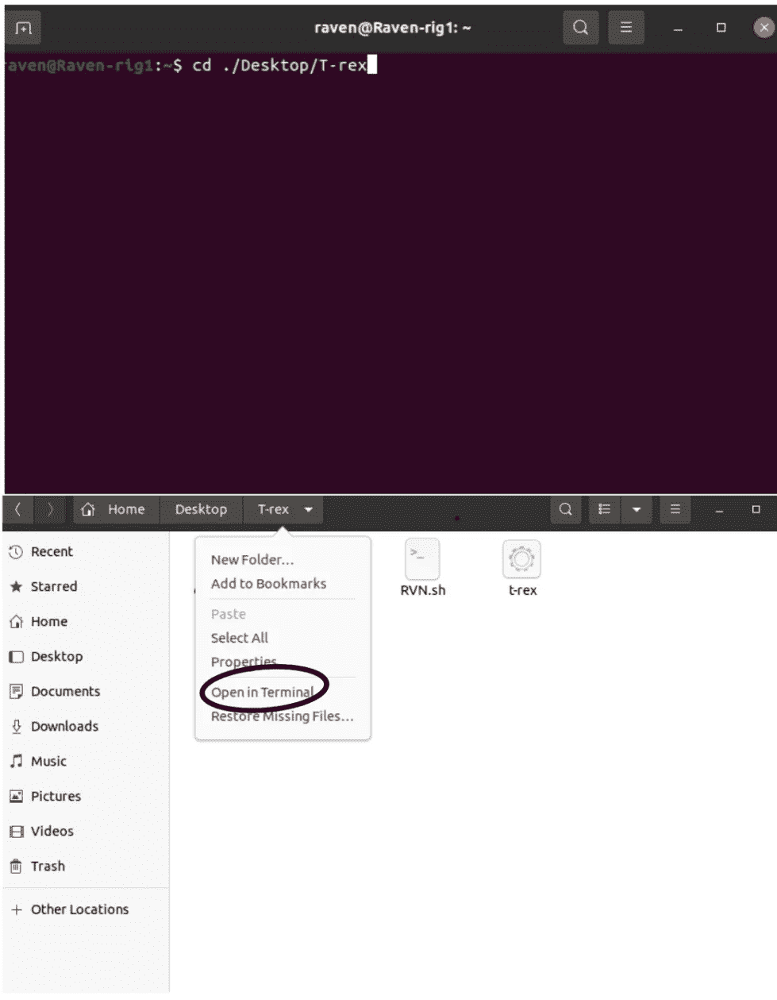
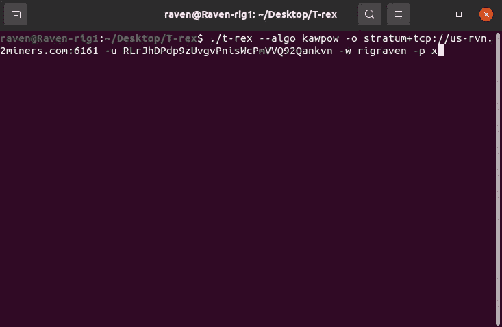
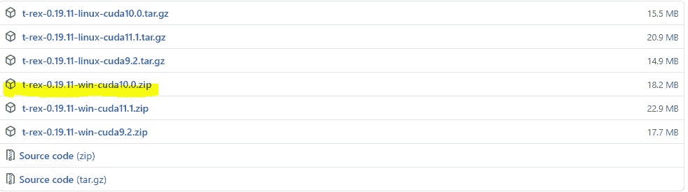
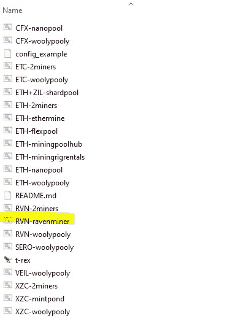

# 替代硬币采矿的逐步指南

> 原文：<https://betterprogramming.pub/a-step-by-step-guide-to-altcoin-mining-a882598782d1>

## 了解如何挖掘 Ravencoin，一种流行的加密货币



在 [Unsplash](https://unsplash.com?utm_source=medium&utm_medium=referral) 上由 [Nana Dua](https://unsplash.com/@nanadua11?utm_source=medium&utm_medium=referral) 拍摄的照片。

Ravencoin (RVN)是比特币的分叉版本，旨在帮助促进交易。它使用 KAWPOW 算法，这使它能够抵抗 ASIC，并有助于防止集中化。许多人转向开采 Ravencoin 是因为它的高利润。Ravencoin 经常出现在有利可图的硬币列表中。它也是完全开源的，没有国际奥委会。

# 本教程的要求

*   至少 3GB 内存的 Nvidia GPU(了解更多信息，请点击下方)
*   Linux 或 Windows 操作系统
*   安装所需的驱动程序(在下面了解更多信息)
*   一个[拉文币钱包](https://ravencoin.org/wallet/)

*推荐:使用*[*whatomine*](https://whattomine.com/)*计算盈利能力。你还应该学会如何超频，以最大限度地提高盈利能力，同时在开矿前尽量减少电力。*

## 为什么选择英伟达？

对于本教程，我们使用 [T-Rex](https://github.com/trexminer/T-Rex) 作为采矿软件，它只允许 Nvidia GPUs。如果你想用一个 AMD GPU(或者两个都用)，我推荐这几个挖矿软件: [Nanominer](https://github.com/nanopool/nanominer/releases) 和 [NBminer](https://github.com/NebuTech/NBMiner) 。

## 采矿池

矿池是一群矿工一起开采一种加密货币。每个矿池都有优点和缺点，如低最低付款，高费用，低税率。选择一个你觉得最舒服的。下面是我推荐的几个: [2Miners](https://rvn.2miners.com/help) 、 [Nanopool](https://rvn.nanopool.org/?_ga=2.130311436.2001052677.1615654092-1796325078.1614299727) 和 [Supernova](https://rvn.suprnova.cc/index.php) 。

## 如何安装 Nvidia 驱动程序(Linux 和 Windows)

Linux (Ubuntu):

1.  单击九个点。
2.  搜索“软件和更新”
3.  单击“附加驱动程序”
4.  你应该看看推荐的驱动程序。点击适合自己的(推荐:点击最上面的)。



设置 GPU 驱动程序的导航

5.点按“应用更改”

窗口:

1.  进入[官方 Nvidia 驱动安装](https://www.nvidia.com/en-us/geforce/drivers/)页面。
2.  下载适合您的驱动程序。

您已经完成了所有的设置工作。现在让我们开始挖掘。

# Linux 操作系统

1.  从他们的 [GitHub](https://github.com/trexminer/T-Rex/releases) 下载霸王龙。



为 Linux 下载 T-Rex

2.提取(建议:提取到一个文件夹，最好叫`T-rex`)。

3.导航到`T-rex`文件夹，或者通过`cd`到目录或者手动到那里，右键单击，然后单击“在终端中打开”



导航到 T-rex 文件夹

4.现在让我们开始挖掘。在终端中，写下下面的命令(确保您在正确的文件夹中)。用矿池的 URL 替换掉`insert_mining_pool_URL`，用你的公共钱包地址替换掉`insert_RVN_wallet`。

```
./t-rex --algo kawpow -o insert_mining_pool_URL -u insert_RVN_wallet -w RavenRig -p x
```



运行 T-Rex 的启动脚本

5.你成功挖掘了乌鸦币。

# Windows 操作系统

1.  从他们的 [GitHub](https://github.com/trexminer/T-Rex/releases) 下载霸王龙。



下载 T-Rex for Windows

2.提取它。

3.导航到该文件。

4.右键单击“RVN-ravenminer”并选择“编辑”



导航到编辑脚本

5.让我们启动采矿机。用下面的命令替换所有代码(确保您在正确的文件夹中)。用矿池的 URL 替换掉`insert_mining_pool`，用你的公共钱包地址替换掉`insert_RVN_wallet`。

```
./t-rex.exe -a kawpow -o insert_mining_pool -u insert_RVN_wallet.RavenRig -p x
```

6.保存您的更改。

7.点击文件。

8.你成功挖掘了乌鸦币。

# **需要牢记的事情**

*   一般来说，你的反病毒软件不允许安装采矿软件，因为一些黑客使用你的电脑作为采矿钻机。
*   “股份”并不意味着开采的区块。
*   大多数矿池都有最低支付额，这意味着矿池只会在开采到一定数量的区块后奖励你。
*   最好不要使用兑换钱包(如币安)来存放您的硬币，因为您无法控制自己的钱包，而且它通常收费较高。