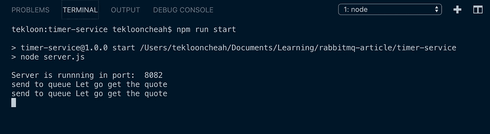
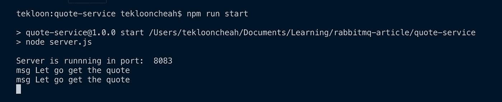

# 用 RabbitMQ 构建事件驱动的微服务的分步指南

> 原文：<https://betterprogramming.pub/a-step-by-step-guide-to-building-event-driven-microservices-with-rabbitmq-deeb85b3031c>

## 将 RabbitMQ 教程合并到我们自己的项目中

照片由 [Jacky Chiu](https://unsplash.com/@jackychiu?utm_source=medium&utm_medium=referral) 在 [Unsplash](https://unsplash.com?utm_source=medium&utm_medium=referral)

最近，当我试图浏览 [RabbitMQ 教程](https://www.rabbitmq.com/getstarted.html)时，我发现自己被一股无聊和困倦的浪潮所冲击。他们很难通过！

因此，我想我会用 RabbitMQ 创造一些有趣的东西，而不是仅仅按照教程去做。结果证明它非常有效，以至于我的肾上腺素开始分泌，让我在午夜前保持清醒。

# 项目背景

我喜欢励志名言。因此，我想*每分钟都收集激励性的引语*。这让我创建了两个微服务。每个微服务相互独立运行，只执行各自的任务。这就是我们实现关注点分离的方法。

*   TimerService
    -每分钟向 RabbitMQ 服务器发布一条消息
*   QuoteService
    -当它从 TimerService 接收到事件时，从互联网上抓取报价

现在我们已经完成了解决方案设计。让我们把手弄脏，开始建造吧。

# 先决条件

在我们开始开发微服务之前，需要几个工具和框架:

*   [Nodej](https://nodejs.org/en/) s
*   [RabbitMQ](https://www.rabbitmq.com/download.html)
*   如何创建 ExpressJS 应用程序的知识。

# 逐步指南

这是泰克龙的第一条开发规则:

> 总是从最容易的部分开始。

轻松的进入会让你完成第一个任务，获得面对即将到来的挑战的信心。

## 步骤 1: TimerService 开发

让我们从创建 TimerService 开始:

TimerService 的代码。点击查看完整代码

让我们看看我们在这里做了什么。我们:

*   创建了一个到我们 RabbitMQ 服务器的连接。
*   创建了一个频道
*   创建了一个直接的、不持久的“报价”交换
*   在每个时间间隔(60 秒)内将消息发布到交换

这段代码实现了 TimerService 的目的。

## 步骤 2: QuoteService 开发

让我们继续我们的 QuoteService 开发。这个服务的主要功能是当它从 RabbitMQ 队列中接收到一条消息时，能够从互联网上抓取一条激励性的引用。

首先，创建一个消费者并监听 TimerService 发送的事件。让我们把它变得非常简单；当我们收到消息时，我们调用`scrapQuoteOfTheDay()`函数:

接下来，我们继续从网上搜集这段引文:

我从[wisdom quotes . com](http://wisdomquotes.com)获取我的报价，并将它们写入 JSON 文件。很直接，对吧？

现在我们已经有了业务逻辑，让我们制作一个 HTML 页面来显示已经废弃的报价。在做了一些研究之后，在 ExpressJS 中动态呈现 HTML 的最简单的方法是使用模板引擎 [Pug](https://pugjs.org/api/getting-started.html) 。让我告诉你我是怎么做的:

这是将基于`index.pug`模板创建的 UI。

你可以在这里获得 QuoteService [的完整源代码。](https://github.com/tlcheah2/quote-service)

## 步骤 QuoteService 的快速服务器设置

为了让 QuoteService 能够监听 RabbitMQ 队列，我们必须在服务器初始化期间进行一些设置。此外，还有基于我们在第二步中创建的`index.pug`模板的报价 HTML 呈现。

除了启动 web 服务器之外，此配置还实现了以下目的:

*   呈现`index.pug`模板(第 17 行)
*   监听 RabbitMQ 队列(第 23 行)

## 第四步:运行并测试它！！！

让我们运行我们的项目并在本地测试它。最终，您可以从 Github 获得我的完整源代码。

*   [TimerService Github](https://github.com/tlcheah2/quote-service)
*   [报价服务 Github](https://github.com/tlcheah2/quote-service)

1.  让我们启动 QuoteService 组件。进入报价服务文件夹，做`npm run start`
2.  通过转到 TimerService 文件夹并运行`npm run start`来启动我们的 TimerService 组件
3.  如果你运行成功，下面是截图:

TimerService 向 RabbitMQ 交换发布两个事件

QuoteService 能够使用两个事件来监听 RabbitMQ 队列

QuoteTimer HTML 页面呈现能够呈现从 [WisdomQuotes](http://wisdomquotes.com) 中抓取的 2 个报价

# 结论

RabbitMQ 肯定非常容易学习，并且在他们自己的网站上有清晰的教程，然而，当你融入你的爱好或兴趣时，教程会更有趣。

我个人非常喜欢 RabbitMQ，希望用它来为即将到来的项目构建事件驱动的微服务。

最后，在我开发这个的时候，有很多想法闪过我的脑海，比如:

*   [如何将这些微服务部署到 Heroku](https://medium.com/better-programming/how-i-deploy-microservice-to-heroku-with-rabbitmq-876499c797cc) 。
*   [如何实时更新 HTML 页面显示行情](https://medium.com/better-programming/how-i-developed-a-real-time-web-app-using-server-sent-events-488cc280c2e1)。

感谢您的阅读，并随时给予反馈。

## 参考

以下是我在构建这个项目时使用的参考资料:

*   [网页抓取终极指南](https://www.freecodecamp.org/news/the-ultimate-guide-to-web-scraping-with-node-js-daa2027dcd3/)
*   [RabbitMQ 官方教程](https://www.rabbitmq.com/getstarted.html)。