# 从 GitHub Repos 创建自制 tap 的分步指南

> 原文：<https://betterprogramming.pub/a-step-by-step-guide-to-create-homebrew-taps-from-github-repos-f33d3755ba74>

## 制作你的第一个自制水龙头

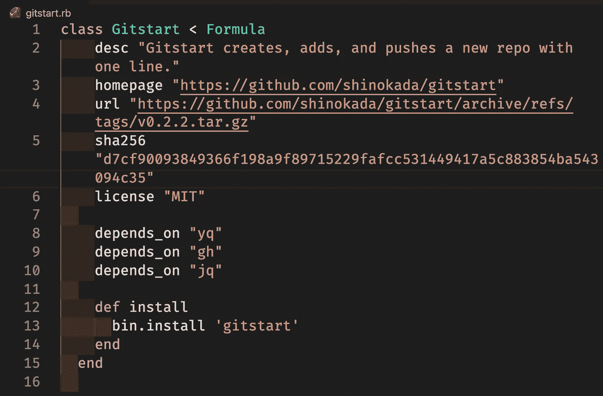

一个用于自制 tap 的 ruby 文件。图片作者。

# 介绍

家酿是 macOS 缺失的软件包管理器。它用一个简单的命令安装软件包，比如`brew install curl`。家酿水龙头是第三方仓库。通过创建一个家酿自来水公式，用户可以安装和使用您的回购。

在本文中，您将学习如何创建一个简单的自制水龙头。我在这篇文章中使用了我的 [gitstart](https://github.com/shinokada/gitstart) 。Gitstart 是创建 Git repo 的 bash 脚本。它只包含一个文件。

# 第一步:Git 标签

您需要在 repo 中添加一个 Git 标签:

```
$ git tag -a v0.0.2 -m "version 0.2.0"
```

将您的标签推送到远程回购:

```
$ git push origin v0.2.0
```

# 第二步。创建新版本

在 GitHub repo 上，点击创建新版本。

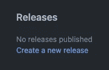

GitHub repo 的发布部分。图片作者。

在标签版本中，选择最新版本，并编写发布的描述。

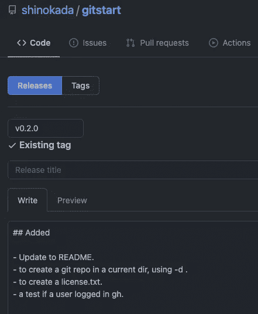

创建一个版本。图片作者。

# 第三步。运行 Brew Create

找到源代码(tar.gz)并复制链接地址:

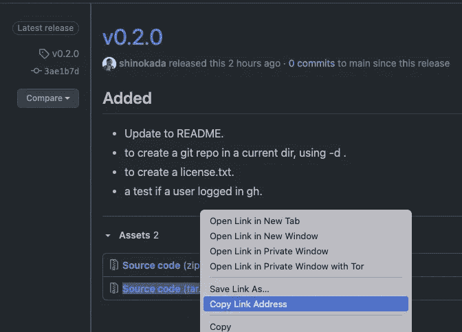

从源代码复制链接地址(tar.gz)。图片作者。

运行`brew create your-link`，用你复制的链接替换`your-link`。

例如:

```
$ brew create https://github.com/shinokada/gitstart/archive/refs/tags/0.2.0.tar.gz
```

它将显示所创建文件的内容。

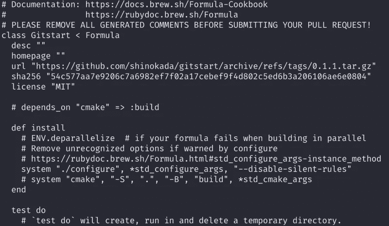

运行 brew create 命令后的输出。图片作者。

如果您的默认编辑器是 VIM，使用`:q`退出程序。

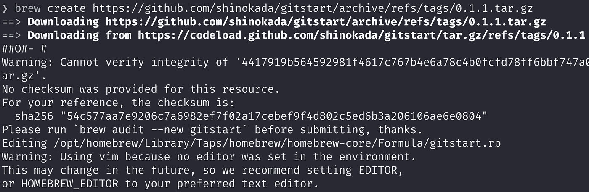

退出编辑器后的终端视图。图片作者。

注意输出中的文件路径。在这种情况下，文件路径是:

```
"/opt/homebrew/Library/Taps/homebrew/homebrew-core/Formula/gitstart.rb"
```

# 第四步。创建新的 GitHub Repo

创建新的 GitHub repo。命名应该以“家酿”开头。

比如，我的名字是`homebrew-gitstart`。

在新的 repo 中，**复制**或将创建的文件移动到您的 repo 中:

对于这个例子，文件名是`gitstart.rb`。

第 2 行:添加您的回购描述。第三行:你必须添加一个主页。第 4 行:这应该是自动填写的。如果没有，请使用上一节中复制的链接。
第 5 行:用您的值替换 sha256。
第 6 行:添加您的[执照](https://docs.github.com/en/github/creating-cloning-and-archiving-repositories/creating-a-repository-on-github/licensing-a-repository)。MIT 是一个开源回购协议的通用许可。
第 8-10 行:陈述你的依赖关系。
第 12–14 行:使用`[bin.install](https://docs.brew.sh/Formula-Cookbook#bininstall-foo)`将文件`gitstart`移动到公式的`bin`目录下(`/usr/local/Cellar/pkg/0.1/bin`，并使其可执行(`chmod 0555 foo`)。

如果有目录，可以使用`Dir["lib"]`安装目录:

```
def install    
    bin.install "gitstart"    
    bin.install Dir["lib"]    
    bin.install Dir["files"]
    prefix.install "README.md"
    prefix.install "LICENSE"  
end
```

使用`prefix.install`将文件复制到/opt/home brew/Cellar/gitstart/0 . 2 . 0 目录。

# 第五步。添加、提交和推送

准备好之后，添加文件，提交，然后推送。

```
$ git add .
$ git commit -m "Version 0.2.0"
$ git push
```

# 第六步。从家酿公式目录中删除 gitstart.rb

您需要从公式目录中删除 gitstart.rb 文件。

```
$ rm  /opt/homebrew/Library/Taps/homebrew/homebrew-core/Formula/gitstart.rb
```

# 第七步。点击并安装

现在你的水龙头准备好了。

使用以下命令运行:

```
$ brew tap shinokada/gitstart
```

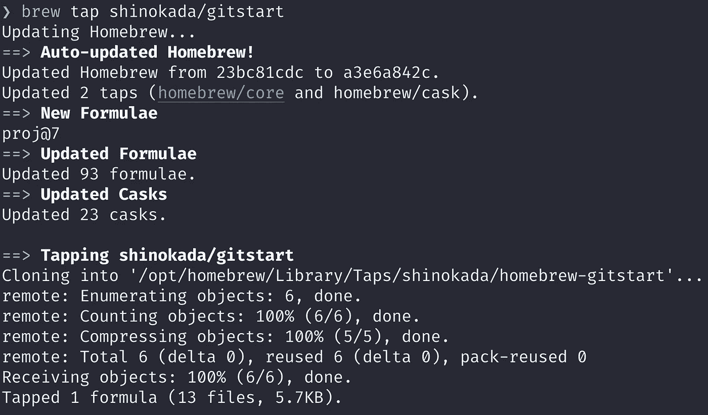

brew tap shinokada/gitstart 的输出。图片作者。

然后运行`brew install gitstart`。

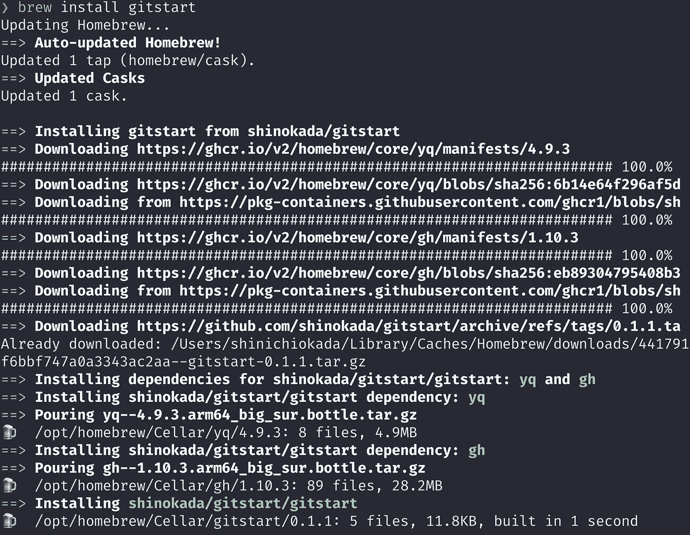

brew 安装 gitstart 的输出。图片作者。

运行`which gitstart`检查是否安装。可以用`brew uninstall gitstart`卸载。

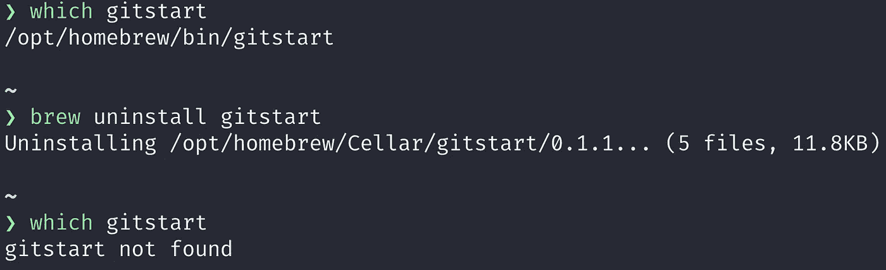

检查安装结果。图片作者。

# 更新例程

## 第一步。

添加并推送新版本。

```
$ git tag -a v0.2.1 -m "version 0.2.1"
$ git push origin v0.2.1
```

重复上面的步骤 2:

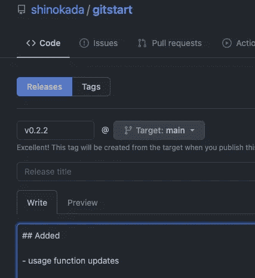

创建新版本。图片作者。

当您更新您的回购时，您需要创建一个新的 sha256。

```
$ brew create https://github.com/shinokada/gitstart/archive/refs/tags/v0.2.1tar.gz
```

更新 URL 值，并将新的 sha256 值复制并粘贴到您在步骤 4 中创建的 homebrew-gitstart 中。

## 第二步。从家酿公式目录中删除 gitstart.rb

与上一节中的步骤 6 相同。从家酿公式目录中移除 gitstart.rb。否则会和你的回购冲突:

```
$ rm /opt/homebrew/Library/Taps/homebrew/homebrew-core/Formula/gitstart.rb
```

## 第三步。运行 brew 升级

```
$ brew upgrade
```

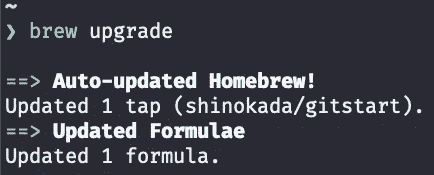

brew 升级的输出。图片作者。

运行`brew install gitstart`:


brew 安装 gitstart 的输出。图片作者。

检查新版本:

```
$ gitstart -v
0.2.2
```

# 技巧

## 未开发

当您更新 homebrew-your-repo 时，您可能需要卸载并取消本地文件:

```
$ brew uninstall --force backpack_install
$ brew untap shinokada/gitstart
Untapping shinokada/gitstart...
Untapped 1 formula (13 files, 7.1KB).
```

`brew uninstall`卸载软件包，但不卸载`homebrew.rb`文件。通过运行`brew untap`，它删除`homebrew.rb`文件。

然后您可以点击您的新存储库:

```
$ brew tap shinokada/gitstart
```

## 别名

当您在本地开发时，您需要链接/取消链接您的本地文件。我添加了如下别名:

```
alias addsym='brew uninstall gitstart && ln -sf ~/Bash_Projects/Gitstart/gitstart-repo/gitstart ~/bin/gitstart'
alias rmsym='rm ~/bin/gitstart && brew upgrade && brew install gitstart'
```

`addsym`从 Homebrew 中卸载 gitstart 公式，并在`~/bin`目录中添加一个符号链接。(我在`.zshrc`文件中导出了路径`~/bin`。)

`rmsym`移除符号链接并运行`brew upgrade`和`brew install gitstart`。

# 下一步是什么？

[家酿的配方食谱](https://docs.brew.sh/Formula-Cookbook)有更详细的说明。[家酿 Ruby API 上的类公式](https://rubydoc.brew.sh/Formula.html)提供了所有的方法和属性。如果你正在使用 Make file，[学习 makefile](https://makefiletutorial.com/)是一个很好的起点。你可以浏览[自制核心公式](https://github.com/Homebrew/homebrew-core/tree/master/Formula)了解有经验的开发者是如何制作他们的公式的。

# 结论

这里有更多关于 [Hombrew Taps](https://docs.brew.sh/Formula-Cookbook) 的信息。我的 repo 是一个简单的 bash 脚本，但是如果您的 repo 更复杂，您可能需要[检查构建系统](https://docs.brew.sh/Formula-Cookbook#check-the-build-system)、[指定与其他公式的冲突](https://docs.brew.sh/Formula-Cookbook#specifying-conflicts-with-other-formulae)、[向公式添加一个测试](https://docs.brew.sh/Formula-Cookbook#add-a-test-to-the-formula)，等等。

我希望这篇文章清楚地说明了如何创建您的自制公式。请让我知道进展如何，并发表你的问题或评论。

快乐编码。

**通过** [**成为**](https://blog.codewithshin.com/membership) **会员，获得媒体上所有故事的访问权限。**


[https://blog.codewithshin.com/subscribe](https://blog.codewithshin.com/subscribe)

# 参考

*   [https://docs.brew.sh/Formula-Cookbook](https://docs.brew.sh/Formula-Cookbook)
*   [http://sophyonline . com/blog/index . PHP/2018/03/19/create-a-local-formula-for-home brew-tap-it/](http://sophyonline.com/blog/index.php/2018/03/19/create-a-local-formula-for-homebrew-tap-it/)