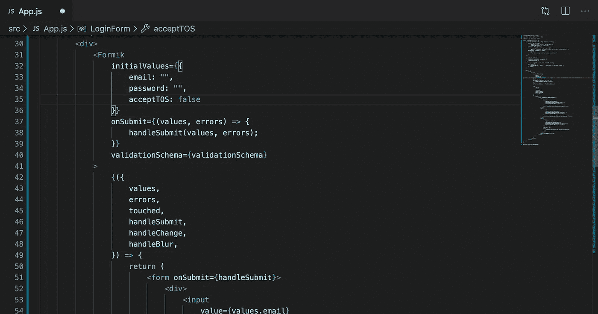

# React 中处理表单验证的分步指南

> 原文：<https://betterprogramming.pub/a-step-by-step-guide-to-handle-form-validation-in-react-83232cd52316>

## *使用* `*formik*` *和* `*yup*`在 React 中验证表单



# 介绍

通常，我们发现自己处于这样一个位置，我们想要简单地创建一个有三个字段(一般来说)的登录表单:一个电子邮件、一个密码和一个复选框。

如果我们想要执行验证，以这种简单的形式处理错误可能会变得更糟糕，例如:

*   输入的电子邮件是否符合电子邮件模式(abc@example.com)？
*   密码是否至少包含 8 个字母？
*   当用户点击输入字段时，它会显示错误吗？
*   复选框是否已选中？
*   禁用“提交”按钮，直到表单字段有效

还有几个…

单独用一个 React 状态处理这样一个登录表单可能看起来很难看，我们可能仍然不能执行所有这样的验证。

我们该怎么办？我们使用`formik`和`yup`来处理 react 组件中的所有表单验证。

# 什么是福米克？

Formik 是使用最广泛的 JavaScript 库，用于在 React 中验证表单。

# 什么是呀？

可以把 Yup 看作是我们表单的一个模式，它保存了诸如密码字段中的最大字符数、电子邮件模式等数据。

如果你不明白，不要担心；一旦我们开始编码，事情会变得更清楚。

# 入门指南

让我们通过运行以下命令将`formik`和`yup`安装到现有的/新的 React 项目中:

```
npm install --save formik yup
```

现在是时候创建作为 React 组件登录表单了。我将创建这个组件作为一个功能组件；根据您的用例，您可以创建一个基于类的组件。

这是一个非常基本的形式。我们在这里做不了什么。在传统方法中，我们将输入字段的值保存在状态中，然后使用`onChange`事件处理程序控制它。

但是，当我们有了`formik`和`yup`时，为什么还要使用组件级状态并花时间编写长的验证处理程序呢，对吗？

好吧！先说添加`formik`！

下面是我们在上面的代码中所做的:

*   将我们的`form`包装在 formik 中，这样我们就可以访问 formik 的事件处理程序，比如`handleSubmit`和`handleChange`。
*   formik 的`initialValues` prop 作为我们表单的初始值。您可以看到，我们在第 13 行到第 16 行中指定了这一点。然后这些值被析构(第 22 行),这样我们就可以用它作为表单输入值。
*   formik 的`onSubmit` props 在表单提交时被调用。因为我们已经将表单的`handleSubmit`事件(第 24 行)附加到了它的`onSubmit`事件上，所以 formik 的`onSubmit`道具被调用到表单的`onSubmit`事件上。
*   最后一个对我们非常重要的功能是 formik 的`handleChange`。我们将这个函数绑定到输入字段的`onChange`事件处理程序，以便 formik 可以处理任何输入更改。该函数接受的第一个参数是它所附加的表单域的值。

现在，我们来添加`yup`。请记住，yup 用于解析我们的表单值，因此 formik 实际上可以对这些解析的值执行最终验证。

我们向组件添加了一个验证模式。这是表单验证最有趣的部分，通常会占用我们大部分时间。但现在不是了— `yup`为我们完成了表单的所有值解析。只需设计表单的模式并将其附加到`formik`。

重要提示:注意第 31 行。

好吧！现在我们已经设置好了验证，让我们开始在错误发生时显示错误。对于这个特殊的用例，`formik`为用户提供了一个非常方便的`error`对象。如果任何输入域有错误，则**对应的**键或`error`对象变为真。看看第 23、33、41 和 52 行。

接下来呢？目前，每当用户在任何字段中输入无效的表单值时，所有其他字段都会显示与其字段相对应的错误消息，而不管用户是否已经对该字段进行了“**触摸**”。这不是我们想要的。嗯，`formik`也管这部分。向 formiks `touched`对象问好。它保留了用户是否实际触摸了某个字段的参考。

让我们用`touched`对象更新我们当前的代码库。

好看吗？不错！最后一件事:如果用户输入了错误的密码，会发生什么？在这种情况下，我们希望在收到服务器的登录失败响应后更新`password`字段的错误消息。福米克也负责这个！

我们简单地析构传递到我们的`handleSubmit`函数中的`errors`对象，以将`setFieldError`从中取出。使用`setFieldError`，我们可以像这样设置特定表单字段的误差值。

最后，我们将添加 formik 的`handleBlur`函数，该函数处理输入字段的`onBlur`事件并执行所需的验证。

女士们，先生们，我向你们展示我在 React 中使用`formik`和`yup`处理表单的方式。以下是最终代码: