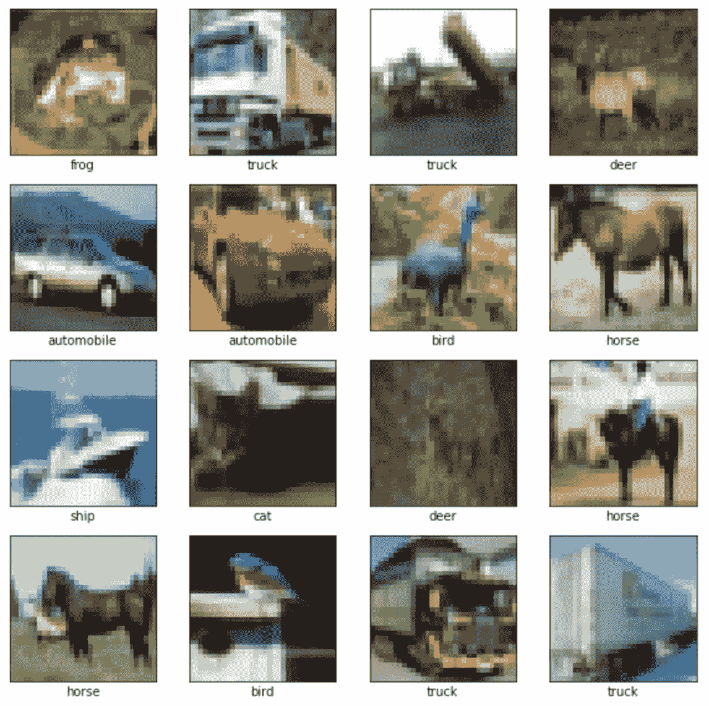
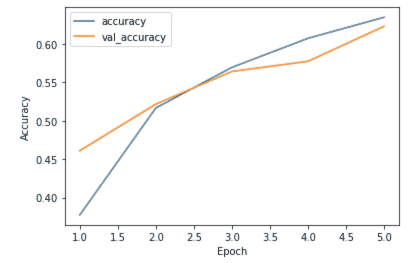
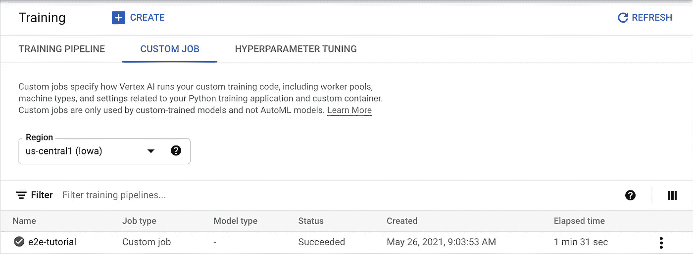
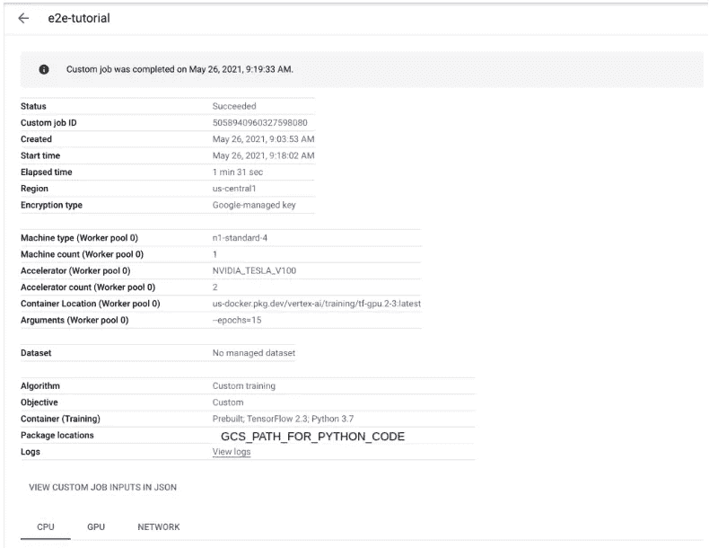

# 在谷歌云的顶点人工智能上训练模型的分步指南

> 原文：<https://betterprogramming.pub/a-step-by-step-guide-to-train-a-model-on-google-clouds-vertex-ai-47faafae1330>

## 从零开始，到达在顶点人工智能上训练的第一个模型


顶点 AI(来源:[谷歌云](https://cloud.google.com/vertex-ai))

# 顶点 AI 教程系列

1.  在 Google Cloud 的 Vertex AI 上训练模型的分步指南(本文)
2.  [在谷歌云的顶点人工智能上调整模型的逐步指南](/a-step-by-step-guide-to-tune-a-model-on-google-clouds-vertex-ai-afd2e72af595)
3.  [如何在谷歌云的顶点人工智能上操作一个模型](/how-to-operationalize-a-model-on-google-clouds-vertex-ai-53298b530703)
4.  [如何在 Google Cloud 的 Vertex AI 上使用 AutoML](/how-to-use-automl-on-google-clouds-vertex-ai-27f8778239ea)
5.  [如何在 Google Cloud 的 Vertex AI 上使用 big query ML](/how-to-use-bigquery-ml-on-google-clouds-vertex-ai-23b1ca0b635)
6.  [如何在 Google Cloud 的 Vertex AI 上使用 Pipeline](/how-to-use-pipeline-on-google-clouds-vertex-ai-863b429c811f)

# **背景和动机**

谷歌最近宣布其用于机器学习的云平台——[Vertex AI](https://cloud.google.com/vertex-ai)正式上市。我对此感到非常兴奋。我一直想在 Google Cloud 上看到一个连贯的、端到端的 ML 工作流故事。多年来，Google Cloud 已经有了许多与 ML 相关的服务和工具。希望这次他们能把它们统一到一个集成的平台上。

怀着很高的期望，我去查阅了[文档](https://cloud.google.com/vertex-ai)。我不得不说，它需要一点改进。内容很多，大部分都很好，但是组织混乱。感觉就像是一大堆文章，由最后几页“索引式”的单页纸链接而成。很难找到从哪里开始。最重要的是，你不知道哪些链接是关键的，所以你最终会分心去访问所有的链接。

我真的很喜欢底层服务，我想学习更好地使用它们，我想为它们布道。这就是为什么我决定创建一系列文章来演示 Vertex AI 的端到端教程。它假设没有谷歌云的 ML 服务的经验。我也尽力包含文章中的所有内容，这样你就不需要在链接之间跳来跳去。显然，如果需要的话，我会为感兴趣的读者提供适当的链接，让他们找到更多的细节。

这是这个系列的第一集。我们从头开始，到本文结束时，我们将创建第一个在 Vertex AI 上训练的模型。

# **先决条件**

本系列假设对 Google 云平台有基本的了解。你需要一个谷歌云项目。您还需要设置常见的命令行实用程序，如`gcloud` ( [Google Cloud SDK](https://cloud.google.com/sdk/docs/install) )和`gsutil`([Google Cloud Storage utils](https://cloud.google.com/storage/docs/gsutil))。

作者插曲:我们将在后面的代码和命令中使用一些谷歌云存储路径占位符，如`GCS_PATH_FOR_*`。您需要以`gs://bucket/[folder]/[sub_folder]/`的形式指定您自己的。此外，本系列假设对 [Tensorflow](https://www.tensorflow.org/) 有基本的了解。我们只使用 Tensorflow 中的高级 API，所有这些 API 都是不言自明的，所以如果你不是 Tensorflow 大师，也不用担心。

检查您是否满足先决条件的一个方法是遵循第一篇文章。如果你觉得它跳过太多，这可能是一个信号，让你在继续下一步之前加强对前提材料的理解。

# **问题设置**

我们在这个系列中处理一个非常基本的图像分类问题。人们喜欢使用 MNIST 数据集。但是我们想变得更加丰富多彩(MNIST 是灰度)。因此，我们将致力于 [CIFAR10](https://www.tensorflow.org/datasets/catalog/cifar10) 。它包含 10 类 60，000 张 32x32 的彩色图像，每类 6，000 张图像——我们将在这篇博文的后面展示图像示例。

# **开发环境设置**

我们与之交互的主要开发环境是 [JupyterLab](https://jupyter.org/) ，从这里我们可以编写交互式 Python 代码并轻松访问命令行终端。你可以在本地建立自己的 JupyterLab。如果你以前做过 ML，你可能已经有了。

我推荐在 Vertex AI(JupyterLab 的管理版本)中使用[笔记本](https://cloud.google.com/vertex-ai/docs/general/notebooks)。这是首选的原因有几个。首先，它内置了所有典型的 ML 包。其次，它已经被配置为连接其他谷歌云服务，所以你不需要为那些烦人的认证/连接设置而烦恼。最后，它允许您超越本地工作站的限制进行扩展。例如，如果您需要更多的 CPU/RAM/GPU，只需创建一个由适当的机器类型支持的笔记本。如果你需要更多的磁盘空间，只需创建一个谷歌云盘，并将其附加到笔记本的虚拟机上。因为它的设置很简单——只需点击几下——而且本教程并不要求这样做，所以我在这里不包括说明。如果你有兴趣，可以看看笔记本[文档](https://cloud.google.com/notebooks/docs)。

默认情况下，所有 Python 代码和命令行执行都在 JupyterLab 中，除非另外调用。

# **数据准备**

数据准备是任何 ML 项目中的关键任务。在我们的示例中，CIFAR10 已经包含在 Tensorflow 数据集目录中。但是为了模拟真实的 ML 项目开发，我们将处理数据集并将其上传到 Google 云存储(GCS)供下游使用。许多 Tensorflow 函数都内置了对 GCS 的支持。我们只需要做一次，结果将被重新用于后续的模型训练和验证。

只需几行 Tensorflow 代码，我们就可以下载数据集，对其进行预处理，并为训练、验证和测试集创建 Tensorflow 示例。

数据预处理代码

然后，我们将文件复制到 GCS 存储桶中，供下游使用。强烈建议将 Vertex AI Notebook(如果你正在使用的话)、GCS bucket 以及后续的 Vertex AI 服务放在同一地区。这不仅提高了性能，还有助于避免您可能遇到的一些奇怪的跨区域问题。

```
gsutil -m cp *.tfrecord GCS_PATH_FOR_DATA
```

我们应该验证 GCS 中的数据是可访问的并且编码正确。我们从 Tensorflow 示例文件中获取、解码并显示一些图像:

数据验证代码



已处理数据集中的样本图像

# **本地训练一个模型**

在我们对 Vertex AI 做任何事情之前，让我们在本地训练一个模型，以确保一切正常。我们首先准备好输入数据集:

张量流数据集创建代码

然后我们构建模型。模型架构包含几个卷积层，后面是扁平化全连接层，最后输出十类的概率。

模型构造代码

最后，我们来训练模型。



本地培训准确性指标

模型训练代码

在测试数据集上，该模型的准确率只有 60%，不是很高。我们将在以后的文章中改进它。但是，就目前而言，至少本地培训是端到端的。

# **在顶点 AI 上训练一个模型**

是时候转向云计算了。我们需要为模型更新一些东西:

*   我们希望将它包装在一个分布式培训策略下，以便它可以利用硬件(如果可用的话)。
*   我们还想保存训练检查点，因为云上的机器可能会被抢占。
*   在训练结束时，我们希望导出训练好的模型以供使用。

最终模型构造代码

现在，我们准备在 Vertex AI 上训练模型。概括地说，它包括以下步骤:

*   稍微重组一下代码，让它可以被 Vertex AI 使用。
*   捆绑一个 Python 发行版，上传到 GCS，这样 Vertex AI 就可以访问了。
*   通过调用`gcloud`命令行工具启动培训任务，并提供适当的参数。
*   轮询作业状态，直到完成。

# **重组代码**

我们可以认为 Vertex AI 上的训练环境类似于我们的 JupyterLab 环境。培训工作的启动类似于在本地启动 Python 程序。我们已经有了 Python 程序——只需将“在本地训练一个模型”部分的所有代码片段放在一个`.py`文件中(按照惯例是`task.py`)。不要忘记为上面提到的分布式策略、检查点和模型导出修改它。

此外，让我们将历元数作为参数添加到程序中。

模型参数代码

尝试在本地启动培训以确保其有效。当在 Vertex AI 上训练时，我们需要等待我们的训练任务被安排，这可能需要一些时间。我们不想因为一些愚蠢的打字错误而发现一项工作失败了！

```
python task.py --epochs=1
```

# **捆绑并上传 Python 发行版**

现在，我们需要捆绑一个 Python 发行版。按如下方式构建文件夹:

```
|-- setup.py
|-- trainer
    |-- task.py
    |-- __init__.py
```

`task.py`文件是我们刚刚放在一起并在本地测试的 Python 程序。把它放在一个`trainer`文件夹里作为惯例。`__init__.py`文件是一个空的 Python 文件，用来划分模块。查看以下`setup.py`文件的基本内容:

setup.py

如果需要安装其他标准 Python 包依赖项，可以在`setup.py`文件中声明。出于演示目的，我们在这里保持一切简单。

现在，让我们打包 Python 发行版。以下命令在新创建的`dist`文件夹下生成一个`trainer-0.1.tar.gz`文件。

```
python setup.py sdist --formats=gztar
```

将 Python 发行版复制到 GCS 位置，以便顶点 AI 可以访问它。

```
gsutil cp dist/trainer-0.1.tar.gz GCS_PATH_FOR_PYTHON_CODE
```

# **启动培训工作**

最后，我们准备启动 Vertex AI 的培训工作。这部分的文档有点不透明。让我们浏览一下说明。

在继续下一步之前澄清一下:我们将使用一个预构建的容器启动一个定制的培训任务。这是一项定制培训工作，因为我们正在从头开始构建模型。在未来的文章中，我们将探索如何利用 Vertex AI 的预建模型。我们正在使用一个预构建的容器。容器是执行训练代码的环境。您可以使用您的自定义容器进行训练，其中包含您的专用工具和依赖项。但是，让我们把这个高级用例放在一边，关注这里简单的端到端工作流。

我们将使用`gcloud`命令行工具启动培训。Vertex AI 内置了一个子命令，`gcloud`(目前还在 beta 阶段)。

```
gcloud beta ai custom-jobs create --region=us-central1 --display-name=e2e-tutorial --config=config.yaml
```

该命令的核心在`config.yaml`文件中。我们也可以在命令行中指定单独的参数，但是我建议使用配置文件，因为我们需要指定相当多的参数。配置的模式也没有很好地记录。您必须知道它实际上是 API 方法的参数( [link](https://cloud.google.com/vertex-ai/docs/reference/rest/v1/CustomJobSpec) )。

config.yaml

# **轮询作业状态**

`custom-jobs create`命令将返回一个任务 ID，以便我们检查状态。只需调用以下命令来轮询作业的状态。

```
gcloud beta ai custom-jobs describe JOB_ID --region=us-central1
```

如果一切顺利，几分钟后您将看到作业状态为`JOB_STATE_SUCCEEDED`。我们还可以在云控制台上查看作业状态。进入顶点 AI - >培训- >定制作业，点击“e2e-教程”查看作业详情。我们还可以通过查看日志链接来检查培训作业的控制台输出。



自定义作业页面



职务详细信息页面

# **验证型号**

此时，我们已经在 Vertex AI 上训练了一个模型，并将其保存到 Google 云存储中。在结束本文之前，还有最后一件事——让我们评估一下 JupyterLab 中的模式。

最终模型评估

我们可以看到，准确率从 60%(在本地用 5 个历元训练)提高到 66%(在 Vertex AI 上用 15 个历元训练)。

# **包装**

这是一个端到端顶点 AI 教程系列的第一篇文章的结尾。如果你创建了 Vertex AI 笔记本，记得清理你的谷歌云资源。庞大的虚拟机可能非常昂贵。我将在未来发布更多内容来演示该平台的其他方面。再见，下次见。