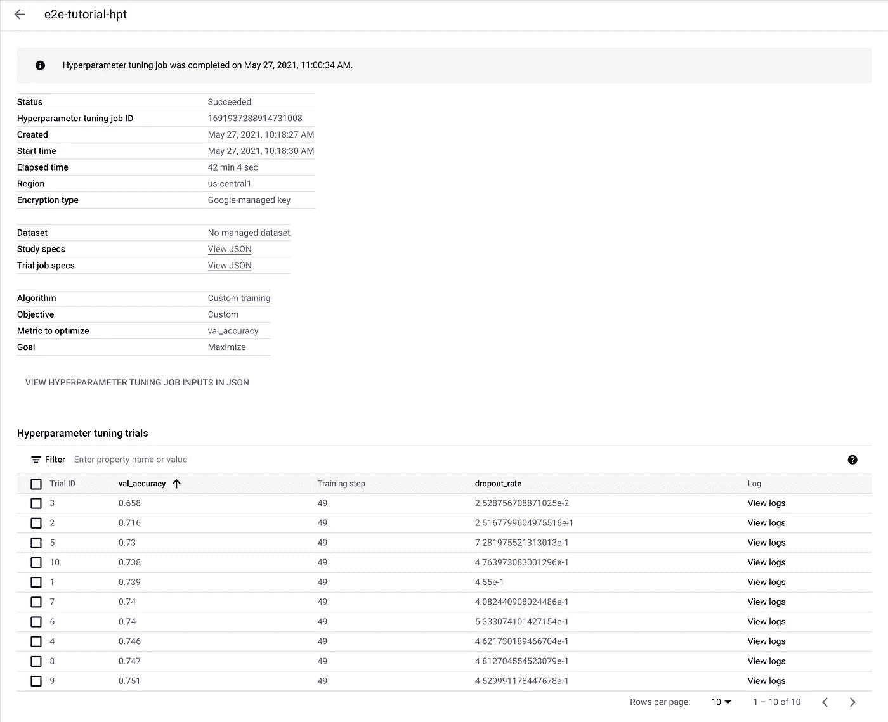
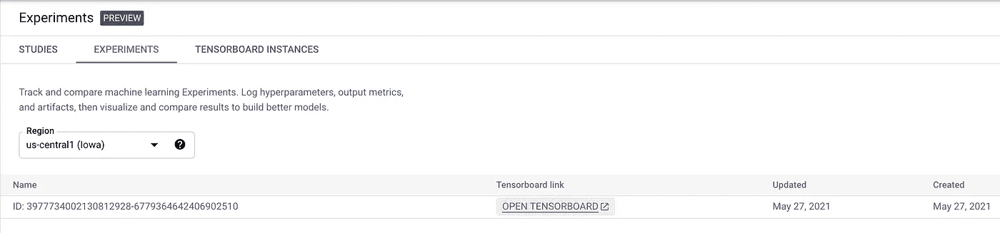

# 在谷歌云的顶点人工智能上调整模型的一步一步的指南

> 原文：<https://betterprogramming.pub/a-step-by-step-guide-to-tune-a-model-on-google-clouds-vertex-ai-afd2e72af595>

## 调整模型超参数，并在托管张量板上可视化度量


顶点 AI(来源:[谷歌云](https://cloud.google.com/vertex-ai))

# 顶点 AI 教程系列

1.  [在谷歌云的顶点人工智能上训练模型的逐步指南](/a-step-by-step-guide-to-train-a-model-on-google-clouds-vertex-ai-47faafae1330)
2.  在 Google Cloud 的 Vertex AI 上调优模型的分步指南(本文)
3.  [如何在谷歌云的顶点人工智能上操作一个模型](/how-to-operationalize-a-model-on-google-clouds-vertex-ai-53298b530703)
4.  [如何在 Google Cloud 的 Vertex AI 上使用 AutoML](/how-to-use-automl-on-google-clouds-vertex-ai-27f8778239ea)
5.  [如何在 Google Cloud 的 Vertex AI 上使用 big query ML](/how-to-use-bigquery-ml-on-google-clouds-vertex-ai-23b1ca0b635)
6.  [如何在 Google Cloud 的 Vertex AI 上使用 Pipeline](/how-to-use-pipeline-on-google-clouds-vertex-ai-863b429c811f)

# B **背景**

在之前的[文章](/a-step-by-step-guide-to-train-a-model-on-google-clouds-vertex-ai-47faafae1330)(本系列的第一篇)中，我们通过一步一步的说明，在谷歌云最新的集成机器学习平台 [Vertex AI](https://cloud.google.com/vertex-ai) 上训练了第一个模型。我们正在解决的问题是针对 [CIFAR10](https://www.tensorflow.org/datasets/catalog/cifar10) 数据集的图像分类任务，该数据集包含 10 个类别的 60，000 张 32x32 图像。

在本文中，我们将在此基础上改进模型性能，并探索 Vertex AI 上的两个非常酷的工具: [Hypertune](https://cloud.google.com/vertex-ai/docs/training/hyperparameter-tuning-overview) 和 [Experiments](https://cloud.google.com/vertex-ai/docs/experiments) 。

# O **优化理念**

前一篇文章中的一个观察结果是，更多时期的训练产生了更好的结果。在本地训练五个纪元时，我们得到了 60%的评估准确率。用顶点 AI 上的 15 个历元，我们获得了 66%的评价准确率。请注意，通常最好使用精度和召回率作为性能指标。但是我们正在处理一个完美平衡的数据集。因此，为了简单起见，我们将坚持准确性。

最简单也是最蛮力的想法就是多历练。我们将 epoch 参数设置为 50，并启动了一个训练作业(参考上一篇文章了解如何操作)。不幸的是，结果令人失望。评估准确率为 64%，低于 15 个时期训练的结果。同时，训练准确率高达 93%。显然，该模型过度拟合了训练数据。所以我们需要某种正则化来推广这个模型。

有许多正则化技术可用。最简单的可能是 [Dropout](https://www.tensorflow.org/api_docs/python/tf/keras/layers/Dropout) ，它随机关闭每个训练批次的一些神经元，试图迫使模型学习更强大的功能。我们将使用辍学来改进我们的模型。

# 超调谐

现在我们已经决定使用 Dropout，接下来的问题是辍学率，这是模型在每个训练批次中将关闭的神经元的百分比。辍学率是一个超参数。许多其他配置也是超参数，例如学习速率、特定层中神经元的数量、层数、激活函数等。出于演示的目的，让我们关注辍学率。为了简单起见，我们只在展平层后添加一个丢弃层。有关实现的详细信息，请参见以下代码片段。该模型与我们在上一篇文章中使用的模型相同。这里唯一添加的元素是 Dropout 层。

超调谐码

如你所见，辍学率被设计成一个我们可以传递给培训工作的论据。我们的目标是找到产生最高验证准确性的最佳退出率。显然，您可以通过启动多个培训工作来手动改变辍学率，使其符合您的最佳猜测。但是，当你可以依靠自动化时，为什么要做一些重复和无聊的事情呢？

Hypertune 是来救援的。它就是这样做的——它从我们指定的范围启动多个具有各种超参数值(在我们的例子中是辍学率)的训练任务。Hypertune 监控我们需要公开的模型性能指标，并在允许的空间中搜索以最大化指标。Hypertune 支持典型的搜索算法，默认为[贝叶斯超参数优化](https://en.wikipedia.org/wiki/Bayesian_optimization)。

回到代码，我们已经参数化了辍学率。现在我们需要更新模型来公开度量。我们使用的衡量标准是验证准确性，在每个时期结束时根据验证数据集进行计算。我们将使用自定义 Tensorflow 回调来实现指标报告，该回调调用 [Hypertune](https://github.com/GoogleCloudPlatform/cloudml-hypertune) Python 库来报告指标。Hypertune 库本质上只是将一些结构化格式的指标转储到主机上的一个临时文件夹中，Hypertune 服务将获取这些数据。

超调度量代码

注意，我们故意忽略了检查点部分，这样我们就不需要为不同的调优试验安排不同的 Google 云存储文件夹。如果我们不幸获得了主机抢占权，那就这样吧。只是从头开始那个特殊的训练试验需要多一点时间。

现在我们准备启动超参数调优工作。与上一篇文章类似，我们将使用`gcloud`命令行工具。

```
gcloud beta ai hp-tuning-jobs create \
--display-name=e2e-tutorial-hpt --region=us-central1 \
--config=hpt.yaml --max-trial-count=10 \
--parallel-trial-count=2
```

命令参数都是不言自明的。肉在配置文件中:

超调配置

`trialJobSepc`下的`workerPoolSpec`与我们在上一篇文章中用于启动培训作业的配置相同。这里新添加的字段是`studySpec`，它包含目标指标和相关超参数的搜索空间。

`hp-tuning-jobs create`命令将返回一个作业 ID，我们可以用它来查询超参数调优状态。

```
gcloud beta ai hp-tuning-jobs describe JOB_ID --region=us-central1
```

我们也可以访问 UI 上的调优工作。进入顶点 AI ->训练->超参数调优，点击调优作业查看详情。



超调结果

看起来它已经完成了，0.45 的退出率产生了最高的验证准确性。

# Exp **eriment(托管 Tensorboard)**

我们可以从超参数调优工作中获得最高验证准确性的模型，然后就到此为止。但是我们想尝试实验功能。因此，我们将用最佳辍学率对模型进行最后一次训练，并连接实验工具(managed Tensorboard)来可视化实时模型训练。

要使用 Experiment，我们首先应该创建一个 Tensorboard 实例。

```
gcloud beta ai tensorboards create \
--display-name=e2e-tutorial-viz --region=us-central1
```

我们可以看到一个 Tensorboard 实例是通过 UI 创建的:Vertex AI-> Experiments-> tensor board Instances。


Tensorboard 实例

接下来，我们将在模型训练中添加一个 Tensorboard 回调，以便它导出 Tensorboard 可视化所需的数据。

Tensorboard 度量代码

这里涉及到一个`AIP_TENSORBOARD_LOG_DIR`环境变量，我们将在后面解释。

在启动培训工作之前还有一件事:我们需要创建一个服务帐户，并为 Tensorboard 可视化配置其权限。你可以按照这个[链接](https://cloud.google.com/vertex-ai/docs/experiments/tensorboard-training#create_a_service_account_with_required_permissions)来设置。我知道我在第一篇文章中说过，我会尽量让文章保持独立。但是这种权限设置是非常机械的，指令都在一个地方，所以我觉得没有必要复制它们。

现在我们可以开始培训工作了。这次我们不使用`gcloud`命令，而是直接发送一个 curl 请求，这就是`gcloud`命令的功能。这是因为在`gcloud`命令中似乎有一个参数解析错误，阻止了为 Tensorboard 可视化创建训练作业。

```
curl -H "Authorization: Bearer $(gcloud auth print-access-token)" \
-H "Content-Type: application/json" \
-X POST -d @request.json \
https://us-central1-aiplatform.googleapis.com/v1beta1/projects/PROJECT_NAME/locations/us-central1/customJobs
```

这里的核心内容在`request.json`文件中:

张量板请求

有几点需要注意:首先，`GCS_PATH_FOR_PYTHON_CODE`是我们的 Python 包发行版所在的地方。关于我们如何在 Google 云存储中打包和存储训练代码，请参考第一篇文章。其次，`GCS_PATH_FOR_TENSORBOARD_LOG`是 Tensorboard 日志的 Google 云存储位置。训练主机将前面提到的`AIP_TENSORBOARD_LOG_DIR`环境变量设置为`GCS_PATH_FOR_TENSORBOARD_LOG`的值，这样就可以在我们的训练代码中访问它。第三，`SERVICE_ACCOUNT_FROM_THE_PERMISSION_STEP`是您按照前面提到的权限设置创建的服务帐户。最后，`FULL_RESOURCE_NAME_OF_TENSORBOARD`是 Tensorboard 实例的完整资源名，我们可以通过以下命令获得:

```
gcloud beta ai tensorboards list --region=us-central1
```

现在我们都准备好了。只需等待训练作业开始，然后导航到 UI:Vertex AI-> Experiments-> Experiments 并单击 Open Tensorboard 按钮，这将在一个新选项卡上打开我们训练作业的 Tensorboard 可视化。



张量板输入


张量板可视化

# **Wra** p Up

最后，让我们在测试数据集上评估模型(代码在第一篇文章中)。评估准确率为 74%。从最初的 60%开始，我们已经走了很长一段路。显然，仍有改进的余地。但这次旅程很好地为我们展示了 Vertex AI 在训练定制模型方面的能力。我们将在此稍作休息，并在本系列的下一集继续讨论。