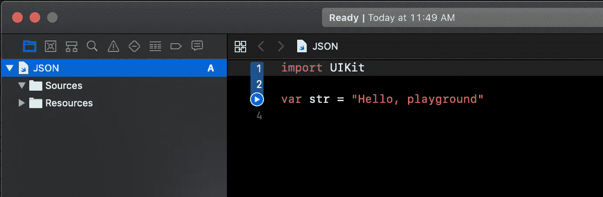
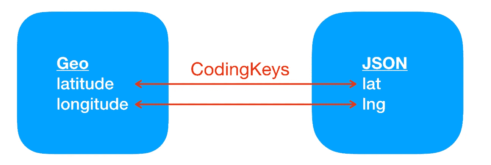
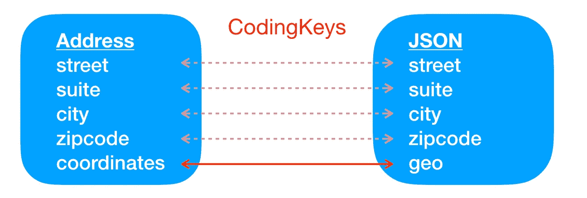

# Swift 中的自助 JSON 编码

> 原文：<https://betterprogramming.pub/a-step-by-step-guide-to-working-with-json-in-swift-without-dependencies-398fd25c4fe8>

## 忘记 Alamofire 吧，你可以在 Swift 中处理 JSON 而不依赖它。


照片由[弗兰基·查马基](https://unsplash.com/@franki?utm_source=unsplash&utm_medium=referral&utm_content=creditCopyText)在 [Unsplash](https://unsplash.com/search/photos/data-exchange?utm_source=unsplash&utm_medium=referral&utm_content=creditCopyText) 上拍摄

在当今的移动应用生态系统中，由于这样或那样的原因，几乎每个应用都需要与后端服务器通信。不可避免地，这种交流将涉及到使用 JSON 数据。

为了强调这一点，有几个开源项目提供了在 Swift 中将 JSON 数据解析成更容易理解的数据模型的便捷途径。其中最受欢迎的可以说是 [SwiftyJSON](https://github.com/SwiftyJSON/SwiftyJSON) 。

使用这些项目没有错，除了它们成为你的应用程序不可或缺的一个依赖源。

[减少对外部项目的依赖是一个值得认真考虑的目标](https://research.swtch.com/deps)，因此，今天，我们将看看如何在没有依赖的情况下在 Swift 中处理 JSON 数据。

# **项目**

我相信在实践中学习，但我不想陷入构建 UI 的困境，所以我们将建立一个操场。

我们将研究如何从服务器获取 JSON 数据并将其解码成易于使用的数据模型，以及如何对更改进行编码并将其发送回服务器。

首先，打开 Xcode 并创建一个新的空白游乐场。将其命名为`JSON.playground`并保存在适当的地方。

我们将创建几个文件来组织我们的工作，所以一旦游乐场开放，通过按下`⌘1`或点击菜单`View -> Navigators -> Show Project Navigator`来显示项目导航器。

现在，您应该可以看到主 playground 文件以及 sources 和 resources 文件夹。



# **数据**

在编写任何代码之前，让我们看看我们将使用的数据。[有很多免费、开放的 JSON 数据端点可供我们学习使用。](https://github.com/public-apis/public-apis)

我的最爱之一是 [JSONPlaceholder](http://jsonplaceholder.typicode.com) ，它已经存在了很多年，而且不太可能很快消失。它们提供了一些不同的端点来模仿相册、待办事项列表等。

我们将使用`users`端点，因为它包含嵌套的 JSON，如果您是使用 JSON 的新手，这会带来一些困难，但这是非常常见的，也是在 Swift 中使用 JSON 的开源框架如此受欢迎的原因之一。

我们今天研究的技术使得使用 JSON 和嵌套 JSON 变得简单，就像使用开源框架一样，没有额外的依赖性。

我们将处理的数据是一组用户对象，如下所示:

```
[{
   “id”: 1,
   “name”: “Leanne Graham”,
   “username”: “Bret”,
   “email”: “Sincere@april.biz”,
   “address”: {
      “street”: “Kulas Light”,
      “suite”: “Apt. 556”,
      “city”: “Gwenborough”,
      “zipcode”: “92998–3874”,
      “geo”: {
         “lat”: “-37.3159”,
         “lng”: “81.1496”
      }
   },
   “phone”: “1–770–736–8031 x56442”,
   “website”: “hildegard.org”,
   “company”: {
      “name”: “Romaguera-Crona”,
      “catchPhrase”: “Multi-layered client-server neural-net”,
      “bs”: “harness real-time e-markets”
   }
},
…
]
```

有十个这样的用户对象，但是我们的代码可以处理任何数量。

关于这些对象，有趣的是我们有两个嵌套的对象:`address`和`company`。`address`对象也有一个名为`geo`的嵌套对象，但是消费和访问它的数据是微不足道的。

# **基本获取**

在深入研究如何使用这些数据之前，我们首先需要获取数据。让我们来处理一些网络代码。

通过点击项目导航器中的 sources 文件夹并输入`⌘N`来创建一个新文件。将文件名从`New File.swift`更改为`Networking.swift`。

在编辑器中，您现在应该只看到一条`import Foundation`语句。

输入以下内容:

```
import Foundationpublic enum NetworkingError: Error {
   case unableToGenerateURL
}public class Networking {
   public static func fetch(fromEndpoint endpoint: String, completionHandler: @escaping ((Result<Data?, Error>) -> Void)) {
      guard let url = URL(string: endpoint) else {
         let error = NetworkingError.unableToGenerateURL
         completionHandler(Result.failure(error))
         return
      } let session = URLSession(configuration: .default)
      let task = session.dataTask(with: url) { (data, _, error) in
         guard error == nil else {
            completionHandler(Result.failure(error!))
            return
         }
         completionHandler(Result.success((data)))
      }
      task.resume()
   }
}
```

理解`URLSession`是一个非常深入的主题，超出了本文的范围，所以我将简单解释一下这里发生了什么。

我们已经创建了一个非常简单的方法来从端点获取数据。我们首先尝试从`endpoint`生成一个`URL`对象。如果失败，我们返回一个错误。如果成功，我们用默认配置创建`URLSession`。

接下来，`URLSession`的`dataTask`方法将完成通过网络与服务器通信的所有繁重工作，并返回三个可能的对象:`data`、`response`和`error`。

我们将首先检查`error`对象，如果它不是`nil`，我们将返回一个包含`error`对象的失败结果。如果`error`是`nil`，我们将使用`data`对象返回一个成功的结果。

我们忽略了`URLResponse`对象，因为老实说，我们假设，如果您从端点获得数据，一切都是好的。这不是最佳实践，所以不要在生产代码中这样做。为了避免复杂性，我选择了一个准系统实现。

如果您是第一次接触`URLSession`，我鼓励您检查这段代码以理解这个非常基本的实现，但是一定要深入研究这个主题，因为如果您将它剪切并粘贴到您的项目中，这段代码会在许多方面让您失望。

另一个需要注意的事项是，我们将大量使用[结果类型](https://developer.apple.com/documentation/swift/result)。如果您以前没有使用过`Result`,它是一种可以用来封装来自异步流程的成功或失败响应的类型，比如我们的网络方法。

如果你是第一次接触`Result`，只要坚持使用这里的代码，到本文结束时，你就应该理解它了。奖金！

既然我们已经有了获取数据的能力，让我们从获取用户列表的代码开始。

让我们继续保持我们的代码组织良好，使用这个函数作为一个内部 API 的第一个函数，我们的主操场代码可以调用它来获得用户列表。

在 sources 文件夹中创建另一个新文件，命名为`UserAPI.swift`。在新文件中输入以下代码:

```
import Foundationpublic struct UserAPI {
   static let endpoint = “https://jsonplaceholder.typicode.com/users”
}
```

因为我们的 API 不需要一个类的开销，我们就把它做成一个`struct`。这也是保存端点字符串的逻辑位置。

在`endpoint`属性后，输入以下内容:

```
public static func getUsers() {
   Networking.fetch(fromEndpoint: endpoint) { (result) in
      switch result {
      case .success(let data):
         print(data)
      case .failure(let error):
         print(error.localizedDescription)
      }
   }
}
```

这里发生的事情是，我们有一个`getUsers()`方法，它将调用我们之前创建的`Networking.fetch`方法。它将传入`endpoint`属性和一个简单的完成处理程序来处理 fetch 方法的`result`响应。

现在，如果我们得到一个成功的响应(暂时忽略 Xcode 的隐式强制警告),我们将打印出数据；如果我们得到一个失败的响应，我们将打印出错误。

这是一个很好的起点，可以确保我们实际上可以与服务器通信并从中获取数据，所以让我们来测试一下。

在项目导航器中，单击 JSON playground 文件。删除所有默认代码，并替换为以下代码:

```
UserAPI.getUsers()
```

执行 playground 代码，您应该会在控制台日志中看到类似下面的内容:

```
Optional(5645 bytes)
```

如果您看到一个错误，请仔细检查您的代码和您的端点，以确保没有打字错误。如果您确实看到了与上面类似的消息，那么恭喜您，因为您现在正在从服务器中提取数据！

现在我们有了数据，我们需要对它做些什么。这将需要一个数据模型和一个 JSON 解码器。

# **数据模型**

除了作为我们数据的存储容器之外，数据模型将是这个项目的关键组件之一，它将使使用 JSON 变得方便和容易。

它背后的力量将是它符合[可编码协议](https://developer.apple.com/documentation/swift/codable)。可编码一致性意味着对象可以与外部格式(如 JSON)相互转换。

`Codable`实际上是一个由`Encodable`和`Decodable`协议组成的协议，所以如果你只需要解码那么你应该使用`Decodable`。我们将会看到从 JSON 到我们的数据模型再回到 JSON 的往返过程，所以我们使用了`Codable`。

按照我们的代码组织主题，点击项目导航器中的 sources 文件夹，创建一个名为`DataModels.swift`的新文件。

在文件中，用以下代码替换默认代码:

```
public struct User: Codable {
   public var id: Int
   public var name: String?
   public var username: String?
   public var email: String?
   public var phone: String?
   public var website: String?
   public var address: Address?
   public var company: Company?
}public struct Address: Codable {
   public var street: String?
   public var suite: String?
   public var city: String?
   public var zipcode: String?
   public var geo: Geo?
}public struct Geo: Codable {
   public var lat: String?
   public var lng: String?
}public struct Company: Codable {
   public var name: String?
   public var catchPhrase: String?
   public var bs: String?
}
```

我们在这里所做的是创建一组结构，这些结构镜像服务器返回的 JSON 用户数据。为了进行比较，我们再来看看 JSON 数据的结构:

```
{
   id
   name
   username
   email
   phone
   website
   address {
      street
      suite
      city
      zipcode
      geo {
         lat
         lng
      }
   },
   company {
      name
      catchPhrase
      bs
   }
}
```

为了可读性，我稍微重新安排了键并删除了数据值，这样我们就可以专注于结构。

每个离散对象— `user`、`address`、`geo`和`company` —都有自己的结构。我们的 JSON 数据的所有值都是字符串，除了`User.id`是一个整数。

这些类型与 JSON 数据中提供的类型相匹配。`User.id`也是我们唯一确定知道服务器会返回的值。所有其他值都是可选的，因为我们不能保证从服务器为每个用户获取的数据都包含这些数据值。

虽然一对一的比赛在很多时候是有意义的，但并不总是必要的。例如，在我们的例子中，我们不需要`company`对象的`bs`参数。

用可编码协议处理这个问题非常简单；只是不包括它。从`Company`结构中删除`public var bs: String?`行。就这么简单。

# **解码**

现在我们有了数据模型，我们需要一个解码器来将来自服务器的数据转换成我们全新的数据模型。

我在上面说过，数据模型是整个项目的一个关键。解码器(以及后来的编码器)是另一个，因为模型和解码器/编码器作为一个团队一起工作。

现在让我们创建一个解码器。

再次在 sources 文件夹中创建一个名为`JSONConverter.swift`的新文件。用以下代码替换文件中的默认代码:

```
import Foundationpublic struct JSONConverter {
   public static func decode<T: Decodable>(_ data: Data) throws -> [T]? {
   do {
         let decoded = try JSONDecoder().decode([T].self, from: data)
         return decoded
      } catch {
         throw error
      }
   }
}
```

这是一个非常基本但非常有用的通用解码器。

让我们一行一行地检查它，因为理解它非常重要。

```
public static func decode<T: Decodable>(_ data: Data) throws -> [T]? {
```

当调用该方法时，您将传递一个`Data`对象给它——特别是我们从`getUsers()`函数中获取的数据——并获取一个符合`Decodable`的可选通用对象数组。

如果在此过程中发生错误，该方法将引发错误。

```
do {
   let decoded = try JSONDecoder().decode([T].self, from: data)
   return decoded
} catch {
   throw error 
}
```

这个`do/catch`块是实际解码发生的地方。

我们调用`JSONDecorder`的`decode`方法，传入一个符合`Decodable`的泛型对象，以及我们的`data`对象。

换句话说，我们告诉解码器从服务器获取我们的`data`对象，并将其解码成一个`Decodable`对象的数组。一旦解码，我们返回数组。如果 decode 方法抛出一个错误，我们将捕捉它并抛出。

# **拼凑起来**

现在我们有了这些构建块，让我们实际使用它们将 JSON 服务器数据解码成我们的数据模型。

打开`UserAPI.swift`文件。在`getUsers()`方法中，找到对`Networking.fetch`的调用，并用以下代码替换`case .success(let data):`代码:

```
case .success(let data):
   guard let data = data else {
      return
   }
   do {
      let users: [User]? = try JSONConverter.decode(data)
      print(users)
   } catch {
      print(“Decoding error: \(error.localizedDescription)”)
   }
```

首先，我们检查从网络调用返回的`data`对象不是`nil`，如果是，我们简单地返回(稍后我们将对此做更多的事情)。

```
guard let data = data else {
   return
}
```

接下来，我们进入一个`do/catch`块来捕捉解码器抛出的任何错误。然后，我们解码我们的数据:

```
let users: [User]? = try JSONConverter.decode(data)
```

这里，我们调用上面创建的 decode 方法，并传入从服务器接收的数据。

通过将数据赋给一个`[Users]?`类型的变量，我们编写的通用解码方法在执行`JSONDecorder().decode(:)`调用时将使用这个`[Users]?`类型。如果您不熟悉泛型，这就是解码器如何知道将 JSON 解码成什么类型的对象。

在解码器里，我们写了行`JSONDecoder().decode([T].self, from: data)`。在运行时，该调用中的通用数组`[T]`被替换为`[User]?`类型。这一切都行得通，因为`Users`符合`Codable`。如果没有，那么这段代码就不会编译。

```
 print(users)
} catch {
   print(“Decoding error: \(error.localizedDescription)”)
}
```

如果解码过程没有抛出任何错误，我们将打印用户对象(稍后我们将解决 Xcode 抛出的警告)。如果有错误，我们将捕捉它并打印出来。

现在，回到 JSON playground 文件，再次执行代码。您应该会看到一个看起来非常混乱的数据列表，类似于:

```
Optional([JSON_Sources.User(id: 1, name: Optional(“Leanne Graham”), username: Optional(“Bret”), email: Optional(“Sincere@april.biz”), phone: Optional(“1–770–736–8031 x56442”), website: Optional(“hildegard.org”), address: Optional(JSON_Sources.Address(street: Optional(“Kulas Light”), suite: Optional(“Apt. 556”), city: Optional(“Gwenborough”), zipcode: Optional(“92998–3874”), geo: Optional(JSON_Sources.Geo(lat: Optional(“-37.3159”), lng: Optional(“81.1496”))))), company: Optional(JSON_Sources.Company(name: Optional(“Romaguera-Crona”), catchPhrase: Optional(“Multi-layered client-server neural-net”))))
```

恭喜您，因为您刚刚将服务器的 JSON 数据转换成了我们的内部数据模型！

# **家政**

我们现在有一点清理工作要做。

首先，我们的`UserAPI.getUsers()`方法不应该打印用户数据，相反，它应该将数据返回给调用代码。

打开`UserAPI.swift`文件，修改`getUsers()`方法的签名，使其与下面的匹配:

```
public static func getUsers(completionHandler: @escaping (Result<[User]?, Error>) -> Void) {
```

`getUsers(completionHandler:)`现在要做的是将成功/失败结果连同用户数据或错误数据一起返回到调用代码将分配的完成处理程序中。

现在，用下面这段代码替换`guard let data = data`代码块:

```
guard let data = data else {
   completionHandler(.success(nil))
   return
}
```

如果没有数据返回，我们会返回一个成功类型(只是因为服务器没有发回数据，所以调用还是成功的)带`nil`数据。接下来，将`print(users)`线替换为:

```
completionHandler(.success(users))
```

并将`print(error.localizedDescription)`替换为:

```
completionHandler(.failure(error))
```

您的`getUsers(completionHandler:)`现在应该是这样的:

```
public static func getUsers(completionHandler: @escaping (Result<[User]?, Error>) -> Void) {
   Networking.fetch(fromEndpoint: endpoint) { (result) in
      switch result {
      case .success(let data):
         guard let data = data else {
            completionHandler(.success(nil))
            return
         }
         do {
            let users: [User]? = try JSONConverter.decode(data)
            completionHandler(.success(users))
         } catch {
            print(“Decoding error: \(error.localizedDescription)”)
         }
      case .failure(let error):
         completionHandler(.failure(error))
      }
   }
}
```

回到 JSON playground 文件，在`UserAPI.getUsers()`调用上面添加下面的方法:

```
func printUser(_ user: User) {
   var msg = “\(user.name ?? user.id.description)”
   if let latitude = user.address?.geo?.lat,
      let longitude = user.address?.geo?.lng {
      msg += “ at coordinates \(latitude), \(longitude)”
   }
   print(msg)
}
```

这种方法将以一种更干净的方式打印出我们的一些用户数据。这里发生的不仅仅是一个漂亮的打印功能。

我特意选择打印出纬度和经度数据，因为它深埋在 JSON 数据中。看看现在访问这些数据是多么容易，因为它们已经被解码到我们的数据模型中。

除了创建适当的结构来保存数据以及创建一个非常简单的解码器之外，我们不必做任何更复杂的事情。

为了获得用户名，我们调用`user.name`。很有道理。为了获得纬度数据，我们称之为`user.address?.geo?.lat`。我们现在可以用简单明了的点符号遍历服务器发送给我们的多层 JSON 数据。

这一直是开源 JSON 框架的主要卖点之一，但是现在您可以自己轻松地构建它。

最后，让我们用以下内容替换`UserAPI.getUsers()`呼叫:

```
UserAPI.getUsers { (result) in
   switch result {
   case .success(let users):
      guard let users = users else {
         print(“No users were returned.”)
         return
      }
      users.forEach({ (user) in
         printUser(user)
      })
   case .failure(let error):
      print(error.localizedDescription)
   }
}
```

在我们对`UserAPI.getUsers(completionHandler:)`的新调用中，完成块将获取发回的结果类型并对其进行处理。

如果返回一个失败，我们将打印相关的错误。如果成功，我们将确保`Users`的可选数组确实包含用户，如果是这样，我们将遍历数组中的每个用户并打印出一些用户数据。

通过执行代码，您现在应该得到以下内容:

```
Leanne Graham at coordinates -37.3159, 81.1496
Ervin Howell at coordinates -43.9509, -34.4618
Clementine Bauch at coordinates -68.6102, -47.0653
Patricia Lebsack at coordinates 29.4572, -164.2990
Chelsey Dietrich at coordinates -31.8129, 62.5342
Mrs. Dennis Schulist at coordinates -71.4197, 71.7478
Kurtis Weissnat at coordinates 24.8918, 21.8984
Nicholas Runolfsdottir V at coordinates -14.3990, -120.7677
Glenna Reichert at coordinates 24.6463, -168.8889
Clementina DuBuque at coordinates -38.2386, 57.2232
```

看起来不错！

# **符合您的数据模型**

虽然这现在可以工作，我们可以让它保持原样，让我们继续改进它一点点。

开发人员可以承担的最重要也是最被低估的任务之一是让他们的代码可读。可读性可以减少混淆，并使将来为自己或其他开发人员阅读代码变得更加简单。

如果我们看一下数据模型，我们有一个名为`Geo`的结构，它的`lat`和`lng`值与来自服务器的 JSON 数据完全匹配。虽然我们现在明白了这些意味着什么，但是通过改进它们，我们不会失去任何东西，并且变得清晰。

当我们被服务器发送给我们的数据困住时，我们可以修改我们的内部模型。

为此，我们将修改`Geo`以符合`CodingKey`协议。`CodingKey`允许我们在编码和解码时修改密钥，本质上是将服务器数据映射到我们自己的数据模型。

为了可读性，我们将把`lat`和`lng`的传入键改为`latitude`和`longitude`的内部键。修改`Geo`结构以匹配以下内容:

```
public struct Geo: Codable {
   public var latitude: String?
   public var longitude: String? enum CodingKeys: String, CodingKey {
      case latitude = “lat”
      case longitude = “lng”
   }
}
```

这里我们设置`Geo`的属性来匹配我们内部想要的，在这个例子中，是可读性更好的`latitude`和`longitude`。

然后我们创建一个名为`CodingKeys`的嵌入式枚举，它的类型是`String`，并且符合`CodingKey`。我们为每个`Geo`的属性设置一个 case 语句，并从 JSON 数据中分配匹配键值。

因此，当`Geo`的 JSON 数据包含`{“lat”: “123”, “lng”: “456”}`时，解码器将使用来自`CodingKeys`枚举的值将`lat`映射到`latitude`并将`lng`映射到`longitude`。



好的，很好，但是如果我们只想将一些 JSON 键映射到新的内部键呢？

好了，现在让我们通过从`Address`结构修改`geo`属性，并将其重命名为可读性更好的`coordinates`来实现。

首先，将`Geo`结构重命名为`Coordinates`:

```
public struct Coordinates: Codable {
```

接下来，在`Address`结构中，将`geo`属性重命名为`coordinates`:

```
public var coordinates: Coordinates?
```

现在，将`CodingKeys`枚举添加到`Address`结构中:

```
enum CodingKeys: String, CodingKey {
   case coordinates = “geo”

   case street
   case suite
   case city
   case zipcode
}
```

如您所见，我们只提供了从内部模型坐标到 JSON 数据的`geo`键的映射。其余的键保持不变，因此没有为它们分配字符串。

尽管我们没有创建显式映射，但是当您没有提供新的键值时，JSON 值会有一个隐式映射。



下面是新的完整的`Address`和`Coordinates`结构:

```
public struct Address: Codable {
    public var street: String?
    public var suite: String?
    public var city: String?
    public var zipcode: String?
    public var coordinates: Coordinates?

    enum CodingKeys: String, CodingKey {
        case coordinates = "geo"

        case street
        case suite
        case city
        case zipcode
    }
}public struct Coordinates: Codable {
    public var latitude: String?
    public var longitude: String?

    enum CodingKeys: String, CodingKey {
        case latitude = "lat"
        case longitude = "lng"
    }
}
```

最后，回到 JSON playground，将`printUser(:)`函数中的`if`语句修改如下:

```
if let latitude = user.address?.coordinates?.latitude,
   let longitude = user.address?.coordinates?.longitude {
   msg += “ at coordinates \(latitude), \(longitude)”
}
```

那就可读性强多了！

# **修改数据**

我们已经学习了如何使用 JSON 数据，但是现在，让我们看看如何修改这些数据。

比方说，我们数据集中的第一个用户得到了一份新工作，我们想更新他们的数据。

在 JSON playground 中的`users.forEach`循环之后的`UserAPI.getUsers(completionHandler:)`调用中添加以下代码:

```
var modifiedUser = users[0]
modifiedUser.company?.name = “Apple Inc.”
modifiedUser.company?.catchPhrase = “We make iThings”
modifiedUser.address?.street = “1 Infinite Loop”
modifiedUser.address?.suite = nil
modifiedUser.address?.city = “Cupertino”
modifiedUser.address?.zipcode = “95014”
modifiedUser.address?.coordinates?.latitude = “37.331586”
modifiedUser.address?.coordinates?.longitude = “-122.029895”
modifiedUser.website = “apple.com”
printUser(modifiedUser)
```

执行 playground，您应该会看到我们之前的用户列表加上一个用户。

您应该看到，第一次打印时，第一个用户的坐标是“-37.3159，81.1496”，但第二次打印时，我们的新坐标是“37.331586，-122.029895”。

```
Leanne Graham at coordinates -37.3159, 81.1496
…
Leanne Graham at coordinates 37.331586, -122.029895
```

嗯，那很简单。

现在，我们需要将更新后的用户发送回服务器。

# **编码**

在将它发送到服务器之前，我们需要对它进行编码，以便服务器可以使用它。

打开`JSONConverter.swift`文件，在`decode(:)`函数后添加以下内容:

```
public static func encode<T: Encodable>(_ value: T) throws -> Data? {
   do {
      let data = try JSONEncoder().encode(value)
      return data
   } catch {
      throw error
   }
}
```

这里我们获取想要编码的值，并通过`JSONEncoder`运行它。

因为我们发送的值是一个符合`Codable`的`User`，通过扩展`Encodable`,`JSONEncoder`知道如何将我们的数据模型编码成 JSON 数据。然后，数据被返回给调用函数。

在`UserAPI.swift`文件中，让我们创建一个函数来处理编码调用并随后发送回服务器。

在`getUsers(completionHandler:)`功能后添加以下内容:

```
public static func saveUser(_ user: User) {
   do {
      guard let data = try JSONConverter.encode(user) else {
         return
      }
      let serialized = try JSONSerialization.jsonObject(with: data, options: []) as? [String: Any]
      print(serialized?.description ?? “<no serialized description>”)
   } catch {
     print(“Encoding error: \(error.localizedDescription)”)
   }
}
```

首先，我们调用刚刚创建的`encode`函数，并将输出保存到名为`data`的变量中。

然后，为了将它打印到控制台，以便您可以看到编码函数的输出，我们将 JSON 序列化`data`并将其打印出来。

在 JSON playground 文件中，在`printUser(modifiedUser)`行之后的`UserAPI.getUsers(completionHandler:)`完成块中，添加一个调用来保存修改后的用户:

```
UserAPI.saveUser(modifiedUser)
```

执行 playground，您应该会看到修改后的用户数据被编码成 JSON 格式，如下所示:

```
["id": 1,
 "username": Bret,
 "name": Leanne Graham,
 "phone": 1-770-736-8031 x56442,
 "address": {
   city = Cupertino;
   geo = {
      lat = "37.331586";
      lng = "-122.029895";
   };
   street = "1 Infinite Loop";
   zipcode = 95014;
  },
 "email": Sincere@april.biz, 
 "website": apple.com, 
 "company": {
   catchPhrase = "We make iThings";
   name = "Apple Inc.";
 }
]
```

# **过账**

我们就要完成了！我们现在需要做的就是将 JSON 编码的数据发送回服务器。

打开`Networking.swift`文件，在`fetch(fromEndpoint:completionHandler:)`函数后添加以下代码:

```
public static func post(toEndpoint endpoint: String, data: Data, completionHandler: @escaping ((Result<Int, Error>) -> Void)) {
   guard let url = URL(string: endpoint) else {
      print(“Unable to generate url”)
      return
   }
   let session = URLSession(configuration: .default)
   var request = URLRequest(url: url)
   request.httpMethod = “PUT”
   request.httpBody = data
   request.setValue(“application/json”, forHTTPHeaderField: “Content-Type”)
   let task = session.dataTask(with: request) { (data, response, error) in
      guard error == nil else {
         completionHandler(Result.failure(error!))
         return
      }
      completionHandler(Result.success((response as!    HTTPURLResponse).statusCode))
   }
   task.resume()
}
```

就像我们的`fetch(fromEndpoint:completionHandler:)`方法一样，理解`URLSession`的内部工作超出了本文的范围，但是我们将快速回顾一下这里发生了什么。

我们首先确保可以生成一个有效的`URL`。如果我们有了这个，那么我们创建一个默认的`URLSession`并用我们生成的`URL`创建一个`URLRequest`对象。

请求的默认`httpMethod`是一个`GET`，所以我们将把它改为一个`PUT`。然后，我们将 JSON 编码的数据对象添加到请求的`httpBody`中，并将“应用程序/json”的“内容类型”添加到请求的 HTTP 头中。

我们从`request`创建一个`dataTask`，并给它一个完成处理程序，它将根据任务是成功还是失败来生成适当的结果类型。

所有这些就绪后，我们调用`task`上的`resume`方法来发送我们的数据。

现在让我们修改`UserAPI.swfift`文件中的`saveUser(:)`方法来调用我们的新`post(toEndpoint:data:completionHandler:)`方法。

在`print(serialized?.description ?? “<no serialized description>”)`后添加:

```
Networking.post(toEndpoint: “\(endpoint)/\(user.id)”, data: data) { (result) in
   switch result {
   case .success(let statusCode):
      print(“Saved with code \(statusCode)”)
   case .failure(let error):
      print(“Unable to save: \(error.localizedDescription)”)
   }
}
```

这里，我们通过发送我们的`endpoint`并附加用户 ID 来调用我们的`post(toEndpoint:data:completionHandler:)`方法，以便服务器知道我们正在修改哪个用户。

完成处理程序将简单地向控制台输出一条适当的成功/失败消息。

回到 JSON 操场，执行代码。您应该在控制台中看到的最后一行是:

```
Saved with code 200
```

请注意，由于我们使用的是公共 JSON 端点，服务器并没有真正保存我们的数据，而只是返回一个 200。

如果我们调用另一个 fetch 来再次获取用户，您将看到我们修改的用户返回到原始数据，并且不包含我们修改的信息。然而，在真实的场景中，这将按预期工作。

# **结论**

在本文的整个过程中，您了解了如何从服务器获取 JSON 数据，将其解码成您自己的内部数据模型，访问和修改该数据，将其编码回 JSON 数据，并将其发送回服务器。

您学习了如何忽略不需要的数据，以及如何映射数据以适应您的内部数据模型。所有这些都不需要我们从 Swift 基础框架中获得的任何外部依赖，也没有混乱的解析代码。

我鼓励您更深入地研究 Codable 协议，因为您可以用它做更多的事情，而不仅仅是从服务器获取和发送 JSON 数据。

例如，您可以使用它轻松编码/解码要在设备上本地保存的数据模型，如用户设置或其他有用的应用程序数据。

我在 GitHub 上的[文件项目，我在之前的文章](https://github.com/CoreyWDavis/File) [*中提到过，在 Swift*](https://medium.com/@CoreyWDavis/reading-writing-and-deleting-files-in-swift-197e886416b0) 中读取、写入和删除文件，它依靠 Codable 来读取和保存数据。

现在您已经有了一些使用 Codable 的经验，摆脱这些依赖，开始用您自己的、可维护的代码来处理 JSON！

你可以在 GitHub 上找到[完整的游乐场源代码。](https://github.com/CoreyWDavis/JSON-Without-Dependencies)