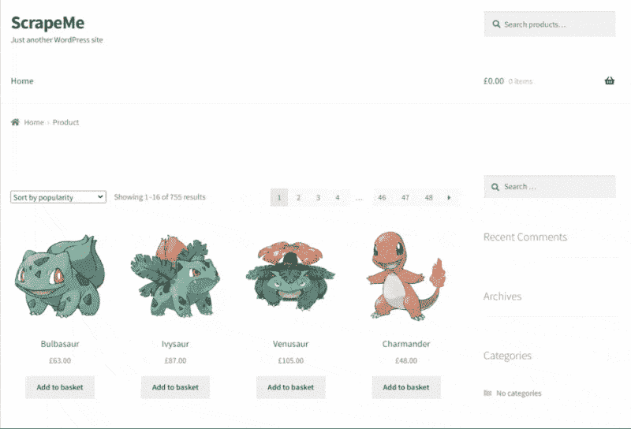
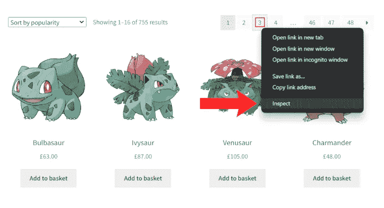
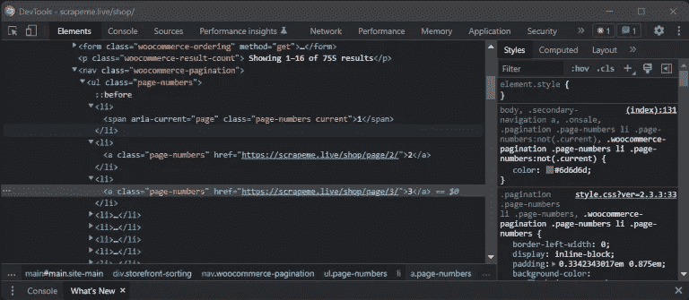
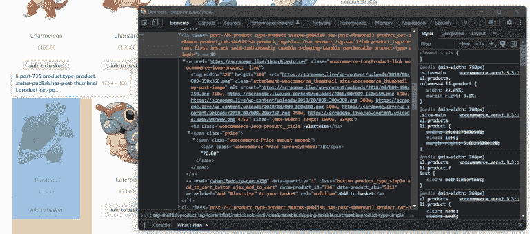
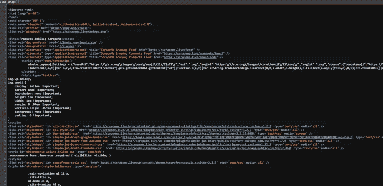
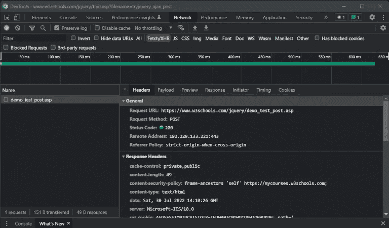

# PHP 网页抓取:一步一步的教程

> 原文：<https://betterprogramming.pub/a-step-by-step-tutorial-to-web-scraping-in-php-fc57a926d468>

## 通过一个完整的例子从基本技术到高级技术


罗斯·斯奈登在 [Unsplash](https://unsplash.com?utm_source=medium&utm_medium=referral) 上的照片

网络抓取变得越来越流行，现在是 IT 社区的一个热门话题。因此，有几个库可以帮助你从网站上抓取数据。在这里，您将学习如何使用最流行的 web scraper 库之一用 PHP 构建 web scraper。

在本教程中，你将学习 PHP 的网页抓取基础知识。然后是如何绕开最流行的反抓取系统，学习更高级的技术和概念，比如并行抓取和无头浏览器。

遵循这个教程，成为 PHP 网页抓取专家！让我们不要浪费更多的时间，用 PHP 构建我们的第一个 scraper。

# 先决条件

这是简单铲运机工作所需的先决条件列表:

如果您的系统上没有安装这些软件，您可以通过上面的链接下载它们。

然后，您还需要以下 Composer 库，您可以使用以下命令将它添加到项目的依赖项中:

```
composer require vokku/simple_html_dom
```

此外，您还需要内置的`cURL` PHP 库。`cURL`带有`curl-ext` PHP 扩展，它在大多数 PHP 包中自动存在并启用。如果你安装的 PHP 包不包含`curl-ext`，你可以按照这里的[来安装](https://www.php.net/manual/en/curl.setup.php)。

现在让我们了解一下这里提到的依赖关系。

# 介绍

`vokku/simple_html_dom`是[简单 HTML DOM 解析器](https://simplehtmldom.sourceforge.io/docs/1.9/index.html)项目的一个分支，它用 [DOMDocument](https://www.php.net/manual/en/class.domdocument.php) 和其他现代 PHP 类代替了字符串操作。拥有近 200 万次安装的，`vokku/simple_html_dom`是一个快速、可靠和简单的库，用于解析 HTML 文档和在 PHP 中执行 web 抓取。

`curl-ext`是一个 PHP 扩展，启用 PHP 中的`[cURL](https://www.php.net/manual/en/book.curl)` [HTTP 客户端](https://www.php.net/manual/en/book.curl)，允许你用 PHP 执行 HTTP 请求。

你可以在[这个 GitHub repo](https://github.com/Tonel/simple-scraper-php) 中找到演示 web scraper 的代码。使用以下命令克隆它并安装项目的依赖项:

```
git clone [https://github.com/Tonel/simple-scraper-php](https://github.com/Tonel/simple-scraper-php)cd simple-scraper-phpcomposer update
```

跟随这个教程，学习如何用 PHP 构建一个 web scraper 应用程序！

# PHP 中的基本网页抓取

在这里，您将看到如何在作为抓取目标的网站`[https://scrapeme.live/shop/](https://scrapeme.live/shop/)`上执行网页抓取。

具体来说，这是商店的样子:



`scrapeme.live/shop`概观

如你所见，`scrapeme.live`只不过是一个简单的受口袋妖怪启发的产品的分页列表。让我们用 PHP 构建一个简单的 web scraper，抓取网站并从所有这些产品中抓取数据。

首先，你必须下载你要抓取的页面的 HTML。您可以使用`cURL`轻松下载 PHP 中的 HTML 文档，如下所示:

现在，您已经将`https://scrapeme.live/shop/`页面的 HTML 存储在了`$html`变量中。用下面的`str_get_html()`函数将它加载到一个`HtmlDomParser`实例中:

您现在可以使用`HtmlDomParser`来浏览 HTML 页面的 DOM 并开始数据提取。

现在让我们检索所有分页链接的列表，以抓取整个网站部分。右键单击页码 HTML 元素并选择“检查”选项。



选择“Inspect”选项打开 DevTools 窗口

此时，浏览器应该打开一个 DevTools 窗口或部分，突出显示 DOM 元素，如下所示:



选择页码 HTML 元素后的 DevTools 窗口

在 WebTools 窗口中，您可以看到`page-numbers` CSS 类标识了分页 HTML 元素。请注意，CSS 类并不唯一地标识 HTML 元素，许多节点可能有相同的类。这正是在`scrapeme.live`页面中`page-numbers`所发生的事情。

因此，如果您想使用一个 [CSS 选择器](https://developer.mozilla.org/en-US/docs/Web/CSS/CSS_Selectors)来挑选 DOM 中的元素，您应该使用 CSS 类和其他选择器。特别是，您可以使用带有`.page-numbers a` CSS 选择器的`HtmlDomParser`来选择页面上所有的分页 HTML 元素。然后，遍历它们，从`href`属性中提取所有需要的 URL，如下所示:

请注意，该函数允许您基于 CSS 选择器提取 DOM 元素。此外，考虑到 pagination 元素在 web 页面上放置了两次，您需要定义自定义逻辑来避免在`$paginationLinks`数组中出现重复的元素。

如果执行，该脚本将返回:

```
Array (   
   [0] => https://scrapeme.live/shop/page/2/
   [1] => https://scrapeme.live/shop/page/3/
   [2] => https://scrapeme.live/shop/page/4/
   [3] => https://scrapeme.live/shop/page/46/
   [4] => https://scrapeme.live/shop/page/47/
   [5] => https://scrapeme.live/shop/page/48/  
)
```

如图所示，所有的 URL 都遵循相同的结构，并以指定页码的最终数字为特征。如果想遍历所有页面，只需要最后一个页面的编号。按如下方式检索:

`$highestPaginationNumber`将包含“四十八”。

现在，让我们检索与单个产品相关的数据。同样，右键单击产品并打开带有“Inspect”选项的 DevTools 窗口。这是你应该得到的:



选择产品 HTML 元素后的 DevTools 窗口

如您所见，产品由一个包含 URL、图像、名称和价格的`li.product` HTML 元素组成。这个产品信息分别放在一个`a`、`img`、`h2`、`span` HTML 元素中。您可以使用`HtmlDomParser`提取这些数据，如下所示:

该逻辑提取一页上的所有产品数据，并将其保存在`$productDataList`数组中。

现在，您只需迭代每个页面，并应用上面定义的抓取逻辑:

瞧啊！您刚刚学习了如何用 PHP 构建一个简单的 web scraper！

如果你想看这个脚本的全部代码，你可以在这里找到它。运行它，您将检索到以下数据:

恭喜你！您刚刚自动提取了所有产品数据！

# 避免被封锁

上面的例子使用了一个为抓取而设计的网站。提取所有数据是小菜一碟，但不要被这个愚弄！抓取网站并不总是那么容易，你的脚本可能会被拦截和阻止。找出如何防止这种情况发生！

有几种可能的防御机制来阻止脚本访问网站。这些技术试图根据非人类或恶意用户的行为来识别他们的请求，并阻止他们。

绕过所有这些防刮擦系统并不容易。然而，您通常可以通过两个简单的解决方案来避免其中的大部分:公共 HTTP 头和 web 代理。现在让我们仔细看看这两种方法。

## 1.使用普通 HTTP 头模拟真实用户

许多网站会屏蔽看起来不是来自真实用户的请求。另一方面，浏览器设置了一些 HTTP 头。确切的标题因供应商而异。因此，这些防刮擦系统希望这些头文件存在。因此，您可以通过设置适当的 HTTP 头来避免阻塞。

具体来说，您应该始终设置的最关键的头是[用户代理](https://developer.mozilla.org/en-US/docs/Web/HTTP/Headers/User-Agent)头(此后称为 UA)。它是一个字符串，用于标识发起 HTTP 请求的应用程序、操作系统、供应商和/或应用程序版本。

默认情况下，`cURL`发送`curl/XX.YY.ZZ` UA 头，这使得请求很容易被识别为脚本。您可以使用`cURL`手动设置 UA 报头，如下所示:

示例:

```
curl_setopt($curl, CURLOPT_USERAGENT, "Mozilla/5.0 (Windows NT 10.0; Win64; x64) AppleWebKit/537.36 (KHTML, like Gecko) Chrome/103.0.0.0 Safari/537.36")
```

这行代码设置了谷歌 Chrome 最新版本目前使用的 UA。这使得`cURL`请求更难被识别为来自脚本。

您可以轻松地在线找到有效、最新和可信的 UA 头列表。大多数情况下，设置 HTTP UA 头就足以避免被阻塞。如果这还不够，您可以用`cURL`发送其他 HTTP 头，如下所示:

示例:

```
// set the Content-Language and Authorization HTTP headers 
curl_setopt($curl, CURLOPT_HTTPHEADER, 
 array( 
   "Content-Language: es", 
   "Authorization: 32b108le1HBuSYHMuAcCrIjW72UTO3p5X78iIzq1CLuiHKgJ8fB2VdfmcS", 
 ) 
);
```

了解 ZenRows 在[设置自定义标题](https://www.zenrows.com/documentation#custom-params-php?utm_source=medium&utm_medium=blog&utm_campaign=web_scraping_php)方面提供了什么。

## 2.使用网络代理隐藏你的 IP

防刮擦系统往往会阻止用户在短时间内访问许多页面。主要检查来自请求的 IP。如果同一个 IP 在短时间内发出许多请求，就会被阻止。换句话说，要阻止 IP 上的块，您必须找到隐藏它的方法。

最好的方法之一是通过代理服务器。web 代理是您的机器和互联网上其他计算机之间的中间服务器。当通过代理执行请求时，目标网站将看到代理服务器的 IP 地址，而不是您的 IP 地址。

网上有几个免费的代理服务器，但是大多数都是短命的，不可靠的，并且经常不可用。你可以用它们来测试。然而，你不应该依赖他们来制作剧本。

另一方面，付费代理服务更可靠，通常伴随着 IP 轮换。这意味着代理服务器公开的 IP 将随着时间的推移或每个请求而频繁改变。这使得该服务提供的每个 IP 更难被禁止，即使发生这种情况，你也会很快获得一个新的 IP。

ZenRows 支持高级代理。了解如何使用它们来避免阻塞。

您可以使用`cURL`设置 web 代理，如下所示:

示例:

```
curl_setopt($curl, CURLOPT_PROXY, "102.68.128.214");  curl_setopt($curl, CURLOPT_PROXYPORT, "8080");  
curl_setopt($curl, CURLOPT_PROXY, CURLPROXY_HTTP);
```

对于大多数 web 代理，在第一行设置代理的 URL 就足够了。`CURLOPT_PROXYTYPE`可以取以下值:`CURLPROXY_HTTP`(默认)、`CURLPROXY_SOCKS4`、`CURLPROXY_SOCKS5`、`CURLPROXY_SOCKS4A`或`CURLPROXY_SOCKS5_HOSTNAME`。

你刚刚学会如何避免被封锁。现在让我们深入研究如何让你的脚本更快！

# 平行刮削

在 PHP 中处理多线程是复杂的。有几个库可以支持你，但是在 PHP 中执行并行抓取的最简单有效的解决方案不需要任何库。

这种并行抓取的方法是为了让抓取脚本可以在多个实例上运行。使用 HTTP GET 参数是可能的。

考虑前面给出的分页示例。您可以修改脚本来处理较小的块，然后并行启动脚本的几个实例，而不是让脚本遍历所有页面。

您所要做的就是向脚本传递一些参数来定义块的边界。

您可以通过引入如下两个 GET 参数轻松实现这一点:

现在，您可以通过在浏览器中打开以下链接来启动脚本的几个实例:

```
https://your-domain.com/scripts/scrapeme.live/scrape-products.php?from=1&to=5https://your-domain.com/scripts/scrapeme.live/scrape-products.php?from=6&to=10...https://your-domain.com/scripts/scrapeme.live/scrape-products.php?from=41&to=45https://your-domain.com/scripts/scrapeme.live/scrape-products.php?from=46&to=48
```

这些实例将并行运行，同时抓取网站。你可以在这里找到这个新版抓取脚本[的全部代码。](https://github.com/Tonel/simple-scraper-php/blob/main/src/parallel.php)

现在你知道了！您刚刚学习了如何通过 web 抓取从网站并行提取数据。

并行抓取网站已经是一个很大的改进，但是在 PHP web scraper 中还可以采用许多其他的高级技术。让我们来看看如何让你的网页抓取脚本更上一层楼。

# 先进的技术

请记住，并非网页上所有感兴趣的数据都直接显示在浏览器中。网页也由元数据和隐藏元素组成。要访问这些数据，右键单击网页的空白部分，然后单击“查看页面源代码”



`scrapeme.live/shop`的源代码

在这里你可以看到一个网页的完整 DOM，包括隐藏的元素。详细地说，你可以在`[meta](https://developer.mozilla.org/en-US/docs/Web/HTML/Element/meta)` [HTML 标签](https://developer.mozilla.org/en-US/docs/Web/HTML/Element/meta)中找到关于网页的元数据。此外，重要的隐藏数据可能存储在`[<input type="hidden"/>](https://www.zenrows.com/blog/mastering-web-scraping-in-python-from-zero-to-hero#explore-before-coding)` [元素](https://www.zenrows.com/blog/mastering-web-scraping-in-python-from-zero-to-hero#explore-before-coding)中。

类似地，一些数据可能已经通过[隐藏的 HTML 元素](https://developer.mozilla.org/en-US/docs/Web/CSS/visibility)出现在页面上。只有在特定事件发生时，JavaScript 才会显示出来。尽管您看不到页面上的数据，但它仍然是 DOM 的一部分。因此，您可以使用`HtmlDomParser`检索这些隐藏的 HTML 元素，就像处理可见节点一样。

此外，记住网页不仅仅是它的源代码。网页可以请求浏览器通过 AJAX 异步检索数据，并相应地更新它们的 DOM。这些 AJAX 调用通常提供有价值的数据，您可能需要从 web 抓取脚本中调用它们。

要监听这些调用，您需要使用浏览器的 DevTools 窗口。右键单击网站的空白部分，选择“检查”，然后进入“网络”选项卡。在“获取/XHR”选项卡中，您可以看到由网页执行的 AJAX 调用列表，如下例所示。



由[演示页面](https://www.w3schools.com/jquery/tryit.asp?filename=tryjquery_ajax_post)执行的 POST AJAX 调用

浏览所选 AJAX 请求的所有内部选项卡，了解如何执行 AJAX 调用。具体来说，可以复制这个 POST AJAX 调用`cURL`,如下所示:

恭喜你！您刚刚与`cURL`进行了一次 POST 通话！

# 无头浏览器

嗅探和复制 AJAX 调用有助于以编程方式从由于用户交互而加载的网站中检索数据。这些数据不是网页源代码的一部分，也不能在从标准 GET `cURL`请求获得的 HTML 元素中找到。

然而，复制所有可能的交互、嗅探 AJAX 调用并在脚本中调用它们是一种麻烦的方法。有时，您需要定义一个脚本，像人类用户一样通过 JavaScript 与页面进行交互。你可以用[无头浏览器](https://en.wikipedia.org/wiki/Headless_browser)来实现。

如果你不熟悉这个概念，无头浏览器是一种没有图形用户界面的网络浏览器，它通过代码提供对网页的自动控制。PHP 中最流行的提供无头浏览器功能的库是`[chrome-php](https://github.com/php-webdriver/php-webdriver)`和 [Selenium WebDriver](https://github.com/php-webdriver/php-webdriver) 。

此外，ZenRows 还提供网络浏览器功能。了解更多关于[如何提取动态加载的数据](https://www.zenrows.com/documentation#custom-params-php?utm_source=medium&utm_medium=blog&utm_campaign=web_scraping_php)。

# 其他图书馆

当涉及到 web 抓取时，您可以采用的其他有用的 PHP 库有:

*   [Guzzle](https://docs.guzzlephp.org/en/stable/) :一个高级的 HTTP 客户端，它使得发送 HTTP 请求变得容易，并且易于与 web 服务集成。你可以用它来代替`cURL`。
*   Goutte :一个网络抓取库，提供高级 API 来抓取网站并从它们的 HTML 网页中提取数据。因为它还包含一个 HTTP 客户端，所以您可以用它来替代`vokku/simple_html_dom`和`cURL`。

# 结论

在这里，您已经了解了在 PHP 中执行 web 抓取应该知道的一切，从基本的抓取到高级技术。如上所示，用 PHP 构建一个可以抓取网站并自动提取数据的 web scraper 并不困难。

你所需要的只是正确的库，这里我们已经看到了一些最流行的库。

如果你喜欢这个，看一看 [JavaScript 网页抓取指南](https://www.zenrows.com/blog/web-scraping-with-javascript-and-nodejs?utm_source=medium&utm_medium=blog&utm_campaign=web_scraping_php)。

此外，你的网页抓取器应该能够绕过防抓取系统，并可能需要检索隐藏数据或像人类用户一样与网页进行交互。在本教程中，您也学习了如何完成所有这些工作。

*最初发表于*[T5【https://zenrows.com】](https://www.zenrows.com/?utm_source=medium&utm_medium=blog&utm_campaign=web_scraping_php)*。*