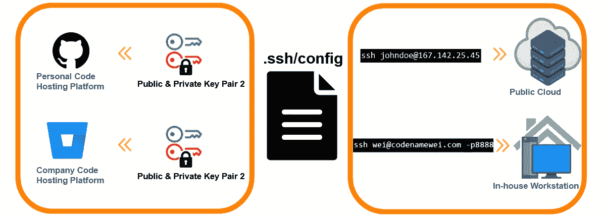
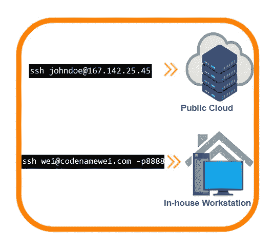
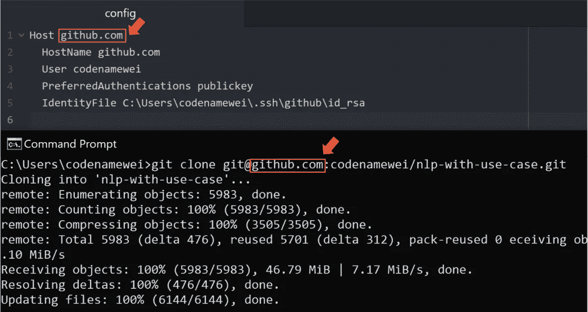
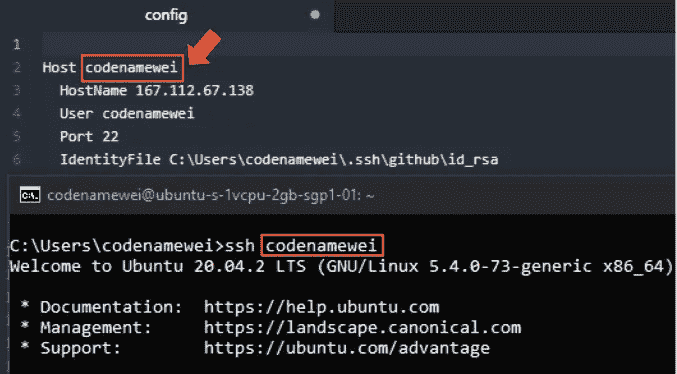
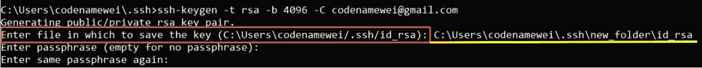
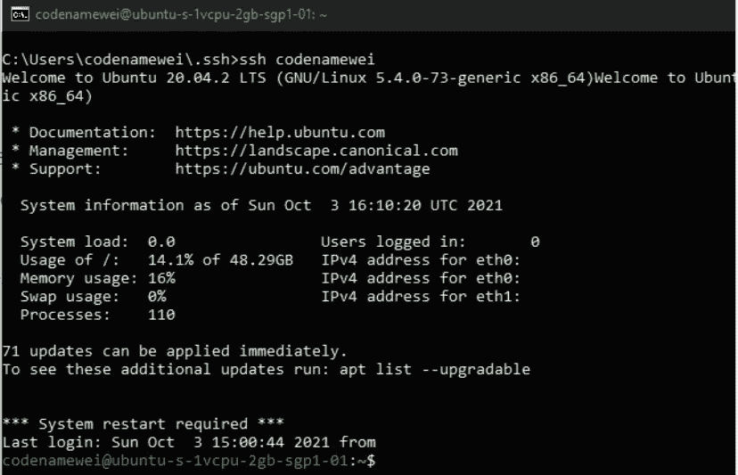

# 创建第一个 SSH 配置文件的逐步演练

> 原文：<https://betterprogramming.pub/a-step-by-step-walkthrough-to-create-your-first-ssh-config-file-f01267b4eacb>

## 用于远程连接和公共<>私有密钥对管理的 SSH 配置文件



作者照片

这篇文章深入探讨了开发人员在使用 SSH 时面临的两种常见场景，以及如何配置 SSH 客户端配置文件(`.ssh/config`)来克服障碍。

# 场景 1:多个公钥和私钥对


作者照片

在工作区中，开发人员可能有不止一对公钥和私钥。例如，我为 Github 和 Bitbucket 准备了不同的密钥对，一个供个人使用，另一个供组织使用。

`.ssh/id_rsa`和`.ssh/id_rsa.pub` 的原生路径只保存一对密钥。创建一个`.ssh/config` 文件允许用户系统地配置多个密钥对的路径，当运行命令时，正确的密钥对将被识别。

# 场景 2:到远程系统的一个或多个连接



作者照片

开发人员的日常工作包括连接到远程系统以执行繁重的计算，在不同的操作系统上运行测试，以及许多其他任务。

带有用户名和 IP 地址的 Ssh 是登录到远程系统的最常见方法，在远程系统中，其余的操作完全通过终端命令运行，没有 GUI。

```
ssh <user-name>@<ip-address>
```

为了记住登录的细节，开发人员必须在某个地方写下信息，比如便笺。这并不完全是最有效的做法，我已经记不清我忘记这些事情记在哪里的时间了。

相反，所有这些 IP 地址、用户名和其他配置都可以保存在 SSH 客户机配置文件中。随后，可以使用替代详细登录信息的别名执行每次登录。

让我们深入研究在哪里以及如何为上面的两个场景设置 SSH 客户端配置文件的细节。

## 内容

*   SSH 客户端配置文件的路径
*   场景 1 和场景 2 的配置文件设置

# SSH 客户端配置文件的路径

文件名为`config` 的 SSH 客户端配置文件位于主目录下的`.ssh`文件夹中。系统的每个用户都拥有一个单独的配置文件。

```
/
│   
├── root/.ssh
|   ├── ...
│   └── config
│
├── home/<user_name_1>/.ssh
|   ├── ...
│   └── config
│
├── home/<user_name_2>/.ssh
│   ├── ...
│   └── config
│
└── ...
```

如果该文件首先不存在，请使用以下命令创建它:

## **Windows(带命令提示符)**

```
cd %HOMEPATH%/.ssh
type nul > config
```

## **Linux(带终端)**

```
cd ~/.ssh
touch config 
```

或者，要设置适用于所有用户的配置，在路径`/etc/.ssh/`中创建配置文件`ssh_config` 。

# 场景 1 和场景 2 的配置文件设置

## **样本格式为*。ssh/config* 文件**

```
Host <host_identifier>
  <ssh_config_key> <ssh_config_value>
  <ssh_config_key> <ssh_config_value>
  <ssh_config_key> <ssh_config_value>
```

每个键和值由一个空格分隔。或者，一个等号也可以。

```
Host=<host_identifier>
  <ssh_config_key>=<ssh_config_value>
  <ssh_config_key>=<ssh_config_value>
  <ssh_config_key>=<ssh_config_value>
```

`<host_identifier>`后的缩进以及分隔每个配置块的空白行是可选的，但为了可读性，建议这样做。

`<host_identifier>`是识别在 ssh 命令中使用哪个配置块的关键。它是在命令提示符/终端中键入时指向的元素。例子显示在下面的截图中。

## **场景 1:多个公钥&私钥对**



作者照片

## **场景 2:到远程系统的一个或多个连接**



作者照片

其余的配置以下列方式列在一个块中:

```
<ssh_config_key> <ssh_config value>
```

是建立连接时要添加的可选配置。

## **场景 1:多个公钥和私钥对**

存储的多个密钥对。ssh，只需创建新的密钥对:

```
ssh-keygen -t rsa -b 4096 -C <email>
```

将密钥对显式保存到。ssh 文件夹。



作者照片

然后将如下所示的代码片段附加到`.ssh/config` 文件中，并进行相应的修改:

```
Host github.com
  HostName github.com
  User codenamewei
  PreferredAuthentications publickey
  IdentityFile C:\Users\codenamewei\.ssh\new_folder\id_rsa
```

每个关键字的详细说明可以在[这里](https://www.ssh.com/academy/ssh/config)找到。

注意:关键字`Host`和`HostName`可能会混淆。`Host`代表终端使用的别名，而`HostName`指定登录的真实主机名。在这种情况下，保持两者相同就很简单了。

## **场景 2:一个或多个到远程系统的连接**

要存储连接到远程系统的配置，请将以下代码片段附加到`config` 文件中，并做出相应的更改。

```
Host codenamewei
  HostName 40.81.206.144
  User codenamewei
  Port 22
```

在本例中，`codenamewei` 是别名:

```
ssh codenamewei
```

也就是说:

```
ssh codenamewei@40.81.206.144 -p22
```

注意:当使用默认端口号 22 时，键`Port`是可选的。否则，需要显式设置端口号。

正确完成配置后，现在可以通过以下方式连接到远程系统:

```
ssh <host_identifier>
```



作者照片

在所示的例子中，`.ssh/config` 的末端表示如下:

```
Host github.com
  HostName github.com
  User codenamewei
  PreferredAuthentications publickey
  IdentityFile C:\Users\codenamewei\.ssh\new_folder\id_rsaHost codenamewei
  HostName 40.81.206.144
  User codenamewei
  Port 22
```

当需要建立更多连接时，追加文件。

## 关于 SSH 配置文件的配置选项的更多信息:

*   [https://www.ssh.com/academy/ssh/config](https://www.ssh.com/academy/ssh/config)

感谢阅读。下次见！