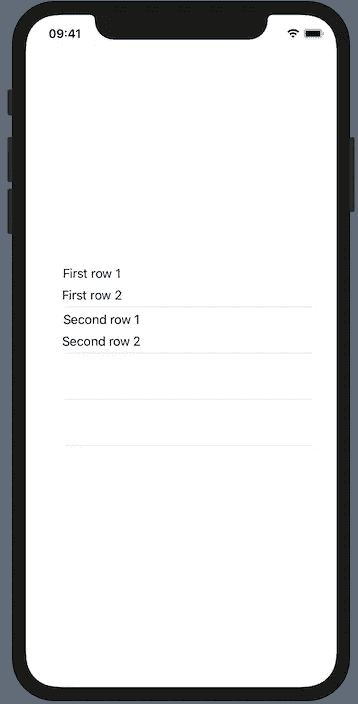
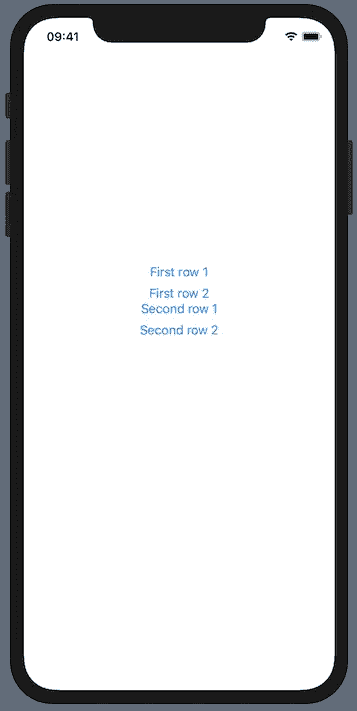
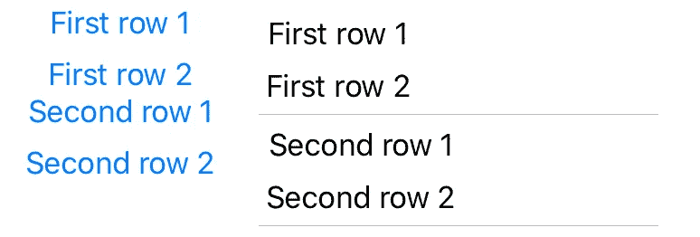

# SwiftUI 列表:ForEach

> 原文：<https://betterprogramming.pub/a-swiftui-list-foreach-or-whats-wrong-with-these-buttons-52c50ba60922>

## 组合 ScrollView 和 ForEach 以改变您的布局

照片来自 [pixabay](https://pixabay.com/photos/office-keyboard-job-work-381228/)

多少次我们问我们的设计师，“桌子上有什么？”好吧，时代变了——这是 SwiftUI。坚持住。没什么不同。有了 SwiftUI，我们只需问，“列表上有什么？”

什么都没变，是吗？猛冲向前，像是没人能阻止清单被执行，进度很快就掉进坑里。

这是个陷阱！那鸿更像是，有人忘记了什么。

大门在前方打开，一场冒险开始了。我们渴望知道 SwiftUI 的[列表](https://developer.apple.com/documentation/swiftui/list)给开发者带来了什么问题。

# 把它推到边缘

至少我们按了一个按钮。结果可能会引起一些不安。

从链接的文档中可以看出，SwiftUI 列表可以这样创建:

带伪代码的 SwiftUI 列表

由于项目(例如，表示为一个结构)必须符合[可识别](https://developer.apple.com/documentation/swift/identifiable)协议——并且下面的演示需要这些项目——这样的结构应该被给出为:

引发正在讨论的问题的途径很短。查看包含两个按钮的列表:

SwiftUI 列表示例

Xcode 中的预览显示了我们闪亮的列表:

居中列表

有人可能会问，这有什么大惊小怪的。运行并按下第一行上部的按钮，调试输出是一个令人惊讶的两行代码:

如果一个 SwiftUI [按钮](https://developer.apple.com/documentation/swiftui/button)放在一个列表中，它似乎覆盖了整个行区域。尽量用绝对宽度和高度框住；尽管如此，你还是会有同样的行为。

这完全取决于具体的要求，但 ForEach 可能是一个真正的朋友，会来帮助我们——并可能防止大量的脏话。

# 七封甜蜜的信——给每个人

在寻找替代方案的过程中， [ForEach](https://developer.apple.com/documentation/swiftui/foreach) ⁴结构出现了，并伸出了援助之手。随着一个封闭的[滚动视图](https://developer.apple.com/documentation/swiftui/scrollview) ⁵，发现显示，一个列表可能被手工制作如下:

Xcode 友好地呈现结果:

内部有 ForEach 的居中 ScrollView

并排，结果看起来很不一样。一切都很普通，但是按钮呈现在蓝色的前景色中，并且可以单独点击——正如调试输出所证实的。

仔细观察:左边是 ForEach，右边是 List 的 ScrollView

# 可能性

许多用例可能被一个 ForEach 结构覆盖，被一个 ScrollView 包围:以垂直或水平排列显示一些相似布局的视图就像用 ScrollView 和 ForEach 的组合替换 List 一样简单。在这两种实现中，要排列的数据必须符合可识别的协议。

这些行可以按照我们的设计师的要求来设计。整洁！

# 脚注参考文献

1.  [https://developer.apple.com/documentation/swiftui/list](https://developer.apple.com/documentation/swiftui/list)
2.  [https://developer . apple . com/documentation/swift/identified](https://developer.apple.com/documentation/swift/identifiable)
3.  【https://developer.apple.com/documentation/swiftui/button 
4.  [https://developer.apple.com/documentation/swiftui/foreach](https://developer.apple.com/documentation/swiftui/foreach)
5.  [https://developer . apple . com/documentation/swift ui/scroll view](https://developer.apple.com/documentation/swiftui/scrollview)