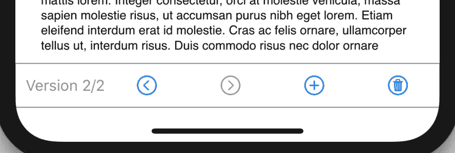

# Toolbar sui:swift ui 工具栏

> 原文：<https://betterprogramming.pub/a-swiftui-toolbar-777523c03b7d>

## 一个开源的类似 UIKit 的工具栏

在 [Unsplash](https://unsplash.com?utm_source=medium&utm_medium=referral) 上由 [Tim Christopher Klonk](https://unsplash.com/@herrklonk?utm_source=medium&utm_medium=referral) 拍摄。

在 SwiftUI 2 之前，没有办法像在 UIKit 中那样创建工具栏，所以我决定实现自己的工具栏。GitHub 上有一个名为 ToolbarSUI 的 Swift 包[。](https://github.com/writing-shed/ToolbarSUI)

这个包的主要组件是一个名为`ToolbarView`的 SwiftUI 视图。代码如下:

如你所见，视图初始化器有三个参数:

1.  显示在工具栏左侧的标签文本。如果您不想要标签，请留空。
2.  一个`ToolbarItems`的数组。
3.  行动结束。

下面是一个正在使用的视图示例:

它看起来是这样的:

作者照片。

工具栏中的每个按钮都由一个`ToolbarItem`定义，如下图所示:

每个条目由三项组成:

1.  SF 符号中的图像名称。
2.  一个标题。这不会显示出来，但它是为了便于使用。应该是对按钮的很好的描述。
3.  一个布尔值，它决定按钮的状态— `true`表示活动，`false`表示不活动。如您所见，每当视图更新时，它的值都会改变。

感谢阅读。我希望你觉得这个包有用。如果您有任何问题，请在 GitHub 上发布问题。