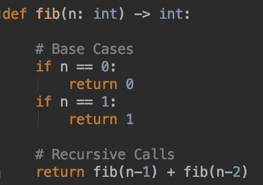
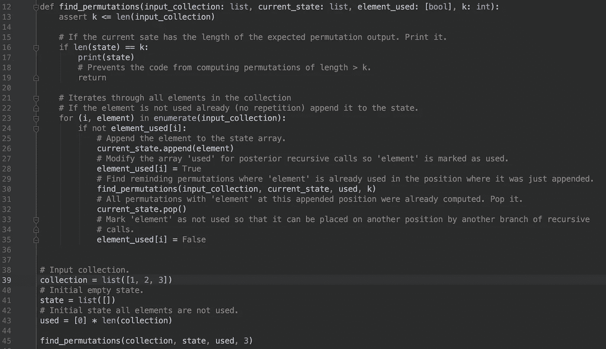
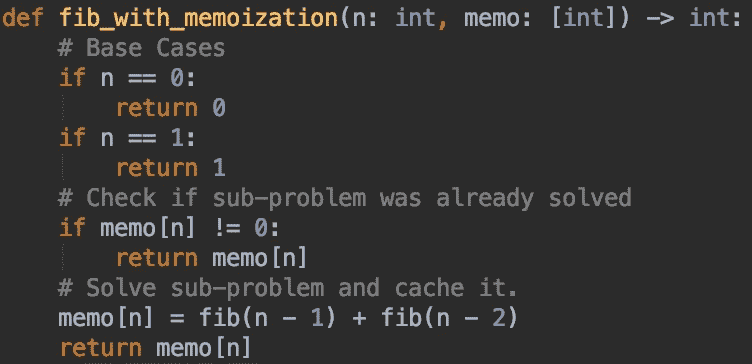
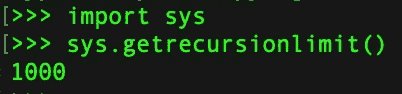
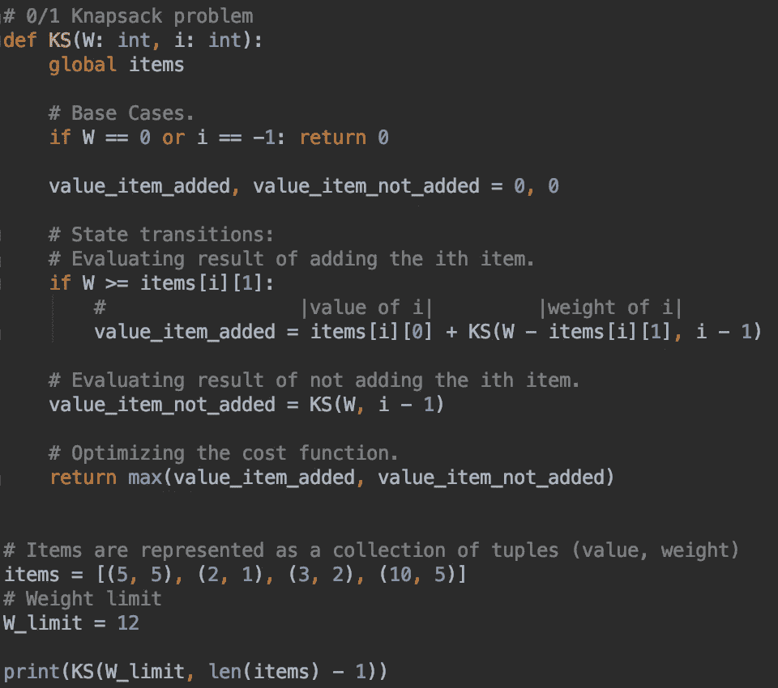
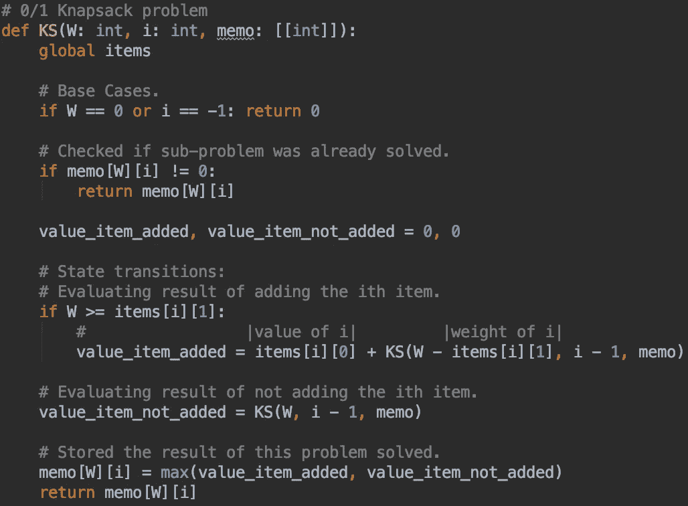
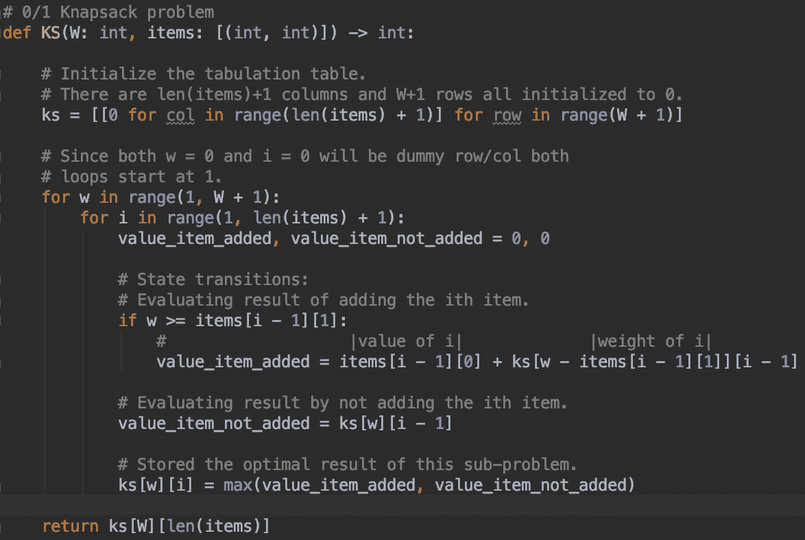

# 动态规划的系统方法

> 原文：<https://betterprogramming.pub/a-systematic-approach-to-dynamic-programming-54902b6b0071>

## 使用记忆和列表的逐步方法

在 [Unsplash](https://unsplash.com/search/photos/fibonacci?utm_source=unsplash&utm_medium=referral&utm_content=creditCopyText) 上由 [Ira Mint](https://unsplash.com/@iramint?utm_source=unsplash&utm_medium=referral&utm_content=creditCopyText) 拍摄的照片

起初，动态编程(DP)可能是一个令人生畏的概念。这种解决问题的技术建立在非直觉的结构上，例如递归、回溯和递归关系。好消息是，动态编程在现实生活中也非常有用，并且在面试官评估你解决问题的能力时非常有吸引力。

可以系统地处理生成动态规划解决方案的过程。在这里，我想分享一个我在使用动态编程解决问题时使用的系统方法。我希望你觉得这是有用的。

我将首先介绍在使用动态编程处理问题时我所遵循的步骤。如果您熟悉这些步骤所描述的术语，您可能想要抓住一个问题并测试这种方法如何为您工作。对于那些不熟悉的人，我会解释每一步是关于什么的，以及为什么要这样安排。

从这里开始，我将把动态编程称为 DP。

## 使用动态规划解决问题的一般步骤

首先问问自己:我能用 DP 解决这个问题吗？

假设问题具有必要的结构(将在后面详细描述),可以应用 DP 技术，那么:

1.  定义状态。
2.  定义重复关系。
3.  列出所有状态转换及其各自的条件。
4.  定义基本案例。
5.  实现一个简单的递归解决方案。
6.  优化缓存的递归解决方案(记忆化)。
7.  用自底向上的方法(制表)去除递归的开销。

在我们开始进入步骤之前，有几个细节。首先，这篇文章概述了动态编程涉及的一些主题。在正式的 DP 课程中，你会得到更加严谨的解释。第二，记忆具体问题的 DP 解决方案在这里没有帮助；学习提出解决方案的方法。最后，我不是 DP 专家。这些技巧是我作为一名计算机科学学生在学习使用 DP 解决问题时发现的有用的东西。

# 我能用 DP 解决这个问题吗？

首先，让我们描述一下什么是 DP。简而言之，动态规划是一种解决问题的技术，旨在通过首先精确地解决一次那些问题的较小实例来解决复杂的问题。

动态规划广泛用于解决与优化相关的问题。判断您的问题是否适合应用 DP 技术的一个好方法是找到暗示优化的关键字，例如*最大化*、*最小化*、*最长*或*最短*。

好的 DP 目标问题被称为具有最优结构和重叠子问题。在学术环境中，你可能会得到对这些术语更详尽的描述，但简而言之:

*   为了评估一个最优的结构*，*问问你自己，你是否能把解描述成一个递归关系。如果是这样，你可以在子问题的解的函数中找到问题的最优解。著名的斐波那契数列就是一个例子。一个斐波那契数是前面两个斐波那契数的和，转化成这个递归关系:Fib(n) = Fib(n-1) + Fib(n-2)。
*   为了评估重叠的子问题，问问你自己，在解决问题时，你是否发现你的程序多次解决相同的子问题。如果是这样，那么你有重叠的子问题。

要点是这样的:如果你在问题描述中找到暗示优化的提示，评估问题是否有最优结构，找到重叠的子问题。那么 DP 可能是解决问题的同时可以考虑的一个路径。

# 递归和回溯很重要

递归是创建动态规划解决方案的基本技术。在递归中，有一个函数会一直调用自己，直到达到某个基本情况。这些函数被称为是递归的。

递归函数的示例

回溯是一种使用递归来解决穷举搜索问题的技术。在这些问题中，我们必须评估多种可能性，才能得出最佳解决方案。因为这些问题通常涉及选择的排列或组合，它们也被称为组合搜索问题。

在回溯中，我们探索，直到我们找到一个有效的解决方案或我们到达一个基本情况，在这一点上，我们返回递归树的上一级，也就是我们回溯。

寻找给定整数集合中 k 的所有排列

上面的代码打印了给定集合中 k 大小的所有排列。注意递归调用发生在第 30 行。在此之前，我们通过添加当前元素并将其标记为已用来修改`current_state`列表。

在第 30 行之后，也就是执行返回到当前递归调用的时候，在我们回溯到前一个调用之前，我们确保该元素从当前位置被删除，并被标记为未使用，以便它可以被后面的递归调用放在其他地方。

起初，这似乎令人困惑，但现在不用担心代码。这里展示代码的目的是为了说明回溯通常需要在我们实际回溯到之前的递归调用之前做一些清理工作。

花时间练习递归和回溯。实践是适应函数调用自己的想法的唯一方法。一旦你习惯了，你会发现递归解决方案无处不在。在这一点上，你有新的问题。

# DP 的方法

动态编程的两种主要方法是记忆(自顶向下的方法)和列表(自底向上的方法)。

到目前为止，我们已经看到了递归和回溯在应用将复杂问题分解成更小实例的 DP 前提时的重要性。然而，上面的代码片段都不属于 DP 解决方案，即使它们使用了递归和回溯。

对于作为 DP 解决方案应用的简单递归解决方案，它应该优化缓存计算子问题的结果。在上面 DP 的简短定义中，重点是只解决一次较小的实例——特别强调“只解决一次”

## 记忆化

记忆化=递归+缓存

我们关于值得动态编程的问题的框架说，它通常包含重叠的子问题。还记得上面的斐波那契密码吗？如果我们创建一个递归树来计算第七个斐波那契数，我们会得到:

[来源:斐波那契递归树](https://stackoverflow.com/questions/35959100/explanation-on-fibonacci-recursion)

注意我们解决同一个子问题的次数。例如，fib(3)被计算五次，并且每个 Fib(3)调用递归地调用另外两个 Fib。这是解决同一个 fib(3)子问题的十个函数调用。

现在我们开始讨论 DP！与其多次解决同一个问题，不如只解决一次，然后存储在某个数据结构上，以备以后需要。那是记忆化！

针对缓存优化的 Fib 代码。

这种方法是这里介绍的两种 DP 方法中最简单的一种。一旦你得到了问题的递归解，只要确保你缓存了子问题的解。在递归调用来解决子问题之前，检查它是否已经解决。注意，这里我们做了一个交易:为了存档时间效率，我们愿意放弃内存空间来分配所有计算的子问题的解决方案。

动态编程通常以内存空间换取时间效率。

当缓存已解决的子问题时，如果问题的解决方案仅依赖于一个状态，则可以使用数组。例如，在上面的 fib 代码中，一个子问题的解是‘第 n 个 Fibonacci’数。我们可以使用 n 作为 1D 数组的索引，它的值代表 fib(n)子问题的解。

有时问题的解决可能取决于两种状态。在这种情况下，您可以使用 2D 数组缓存结果，其中列代表一个州，行代表另一个州。例如，在著名的背包问题(我们将在后面探讨)中，我们希望优化总价值，给定一个最大重量约束和一个项目列表。一个背包子问题可能看起来是这样的:KS(W，i) *→ (* Max value)，这里我们解释为:“用一个权重‘W’，考虑到第‘I’项，我能得到的最大值是多少？."因此，如果我们想缓存这个解决方案，我们需要考虑这两种状态，这可以通过使用 2D 数组来实现。

记忆化是伟大的——我们有递归描述的问题的优雅，并且我们只解决一次重叠的子问题。不是所有的事情都那么好。我们还在做一些递归调用。递归在处理器时间和内存空间上都很昂贵。大多数递归函数会随着完成任务所需的递归调用次数而线性消耗调用堆栈内存。

有一些特殊类型的递归函数，称为尾递归，如果优化正确，它们不一定会线性增加调用堆栈。这些可以在恒定的调用堆栈空间上执行。不涉及太多细节，尾递归函数在其执行结束时执行递归调用，这意味着其后它的堆栈帧是无用的。可以重用相同的堆栈内存空间来保存下一次递归调用的状态。出现的问题是处理回邮地址。我们希望确保递归树结束后，您返回到开始一系列递归调用的指令。随意做一些关于这个话题的研究。

递归函数总是承担着潜在的堆栈溢出问题。以下是检查递归深度限制的 Python 命令。如果我尝试使用 Python 和递归来解决一个问题，其解决方案涉及的递归深度超过 1000 次调用，我会得到一个堆栈溢出异常。这个数量可以增加，但是我们要进入特定语言的主题。

Python 中的递归深度限制

为递归编程辩护，我们必须说递归函数通常更容易被正式证明。递归函数为您提供了与原始循环相同的重复行为，但没有块内状态变化，这是常见的错误来源。递归编程中的状态是通过向新的递归调用传递新的参数来更新的，而不是随着循环的进行而修改。

## 表格

制表旨在解决同类问题，但完全消除了递归。移除递归意味着我们不必担心堆栈溢出问题，以及递归函数的常见开销。在 DP 的列表法(也称为表格填充法)中，我们解决所有子问题，并将它们的结果存储在一个矩阵中。这些结果然后被用来解决依赖于先前计算结果的更大的问题。正因为如此，制表方法也被称为自下而上的方法。这就像从递归树的底层开始向上移动。

制表可能比递归加缓存的记忆解决方案更违反直觉。但是，如果我们考虑到随着递归调用的数量线性增加的调用堆栈内存，它在时间复杂度和空间复杂度方面也更有效——同样，假设它不是尾递归优化的。

如果你回到这篇文章中最初介绍的步骤，你会发现制表是 DP 系统方法的最后一步。这是因为首先通过递归和回溯来解决问题，然后在必要时通过记忆技术将其优化为缓存，最后进行一些调整以更新为最终的自底向上的解决方案，这样更容易获得制表解决方案。稍后，您将看到一些技巧来实现这一点。但是首先，让我们看看制表是如何工作的。

我们已经谈了很多关于状态的问题，但是我们仍然没有一个正式的定义，在我们的 DP 上下文中，我们所指的状态是什么。我所理解的状态是影响递归调用结果的参数。状态将一个调用与另一个调用区分开来，并允许我们探索不同的选择并获得最佳结果。在本文的最后，我们将得到一些定义状态的练习。

既然制表提出了自下而上的方法，那就要先解决一个更大的问题可能依赖的所有子问题。如果我们不解决较小的问题，我们就无法继续解决较大的问题。在制表中，我们对问题的每个状态使用一个 for 循环。但是我从哪里开始呢？我在哪里让它结束？为了回答这个问题，让我们来研究下面的递归关系。

假设我们有一个函数可以解决一些优化问题——简称为 optimal 或 OP。而我们假设问题的性质使得 OP(n)依赖于 OP(n-1)，所以 OP(n) = OP(n-1)。

这个递归关系告诉你，如果你不知道 OP(n-1)是什么，你就不能知道 OP(n)是什么。这意味着我们需要从 n 的最小值开始，比如说 0，然后解决每个子问题，一直到 n。这就是诀窍:如果你的递归关系显示你的状态在减少，那么你的循环应该增加，这样你就可以计算更大的问题所依赖的每个子问题。记住*自下而上*。

当我们将学到的所有策略应用到实际问题中时，这一点就会变得很清楚。你猜怎么着？这将从现在开始。

# 背包问题

我们将开始把我们的系统方法应用于著名的 0/1 背包问题的动态规划。我们的任务如下:给我们一个袋子，里面有一些不连续的物品，每个物品都有一个值和一个重量。我们想要抓取物品，这样我们就能最大限度地提高带回家的价值。但有一个条件:我们只能携带有限的重量。所以给定的是 n 个分别取值为[v0，v2，v3，…，v(n-1)]和权重为[w0，w1，w2，…w(n-1)]的项目，以及一个权重限制(W)。我们能带回家的最大价值是多少？

## 我应该用 DP 来解决这个问题吗？

你注意到了吗？这个问题要求我们根据条件最大化某个问题的结果。我已经闻到优化的味道了。但是它有最优结构吗？

是的，我可以通过项目[0，n]及其各自的值[v0，…，v(n-1)]和权重[w0，…，w(n-1)]以及总权重限制 W 获得多少值的问题的解决方案可以分解为我可以通过添加第 n 个项目并评估我用剩余权重和剩余项目获得的最佳结果，或者不添加它，并研究我用相同权重和剩余项目获得的最佳结果而获得的最大值。

等等，什么？我知道，很多单词，但是当我们定义递归关系和状态转移时，数学会解释得更好。

## 步骤 1:定义状态

哪些参数会影响递归调用的结果？在这个问题中，我们有两个因素影响我们的结果:重量限制和我们正在考虑是否添加到我们的包中的项目。递归调用的状态将由其可用权重 W 和在“I”时刻被考虑的项目的索引来定义。

## 步骤 2 和 3:定义递归关系并检查状态转换

我们试图优化的成本函数将是 KS(W，I)，这将给出我们可以用项目[0，i]和剩余重量 W 得到的最大重量。

我们有两个选择:我们可以得到这个项目或没有。如果我们得到了该项，我们将影响下一个递归调用的状态，因为它将具有更少的可用权重和一个要考虑添加的项。我们只考虑添加一个项目，如果它适合。我们用数学方法将所有信息压缩如下:

KS(W，i) = MAX( val[i] + KS(W- w[i]，i-1)，KS(W，i-1)) **i** f W ≥ w[i]

KS(W，i) = KS(W，i-1) else

## 步骤 4:定义基本案例

我们什么时候应该停止考虑选项？一个停止条件将是如果我们没有更多的空间(W == 0)，另一个将是如果我们没有更多的项目要考虑(i == -1)。两种基本情况都没有给我们增加价值，因此:

如果 W == 0 或 i== -1，则返回 0**T3**

## 步骤 5:实现一个简单的递归解决方案

我们具备了提出递归解决方案的所有条件。我们有一个递归关系，我们已经定义了状态转换，我们有基本情况。

背包问题的递归解法。**结果= 18**

## 步骤 6:优化缓存的递归解决方案(记忆化)

根据我的经验，如果不通过递归解决问题的例子，有时很难看出问题是否有重叠的子问题。这可以通过运行您的代码或简单地在纸上画出递归调用的序列来完成。让我们更新代码来缓存计算出的子问题。

记忆化=递归+缓存。

## 步骤 7:用自底向上的方法(制表)去除递归的开销

正如我们之前讨论的，一旦我们到了这个阶段，就很容易优化成列表解决方案。我们的代码只会有一些改动。

而不是:

KS(W，i) = MAX( val[i] + KS(W- w[i]，i-1)，KS(W，i-1))如果 W ≥ w[i]

KS(W，i) = KS(W，i-1) else

我们有:

KS[W][I]= MAX(val[I]+KS[W-W[I]][I-1]，KS[W][i-1])如果 W ≥ w[i]

KS[W][ i] = KS[W][ i-1] else

我们已经修改了矩阵符号的递归关系，因为我们现在要填充一个矩阵。

请记住制表中的两个要点:

*   每个状态一个 for 循环。
*   如果你的状态值减少，那么你的循环值增加，反之亦然。

在这种情况下，我们有两个状态，并且它们的值都如递归关系中所描述的那样减小。更新后的代码如下所示:

0/1 背包列表解法。

请注意发生变化的地方:

*   我们的函数不再是递归的。我们不需要传递修改过的状态。KS 现在接收重量限制和项目集合，并返回最佳结果。在这种情况下，我们可以说 KS 现在是纯功能性的。
*   在我们的制表方法中，基本情况被硬编码到表格中。有时这需要我们考虑添加虚拟行/列。如果你看到 I 的基本情况，它是 i==-1。然而，在矩阵上，我们不能有负指数。为了解决这个问题，我们做了一个索引转移。过去是(i==-1)现在是(i==0 ),所以我们将存储基本情况的值。
*   让我们花点时间来进一步分析索引转移，因为这是一种非常常见的做法。我们的递归关系表明:

KS[W][I]= MAX(val[I]+KS[W-W[I]][I-1]，KS[W][i-1])如果 W ≥ w[i]

KS[W][ i] = KS[W][ i-1] else

请注意[i-1]。如果我们从 i = 0 开始循环，那将导致一个越界异常。但是我们说过 i = 0 和 W = 0 是我们的基本情况。没有理由计算它们，所以让我们从 1 开始。但是，我们需要修改我们引用 val[i]和 w[i]的方式，因为现在(i = 1)应该映射到第一个元素(位置 0 的元素)。每当我们想要索引输入集合中的一个元素时，我们简单地通过使用(i-1)来平衡索引移动的影响。

*   请注意，唯一的主要变化是删除了用于递归的 return 语句，并将所有的递归符号改为矩阵形式。我们将相同的状态转换逻辑包装在我们容易知道如何生成的循环中。
*   在我们的函数中只剩下一个返回语句，它给出了原始问题的最终结果。就是这样！

# 需要记住的最重要的事情

我知道这里有很多信息。让我们试着强调一些最重要的细节:

*   动态规划是一种解决问题的技术，旨在通过先精确地解决一次这些问题的较小实例来解决复杂的问题。
*   好的 DP 目标问题是那些具有最优结构和重叠子问题的问题。
*   动态规划的两种主要方法是记忆(自顶向下的方法)和列表(自底向上的方法)。
*   记忆化=递归+缓存
*   递归在处理器时间和内存空间上都很昂贵。
*   在 DP 的制表方法中，我们解决所有子问题并将它们的结果存储在矩阵中。然后我们继续解决依赖于这些计算出的子问题的更大的问题。
*   练习，练习，练习。

感谢阅读。