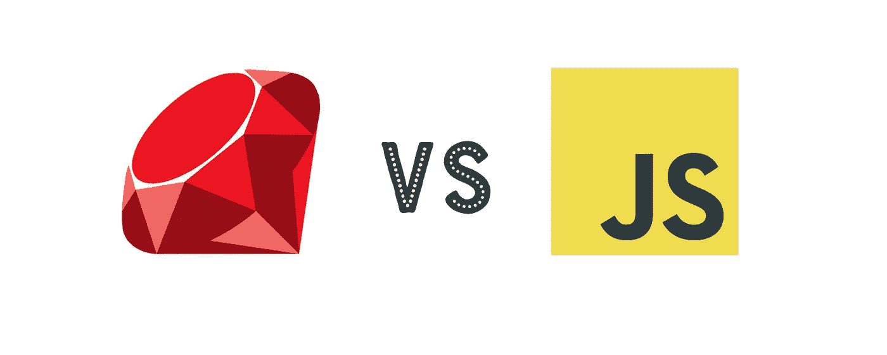

# 两种语言的故事

> 原文：<https://betterprogramming.pub/a-tale-of-two-languages-a-story-about-class-b6b7551c795d>

## 一个关于阶级的故事



刚刚学习了 JavaScript 中的类，我认为深入了解 JavaScript 中的类以及我最近使用的另一种语言 Ruby 中的类的内部工作方式可能是个好主意。

# 编程中的类:基础

从简单实用的角度来看，每种语言中的类都只是制造对象的蓝图。就像宜家家具手册描述家具并教顾客如何制作一样，课程告诉语言如何制作物品。

什么是对象？只是一堆属性和动作。现实世界中的一把特定的椅子可以被认为是类`Chair`的一个对象，具有类似`num_legs`的属性和类似`#be_sat_on`的方法。从这个意义上说，面向对象语言试图反映人类所看到的世界:它由不同类型的对象组成。


椅子类型的物体

# 鲁比:真正的交易

严格来说，JavaScript 不是面向对象的:类只是具有一些特殊键和值的对象。但是类不就是制造对象的蓝图吗？哇，那听起来令人困惑。所以让我们从 Ruby 开始，这是一种理想的面向对象语言，其中类就像它们看起来的那样:制造对象的蓝图。简单吧？

# Ruby 中的类是一级对象

Ruby docs 的“类介绍”以这个有用的、令人欣慰的句子开始:

> Ruby 中的类是一级对象——每个都是类`Class`的一个实例。

这听起来非常类似于 JavaScript 范式，类只是具有一些特殊属性的对象。幸运的是，对于我们对 Ruby 类的理解来说，Ruby 最初是作为一种面向对象的语言而设计的，在类和普通的 Ruby 对象之间有更强的区分。具体来说，Ruby 有一个名为`Class`的内置类，它将类与其他对象截然分开。

此外，虽然 Ruby 类是一级对象看起来很神秘，但这仅仅意味着类可以被分配给行为很像指向普通旧(非类)对象的变量的变量。类可以在创建后修改，传递给函数，并从函数返回。然而，Ruby 的类是内置在语言中的，类和其他对象之间的界限非常清楚。具体来说，类是普通旧对象的类型和蓝图。

# 遗产

Ruby 和其他 OO 语言中的继承试图模仿人类看待世界的方式。现实世界中的类型是分等级的:人类是哺乳动物的类型，哺乳动物是动物的类型，动物是一种生命形式。除了反映现实生活，面向对象语言中的继承范例允许程序员避免重复工作。通过让`Human`和`Cat`都从`Mammal`继承，程序员可以避免编写两个`#give_live_birth`方法，这确实是所有哺乳动物共有的方法，而不是`Cat`或`Human`的责任。

# Ruby 中的继承

Ruby 中的类不同于其他对象，这极大地简化了继承的实现。从父类继承的类可以访问父类的属性和方法，创建一个总是以`BasicObject`结束的继承链。当我们调用一个方法或请求一个对象的属性时，Ruby 解释器首先检查该对象的直接类，看是否有任何属性或方法匹配。如果没有，它检查父类，依此类推，直到曾祖父祖先`BasicObject`。最后，如果没有匹配的，解释器抛出一个`Undefined Method`错误。

# JavaScript“类”

JavaScript 中的情况更复杂。除了字符串和数字之类的原语，JavaScript 中唯一的实体是对象:指向值的键的集合。我们如何从这种简单的数据结构中获得模仿 Ruby 类友好行为的东西(蓝图和继承)？通过展示一系列针对这个问题的低效解决方案，我希望能说明为什么 JavaScript 的原型解决方案能在糟糕的情况下发挥最大作用。

# 幼稚的对象工厂

由于 JavaScript 函数可以返回对象，我们可以实现一个简单的函数类，它返回一个具有特定属性(指向原语或其他对象的键)和方法(指向函数的键)的对象。这里有一个例子:

然后我们可以调用这个函数来创建一个具有`name`、`weight`和`specialty`属性以及`rechargeBatteries()`方法的机器人对象。

## 问题是

我们创造的每个机器人都有一个`rechargeBatteries()`指向的独特功能。当我们用许多复杂的方法创建许多对象时，这就变成了内存使用的灾难。呀！

## 好一点了

通过让机器人工厂指向自身之外的一个函数，每个机器人的`rechargeBatteries()`方法将指向一个单独的函数，从而节省内存。但是如果我们有一堆函数呢？我们需要一些方法来组织它们。这就是原型出现的地方。原型是特殊的对象，包含了工厂函数需要赋予它所创建的对象的所有方法。因为这些方法只在内存中存储一次，所以这种实现也比第一个例子高效得多。

# 一个例子

```
Array.prototype === [1,2,3].__proto__ 
>> true
```

这告诉我们什么？`Array`对象是数组对象的蓝图。`Array`有一个指向`prototype`对象的键，它将这个键传递给它创建的所有数组对象。因此，当我们调用像`[1,2,3].forEach()`这样的方法时，我们实际上是在幕后调用`[1,2,3].__proto__.forEach()`。当我们在`[1,2,3]`上调用`.forEach()`时，一些 JavaScript 魔法会在`[1,2,3].__proto__`中搜索`.forEach()`。

重申一下，`Array`，我们可以认为它是一个类，有一个键指向一个原型，它具有数组对象的所有功能。然后，当我们创建数组时，它们通过键`__proto__`访问这个原型对象，允许我们调用数组上的方法。

# JavaScript 中的原型继承

那么基于原型的类范式到底是如何允许继承的呢？考虑下面的代码片段:

```
[1,2,3].__proto__.__proto__ === Object.prototype
>> true
```

对我来说，这一行是 JavaScript 继承的核心。在 Ruby 中，当我们在一个对象上调用一个方法时，它首先在该对象的类中寻找相应的方法。如果解释器没有找到同名的方法，它会在父类中查找，创建一个查找链。

在 JavaScript 中，有一个从每个对象延伸的原型链，该语言依次查看每个原型，寻找对象上调用的方法。由于`Object`是`Array`的父类，从一个数组向上两次跳转原型链将使我们到达`Object`原型。

再举一个例子，假设我有一个指向类`Human`的对象的`human`变量和一个指向类`Mammal`的对象的`mammal`变量。最后，假设`Human`是`Mammal`的子类。则以下所有内容都将返回 true:

```
human.__proto__ === Human.prototype
human.__proto__.__proto__ === Mammal.prototype
human.__proto__.__proto__ === mammal.__proto__
```

这是我说明 JavaScript 中继承如何工作的最佳尝试。类的原型是包含其方法的对象。该原型的原型是一个包含该类祖先的方法的对象。

# 在 JavaScript 中实现继承

我该如何在`Mammal`和`Human`之间建立父子关系呢？如果我们已经定义了类，并且需要建立链接，我们可以使用一个叫做`Object.create()`的东西，它是完成这项工作的完美工具。MDN 对`Object.create()`做了如下描述:

> `**Object.create()**`方法创建一个新对象，使用一个现有对象作为新创建对象的原型。

哇，好大一口。但是看看这能有什么帮助？根据 MDN 的定义，`Object.create(ParentClass.prototype)`将返回一个新的对象，带有一个指向`ParentClass.prototype`的`prototype`键。

我们可以通过将子类的原型指定为这个新对象来建立父子关系。例如，在`Mammal`和`Human`的情况下，我们可以写成:

```
Human.prototype = Object.create(Mammal.prototype)
Human.prototype.constructor = Human
```

不用太担心二线。它只是为了确保当我们创建一个新的`Human`实例时，JavaScript 不会默认创建一个`Mammal`对象。最后，如果我们将`human`指定为`Human`的实例，我们将看到以下结果:

```
human.__proto__.__proto__ === Mammal.prototype
>>> true
```

这表明我们已经成功地在`Mammal`和`Human`之间建立了父子链接！如果我们在`human`上调用一个方法，而它的原型中没有相应的方法，那么 JavaScript 将在`human.__proto__.__proto__`中寻找这个方法，我们使用`Object.create()`将它指定为`Mammal`原型。因此，`human`确实继承了`Mammal`的方法。

# 引文

Ruby Docs 的主要支柱:[https://ruby-doc.org/](https://ruby-doc.org/)和 MDN:[https://developer.mozilla.org/en-US/](https://developer.mozilla.org/en-US/)，它们分别是 Ruby 和 Web 开发的惊人资源。