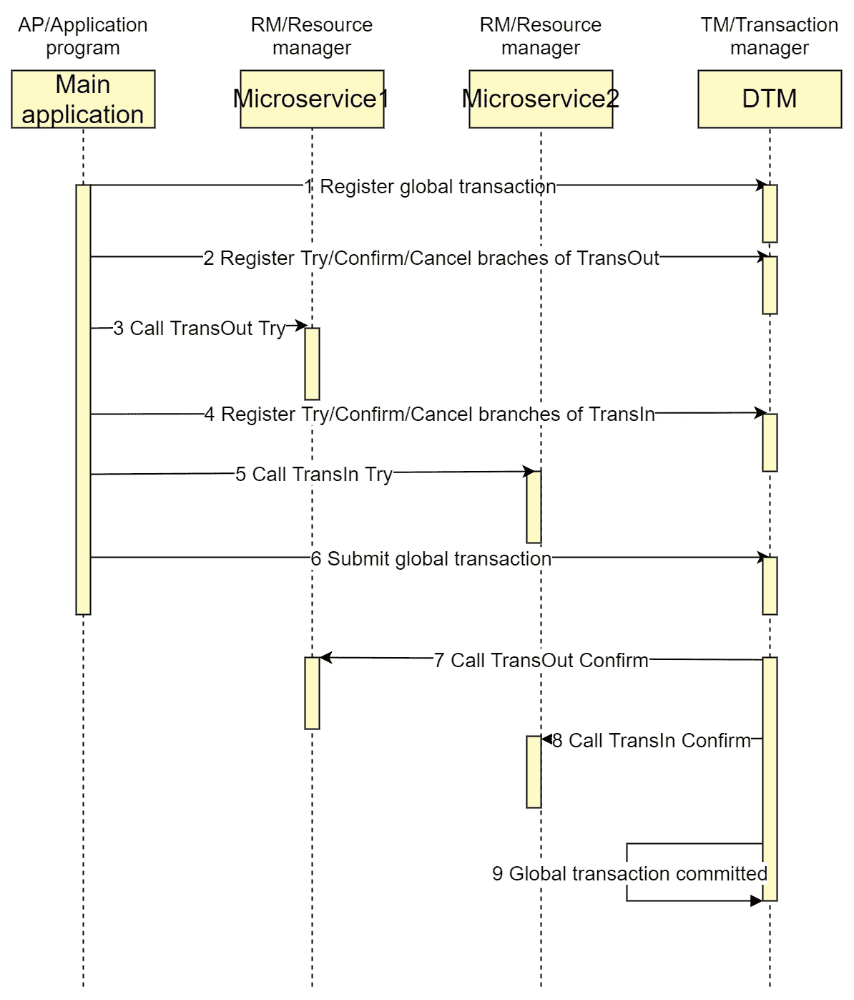
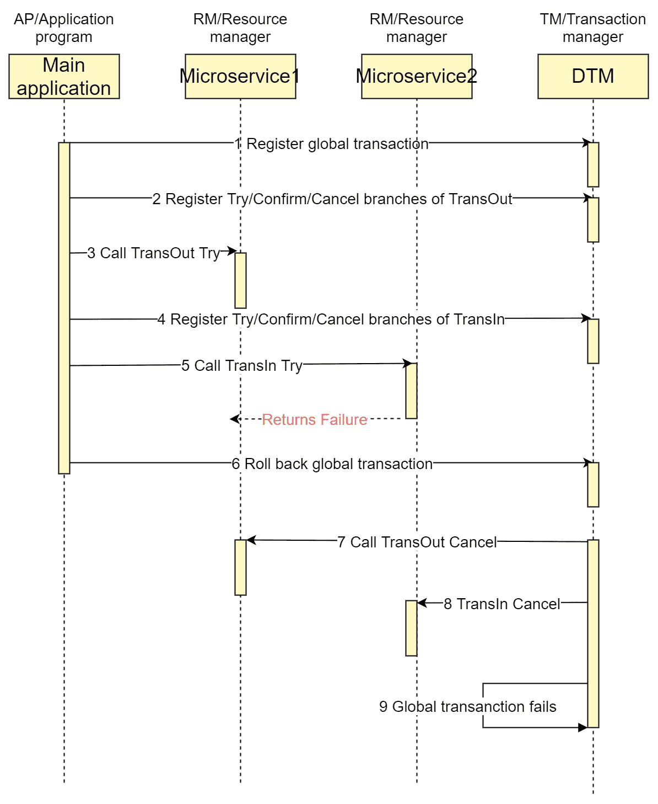

# Go 中 TCC 分布式事务的最佳实践

> 原文：<https://betterprogramming.pub/a-tcc-distributed-transaction-made-easy-with-go-c0a38d2a8c44>

## 本文将给出一个完整的 TCC 示例，让读者准确理解 TCC 类型的事务


[西格蒙德](https://unsplash.com/@sigmund?utm_source=medium&utm_medium=referral)在 [Unsplash](https://unsplash.com?utm_source=medium&utm_medium=referral) 上拍照

# 业务场景

典型的分布式交易场景是银行间转账，其中 A 需要通过银行将资金转移到 B。假设的需求场景是，从 A 转出和转入 B 的转账都可能成功和失败，并且转入和转出都将最终成功或失败。

还有一个要求，如果有回滚，佐贺模式会导致 A 发现自己的余额被扣了，而收款人 B 却迟迟没有收到余额，会造成很大的苦恼。企业希望避免这种情况

# 变矩器离合器部件

变矩器离合器分为 3 个部分

*   尝试部分:尝试执行，完成所有业务检查(一致性)，保留必要的业务资源。
*   确认部分:如果所有分支都在 Try 阶段成功，那么我们就转移到 Confirm 阶段，在这里 Confirm 实际执行业务，而不进行任何业务检查，只使用 Try 阶段保留的业务资源
*   取消部分:如果所有分支中有一个`Trys`失败，我们进入取消阶段，释放在尝试阶段预留的业务资源。

如果我们要执行一个类似于银行间转账的交易，TransOut 和 TransIn 在不同的微服务中，一个成功完成的 TCC 交易的典型时序图如下。



# 核心运营

首先我们创建账户余额表，其中`trading_balance`表示已经冻结的金额。

```
create table if not exists dtm_busi.user_account(
  id int(11) PRIMARY KEY AUTO_INCREMENT,
  user_id int(11) UNIQUE,
  balance DECIMAL(10, 2) not null default '0',
  trading_balance DECIMAL(10, 2) not null default '0',
  create_time datetime DEFAULT now(),
  update_time datetime DEFAULT now(),
  key(create_time),
  key(update_time)
);
```

让我们先写核心代码，冻结/解冻资金操作将检查约束余额+交易余额> = 0，如果约束无效，执行失败

让我们编写具体的尝试/确认/取消处理函数

这些功能的核心逻辑是冻结和调整平衡，`bb.Call`在其中的作用将在后面详细解释

# TCC 交易

然后创建 TCC 事务并进行分支调用

至此，一个完整的 TCC 分布式事务完成。

# 奔跑

如果您想完整地运行一个成功的示例，步骤如下。

1.  运行 dtm

```
git clone https://github.com/dtm-labs/dtm && cd dtm
go run main.go
```

1.  运行示例

```
git clone https://github.com/dtm-labs/dtm-examples && cd dtm-examples
go run main.go http_tcc_barrier
```

# 处理网络异常

假设提交给`dtm`的事务在其中一个步骤中短暂失败。`dtm`将重试未完成的操作，要求全局事务的子事务是幂等的。`dtm` framework 开创了子交易障碍技术，提供了`BranchBarrier`实用程序类来帮助用户轻松处理幂等性。它提供了一个函数调用，保证该函数内部的操作最多被调用一次:

```
func (bb *BranchBarrier) Call(tx *sql.Tx, busiCall BarrierBusiFunc) error
```

这个`BranchBarrier`不仅可以自动处理等幂，还可以自动处理零补偿和挂起问题，详见[异常和解决方案](https://en.dtm.pub/practice/barrier.html)。

# TCC 回滚

如果银行正准备给用户 2 转账，发现用户 2 账户异常，返回失败，会怎样？我们修改代码来模拟这种情况。

```
app.POST(BusiAPI+"/TccBTransInTry", dtmutil.WrapHandler2(func(c *gin.Context) interface{} {
  return dtmcli.ErrFailure
}))
```

这是事务失败交互的时序图



这与成功的 TCC 的区别在于，当子事务返回失败时，全局事务随后被回滚，调用每个子事务的取消操作，以确保全局事务被全部回滚。

`TransInTry`的正向操作没有做任何事情就返回一个失败，此时调用`TransInCancel`补偿操作会导致反向调整出错吗？

不要担心，前面的子事务屏障技术确保了如果`TransInTry`错误发生在提交之前，它将被补偿为空操作，如果临时错误发生在提交之后，补偿操作将提交数据。

您可以将`TccBTransInTry`改为

最终结果平衡仍然正确，详情见[异常和解决方案](https://en.dtm.pub/practice/barrier.html)。

# 摘要

本文给出了一个完整的 TCC 事务解决方案。通过对这个例子做一些简单的修改，您可以用它来解决您的实际问题

有关变矩器离合器原理的更多信息，请参见[变矩器离合器](https://en.dtm.pub/practice/tcc.html)。欢迎您参观 https://github.com/dtm-labs/dtm 项目。