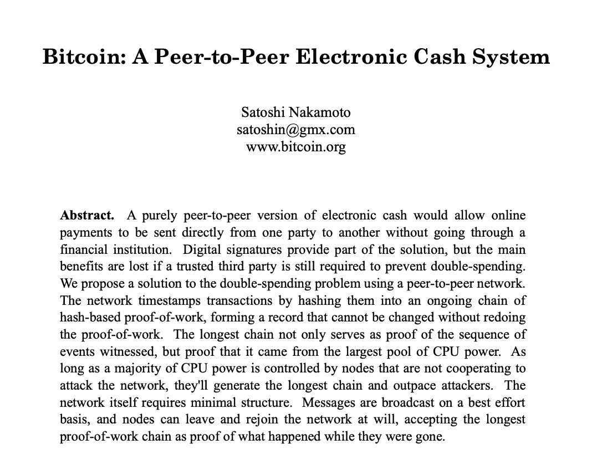
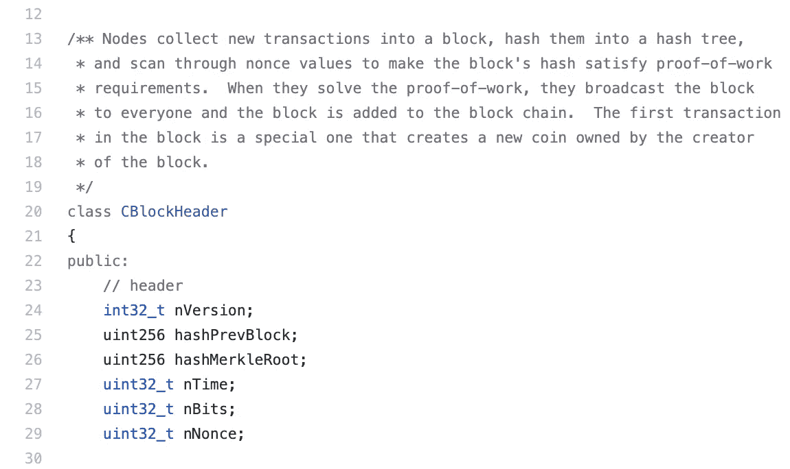
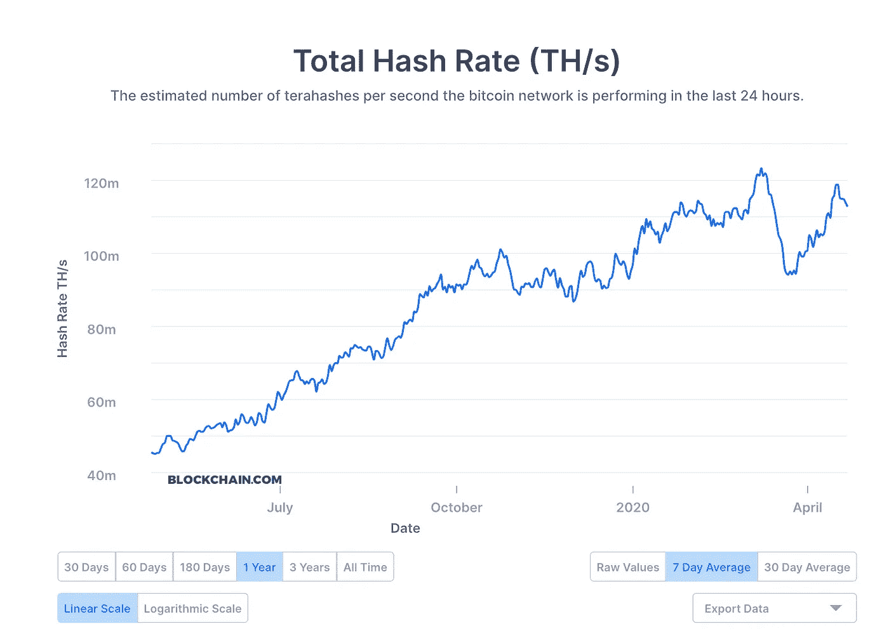
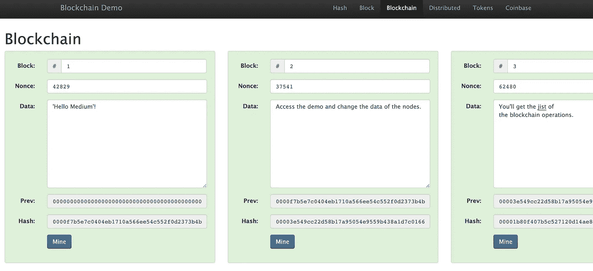
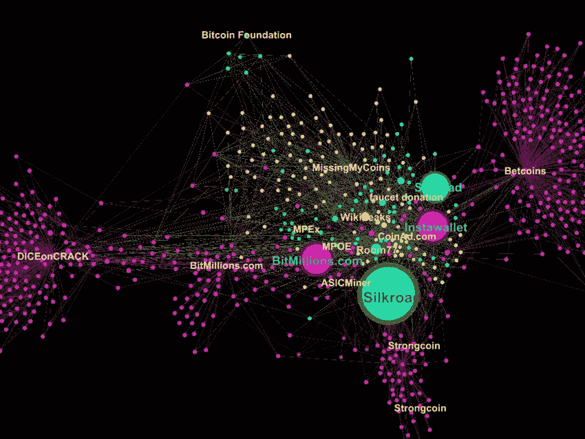
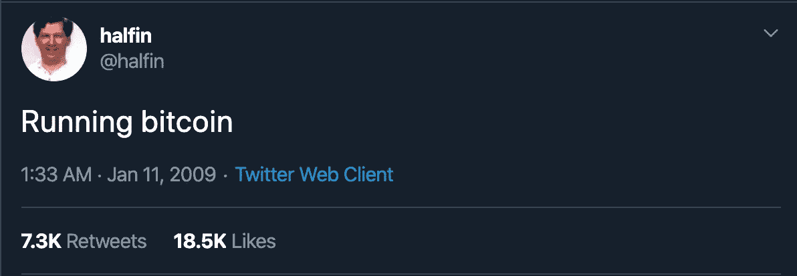
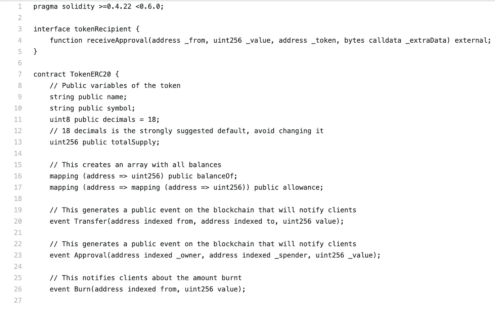

# 区块链的技术介绍

> 原文：<https://betterprogramming.pub/a-technical-introduction-to-blockchain-22ab05308151>

## 一个没有代码，没有炒作的技术介绍

# 1.重要的事情先来

## 1.1 区块链:另一种数据结构？

在计算机科学中，数据结构被定义为数据、其结构以及处理它们的一组操作的集合。一些例子是链表、栈、树和图。

区块链在数据结构中有着最深刻的根源，但仅仅从这个角度来看是不够的。网络特性(也就是说，在一组通过网络连接的计算机上使用这种数据结构)是本主题中同样重要的部分。

区块链的理想化是针对没有中央实体的网络进行的，在该网络中，运行相同代码的几个参与者旨在达成共识以保持记录在结构中的数据的完整性。

## 1.2 那么，我们如何定义它是什么？

区块链是一种分散的数据结构，可以由一系列记录定义，也称为*块*，可以包含任何类型的数据，并通过加密引用进行链接。从区块链的这些建筑特性中，我们可以列举出它的一些主要特征:

*   可以在其块中存储任何类型的数据
*   确保数据完整性
*   仅附加
*   当以分散的方式使用时，它遵循网络参与者之间的特定通信协议
*   网络共识是以分散的方式实现的，通过像 [*工作证明*](https://en.wikipedia.org/wiki/Proof_of_work) 这样的技术。这些技术用于减少恶意用户侵入网络的机会。

像其他数据结构一样，区块链也有这样的用例，其设计安全的架构非常适合，有时甚至是某些应用程序开发所必需的。

例如，参与者需要依赖注册信息的系统，即使没有中央实体来批准或拒绝内容，也是该技术的良好用例。

加密金融系统、公证、游戏、物流系统以及其他应用都从区块链中受益。

## 1.3 其故事简介

已经进行了一些尝试来设计分散的和密码可靠的数据结构，但是没有一个成功地开发出来，直到 2008 年中本聪发表了文章[比特币:点对点电子现金系统](https://bitcoin.org/bitcoin.pdf)，该文章使用区块链作为比特币加密货币的拟议实施的核心部分。

有趣的事实:直到今天，没有人知道中本聪的真实身份。

Nakamoto 在文章中提出的区块链是公开的，使用 [P2P 协议(peer-to-peer)](https://en.wikipedia.org/wiki/Peer-to-peer) 策略在网络参与者之间进行通信。它的公开特性，加上加密技术，使得任何人都可以验证存储在区块链上的数据的完整性。参与者之间的一致协议赋予网络一定程度的可靠性，考虑到所有参与者通过向区块链添加块来执行数据验证并一致工作，而没有集中实体有权改变或删除保存的记录。

几年后，区块链的变体被开发出来，经历了许可或私人区块链计划，其中参与者必须收到邀请或许可，才能参与或查看记录的数据，以及以替代方式使用网络计算能力的新公共区块链。

开始这一切的[纸](https://bitcoin.org/bitcoin.pdf)。

# 2.数据结构

## 2.1 街区

块结构定义了以下基本属性，也能够定义其他附加字段。主要属性有:

*   **索引**:用于索引和辅助检查块的排序
*   **数据**:可序列化的结构，可以根据应用程序的用例来定义
*   **映射前一个块**的数据或散列的记录:类似于前一个节点的指针，用在双向链表数据结构中；然而，在区块链上，前一个块的散列并不指向其前身的存储器地址，但是它是前一个块中包含的数据的签名，因此能够验证其完整性
*   **当前块的散列**:当前块中包含的数据的签名，由数学函数计算，考虑了块的所有属性
*   **难度**:该区块的开采难度等级(工作证明)
*   **nonce** :修改生成哈希的参数
*   **创建时刻的记录，或其时间戳**:有助于验证块排序和区块链完整性的值

## 2.1.1 里面的数据安全吗？

在区块链的情况下，由散列函数返回的值，或者仅仅是*散列*，用于保护包含在块中的数据不被有意网络中的任何参与者改变。对于两个不同的数据集，该值不能相等，并且通过对散列应用逆向工程技术，原始数据应该不容易获得。

也就是说，从数据中，我们可以生成哈希，而从哈希中，应该不可能生成数据。所选函数使用的算法必须确保安全前提。一个流行的经验法则是不要试图实现你自己的散列函数，除非你和一群在这个领域有丰富经验的数学家和密码学家一起工作。

有一些安全的开源实现，比如 SHA-2。其他非常著名的实现，如 [SHA-1](https://en.wikipedia.org/wiki/SHA-1) 和 [MD5](https://en.wikipedia.org/wiki/MD5) 不被推荐，因为他们已经公开了他们的攻击向量。

## 区块链的第一个区块

在区块链上创建的第一块被称为*起源块*。

genesis 块通常以硬编码的方式创建，即直接在区块链应用程序源代码中创建。此外，起源块不包含前一个块的散列，并且通常具有零索引。

比特币的 [block.h 源代码](https://github.com/bitcoin/bitcoin/blob/master/src/primitives/block.h)

## 2.2 链条

在我们进入关于链的细节之前，让我们探索一下
块*挖掘*的概念。为了生成一个序列，我们必须*链接*这些块，以便生成的散列总是如预期的那样，以便其他网络参与者可以验证和接受新数据。

该过程检查区块链数据的完整性，但是不能防止具有大量处理能力的恶意攻击者(哈希计算使用该处理能力)能够重写阻止列表，以便其他参与者将其接受为有效的更改。

## 采矿

为了避免这种攻击，可以使用一些技术。在这里我将谈谈比特币区块链中使用的工作证明方法(Proof of Work method，简称 PoW)，以获得共识并防止攻击。还有其他方法，如*标桩证明*或*空间证明*，此处不再赘述。

工作证明是一种技术，因为网络参与者必须执行艰苦的计算工作，以便能够在链上插入新的块。当在使用 PoW 的区块链上创建块时，参与者必须处理两个特定的属性——难度和随机数。

困难在于由
区块链的代码定义和更新的属性。它用于调节块添加到链中的速度。例如，它可以定义应用于数据的哈希函数的结果开头的零的数量。

正如我们之前看到的，数据散列是在考虑块的所有属性的情况下获得的。如果生成的哈希没有达到前导零的目标数量，我们如何改变这个值，因为我们不能改变块的其他属性？

在这种情况下，我们可以更新随机数。它必须被改变以便生成新的散列结果，直到散列函数达到网络预期的结果。

这项工作计算量很大，随着网络参与者计算能力的增加，这项工作会变得更加困难。为了鼓励参与者，区块链应用用来自网络的多个令牌或加密货币奖励在链中添加有效块的节点或参与者。由于这个方面，这个过程被称为*挖掘*。

当接收到有效块时，所有其他参与者可以通过应用散列函数来验证该工作，因此这是一种执行起来昂贵但易于验证的技术。

这防止了具有大量计算能力的恶意参与者重写区块链的内容。网络考虑到了计算能力，这也是公共区块链拥有自己的货币或代币的主要原因。

## 2.2.2 为了好玩和盈利:我们可以挖矿赚钱吗？

对于一个新的区块链网络来说，一个你可以在零售店买到的 CPU 就足以参与并可能赢得区块开采竞赛。

随着网络中参与者数量的增长以及随之而来的计算能力的增长，挖掘的难度趋于增加，因此需要参与者进行投资以继续获得回报，购买更好的机器或硬件，例如:

*   [**GPU**](https://en.wikipedia.org/wiki/Graphics_processing_unit) :图形处理单元是广泛使用的硬件，因为其
    并行处理器具有用于计算
    算法的高计算能力，适用于诸如 SHA2 家族的算法
*   [**ASIC**](https://en.wikipedia.org/wiki/Application-specific_integrated_circuit) :专用集成电路具有面向实现特定任务的电路，能够被构建为具有执行在块挖掘中使用的算法的独特任务。

目前，在比特币网络中，这是运行中最大的区块链，一组庞大的 ASIC 硬件一起工作是在挖掘过程中有机会的必要最低要求。

[区块链网络总处理能力(以每秒 terahash 操作数衡量——TH/s)](https://blockchain.info/charts/hash-rate?timespan=all&daysAverageString=7)

## 2.3 演练:将块添加到链中

理解了分散共识和挖掘的主要概念后，我们可以继续创建和操作我们的区块链。

创世纪块创建后，在创建下一个块时，我们必须遵循以下步骤:

1.  获取起源块的散列。
2.  用以下值实例化块:
    a .索引:前一个块的索引+ 1
    b .当前网络难度:通过区块链码
    获得 c .初始随机数:可以为零
    d .前一个散列:起源块的散列
    e .数据:与应用相关的任何可串行化数据
    f .时间戳:块创建的时刻
    g .当前块的散列:对属性值应用散列函数并存储结果值
3.  应用 PoW 方法，改变 nonce 值，直到获得的散列值满足网络困难的条件。
4.  将该块发送给网络中的其他参与者，并使用要插入到区块链中的新数据重新开始工作。

## 2.4 我们这样做了之后，链是不是“不可改变”了？

由于其体系结构，该块包含属于紧接在其之前的块的数据的签名。这意味着，如果我们处理 20 个块的列表，索引块 19 将具有索引块 18 内容的签名，而索引块 18 又包含索引块 17 的签名，依此类推。

也就是说，例如，为了改变块 12 中的信息，我们将必须从块 12 开始改变区块链中的所有块。这个过程是计算密集型的，并且不太可能被执行，因为在网络参与者开采区块之前必须这样做。

## 2.5 演示

在这个伟大的[演示](https://andersbrownworth.com/blockchain/blockchain)中，我们可以与 Anders Brownworth 开发的基于浏览器的区块链互动。

# 3.网络

## 3.1 点对点

我们必须解决的第一点是 P2P(点对点)网络。参与者通过网络以分散的方式相互发送和接收数据。

P2P 是一种计算机网络体系结构，其中每个参与者或网络节点同时扮演客户端和服务器的角色。使用 P2P 网络的应用程序的一些例子是用于文件传输的 [BitTorrent](https://en.wikipedia.org/wiki/BitTorrent) 协议和域名系统 [DNS](https://en.wikipedia.org/wiki/Domain_Name_System) 。

这种架构的优势在于它提供了更高的可用性，因为它不依赖单个节点作为所有信息的来源。另一个相关点是，由于它是分散的，与专用服务器相比，有多个参与者使用他们的智能手机的网络可以更具弹性，并且相对成本更低。

## 3.1.1 搜索节点

P2P 网络的概念是基于去中心化的。但是，如果我们没有一个中央实体来指示这些其他参与者的 IP 地址，我们如何连接到其他节点呢？有几种方法可以解决这个问题。

一种方法是提供参与网络并使用与应用程序相同的通信协议的节点列表。在与第一个节点建立连接之后，新节点可以连接到与第一个节点连接的所有节点。之后，必须更新已知初始 IP 的列表，以便在下一次应用程序启动时，该节点可以连接到所有先前已知的节点。

另一种方法是通过 [DNS 播种](https://bitcoin.org/en/glossary/dns-seed)。这种方法非常有趣，因为它使用了另一种分散式网络，即 DNS 网络。该方法工作如下:DNS 服务器列表，每个包含节点地址列表，与应用程序源代码一起发布。初始化时，应用程序在 DNS 服务器上执行查询以获取节点的地址，并连接到它们。连接后，新的网络参与者可以获得其他节点连接的地址列表，就像我们介绍的第一种方法一样。

## 3.1.2 与其他对等方通信

为了进行节点间的通信，通信通常是通过 [*插座*](https://en.wikipedia.org/wiki/Network_socket) 进行的。套接字是用于接收或发送数据的通信点。实际上，IP 网络上的套接字是由地址和端口定义的。在这种情况下，通常采用传输层，因为它有助于节点之间的通信。

一个例子是 [WebSocket](https://en.wikipedia.org/wiki/WebSocket) 技术，它通过单个 TCP 套接字执行双向通信。一旦节点之间的连接建立，参与者就可以根据高级数据协议发送和接收数据。

## 3.2 与区块链沟通

随着区块链的启动和运行，连接到其他网络参与者，并验证添加到链中的数据块，我们如何使用代码与主软件通信以获取信息和发送命令？

假设运行网络的机器不容易访问，比如在远程服务器上，我们可以开发客户端应用程序通过 web 发送命令和接收数据。

[比特币网络可视化](https://www.researchgate.net/figure/Visualization-of-Node-Size-Number-of-Public-Keys-in-the-Bitcoin-Network_fig36_296700474)

我们将更多地讨论 [RPC](https://en.wikipedia.org/wiki/Remote_procedure_call) 和 [REST](https://en.wikipedia.org/wiki/Representational_state_transfer) 方法，我们可以使用它们让客户端应用程序与运行区块链网络的机器进行交互。

## 3.2.1 远程过程调用，或 RPC

RPC 是一种在系统进程之间进行通信的方法，它允许一个程序执行另一个软件的现有过程，该软件通常运行在同一网络上的另一台计算机上。在区块链的情况下，我们可以用区块链主节点的代码编写软件来执行过程调用，以获得节点列表或发送要插入块中的数据。

为了实现这个实现，我们可以选择 RPC 库，比如开源社区中的几个区块链项目使用的 [gRPC](https://grpc.io/) 。

## 3.2.2 表述性状态传输，或 HTTP 上的 REST

REST 指的是允许软件为网络应用服务的一组原则。目前，当谈到 REST 时，请考虑 HTTP。

为了与区块链代码进行交互，我们可以在区块链主节点上编写一个 HTTP 服务器代码，通过包含 HTTP 方法、地址和数据(如果需要)的调用进行交互。这个 HTTP 服务器必须使用一些标准的数据格式，比如 JSON、XML 或其他更合适的格式，来接收和响应客户端应用程序的请求，这些请求可以由使用 HTTP 的任何类型的应用程序执行，比如`curl`、移动、web 或桌面应用程序。

# 4.许可

## 4.1 最常见的类型有哪些？

使用区块链的应用程序并不一定意味着所有数据都必须公开，任何人都可以成为网络的参与者。

## 公共

为了解决公共区块链的特点，我们必须从它的第一个也是最著名的应用开始:比特币加密货币。

加密货币是一种使用加密技术来确保代币或硬币交易有效性的交换手段。加密货币创造了一种交换价值的方式，不需要中介，也不需要相关方之间的信任。比特币出现后，又出现了其他几种外观非常相似的硬币。

比特币网络是公开的，因为它允许任何人成为网络节点，验证块，参与挖掘过程，发送数据，并添加新节点。简而言之，任何参与者都有可能进行任何操作。这是一个自由访问的网络，没有任何许可或限制。

## 许可

一个*许可的*区块链是一个可以
应用某些许可级别的网络。许可网络主要用于在区块链内有等级制度的私营公司，参与者有许可和有限的活动范围。根据使用案例，网络数据可以公开访问，也可以仅由少数参与者访问。

一个用例是 Ripple 加密货币，在撰写本文时，几家银行和金融机构使用它来进行跨境交易。它不存在于公共网络中，而是存在于许可网络中，其中一些节点负责验证所进行的交易。

这也意味着工作证明技术是不必要的，因为它的计算成本很高，并且与网络节点相关的不信任度也很高。在这种情况下，一种可能的替代方案是使用[权威证明](https://en.wikipedia.org/wiki/Proof_of_authority)方法，该方法仅基于节点的权威来获得共识。

今天一些广泛使用的平台是 [Corda](https://www.corda.net/) 和 [Hyperledger](https://www.hyperledger.org/) ，它们被用来创建许可的区块链。

## 4.2 激励措施

公共区块链通常对参与者进行激励，以推动网络增长和可用性。这是通过奖励区块矿工来实现的，最终成为公共区块链技术和分散加密货币应用之间的完美结合。

许可区块链不需要令牌来操作，因为它们不需要向执行块验证的网络参与者提供某种激励。

# 5.区块链还是加密货币

为什么这两个话题被当作一回事？

这主要是因为这两种技术的出现是同时发生的。在中本聪的文章中，区块链是比特币应用程序使用的数据结构。

由于主题的深度，加密货币和区块链都开始被孤立地研究和应用，正如我们在上一节中看到的。有一些区块链，其主要目的既不是交换代币，也不是为了鼓励采矿而向参与者分发代币。

计算机科学家哈尔·芬尼收到了有史以来第一笔来自中本聪的比特币交易。[(推特)](https://twitter.com/halfin/status/1110302988)

# 6.智能合同

智能合同是使用自动区块链自动执行协议的算法。他们的主要目标是在当事人之间执行合同，而不需要当事人之间的中介实体或信任。

若要使用智能协定，必须首先发布您的代码，将其发送到网络以添加到块中。为了进一步的交互，可以将命令以数据格式发送给区块链来执行，从而与已经发布的合同进行交互。这意味着代码的副本将被存储并由每个网络节点执行。

智能合约的概念产生于 1996 年，当时还没有任何类型的公共区块链，随着比特币网络的出现，它开始得到实施。它提供用[脚本语言](https://en.bitcoin.it/wiki/Script)编写的合同的执行，专注于比特币的转账。

## 6.1 以太坊

正是在[以太坊](https://ethereum.org/)的帮助下，第一个复杂的智能合约得以实现，这得益于支持执行[完整图灵程序](https://en.bitcoin.it/wiki/Script)的环境的可用性。像比特币区块链一样，以太坊有一个公共区块链，使用工作证明技术(在撰写本文时，有一个旨在改变共识方法的 Casper 项目)，并有一种加密货币来奖励矿工。然而，它有一个基本的区别:以太坊主要不是从事证券交易。

它的主要功能是执行智能合同，并作为分散应用程序的平台。以太坊依赖于以太坊虚拟机或 EVM，这是一个虚拟环境，包含在块中的代码在其中执行。这样，验证块的网络的所有参与者也执行合同，以验证它们的有效性。

## 6.1.1 以太坊安全吗？

鉴于其架构，契约的代码是不可变的，并且对网络中的所有人都是可见的。如果智能协定的代码中存在漏洞，该漏洞将无法修复，并且如果协定具有任何价值，则可能被恶意用户利用。

有一些构建分散式应用程序的标准，可以降低攻击契约的风险。区块链本身的代码或虚拟机的代码也存在被恶意用户使用的风险。

## 6.2 使用案例

智能合同有利于任何类型的合同，这些合同需要通过自动化和取消中介来提高效率，并且也可以从使用加密货币中受益。它可以用于存储事件或特定于事件的信息，因为可用的数据是公共的和不可变的。

与加密货币类似，代币可以通过智能合约创建、共享、交换其他代币或转移到数字钱包。它们也可以通过首次发行硬币或 ICO 来为项目筹集资金。

以太坊运营中的一些用例是加密货币钱包、分散的加密货币经纪人和虚拟商品商店，如游戏和保险合同等。

许可的区块链平台主要基于智能合约的执行。

用 Solidity 编写的智能合约代码示例——仍然没有突出显示 Solidity 的语法，Github？:(

# 7.包扎

在本文中，我们讨论了区块链结构的基础，包括数据结构和网络操作、它们的操作形式、权限级别以及自动化合同的可能性。值得记住的是，这些主题都是以肤浅的方式覆盖的，每个部分都很容易扩展到成为一本书的程度。

基本面的知识是获得
必要理解项目如何从区块链的使用中获益的最初方法。为了加深知识，应针对一些重要的主题，如:

*   导致技术发展的历史动机
    分散化
*   哈希函数的数学
*   对称和公钥加密
*   共识方法
*   硬叉和软叉
*   可扩展性挑战
*   侧链
*   智能合约编程
*   为在特定于组织的用例
    中使用区块链而开发的技术

> “教育不是你能完成的事情。”—艾萨克·阿西莫夫

我希望你喜欢阅读这篇文章。

*如果你有，考虑在*[*Twitter*](https://twitter.com/ogaihtcandido)*上关注我。*

谢谢你的时间。保重，继续编码！