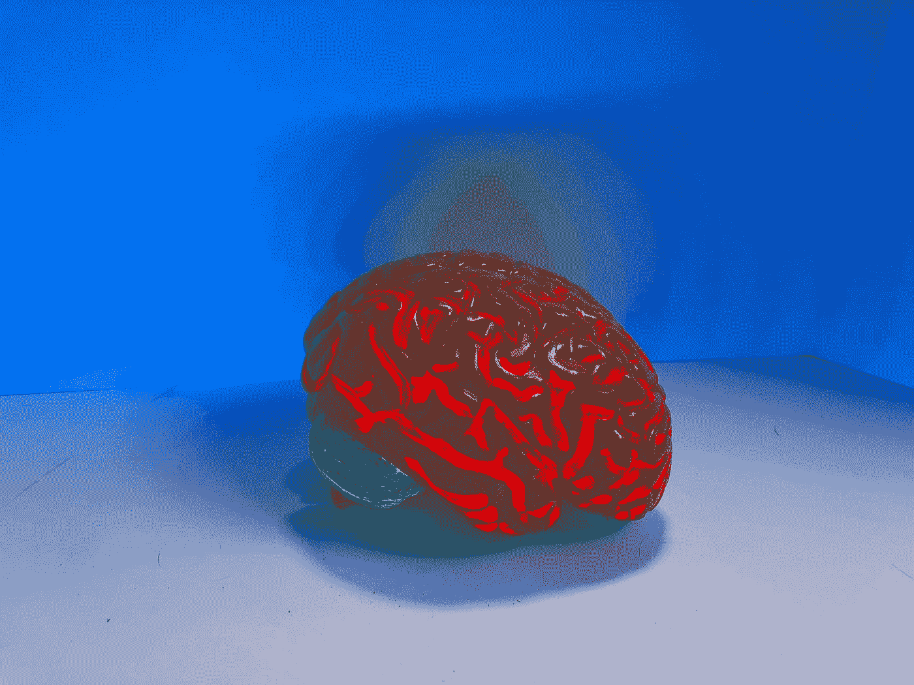
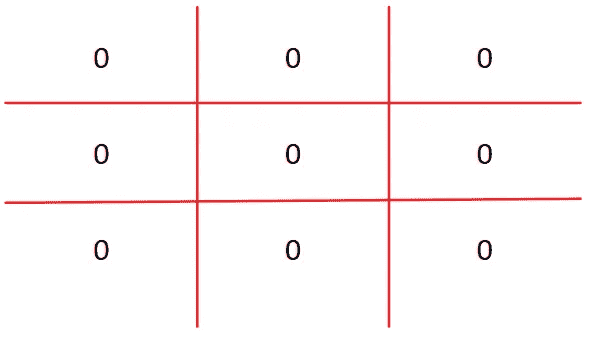
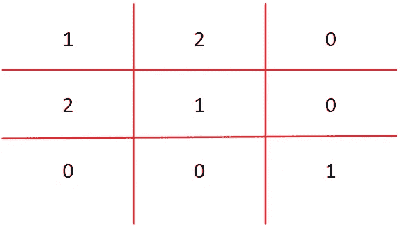
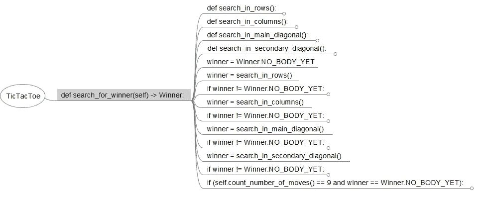

# 用思维导图检查复杂代码的技术

> 原文：<https://betterprogramming.pub/a-technique-to-inspect-complex-code-with-mind-maps-2dc83bb4c3a9>

## 通过 Freemind

娜塔莎·康奈尔在 [Unsplash](https://unsplash.com?utm_source=medium&utm_medium=referral) 上的照片

阅读和理解复杂的代码是一项非常艰巨的任务。代码并不总是有好的变量名、简洁的函数、测试等等。不幸的是，重写代码很少是一个选项。

在我的日常工作中，我需要阅读和理解旧的代码——这些代码是几年前写的，在软件开发的良好实践被创造出来之前。不仅是这种类型的代码，即使是最近用新语言编写的代码，第一次也很难理解。

我试图找到一种方法，用更少的努力来分析这种类型的代码，并发现通过使用思维导图，可以用更好的方式来查看代码。我一直喜欢思维导图。从 2008 年开始，我用它来组织大量的信息。在我看来，思维导图是学习和储存信息的最好(或最好)方法之一。

在本文中，我将使用 [Freemind 思维导图工具](http://freemind.sourceforge.net/wiki/index.php/Main_Page)。

为了解释这项技术，我将使用 Python 中的一个例子。我是一名计算机教授，当我教编程语言时，我总是和我的学生一起玩井字游戏。要检测每轮是玩家 1 还是玩家 2 赢，请运行以下算法:

开始一个用零填充的 3x3 矩阵。

当参与人 1 行动时，我在单元格中写 1。当参与人 2 行动时，我在单元格中写 2。这是一个参与人 1 在主对角线上获胜的例子:

要检测到参与人 1 赢了，在线、列和对角线上做乘积。如果结果是 1，玩家 1 获胜；如果结果是 8，玩家 2 获胜；如果结果是 0、2 或 4，在这条线、列或对角线上没有人赢。

就这样，简单。

这是实现了算法的 Python 函数:

这个函数的编写方式我认为已经足够了:在行、列和对角线上的搜索被分解成主函数中的嵌套函数，它使用枚举来描述玩家和赢家。此外，这个算法中的早期回报(这可以被认为是一件坏事)不是一个问题——假设主要流程是简单可见和易于理解的。

即使是本文中描述的技术也是集中在复杂的算法上，不像这样写得很好。我选择这个例子是因为它更容易解释和理解。

现在，打开代码和 Freemind，我复制并粘贴代码，瞧！魔法结束了。

Freemind 会自动将标签识别为子节点，因此不带标签的代码放在第一个节点片上，第二个节点片上有一个标签，依此类推。

使用 Python 时，由于缩进是源代码的一部分，这就更容易了。但是在像 C#这样的语言中，默认情况下大括号在语句下面的一行中，思维导图很难阅读，因为有很多大括号。

像这样的工具[https://formatter.org/csharp-formatter](https://formatter.org/csharp-formatter)将格式化程序设置为 Chromium，并将线宽设置为一个较高的值，会有所帮助。

另一个例子:如果代码有不寻常的缩进(就像在 Visual FoxPro 中 if 语句很长)，开发人员通常会破坏 if 条件，使用分号，转到下面的行添加使用制表符，使代码与原始 if 对齐。在这种情况下，您需要手动调整思维导图中的节点。

如前所述，这个例子很简单——函数很少，代码写得很好。但是想象一个代码，里面有`if``else``for``while``try`，还有很多这些语句，还有变量的可变性等等。

IDE 的概要并不总是有助于可视化代码。当你阅读一个 if 语句的内容时，你可能会忘记这个 if 语句是用什么结构写的。

将代码放在思维导图结构中，您可以更容易、更有层次地将其可视化，这是一种读写代码的自然方式。

此外，Freemind 提供了许多工具:写笔记、着色、在节点之间创建链接、在节点周围绘制云等等。所有这些都可以用来帮助理解复杂的代码。

我希望这个提示能帮助你理解复杂的(不幸的是，很多时候是糟糕的)代码。开发人员花在阅读上的时间比写代码多得多。因此提高可读性一直是软件开发的目标。

在理想情况下，这种技术是不必要的！总是试图写出好的代码。如果需要使用这种技术，可以提示重构是必要的。从 Robert Martin 的干净代码手册和理解函数式编程的概念是编写更好代码的良好起点。