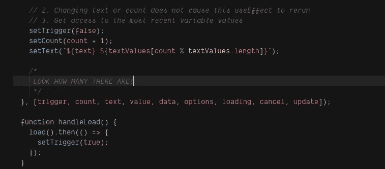

# React 中使用效果依赖的工具

> 原文：<https://betterprogramming.pub/a-tool-for-useeffect-dependencies-ca4086b085bb>

## 触发器赋予您决定执行时间的权力



这看起来眼熟吗？作者照片。

React 钩子为函数提供了一个方便的生态系统，它基于对所述函数的依赖关系进行的操作来运行。在某种意义上，`useEffect`是一个类似于数据库钩子的概念。数据库挂钩允许您在数据库操作后执行操作。

假设您正在构建一个游戏，每当玩家的分数更新时，如果有必要，您也希望更新高分。您可以在用一些常规的业务逻辑写入数据库之前这样做，但是这无疑会增加更新功能。在我看来，它也松散地破坏了几个最佳实践。具体来说，一个函数应该有一个目的和最小的副作用。一旦编写完成，它的功能应该被扩展而不是修改。

另一种方法是使用更新后挂钩。这个钩子监听玩家分数的变化，如果这个分数大于最高分，它就用新值执行一次单独的更新。

`useEffect`怎么像数据库钩子？它允许我们为一个函数订阅一个或多个在依赖数组中标识的变量变化。

在前面代码片段中的任何时候`score`或`highscore`发生变化，`useEffect`中的函数就会运行。请注意，这实际上可以运行两次。它总是在`score`改变时运行。如果`highscore`被更新，它将第二次运行。您现在可以看到，这在概念上类似于数据库挂钩。

这是一个相对简单的想法，但是一旦理解了，它就强大了！

# 冗长的依赖数组

当您需要对许多数据点进行操作时，会出现一个令人烦恼的问题。对任何依赖项的更改都会导致函数运行。如果您需要引用许多变量，但只想在非常精确的时间运行函数，该怎么办？假设您有以下不可否认的组件:

重点看第二个`useEffect`。每当它运行时，它都会增加计数，并根据`count`的当前值设置一些本地文本。

我把下面的工具称为“触发器”触发器允许我们准确地知道业务逻辑何时运行。我们来分解一下`useEffect`。想象一下它是这样写的:

```
useEffect(() => {
  setCount(count + 1);
  setText(`${text} ${textValues[count % textValues.length]}`);
}, [count, text])
```

这显然是不可接受的，因为它无限重播。它改变了`count`和`text`的值，这将导致它再次运行。通过添加触发器逻辑，我们强制它运行一次业务逻辑。说是`count`或者`text`变化，但是触发点是`false`。它将命中第一个`if`语句并结束执行。为了达到业务逻辑，触发器必须是`true`。如果是`true`，立即设置为`false`。没有循环发生。

这还能带来什么好处？它还确保任何业务逻辑都具有最新的值。假设我们在`handleLoad`的`then`中运行这个逻辑。它要么依赖于闭包(可能有一个竞争条件)，要么将一个函数传递给`setCount` / `setText`。虽然在这个例子中你可以这样做，但并不总是能够确定变量的下一个序列。如果逻辑依赖于在不同时间点变化的变量，你也不能这样做。

这也确保了如果我们需要链接`useEffects`，我们可以在不影响调用`useEffect`的依赖的情况下触发它。请看第一个`useEffect`的例子。因为我们不调用函数，所以我们不需要将函数的依赖项放入依赖数组中。即使我们使用了`useCallback`，我们仍然必须引用在依赖关系改变时会改变的回调。所以，我们并没有真的改变什么。

# 必要时使用该工具

虽然这是一个有用的工具，特别是在管理大型依赖关系数组时，但我必须承认我们已经学到的一些其他最佳实践:

1.  简化你的依赖关系。似乎很多单用途的`useEffects`比有几个副作用的大的更容易维护。
2.  使用 react-hooks/exclusive-deps。如果你是 React 或 React Hooks 的新手，这将迫使你理解何时以及为什么你必须改变你的依赖数组。
3.  小心依赖数组中不必要的引用。有时你会在代码中添加一个依赖项并移除它的引用。如果您不从依赖数组中删除它，它仍然会强制`useEffect`在它改变时运行。这可能会导致性能退化。
4.  不要忘乎所以。在任何你想的地方使用触发器。把它想象成你调用函数的新方法。然而，只有在绝对必要时才使用它。否则，很难跟踪依赖关系的变化是如何影响您的状态的。