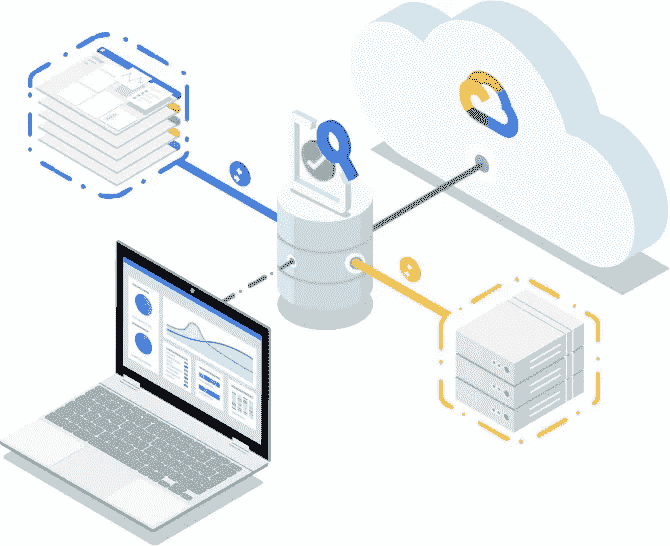
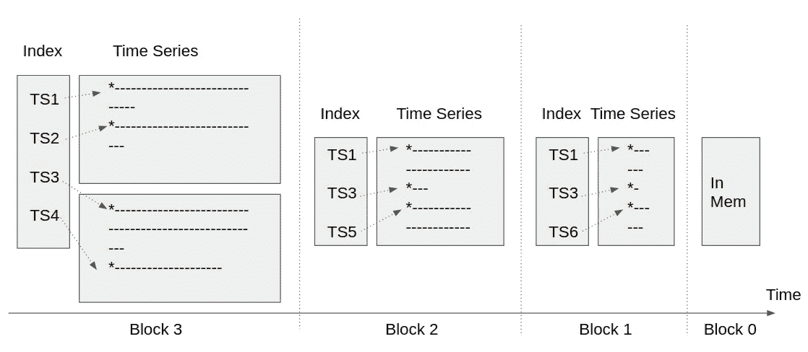

# 一个棘手的系统设计面试问题:解释服务器监控

> 原文：<https://betterprogramming.pub/a-tricky-system-design-interview-question-explain-server-monitoring-c5be0ce54a30>

## 在下一次面试前测试你的系统设计能力

图片来自[谷歌云](https://cloud.google.com/)。

在网上看到这个系统设计面试问题，想写一下。当我最初试图回答这个问题时，我尴尬的没有一个好的方法来组织我的想法。我有几个想法，但我不知道从哪里开始。我后来意识到，这可能是因为服务器监控在现代 web 开发中如此普遍，以至于我一直认为它是理所当然的。所以我似乎对此很了解，但我不能真正把这些点联系起来。我不得不花时间做一些研究，充实我的想法。

如果你第一次看到这个问题就卡住了，不要着急。很正常。

通常，系统设计面试的第一步是要求用例澄清。我不认为这有多大帮助，因为我们都知道服务器监控系统是什么样子的。随着讨论的进行，寻求确认和方向性指导可能是更好的策略。它显示了我们的知识深度，使我们能够提出更具体、更明智的问题。

# **监视什么**

我们可以在服务器上测量和监控成千上万的东西。

我们可以定义应用层指标。例如，服务器在某个路径上收到了多少 POST 请求？服务器正在处理多少个并发请求？特定方法的延迟分布是怎样的？未处理的消息队列有多长？缓存命中率是多少？这些指标由应用程序定义，也由应用程序在内存计数器中跟踪。

我们可以监控特定于语言/执行的指标。我喜欢 Golang，所以我用它来举例说明。例如，我们想知道:

*   是哪个 Go 版本。
*   进程有多少个并发 Goroutines。
*   上一次垃圾收集是什么时候？
*   进程已经分配和释放了多少字节的内存。
*   堆的大小是多少。

Golang 有一个`runtime`包，提供了获取这类信息的方法。

我们还可以检查主机系统。例如，CPU/内存/磁盘的使用情况如何？主机上运行了多少个进程？文件系统、网络和系统定时器工作正常吗？这些类型的度量是通过系统调用表现出来的，并且在不同的平台上有所不同。我们通常不会在应用程序进程中收集它们，因为它们对主机来说是常见的，我们需要更高的权限才能访问它们。这时一个守护进程就出现了。同样值得注意的是，这类指标的获取非常昂贵，因此我们应该小心轮询频率。

现在是停下来问面试官是否有什么特别想让我们关注的问题的好时机。答案很可能是否定的，因为面试问题的主旨是测试我们的系统设计能力。采访不太可能希望我们谈论细节，例如，文件系统缓存统计。

# **如何获得指标——推送还是拉动**

这些指标现在都可以通过内存计数器、语言运行时和系统调用在服务器上获得。我们如何把它们从服务器中取出来？

在继续之前，我们应该与面试官确认:我们需要从服务器中获取指标吗？也许我们没有。在这种情况下，服务器可能会公开一个带有指标的端点服务，或者它可能只是将指标保存到本地磁盘，我们可以通过 SSH 访问它以进行检查。然而，面试官的回答很可能是肯定的。我们确实想把指标拿出来。否则，当服务器变慢或停机时，我们将无法访问这些指标——就在我们最需要它们的时候。我们还希望将指标放在一个集中的地方，以便更好地进行全局监控和警报。

我们现在面临的一个基本设计问题是，我们应该使用推还是拉，这意味着服务器是应该主动发送指标，还是应该只暴露一个端点，被动地等待查询。

普罗米修斯(著名的监控系统)选择了拉，并且有[关于设计选择的好博文](https://prometheus.io/blog/2016/07/23/pull-does-not-scale-or-does-it/)。它提倡拉，因为这样更方便。被监控的每台服务器只需收集内存中的指标，并通过端点提供服务。它不需要关心监控系统在哪里。如果他们发送太多和/或太频繁，就不必担心监控系统过载。可以在监控系统中调整关于收集内容和收集间隔的全局配置。

另一方面，推送在某些情况下可能有用(例如，当防火墙阻止监控系统直接访问服务器时)。

这篇博文没有提到的拉的一个缺点是，用一个只拉的模型提供高可用性和可伸缩性是一个挑战。如果我们使用推送，我们可以在一组监控系统副本前放置一个负载平衡器，并让被监控的服务器通过负载平衡器发送指标。但是对于只拉模型，指标是由监控系统实例直接收集的。为了支持复制和故障转移，在提取和部署备份实例时，我们必须有意识地划分指标。根据环境的不同，这可能是也可能不是一个大问题。

另一个值得注意的点是，现代监控系统通常有不止一层的推/拉来聚合层次结构中的指标。有时，在层次结构层之间会使用混合推/拉模型来解决同构检索机制的缺点。

# **持续度量**

既然我们已经成功地将指标从被监控的服务器转移到另一个系统中，接下来的事情就是如何存储它们。再次强调，总是先要求确认，看看是否有必要。也许需求只是拥有一个集中的内存度量存储库。在这种情况下，我们不需要担心设计一个时间序列数据库。然而，时间序列数据库是有趣的。让我们假设耐久性是一个要求。通常是这样，因为没有历史视图的监控系统没什么用。

我们希望按照时间顺序存储所有时间序列的数据样本——本质上是一个带有时间戳的值。时间序列是特定指标的完整时间表视图。例如，每隔 15 秒收集的来自服务器`instance1`的`POST/myMethod`的 P50 延迟是一个时间序列。

我们的第一直觉应该是，我们绝对不能在文件到达时就将单个数据样本写入文件。这将是非常低效的，因为监控系统可能每分钟收集一百万或更多的数据样本。所以某种形式的批处理是至关重要的。在内存中进行批处理，会有丢失数据的风险。如果我们只是在短时间内进行批处理，这可能没什么大不了的，因为典型的时间序列用例可以容忍少量数据样本的丢失。但是，如果我们想在更长的一段时间内批量生产，就应该采取耐久性保护措施。毕竟，最新的数据样本通常是最有价值的。我们不想处于失去最后 30 分钟指标的境地。

预写日志(WAL)是补充内存批处理持久性的标准解决方案。更多细节，你可以查看[我写的关于这个话题的详细文章](https://eileen-code4fun.medium.com/building-an-append-only-log-from-scratch-e8712b49c924)。在高层次上，WAL 通过管道将更改传递到磁盘上的日志文件，该文件可用于在崩溃后恢复系统状态。WAL 不会招致很大的 IO 损失，因为顺序文件访问相对较快。

现在，我们可以在内存中缓冲数据样本一段时间，这为更好的写入效率打开了大门。我们应该决定的下一件事是如何在文件中组织数据。每个文件一个时间序列听起来像是一个简单的解决方案，但不幸的是，它无法扩展。有太多的时间序列需要创建单独的文件。我们必须在一个文件中存储多个时间序列。另一方面，我们不能把所有东西都放在一个单一的文件中。那个文件会太大而无法操作。我们需要以某种方式剪切文件。这里的自然选择是按时间维度切割文件。我们可以每天或其他可配置的时间窗口创建一个文件。让我们把一个时间窗口中的数据称为一个块。如果一个块中的数据量对于一个文件来说太大，我们可以将它分成几个文件。我们还需要每个块中的索引文件来告诉我们在特定的时间序列中要查找哪个文件以及文件的位置。请参见图 1 中的图示。

图 1

当数据样本到达内存时，我们会缓冲它们，直到需要将它们刷新到磁盘。当我们将它们刷新到磁盘时，我们将它们组织成块。最近数据样本的块通常代表一个小的时间窗口。随着块变老，我们压缩它们以形成更长的时间窗口。这可以控制总块数。此外，旧数据样本的查询频率较低，因此我们可以将它们放在更大的文件中以便于管理。作为压缩的一部分，我们还可以对数据进行下采样，以减少总体数据量。将新文件压缩到更大的旧文件中的想法并不新鲜。它被称为[日志结构的合并树](https://eileen-code4fun.medium.com/log-structured-merge-tree-lsm-tree-implementations-a-demo-and-leveldb-d5e028257330)。LevelDB 可能是它最著名的实现。

还有其他一些小而重要的细节。应采用压缩来减少总体数据量。时间序列数据是压缩的绝佳选择。所有的数据样本都可以表示为来自前面的数据样本的增量。脸书[发表了一篇论文](https://www.vldb.org/pvldb/vol8/p1816-teller.pdf)，描述了时间序列数据压缩中的两个特殊技巧，利用相邻数据点接近的事实，实现了 10 倍的节省。在他们的论文中，时间戳被编码为增量的增量。二阶导数往往有更多的零。浮点值被编码为 XOR 结果，可以通过`(a XOR b) XOR a = b`恢复。当两个浮点值接近时，它们的 XOR 结果有许多零。

到目前为止，我们只关心本地磁盘中的数据。为了超越单个节点，我们需要横向扩展存储。我们可以通过使用分布式文件系统(如 HDFS)来备份数据，也可以重新设计存储逻辑来适应更具本地分布式的基础架构。我们没有时间在这里详细讨论。

# **支持查询和预警**

如果我们有如图 1 所示的存储布局，查询就很容易想象了。时间是所有指标搜索中的通用过滤标准。我们使用时间范围将搜索范围缩小到一组连续的块。如果我们知道时间序列 ID，我们可以从这些块中的文件中检索它。否则，我们需要添加一个从搜索标准到时间序列 id 的反向索引，然后按照块中的索引文件来定位时间序列文件。一旦我们检索到时间序列数据，我们就可以用图形显示它们。

警报可以在监控服务器内部注册。当它嗅探传入的数据样本时，它可以对任何异常模式发出警报。我们还可以将它们与监控服务器分离，并将其部署为下游监控服务器，只收集和检查一组更精选的指标。

# **关闭**

本次系统设计面试到此结束。我们绝对涵盖了比典型的系统设计面试更多的内容。我希望你能从这篇文章中得到一点启发。

# **参考文献**

*   [https://Prometheus . io/blog/2016/07/23/pull-does-not-scale-or-does-it/](https://prometheus.io/blog/2016/07/23/pull-does-not-scale-or-does-it/)
*   [https://Eileen-code 4 fun . medium . com/building-an-append-only-log-from-scratch-e 8712 b 49 c 924](https://eileen-code4fun.medium.com/building-an-append-only-log-from-scratch-e8712b49c924)
*   [https://Eileen-code 4 fun . medium . com/log-structured-merge-tree-LSM-tree-implementations-a-demo-and-level d b-d5e 028257330](https://eileen-code4fun.medium.com/log-structured-merge-tree-lsm-tree-implementations-a-demo-and-leveldb-d5e028257330)
*   [Tuomas Pelkonen 等人，Gorilla:一个快速、可扩展的内存时间序列数据库，VLDB，2015 年](https://www.vldb.org/pvldb/vol8/p1816-teller.pdf)