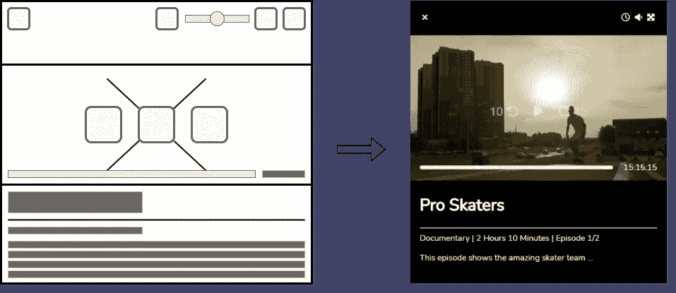
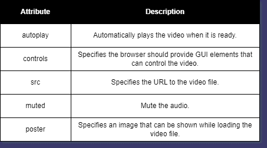
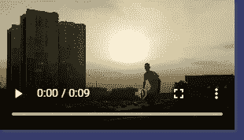
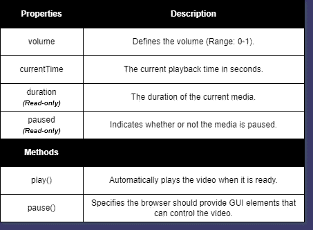
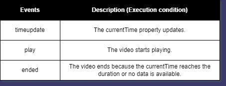
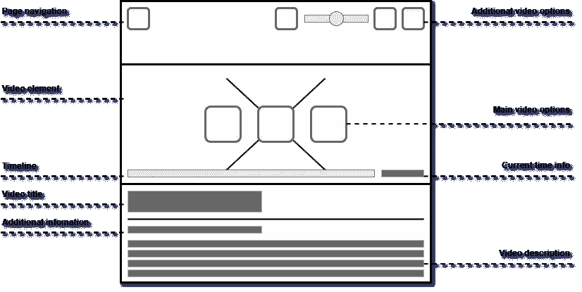
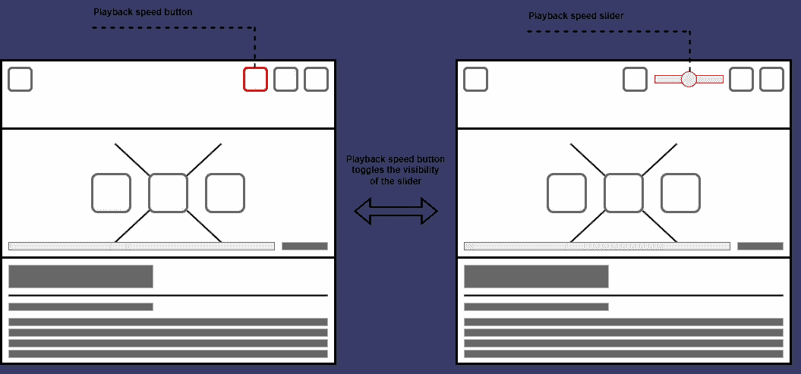
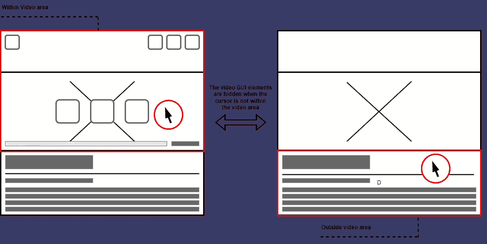
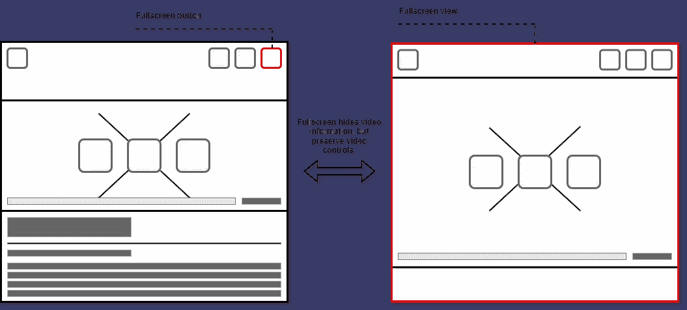
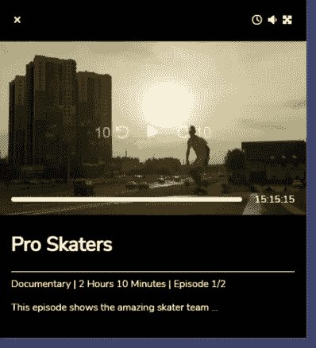

# 为你的网站建立一个自定义的视频播放器

> 原文：<https://betterprogramming.pub/a-tutorial-to-the-html-video-element-b8b9a4bf2f76>

## HTML 视频元素教程

你是否在建立一个网站，让你的访问者可以观看视频，但是发现 HTML 视频元素的默认设计很无趣？不要担心！这篇文章解释了如何修改你的视频 HTML 元素，给他们一个更清爽的设计。

# 1.HTML 视频元素是什么？

video 元素提供了一种将视频直接嵌入 HTML 文档的方法( [Mozilla，无日期，a](https://developer.mozilla.org/en-US/docs/Web/HTML/Element/video) )。它有一套全面的属性、事件和方法，可用于将特性绑定到新元素。

## 1.1.属性

可以使用不同的属性直接配置视频元素，如`autoplay`、`controls`、`src`、`muted`、`poster`等。(参见图 1)。视频元素的属性远不止这些，如果你对其他属性感兴趣，我推荐你看看 [Mozilla(无日期，a)](https://developer.mozilla.org/en-US/docs/Web/HTML/Element/video#browser_compatibility) 。

图一。视频元素属性说明( [Mozilla，无日期，a](https://developer.mozilla.org/en-US/docs/Web/HTML/Element/video) )。

视频元素可以配置一个或多个信号源(见图 2)。使用多个源的原因是为可能不支持特定格式的浏览器提供一种替代格式( [Mozilla，无日期，a](https://developer.mozilla.org/en-US/docs/Web/HTML/Element/video) )。通过在视频元素中插入消息，不会向用户传达支持错误。

图二。一个视频标签配置了单源和多源的例子( [Mozilla，无日期，a](https://developer.mozilla.org/en-US/docs/Web/HTML/Element/video) )。

默认浏览器控件为不同的视频操作提供了图形用户界面(GUI)元素。这包括播放/暂停、时间轴、时间信息、音量设置、全屏、播放速度和集成图像等操作(参见图 3)。

图 3。带有默认浏览器控件的视频元素示例。视频元素显示的图像来自 Artem Podrez 制作的视频。

## 1.2.方法和属性

HTML video 元素的接口继承了 HTML media 元素接口的属性、事件和方法( [Mozilla，无日期，b](https://developer.mozilla.org/en-US/docs/Web/API/HTMLMediaElement) )。这包括`play()`、`pause()`等方法，以及`volume`、`duration`、`currentTime`、`paused`等属性。

图 4。对 HTML 媒体元素的属性和方法的解释( [Mozilla，无日期，b](https://developer.mozilla.org/en-US/docs/Web/API/HTMLMediaElement) )。

只需从 HTML 文档中获取视频元素，就可以使用这些属性和方法(参见图 5)。

图 5。一个通过界面修改视频元素的例子。

注意:在任何交互之前调用方法`play()`可能会导致以下错误: *DOMException: play()失败，因为用户没有先与文档进行交互。*

出现此错误是因为实施了特定于浏览器的自动播放策略( [Beaufort，2017](https://developer.chrome.com/blog/autoplay/) )。

## 1.3.事件

HTML 媒体元素接口还提供了一组在不同场景中执行的事件(参见图 6)。

图 6。对 HTML 媒体元素事件的解释( [Mozilla，无日期，b](https://developer.mozilla.org/en-US/docs/Web/API/HTMLMediaElement) )。

一个事件可以通过调用方法`element.addEventListener(event, function)`来分配，或者作为一个属性来分配( [Mozilla，无日期，b](https://developer.mozilla.org/en-US/docs/Web/API/HTMLMediaElement) )。当属性指定一个事件时，可以指定一个函数，但是方法`addEventListener()`可以用于指定多个函数。当调用分配给事件的方法时，事件对象被传递给包含执行事件的元素的方法(参见图 7)。

图 7。一个如何使用 HTML 媒体元素事件的例子。

# 2.构建自定义视频播放器

本文的这一部分将解释如何为 HTML 视频元素构建定制的 GUI 元素。

## 2.1.实体模型设计

在编写任何 HTML、CSS 或 JavaScript 之前，我想介绍一下设计的概况(参见图 8)。设计可以分为三个不同的部分:顶部；视频；底部；

顶部包含页面导航元素和附加视频选项，如播放速度滑块或全屏按钮。视频部分包含实际的视频元素、时间轴、当前时间信息和主要视频选项，如播放/暂停、倒带和前进。底部包含显示视频信息的元素，如标题、持续时间和描述。

图 8。视频播放器的实体模型设计。

默认情况下，附加选项滑块是隐藏的，可以通过按下它们位置旁边的按钮来切换它们的可见性(参见图 9)。

图 9。切换滑块可见性的图示。

当光标移动到视频区域之外，或者有一段时间没有移动时，视频控件会自动隐藏(参见图 10)。

图 10。光标不在视频区域内时 GUI 元素如何隐藏的图示。

全屏活动时，视频信息是隐藏的，但仍然可以访问视频控件(参见图 11)。

图 11。全屏活动时如何隐藏视频信息的图示。

## 2.2.构建 HTML 结构

第一步是建立一个简单的 HTML 结构(参见图 12)。图 12 中的 HTML 结构包括两个外部资源，[字体 Awesome](https://fontawesome.com/) 和[谷歌字体 Nunito](https://fonts.google.com/specimen/Nunito?query=nunito) 。Font Awesome 提供了一个可以由特定类显示的图标集合，Google Fonts Nunito 将被用作页面的主要字体家族。

图 12。一个简单的 HTML 结构的例子，包括字体 Awesome 图标和 Nunito Sans 字体。

下一步是添加第 2.1 节“实体模型设计”中介绍的分割部分(顶部、视频、底部)(参见图 13)。这包括一个 div 元素，其中有一个名为`video-player`的类包装这三个部分。顶部有一个名为`top`的类，视频部分有一个名为`video-container`的类，底部有一个名为`video-information`的类。

图 13。视频播放器三个不同部分的 HTML 结构。

最后一步是添加不同的输入和输出元素(参见图 14)。我不会详细讨论具体的 HTML 元素，因为它不包含任何特别高级的东西。

图 14。自定义视频播放器的 HTML 结构。

## 2.3.设计视频播放器

有了 HTML 结构，是时候添加一些样式了。添加一个名为 style.css 的单独文件，并在 HTML 文档头中链接资源(参见图 15)。

图 15。包含外部样式表的例子。

首先向样式表添加几个通用类(参见图 16)。这些类没有绑定到任何特定类型的概念元素(fx top、video-container 等)。)，它们应该被组合在 HTML 文档中。

例如，`btn`定义了视频播放器中一个按钮的默认外观，但是它没有指定文本颜色。然而，按钮的文本颜色可以通过将类与`txt-white`结合起来定义。

图 16。一个用于设计视频播放器的通用类的例子。

下一步是将通用类添加到相关的 HTML 元素中。该设计包含四个不同的元素，应该使用`flex`属性显示出来(参见图 17)。

顶部的 div 元素应该包含`flex`、`space-between`和`align-center`类的组合，以确保导航和“附加视频选项”被调整到各自的一侧，并垂直居中对齐(参见图 17，第 13 行)。

“additional video options”div 元素还应该包含`flex`类，以确保按钮和输入滑块的换行 div 元素被内联显示(参见图 17，第 22 行)。

主视频选项应该包含`flex`和`space-between`类，以确保按钮彼此分开显示(参见图 17，第 37 行)。

最后，包含当前时间信息和时间轴的 div 元素应该包含类`flex`、`align-center`和`gp-20`(参见图 17，第 44 行)。`Align-center`确保时间线和时间信息文本垂直居中，并且`gp-20`在时间线和时间信息文本之间添加一个 20px 大小的间隙。

图 17。应包含 flex 类的元素示例。

视频容器 div 应该包含`relative`类，以确保定义为 absolute 的子元素相对于视频容器 div 定位(参见图 18，第 16 行)。

主视频选项 div 应该包含`absolute`和`absolute-center`类，以指定 div 元素应该位于视频容器 div 的中心，并在视频元素的顶部(参见图 18，第 25 行)。

时间信息 div 应该包含`absolute`和`absolute-bottom`来指定它应该位于视频容器 div 的底部，视频元素的顶部(参见图 18，第 33 行)。

图 18。应该相对或绝对定位的元素示例。

下一步是设计按钮和锚元素的样式，并添加文本颜色。顶部 div 标签中的按钮和锚元素应该包含四个不同的类:`btn`；`txt-white`；`txt-white-alpha-hover`；`font-m`；(参见图 19，第 16–38 行)

`btn`取消默认按钮设计，增加 5 个像素的填充。`txt-white`将文本颜色设置为白色。`txt-white-alpha-hover`当鼠标悬停在包含该类的元素上时，将文本颜色设置为透明白色。`font-m`将字体大小设置为中等。

主视频选项 div 中的按钮也应该包含四个类:`btn`；`txt-white-alpha`；`txt-white-hover`；`font-xl`；(参见图 19，第 55–64 行)

`txt-white-alpha`将文本颜色设置为透明白色。`txt-white-hover`如果鼠标悬停在元素上，将文本颜色设置为白色。`font-xl`将字体大小设置为特大号。

显示当前时间信息和附加视频信息的 div 元素应该包含`txt-white`类，以确保文本是白色的(参见图 19，第 77–84 行)。

图 19。一个设置锚和按钮元素样式并添加文本颜色的例子。

最后一个通用类是`pd-20`。这个类只是增加了 20px 的填充。将该类添加到 top div、time info div 和 video information div 中(参见图 20)。

图 20。应包含填充类的元素示例。

下一步是向一些概念性元素添加一些宽度、高度和边距配置，比如 top div 和 video options div(参见图 21)。将图 21 中的附加 CSS 添加到 style.css 的顶部。

图 21。定义宽度、高度和边距属性的附加 CSS。

类`timeline`也应该被添加到时间轴的 progress 元素中(参见图 22，第 27 行)。

图 22。添加 timeline 类的示例。

下一步是添加四个定义，为数据状态属性等于`none`、`flex`、`block`或`maximized`的元素添加样式。将图 23 中的 CSS 添加到 style.css 中。

`none`、`flex`和`block`的定义用于根据元素的数据状态值隐藏或显示元素，而`maximized`的定义用于确保当元素全屏显示时，顶部 div 元素位于视频元素的顶部。

图 23。针对具有数据状态属性的元素的两个 CSS 定义的示例。

顶部的 div 和视频容器 div 应该包装在一个新的 div 元素中，该元素的 id 为`fullscreen-container`，数据状态属性设置为`minimized`(参见图 24，第 13 行)。

样式化的最后一步是将数据状态属性`none`和`flex`添加到 div 元素中(参见图 24，第 20–78 行)。有些元素可能已经使用 flex 属性显示了，但是 data-state 属性将在本教程的后面使用。

图 24。向 div 元素添加数据状态属性的示例。

此时，视频播放器应该类似于图 25 中的屏幕截图。

图 25。视频播放器的截图。视频元素显示的图像来自 Artem Podrez 制作的视频。

## 2.4.添加事件和控件功能

在添加任何特定的方法或事件之前，添加一个名为 video-player.js 的新文件，并将其包含在 HTML 文件中(参见图 26)。

图 26。包含 JavaScript 文件的示例。

向 javascript 文件添加一个名为`toggleVisibility(id)`的方法(参见图 27)。此方法的职责是根据元素的当前数据状态值将元素的数据状态属性设置为“none”或“block”。

该方法还应该被添加到一个名为`VideoPlayer`的空对象中，以便有一个封闭的范围来调用方法。

图 26。用于切换元素可见性的方法示例。

下一步是向包装 div 元素添加 id，向播放速度滑块和音量滑块按钮添加方法`toggleVisibility(id)`(参见图 27)。

图 27。添加`toggleVisibility(id)`方法和 id 的示例。

在向 video-player.js 添加最后的方法之前，应该向 video 元素、滑块、按钮和其他相关的 div 元素添加几个 id(参见图 28)。

还应该注意到，倒带和前进按钮应该包含一个数据状态属性，指定它们修改当前时间属性的秒数(参见图 28，第 69–86 行)。

图 28。最后一个 id 和数据状态的例子。

视频播放器需要的下一件事是控制视频功能的方法(参见图 29)。

`setVideoElement(videoId)`是否应该总是在其他方法之前执行*，因为其他一些方法是为了从名为`videoElement`的属性中获取视频元素而设计的(参见图 29，第 22–24 行)。*

*`setPlaybackSpeedEvent(sliderId)`绑定一个滑块来设置视频的回放速率属性等于滑块的值(参见图 29，第 30–36 行)。*

*`setVolumeEvent(sliderId)`绑定一个范围在 0–100 之间的滑块，将视频的音量属性设置为等于滑块的值(参见图 29，第 42–48 行)。*

*`setCurrentTimeEvent(buttonId)`绑定一个按钮的`click`事件，根据按钮的数据状态属性增加视频的当前时间属性(参见图 29，第 64–61 行)。*

*`setPlayPauseEvent(buttonId)`绑定一个按钮的`click`事件，根据视频的暂停属性播放或暂停视频(参见图 29，第 68–77 行)。*

*`setCurrentTimeInfoEvent(containerId)`绑定视频的`timeupdate`事件，将容器的内容设置为视频的当前时间(参见图 29，第 84–90 行)。*

*`setTimelineEvent(timelineId)`绑定视频的`timeupdate`事件，根据视频的当前时间与其持续时间的比较，将 progress 元素的值设置为 0–100 之间的一个数字(参见图 29，第 98–107 行)。*

*`setFullscreenEvent(buttonId, containerId)`绑定一个按钮的`click`事件来设置容器是否全屏(参见图 29，第 117-133 行)。*

*`setOnHoverEvent(containerId)`绑定鼠标事件来隐藏或显示包含类`video-hover-event`的 HTML 元素(参见图 29，第 143–175 行)。*

*图 29。用于控制视频功能的方法示例。*

*最后，将类`video-hover-event`添加到数据状态属性等于`flex`的 div 元素中，并添加一个带有视频播放器初始化的脚本标签(参见图 30)。*

*图 30。添加类`video-hover-event`并初始化视频播放器的例子。*

*这就是一切！自定义视频控件现在已连接到视频元素。*

# *3.未来的改进*

*我有意省略了一些重要的元素，比如隐藏光标、点击时间线的能力或者格式化当前时间。原因是为了保持文章简短。另一个方面是对平板电脑和手机的支持，该设计目前只在桌面上测试。*

*在 https://github.com/niiicolai/video-player 找到完整的代码*

# *4.文献学*

*Mozilla。没有约会。a. *<视频>:视频嵌入元素*。可在:[https://developer . Mozilla . org/en-US/docs/Web/HTML/Element/video](https://developer.mozilla.org/en-US/docs/Web/HTML/Element/video)(访问时间:2022 年 10 月 19 日)。*

*Mozilla。没有约会。b. *HTMLMediaElement* 。可在:[https://developer . Mozilla . org/en-US/docs/Web/API/HTMLMediaElement](https://developer.mozilla.org/en-US/docs/Web/API/HTMLMediaElement)(访问时间:2022 年 10 月 19 日)。*

*Beaufort，f .(2017)*Chrome 中的自动播放政策*， *Chrome 开发者*。可用时间:[https://developer.chrome.com/blog/autoplay/](https://developer.chrome.com/blog/autoplay/)(访问时间:2022 年 10 月 19 日)。*