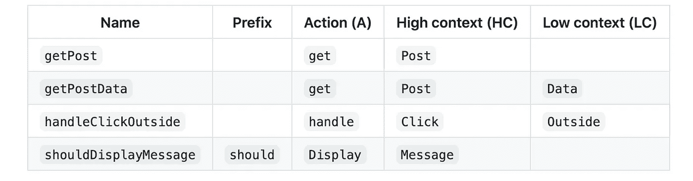

# 命名类、函数和变量的有用框架

> 原文：<https://betterprogramming.pub/a-useful-framework-for-naming-your-classes-functions-and-variables-e7d186e3189f>

## *“计算机科学只有两个硬东西:缓存失效和事物命名。”—菲尔·卡尔森*


照片由 [Zaini Izzuddin](https://unsplash.com/@izzuddindanial?utm_source=medium&utm_medium=referral) 在 [Unsplash](https://unsplash.com?utm_source=medium&utm_medium=referral) 上拍摄

> 在计算机程序设计中，*命名约定*是一套规则，用于选择字符序列，作为标识符，在源代码和文件中表示变量、类型、函数和其它实体— [维基百科](https://en.wikipedia.org/wiki/Naming_convention_(programming))

给事物命名很难！

本文将重点介绍 A/HC/LC 命名方法，希望这能增强代码的可读性。

尽管这些建议可以应用于任何编程语言，但我们将在实践中使用 JavaScript 来说明它们。

# 什么是信用证？

本实践建议使用以下模式命名函数。

```
prefix? + action (**A**) + high context (**HC**) + low context? (**LC**)
```

# 什么是前缀？

前缀*增强了函数的含义。*

## `- is`

描述当前上下文的特征或状态(通常为布尔值)。

```
const color = 'blue'
const isBlue = (color === 'blue') // characteristic
const isPresent = true // stateif (isBlue && isPresent) {
  console.log('Blue is present!')
}
```

## `- has`

描述当前上下文是否拥有某个值或状态(通常为布尔值)。

```
/* Bad */
const isProductsExist = (productsCount > 0)
const areProductsPresent = (productsCount > 0)/* Good */
const hasProducts = (productsCount > 0)
```

## `- should`

反映与特定动作相关联的肯定条件语句(通常为布尔型)。

```
function shouldUpdateUrl(url, expectedUrl) {
  return (url !== expectedUrl)
}
```

# 动作是函数的核心

*动作*是你的函数名的动词部分。它们是描述函数功能的最重要的部分。

## `- get`

立即访问数据(即内部数据的快速获取器)。

```
function getFruitsCount() {
  return this.fruits.length;
}
```

## `- set`

以声明方式将值为`A`的变量设置为值`B`。

```
const fruits = 0function setFruits(nextFruits) {
  fruits = nextFruits
}setFruits(5)
console.log(fruits) // 5
```

## `- reset`

将变量设置回其初始值或状态。

```
const initialFruits = 5
const fruits = initialFruits
setFruits(10)
console.log(fruits) // 10function resetFruits() {
  fruits = initialFruits
}resetFruits()
console.log(fruits) // 5
```

## `- fetch`

请求数据，这需要时间(例如，异步请求)。

```
function fetchPosts(postCount) {
  return fetch('https://api.dev/posts', {...})
}
```

## `- remove`

从某处移走某物。

例如，如果您在搜索页面上有一个选择的过滤器集合，从集合中删除其中一个是`removeFilter`，而不是`deleteFilter`(这也是您在英语中自然会说的):

```
function removeFilter(filterName, filters) {
  return filters.filter(name => name !== filterName)
}const selectedFilters = ['price', 'availability', 'size']
removeFilter('price', selectedFilters)
```

## `- delete`

从存在的领域中彻底抹去一些东西。

假设你是一个内容编辑，有一个臭名昭著的帖子你想去掉。一旦你点击了闪亮的删除-发布按钮，CMS 就会执行一个`deletePost`动作，而不是`removePost`动作。

```
function deletePost(id) {
 return database.find({ id }).delete()
}
```

## `- compose`

从现有数据创建新数据。这主要适用于字符串、对象或函数。

```
function composePageUrl(pageName, pageId) {
  return `${pageName.toLowerCase()}-${pageId}`
}
```

## `- handle`

处理一个动作。通常在命名回调方法时使用。

```
function handleLinkClick() {
  console.log('Clicked a link!')
}link.addEventListener('click', handleLinkClick)
```

# 最后，是背景

一个*上下文*是一个函数操作的域。

功能通常是对某事物的动作。说明它的可操作域是什么——或者至少是预期的数据类型是很重要的。

```
/* A pure function operating with primitives */
function filter(predicate, list) {
  return list.filter(predicate)
}/* Function operating exactly on posts */
function getRecentPosts(posts) {
  return filter(posts, (post) => post.date === Date.now())
}/*Some language-specific assumptions may allow to omit the context. For example, in JavaScript it is common that filter operates on Array. Adding explicit filterArray would be unnecessary.*/
```

# 概括起来



GitHub 上的[命名备忘单](https://github.com/kettanaito/naming-cheatsheet)

# - 5 变量命名指南


照片由[杰伊·温宁顿](https://unsplash.com/@jaywennington?utm_source=unsplash&utm_medium=referral&utm_content=creditCopyText)在 [Unsplash](https://unsplash.com/s/photos/code?utm_source=unsplash&utm_medium=referral&utm_content=creditCopyText) 拍摄

> 这一节试图将重点放在命名变量的一些规则和协议上，这将提高代码的可读性。

## 1.跟着科学情报署走

名称必须是简短的、描述性的。

```
/* Bad */
const a = 5 // "a" could mean anything
const isPaginatable = (postsCount > 10) // "Paginatable" sounds extremely unnatural
const shouldPaginatize = (postsCount > 10) // Made up verbs are so much fun!
```

建议:

```
/* Good */
const postsCount = 5
const hasPagination = (postsCount > 10)
const shouldDisplayPagination = (postsCount > 10) // alternatively
```

## 2.避免收缩

不要使用缩写。它们只会降低代码的可读性。找到一个简短的、描述性的名字可能很难，但缩写不是不这样做的借口。例如

```
/* Bad */
const onItmClk = () => {}/* Good */
const onItemClick = () => {}
```

## 3.避免上下文重复

如果不降低名称的可读性，请总是从名称中删除上下文。

```
class MenuItem {
  /* Method name duplicates the context (which is "MenuItem") */
  handleMenuItemClick = (event) => { ... }

  /* Reads nicely as `MenuItem.handleClick()` */
  handleClick = (event) => { ... }
}
```

## 4.应反映预期结果

```
/* Bad */
const isEnabled = (itemsCount > 3)
return <Button disabled={!isEnabled} />/* Good */
const isDisabled = (itemsCount <= 3)
return <Button disabled={isDisabled} />
```

## 5.考虑单数/复数

像前缀一样，变量名可以是单数或复数，这取决于它们是保存单个值还是多个值。

```
/* Bad */
const friends = 'Bob';
const friend = ['Bob', 'Tony', 'Tanya'];/* Good */
const friend = 'Bob';
const friends = ['Bob', 'Tony', 'Tanya'];
```

## 6.使用有意义且容易发音的变量名

```
const yyyymmdstr = moment().format("YYYY/MM/DD");  // simply awful// Insteadconst currentDate = moment().format("YYYY/MM/DD");
```

这篇文章的灵感来自这个 [GitHub](https://github.com/kettanaito/naming-cheatsheet) 回购。快乐编码。

感谢阅读！