# 你可以编写的每一种测试的可视化教程

> 原文：<https://betterprogramming.pub/a-visual-tutorial-on-every-type-of-test-you-can-write-ec9b83edcf35>

## 所有类型的测试都在一个地方进行

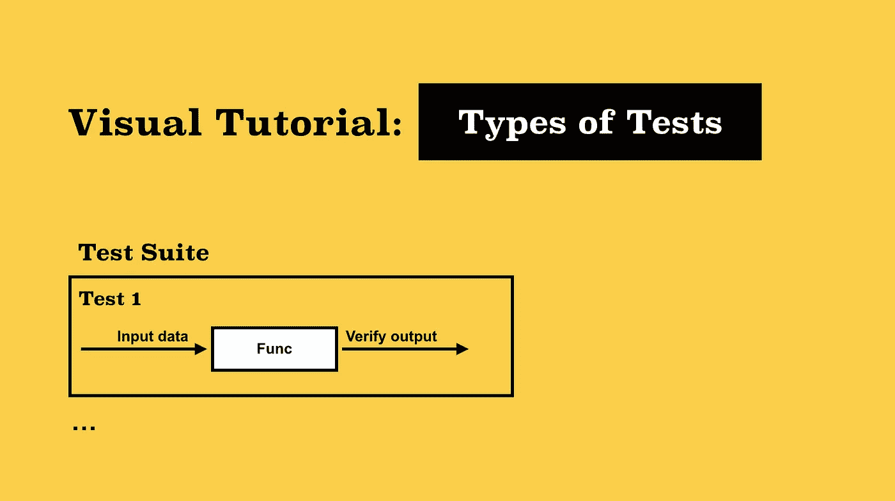

作者照片。

> 从理论上讲，每次修复后，都必须运行之前针对系统运行的整个测试用例库，以确保系统没有受到不为人知的破坏— [弗雷德·布鲁克斯，神话中的人月](https://en.wikipedia.org/wiki/Regression_testing)

一段时间以前，一位经理让我告诉他一个可靠的资源，在那里他可以找到集成和单元测试之间区别的清晰描述。我回答说，这是显而易见的，他可以在维基百科上找到这个描述以及堆栈溢出。

过了一会儿，经理给我发来一条消息，简短地描述了测试之间的差异，以重新检查并批准它。我感兴趣的是为什么这是必要的。原来其中一个软件开发人员辩称单元测试是主要方式，不需要集成测试。他也没有时间阅读关于这个话题的文章。因此，经理决定做一个简洁的描述，这将有助于改变开发者的想法。我建议他发一张会有视觉差异的图。研究一个视觉方案比阅读一篇文章更快，也许更有效。

我开始搜索这张图片，但我无法通过谷歌快速找到任何东西。最后，我自己在 MacBook 上用 Keynote 做了这个图表。

奇怪的是，这张图片很有帮助，开发者没有进一步的问题。实际上，这就是我写这篇关于不同测试类型可视化的小文章的动机。

# TST(全系统测试)

我喜欢 TST 哲学。没有不必要的测试。许多开发人员说他们没有时间进行某些形式的测试。想象一下，一位医生给你开了很多药，并建议你每天服用，但不看你的检查结果。或者想象一下买了一辆没有通过所有必要测试的汽车。或者在飞行前没有经过适当测试的飞机上飞行。情况不妙，对吧？

争取全面完整的系统测试总是必要的。是的，100%不可能，但努力争取是可以的。单元测试只检查系统中孤立的小部分。谁来检查他们的团队合作？谁来检查他们的通信？系统测试就是为此而开发的。供应情况如何？

通过提供带有公共 API 的服务，您必须用集成测试来测试这个 API。否则，每当有人对系统进行更改时，您都必须雇用一组人工测试人员。当然，开发人员会说那里一切正常。一切都是孤立的，这个终点没有触及其余部分。你认出你自己了吗？但是保障在哪里呢？因此，集成测试是系统稳定的保证。

同时，您应该记住，我们与企业合作，也是为了企业。在这种现实中，TST 是不可能的。用迈克·科恩的测试金字塔*或者肯特·c·多兹的测试奖杯更合适:*

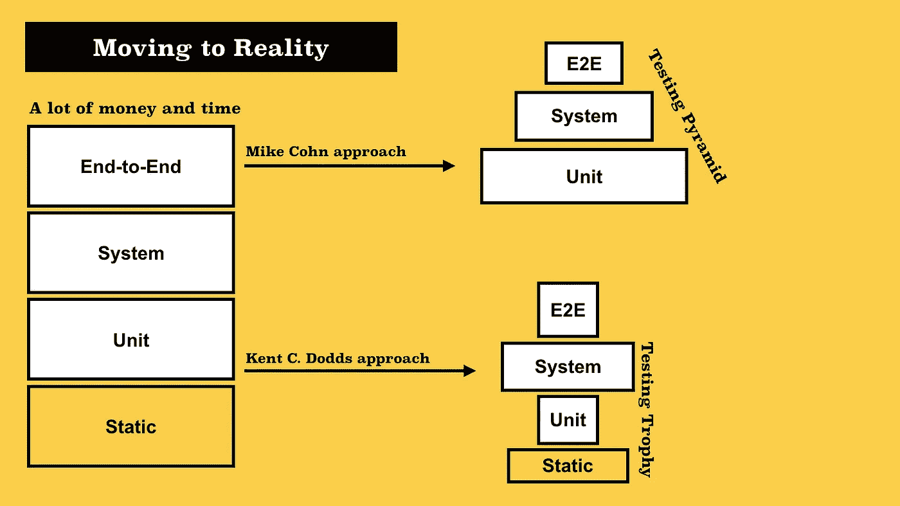

测试方法。

你应该记得:自动化应该像钢铁侠——而不是奥创。

我将为您提供一个测试列表，在我看来，这些测试应该由开发人员编写。不是自动化工程师。他们用可伸缩性测试、负载测试、压力测试、浸泡测试等来补充测试环境。我说的是我们，开发商。

# 单元测试、块测试或组件测试

单元测试用于测试逻辑分配和隔离的系统单元。在大多数情况下，它是一个类方法或一个简单的函数(尽管它可以是整个类)。被测单元的隔离是在短截线、模型和实物模型的帮助下实现的。

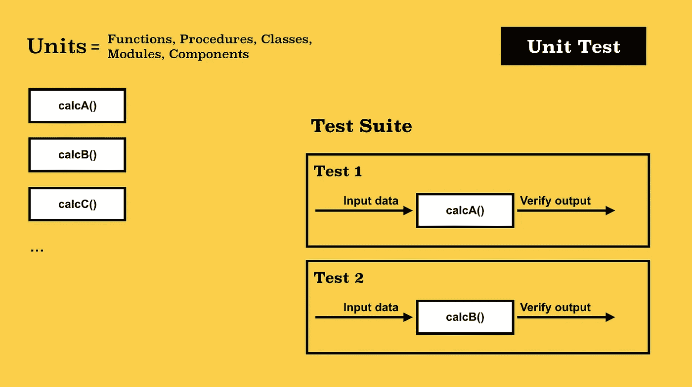

单元测试图。

# 系统测试或服务测试

> *"* 几年来，我一直成功地使用下面的
> 经验法则来安排软件任务:
> 
> 1/3 规划
> 
> 1/6 编码
> 
> 1/4 组件测试和早期系统测试
> 
> 1/4 系统测试所有组件在手”
> 
> - [弗雷德·布鲁克斯，神话人月](https://www.cs.drexel.edu/~yfcai/CS451/RequiredReadings/MythicalManMonth.pdf)

这是一个复杂的测试，一次测试几个组件。在这种情况下，系统被视为一个黑盒。我们可以说这是一个单元测试，其中模块是一组组件。这个包由一个提供适当 API 的外观联合在一起。这个 API 的方法是我们应该用测试来覆盖的。在`Stubs`、`Dummies`和`Mockups`的帮助下实现线束的隔离。借助所谓的`Spies`连接部件并检查它们之间的通信格式。

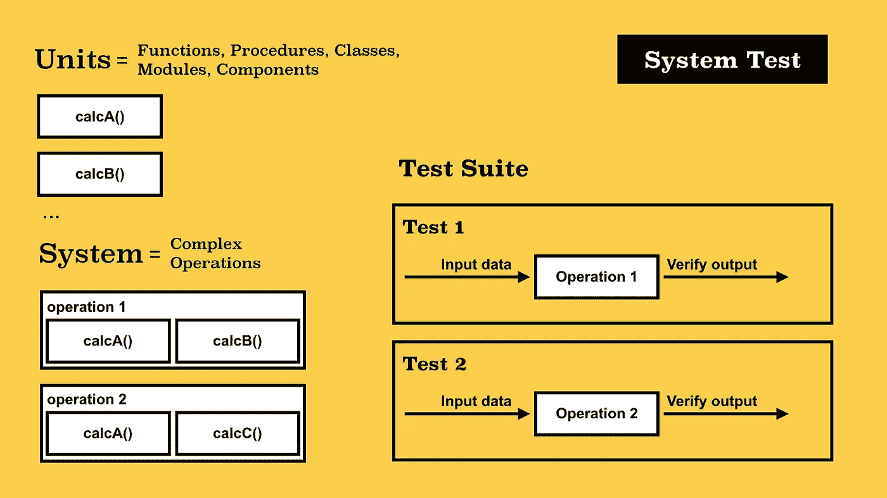

系统测试图。

# 集成测试、契约测试或 API 驱动的测试

其实这是一种系统测试。更常见的是，这个术语用于测试覆盖服务的公共 API。重点是根据“服务-客户”的原则测试不同系统的交互例如，数据访问层方法包含在系统测试中。系统测试还涵盖了调用计算业务信息(业务层)的函数的控制器方法。

但是 HTTP 请求的处理程序(调用控制器的方法)包含在集成测试中。对于这样的测试，请求应该以与该服务的最终用户相同的方式发出(例如，单页应用程序或使用 Postman/Swagger 的测试人员)。这意味着，实际上，对于这样的测试，有必要重新创建一个几乎全功能的环境。最困难的事情是隔离测试并生成测试数据。为了形成这样的环境，使用了`TestBed`和`Fixture`(脚手架)模板。

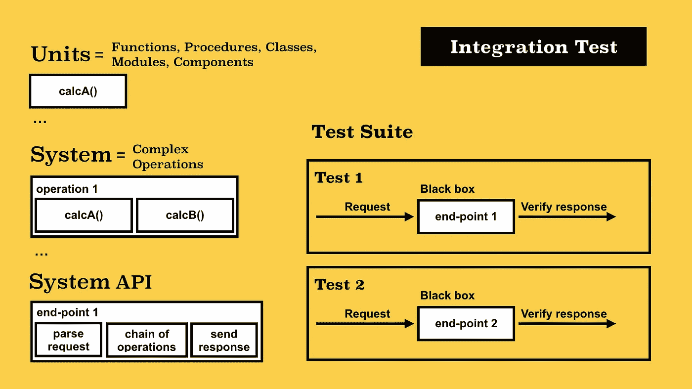

集成测试图。

# 功能或端到端测试、GUI 测试、走查测试

这是为了模拟系统最终用户的行为而开发的测试。实际上，您必须编写一个将在测试环境中使用您的系统的机器人。更常见的是，该术语用于 GUI(即用户交互和图形系统界面)。

使编写这样的测试变得更容易的最流行的模板之一是页面对象(屏幕对象)。一个好的实践是以无头浏览器的风格实现这样的测试，这样它们可以在没有图形界面的情况下作为 CI(持续集成)过程的一部分运行。这些测试大部分是由自动化工程师编写的，但是开发人员应该添加基本集。

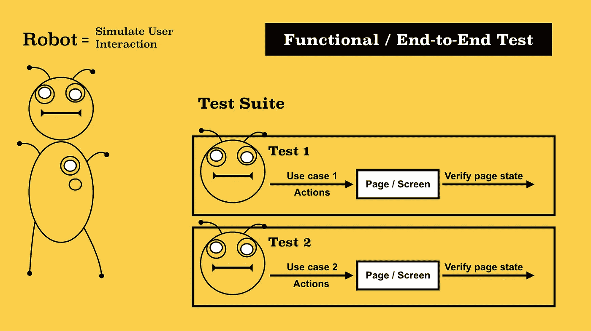

功能/E2E 测试图。

# 快照测试

快照是一种介于集成和功能测试之间的测试。大多数情况下，这些测试与用户界面及其组件相关，因为它们检查组件的可视化表示。但是，这种测试也可以应用于系统的其他部分，例如，检查数据库转储或代码转换结果。

测试的本质非常简单，使用专门的工具，我们创建一个 UI 组件或页面的参考图像(快照)——这实际上是渲染的结果。

在测试中，我们用特定的输入数据挂载一个 UI 组件，并在每次开始时创建一个新的快照。接下来，我们比较存储的快照和测试期间生成的快照。

快照可以是*文本*(一个带有 HTML 标记的文件，就像[玩笑中的快照](https://jestjs.io/docs/en/snapshot-testing))和*视觉*(事实上，这是一个截图——工具像[珀西](https://percy.io/) *、* [彩色](https://www.chromaticqa.com/) *或* [像素匹配](https://github.com/mapbox/pixelmatch))

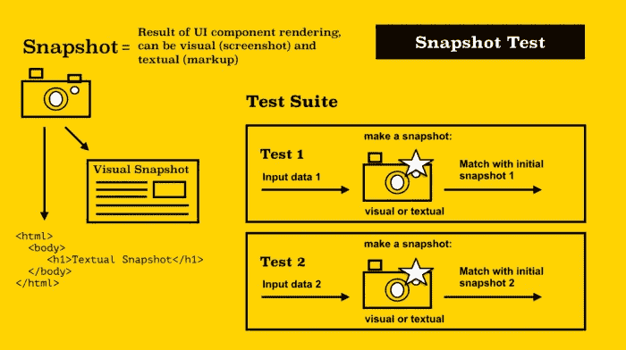

快照测试图

# 冒烟测试或健全性检查

这是集成测试的一个特例。通常，这些都是在系统启动前运行的非常小的测试，以确保第三方软件正常工作，这是系统正常运行所必需的。如果此类测试失败，我们可以通知用户有关问题或完全停止系统的启动。

> 冒烟测试起源于硬件测试，以确定给设备通电是否会导致设备开始冒烟，这表明存在重大问题— [有效的开发工作:建立大规模的协作、亲和和工具文化](https://books.google.ca/books?id=6e5FDAAAQBAJ&pg=PA186&lpg=PA186&dq=Smoke+tests+originated+with+hardware+testing+to+determine+whether+powering+on+a+device+would+cause+it+to+start+smoking,+an+indication+of+a+major+problem.&source=bl&ots=-XfcbaRU01&sig=ACfU3U2MPtDne2PbgjCTkU6I2odqT8oblw&hl=en&sa=X&ved=2ahUKEwip2d_92LPoAhUjc98KHWMDAGkQ6AEwAHoECAgQAQ#v=onepage&q=Smoke%20tests%20originated%20with%20hardware%20testing%20to%20determine%20whether%20powering%20on%20a%20device%20would%20cause%20it%20to%20start%20smoking%2C%20an%20indication%20of%20a%20major%20problem.&f=false)

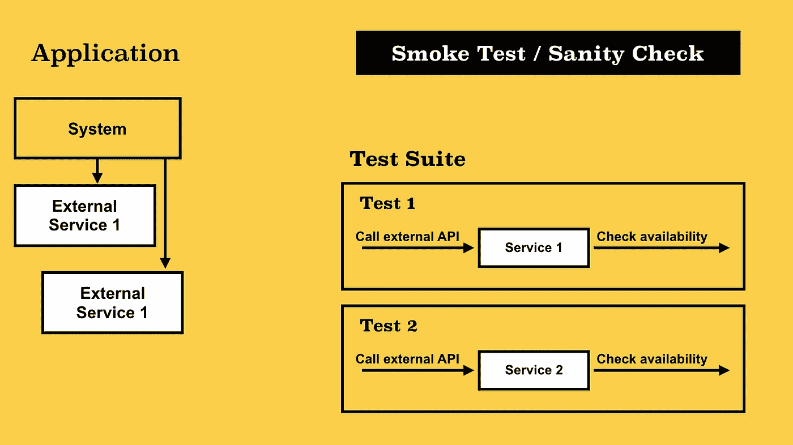

烟雾测试图。

# 学习测试

这是一种由客户开发人员(集成人员)编写的集成测试，作为研究他以后必须集成的系统的过程的一部分。

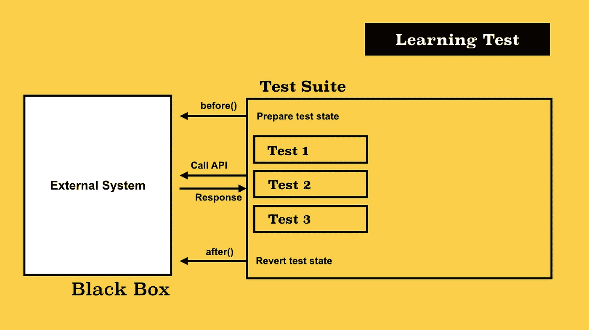

学习测试图。

# 回归测试

这可以是上面描述的任何一种测试，但是它是在检测到问题之后编写的。测试应该模拟完全相同的步骤来重现问题。在修复问题后进行这样的测试可以保证相同的错误不会再出现在系统中。

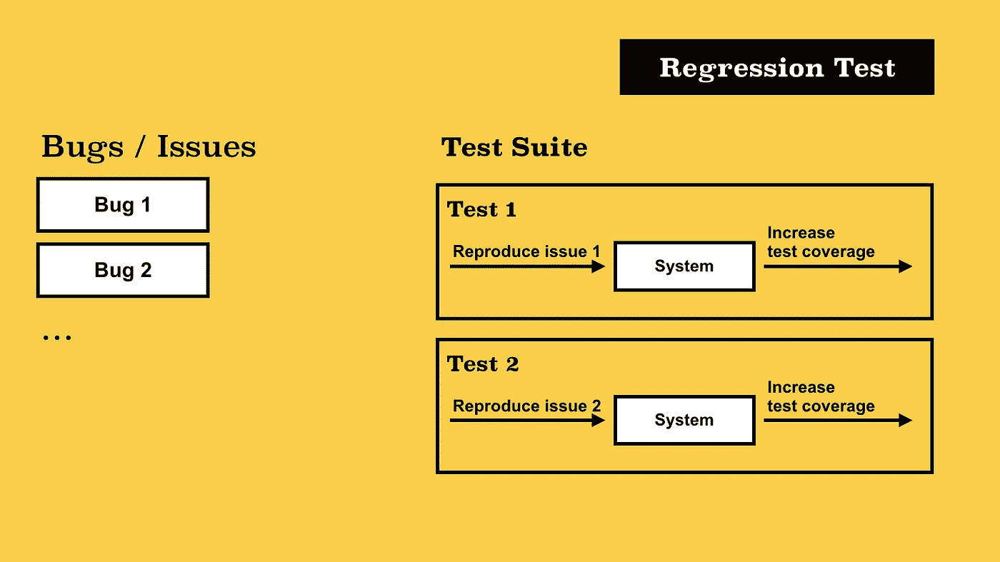

回归测试图。

# 验收测试或故事测试

这可以是上述测试中的任何一种。主要思想是，一个这样的测试对应于一个特定的用户故事(也就是说，验收测试的正面结果是一个保证，即您完全按照客户希望的方式实现了功能)。

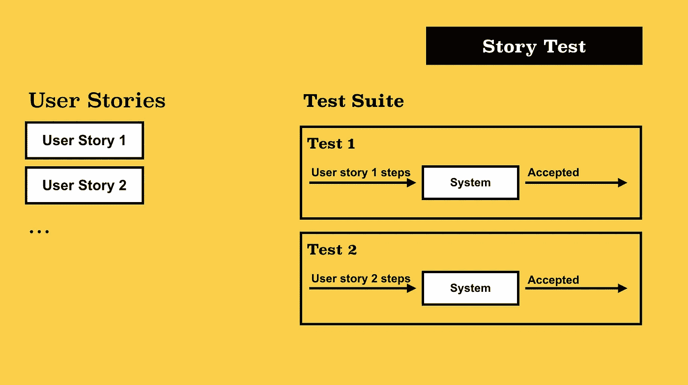

验收测试图。

# 渗透试验

系统检查各种漏洞。一个很好的例子是检查 SQL 命令的转义(注入保护)、数据可用性和使用过期令牌的授权等的测试。编写这样的测试的困难是所有瓶颈的原因。通常，关于平台的已知漏洞和利用的公开信息用于此目的。

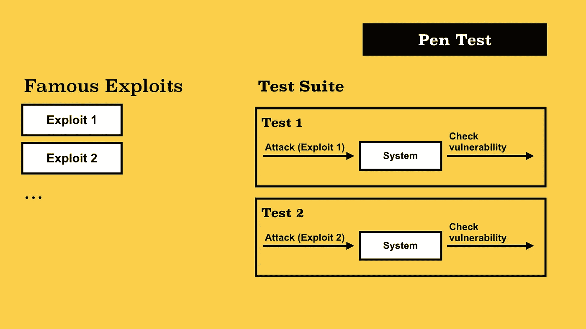

渗透测试图。

# 模糊测试，模糊测试，随机测试

这通常是一种系统测试或漏洞检查。其思想是将随机的、故意不正确的或意外的输入数据流输入到系统输入端。此测试的目的是尝试检测验证逻辑和验证的违反情况、边界情况下的应用程序逻辑、突然的服务器崩溃、尝试检测内存泄漏或通过未处理的错误消息(stacktrace)泄漏有关系统内部设备的信息。

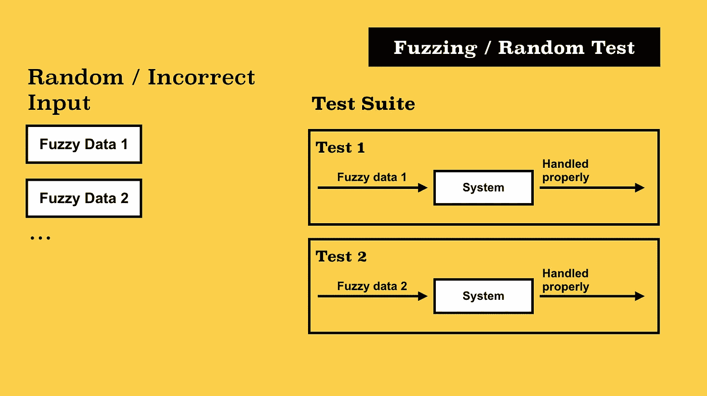

模糊测试图。

# 测试模式

`Stub (Dummy, Noop)`是一个类的函数或方法，它替换了原始函数的实现，并且在不执行任何有意义的操作的情况下，返回一个空结果或测试数据。

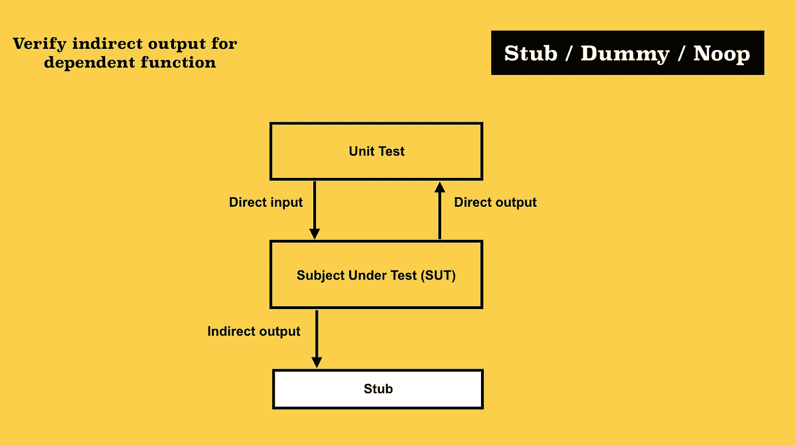

存根图。

`Mockup`是对象的实例，表示接口的特定虚拟实现。一般来说，实体模型旨在替代原始系统对象，仅用于测试被测组件的交互和隔离。通常，对象的方法是`Stubs`和`Dummies`。

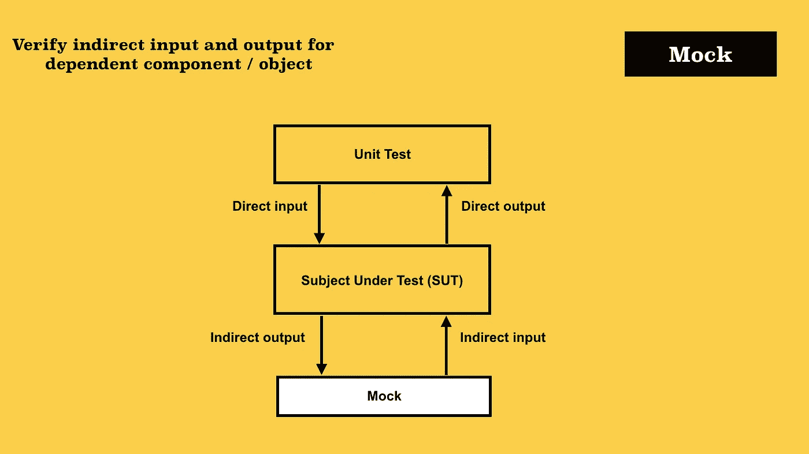

模拟图。

`Spy`是一个包装器对象，一种监听调用并存储原始系统对象的调用信息(参数、调用次数、上下文)的代理。此外，`spy`-保存的数据用于测试。

`TestBed`是专门重新创建的测试环境，一个测试的平台(可能是一组`Mockups`、`Stubs`、`Spies`)。它用于单个组件包或整个系统的复杂测试。也可以作为实验的操场。

JavaScript 中的例子有 [lab](https://github.com/hapijs/lab) 和 [hapi.js server.inject](https://hapi.dev/api/?v=19.1.1#-await-serverinjectoptions) ， [supertest](https://github.com/visionmedia/supertest) 和 [express.js](https://expressjs.com) app，组件的 [angular 2 testbed](https://angular.io/api/core/testing/TestBed) ，react.js 组件的 [enzyme](https://enzymejs.github.io/enzyme/) 和 [react-testing-library](https://testing-library.com/docs/react-testing-library/intro) ，sinonjs 中的[沙箱](https://sinonjs.org/releases/v1.17.6/sandbox)。

`Fixture` (Scaffolding)是将对象或整个系统带入某种状态，并固定这种状态进行测试的机制。通常，fixture 指的是正确启动测试所必需的测试数据，以及将这些数据上传/下载到存储库的机制(也就是说，fixture 的主要目的是将系统数据带到一个特定的状态——固定的——这将在测试执行过程中确切地知道)。

`Page Object`或`Screen Object`是一个结构重复页面元素的对象。对象提供了使用相应的 UI 页面(单击按钮、填充字段、切换到其他页面)和访问该页面上的信息(标题、各种文本、标签)的方法。这个领域最流行的工具之一是 [Selenium WebDriver](https://www.selenium.dev) 和它上面的各种包装器。

`Asserts`是一组函数，允许您比较两个或多个函数的结果。它可以提供深入比较结构的可能性，使用内省机制来检查对象是否存在某些属性。

# 结论

以上所写的一切都代表了我谦虚的主观看法和解释。你的呢？我很高兴在评论中看到它们。