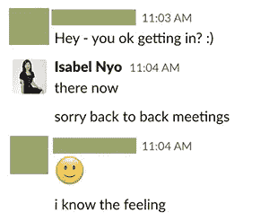
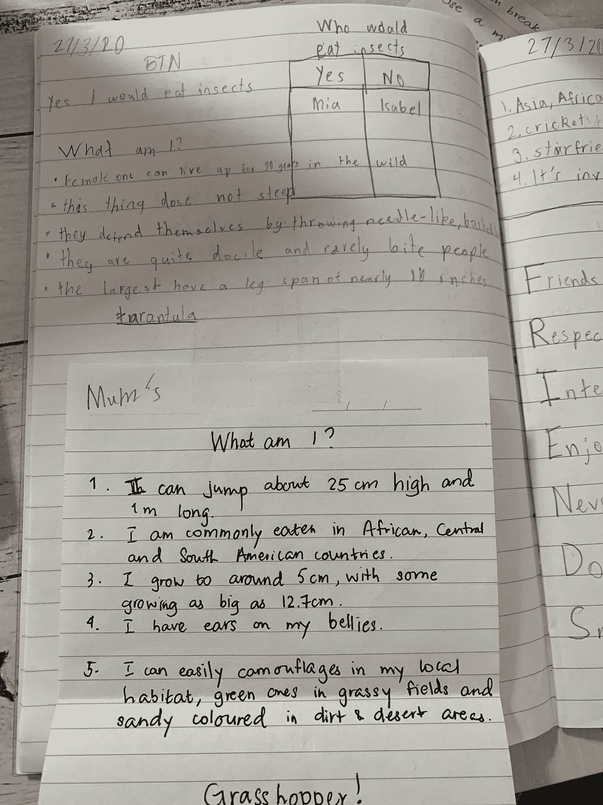
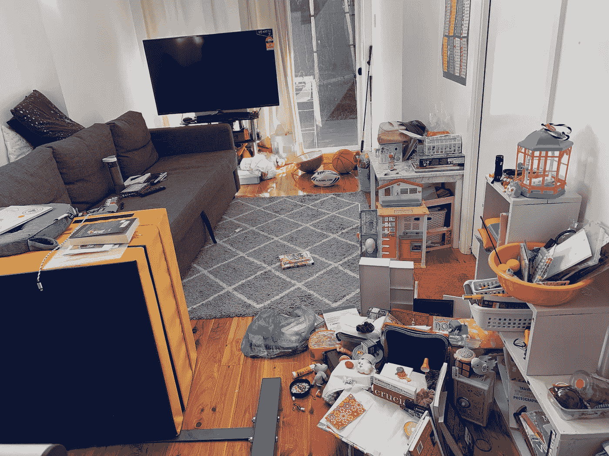
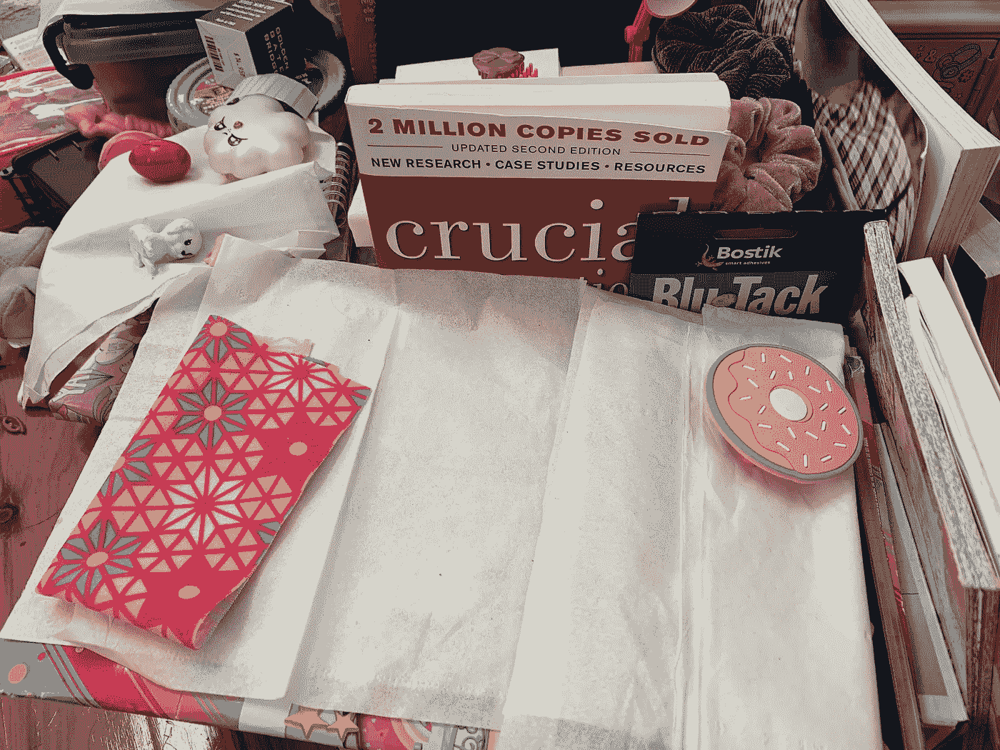
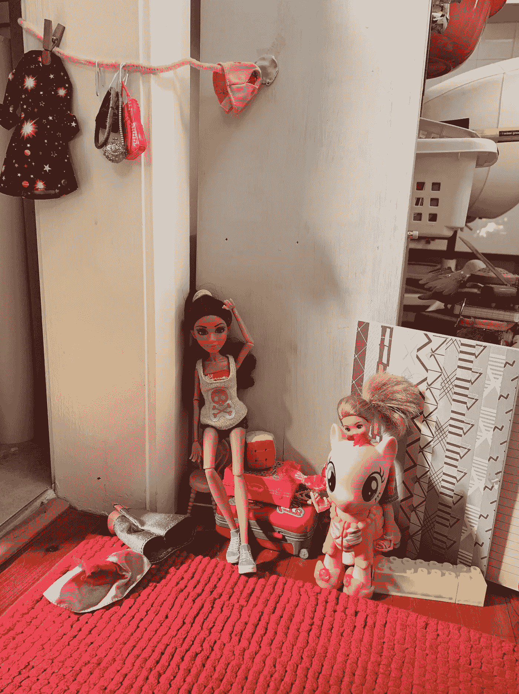
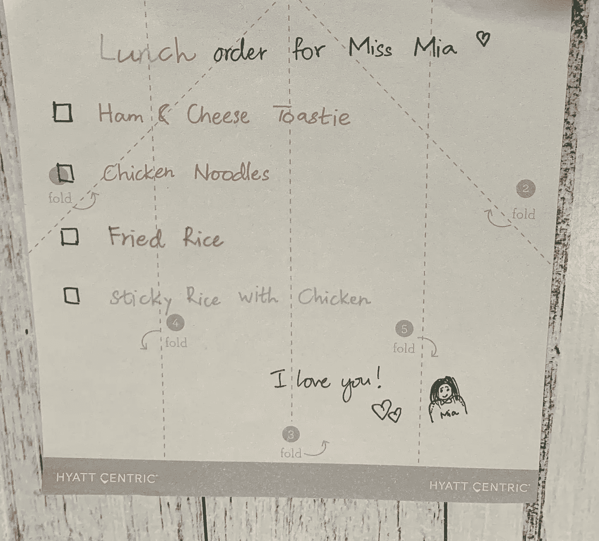
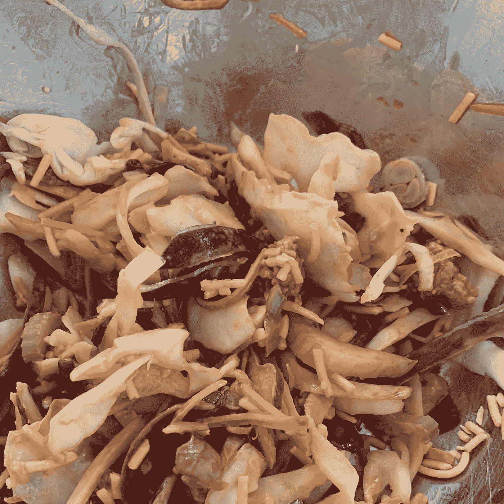

# 作为一名工程经理和母亲，在家工作和在家上学一周

> 原文：<https://betterprogramming.pub/a-week-of-working-from-home-and-homeschooling-as-an-engineering-manager-and-a-mom-c599839ec297>

## 我诚实地讲述了如何平衡我最重要的两项职责

凯文·巴加特在 [Unsplash](https://unsplash.com?utm_source=medium&utm_medium=referral) 上的照片

有很多关于远程工作和在家工作的资源(WFH)。同样，关于在家上学的孩子，有很多建议和忠告。这两个话题我都不是专家，但是我决定写这篇文章来分享我在家工作一周并在家教育我 7 岁女儿的经历，她现在上三年级。

我将使用一种流行的回顾格式来组织这篇文章——[4Ls](https://www.atlassian.com/team-playbook/plays/4-ls-retrospective-technique):热爱、学习、厌恶和渴望。使用这种 4Ls 格式的原因是为了突出积极的方面(喜欢和学习)以及消极的方面(讨厌和渴望)。因为让我们面对现实吧，无论一个人多么乐观或悲观，情况总是有好有坏。

所以没有任何进一步的麻烦，我的 4Ls。

# 我喜欢 WFH 和家庭学校的 4 件事

1.  我在早上有一两个小时的安静时间，通常是从早上 7 点到 9 点，不用急着出门。我利用这段时间为我的工作、我女儿的学校课程和我们的幸福设定一天的意图和目标。
2.  我期待着丈夫一下班回家就出门**(他的工作还没有开始 WFH——希望很快)。我们去散步，通常需要一个小时到一个半小时。别担心，我很重视社交距离，和其他人保持至少 2-3 米的距离。它帮助我理清思绪，欣赏生活给予我的更简单的东西，比如新鲜的空气，蔚蓝的天空，感觉微风拂面。**
3.  我不再在办公桌前不停地吃零食，而且**我做得更多了，**这意味着我的家人吃得更健康了。我们仍然一天晚上吃麦当劳，另一天晚上吃肯德基——所以一周两次外卖——但它们是急需的碳水化合物！
4.  我喜欢我现在和我女儿的学习和进步有了更多的联系。我开始真正了解她在学什么，她的学校课程是什么样的。

我晚上散步的景色

# 我从 WFH 和在家上学中学到的 4 件事

1.  连续的放大会议比连续的面对面会议更累人。即使使用了 Zoom，我有时还是会迟到，因为结束一个 Zoom 呼叫并拨入下一个呼叫需要时间。
2.  **管理者没有所有的答案；在这种时候，我们能做的最好的事情就是倾听和同情。有些人喜欢保持高效以保持理智，而有些人需要更多的个人时间来处理正在发生的事情。有些人真的需要把事情说出来。现在非常需要那些能够灵活调整以适应每个人需求的经理。**
3.  **在家上学也提高了我的常识。谁知道人们应该吃像蚱蜢、蟋蟀和蚕这样的昆虫，因为它们对环境无害并含有大量维生素和矿物质？**
4.  我学会了更多地信任——信任他人，信任过程，最重要的是，信任自己。例如，我有点怀疑在家教育我的女儿。我担心她会整天看着她的 iPad。但在我们开始之前，我采纳了一个众所周知的与孩子打交道的建议:我向她解释说，白天我将是她的老师。我会尽最大努力教她，我需要她尽最大努力学习——然后放学后她可以有几个小时的 iPad 时间作为奖励。到目前为止效果很好。

谁知道 zoom 会议会迟到呢？

谁会吃昆虫？我不要，谢谢。

# 我讨厌 WFH 和家庭学校的 4 件事

1.  我讨厌开会。我知道会议对经理来说是一种基本的罪恶，但是我真的需要在远程工作时更好地管理会议。与在办公室工作时相比，我参加了更多的 Zoom 会议。也许我不需要参加所有的会议。但是，如果我不参加会议，人们看不到我还在工作并且我很关心，我该如何表达我的支持和见解呢？
2.  我不断提醒自己，我可以给自己和女儿一点放松。如果我没有完成今天想做的事情，这并不是世界末日。即使我女儿喜欢画画，如果她不全身心地投入到绘画练习中，她也不会在学业上落后。最重要的是我们都活着，健康，安全。这些我都知道，但我还是觉得很难接受。
3.  我不喜欢不知道接下来会发生什么，或者我们什么时候能走出疫情的困境。尽管我很喜欢例行公事，但如果我必须坚持几个月，WFH 和家庭学校将变得很艰难。不知道能不能跟上。我讨厌当我应该关注现在的时候，却在考虑未来的不确定性。
4.  我房子的状况:我会让照片来说话。

在家自学一周后

《至关重要的对话》这本书构成了一堵非常坚固的长城

嗨，你好！

# 做 WFH 和家庭学校时我渴望的 4 件事

1.  **我想念我的通勤时间。**是真正放松的时候了，它成了我家庭和工作之间的桥梁。我没想到我会这么说，但是，是的，我错过了我的通勤时间。
2.  **我怀念我的工作提供的免费午餐和健康小吃，以及咖啡馆里的咖啡师咖啡。这些天，我正努力和速溶咖啡交朋友。**
3.  我希望我有无限的智力和精力去创造，去做我想做的事情。我发现到下午 6 点的时候我已经很累了，所以我几乎不能做别的事情。我怀念我的*制造者*时代。
4.  **我渴望与同事和朋友进行明智的对话**这并不是说我们在做什么，我们如何跟踪各种项目，我们感觉如何，我们是否健康和安全，等等。我也怀念仅仅是一个母亲，知道我的女儿在学校学习她需要学习的任何东西，享受她在家的时光。现在，我既是母亲又是老师，对她的幸福和学习都负有责任。

我本周最有创意的作品

我的不免费，不热的午餐

# 最后的话

我实际上没有任何最后的话或建议。就像你一样，在困难时期，我不断尝试和试验对我自己、我的家庭和我的团队有用的东西。然而，如果我要留给你们一些东西来帮助你们正确看待事物，我想给你们引用查尔斯·达尔文的话:

> “幸存下来的不是最强壮的物种，也不是最聪明的物种。是最能适应变化的一种。”

注意安全！