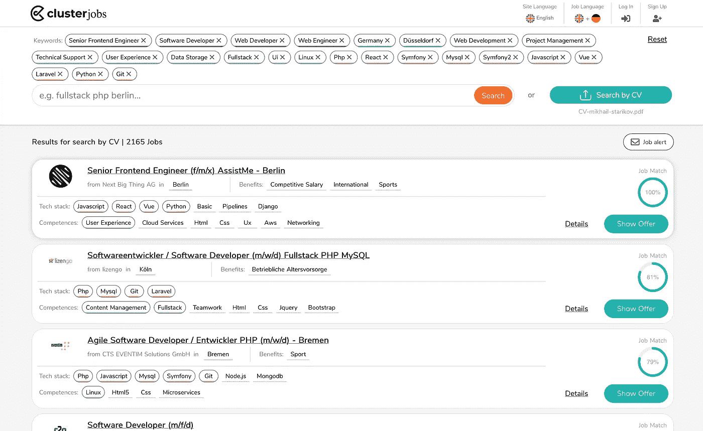
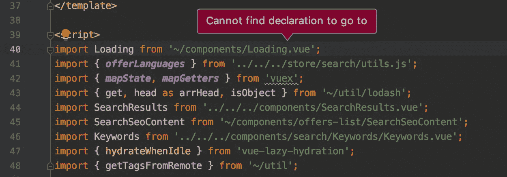
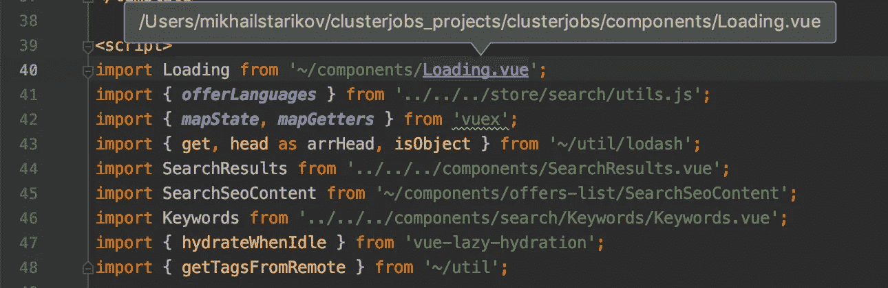

# Nuxt.js 一年——对框架的真正回顾

> 原文：<https://betterprogramming.pub/a-year-with-nuxt-js-geninue-review-of-a-framework-2564ab230495>

照片由[亚历山大·戈德罗](https://unsplash.com/@alexandre_godreau?utm_source=unsplash&utm_medium=referral&utm_content=creditCopyText)在 [Unsplash](https://unsplash.com/s/photos/mountain-home?utm_source=unsplash&utm_medium=referral&utm_content=creditCopyText) 拍摄

一年多来，我每天都在用 [Nuxt.js](https://nuxtjs.org/) 工作。

在这篇综述中，我将尝试总结使用这个框架的所有起起落落。希望这篇文章可以说服您在新项目中尝试 Nuxt，同时注意一些注意事项。

## TL；速度三角形定位法(dead reckoning)

*   我每天在 Nuxt 工作已经有一年了
*   Nuxt 对于生产来说非常方便和神奇
*   Nuxt 是可扩展的，有很多特性，并且是由一个巨大的有才华的社区驱动的
*   Nuxt 确实有一些警告，对此我已经建立了一些变通办法

## 利益

*   表演的
*   结构
*   社区
*   文档(测试指南、部署指南)
*   模块(i18n、网站地图、SVG、Apollo、Axios、PWA、Sentry、GA、GTM)

## 警告

*   共享状态问题(节点问题)
*   和 Heroku (i18n 多域，网站地图)
*   `this`到处都是
*   微弱的`rx.js`支持

在我开始之前有一句话:我不知道它是否有意图，但我只是喜欢 Nuxt 的标志是一座山——就像你在一堵可靠的墙后面。

Nuxt 山脉标志

# 项目

首先，我想简单介绍一下这个项目。

一年前，2018 年 10 月，我的朋友[总而言之，相关性有时很差——对必需的编程技能和软技能的认识本身就是一个问题。](https://medium.com/u/4b902866d8d0#，ASP.net 等等)。

 commit -> store，那么由于某种原因，数据是混合的。

我承认，我没有调查真正的原因——可能是 Vuex 商店的某个全局对象或类似的东西，但问题是当我让我的应用程序为第一个请求运行时，每个下一个请求都有它的状态。因此，你可能最终会登陆[“全栈开发者”招聘页面](https://en.clusterjobs.de/search/fullstack developer)，并获得机器学习工程师的结果。

解决方法是:

直接从 fetch 函数提交

所以动作->返回获取->提交->状态。该操作应该返回一个用正确数据解析的承诺，您可以在 fetch 函数中使用它。

此后，`commit`调用可能会接近`fetch`的末尾，页面会有正确的数据，但一般问题可能仍然存在。

## Heroku 和 is-https

我使用 Cloudflare for DNS 和 Heroku 作为服务器托管应用程序。将域名指向 Heroku 是通过 CNAME 完成的，这给我带来了一些问题。

Nuxt (sitemap，i18n)的几个模块使用 is-https 库在服务器端识别请求的类型。对 Cloudflare 的请求是 HTTPS，但代理可能不是。我在这方面得到了 CMTY 的一些建议。

启用`x-forwarded-proto`应该有帮助，不过我还没试过。

## 到处都是这个

我个人喜欢用 JS 编写函数代码。用 Nuxt 是可以的，但是所有的模块都让你用`this`。

想在 Vuex 商店或组件中找到当前的语言环境吗？`this.app.i18n.locale`切换区域设置和获取所有区域设置列表也是如此。

想在 Vuex 中换页？`this.router.push`

我可以接受这一点，但是将这些对象作为函数内部的参数也可以有利于更好的代码分离。

## Rx.js

我喜欢 RX，尤其喜欢将它应用到状态管理用例中。RX 可以集成到 Vue 中——如果我们谈论 DOM 事件的话，也可以集成到 Nuxt 中。有[这个包](https://github.com/vuejs/vue-rx)。

要将其集成到 Nuxt 应用中，只需创建一个插件，如下所示:

将这个文件放入 plugins 文件夹，并将插件添加到 nuxt.config.js 中

也有几次尝试将其集成到 Vuex 中，但到目前为止，回购已被否决。最近没看到任何关于这个的文章。

# 摘要

总而言之，我爱 Nuxt。我甚至为我的同事们准备了一个研讨会，并做了几次，以传播知识并鼓励他们尝试。

我认为这是一个非常成熟和发达的工具，可以满足任何需求。从简单的静态登录页面和个人网站到复杂的网络应用和电子商务平台，你都可以使用它。

我遇到了一些问题，这些问题是可以解决的，但我也经历了许多美好的时刻，一切都变得如此简单，而且运行得棒极了。我真的相信这个框架，并且深深地感谢那些创建了它并且还在维护它的人们。