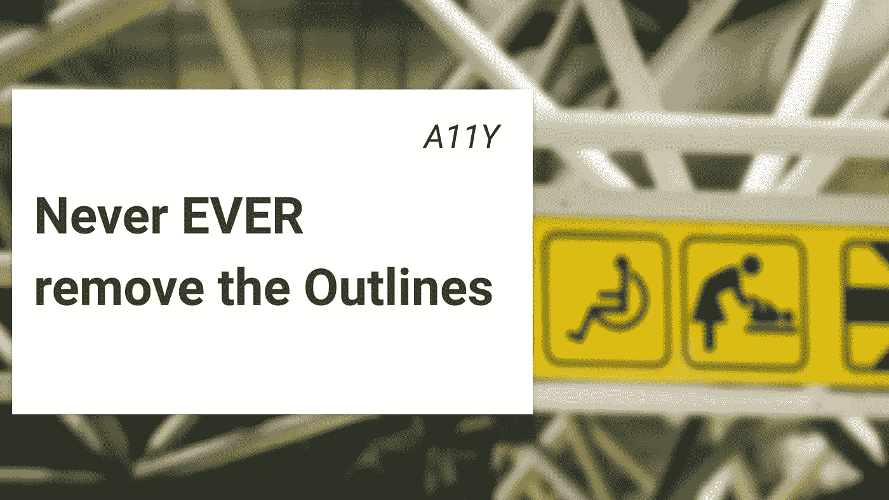
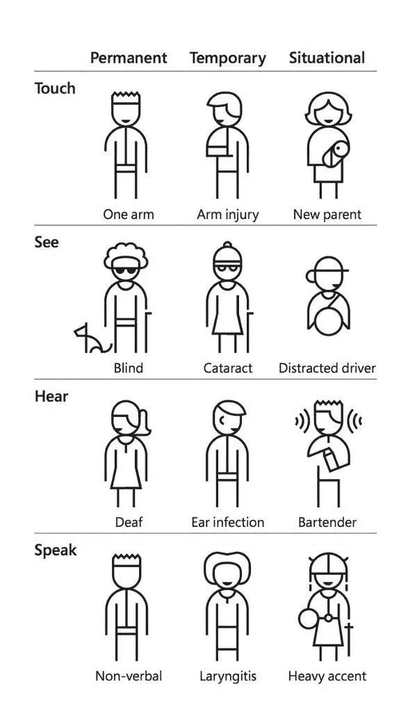
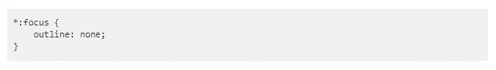
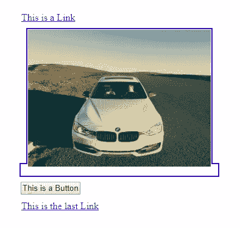

# 可访问性:永远不要删除轮廓

> 原文：<https://betterprogramming.pub/a11y-never-remove-the-outlines-ee4efc7a9968>

## 你会破坏网页的可访问性



# 什么是 Web 大纲？

轮廓是您在浏览器中聚焦的元素周围看到的浅蓝色边框。为了看得更清楚，您可以多次按 tab 键来了解您当前关注的是哪个元素。

## 我不想看大纲——这不酷

你通常不会说，“我不想看到这些楼梯上的栏杆。”你不会说，“我不想在这个面板上看到盲文。”
你不会说，“我讨厌这个给坐轮椅的人用的坡道。”

## 为什么我应该关心可访问性？

移除轮廓对可访问性(或 A11Y)非常不利。
无障碍环境影响着每个人，即使人们普遍认为这只是盲人的事。事实上，每个人都会受到影响，就像图中的人一样。



# 堆栈溢出是非常错误的

如果你说去掉轮廓很普遍，你是对的，但这只是我曾经也效仿过的不良行为。

这里有一个不好的[栈溢出答案](https://stackoverflow.com/questions/3397113/how-to-remove-focus-border-outline-around-text-input-boxes-chrome)。



这可不好

这个代码片段是您可以添加到 CSS 类中的最糟糕的东西——outline 设置为 none 或 0 会完全删除它。

努力使网站变得可访问让我意识到这些变化带来的问题，解决这个问题比解决问题更简单。

# 我们真的需要大纲吗？

是的，你可以删除它们，但你应该首先明白一件事:
你永远不应该删除轮廓，让用户使用键盘浏览页面。只使用键盘的人需要知道他们关注的是哪里；用鼠标或触摸你就不会有这个问题。

没有大纲，你就看不到你当前关注的是什么。

你可以试着拔掉鼠标五分钟，然后用键盘上的 tab 键上网。

在这个例子中，我关注汽车的图片链接:[https://codepen.io/Giorat/full/YzKMdEW](https://codepen.io/Giorat/full/YzKMdEW)。

在左边，我用堆栈溢出中的“提示”删除了每个轮廓。

在右边，有一个易接近的——你可以清楚地看到它的轮廓。

[](https://codepen.io/Giorat/full/YzKMdEW)[](https://codepen.io/Giorat/full/YzKMdEW)

# 我想用一种容易理解的方式去掉轮廓

这比您想象的要简单—只需添加这个 [JavaScript 代码](https://raw.githubusercontent.com/nuclei/unfocus/master/dist/unfocus.js):

使用这段代码，如果使用鼠标，您将删除轮廓，如果使用键盘，您将重新启用所有轮廓。

通过这段简单的代码，我们让两个用户都非常高兴。使用鼠标的人点击链接时不会看到蓝色的轮廓，使用键盘的人会清楚地看到一个好看的轮廓。

感谢 [unfocus 库](https://github.com/nuclei/unfocus)。

# Medium 也有这个可访问性问题

中型策展人:你应该告诉你的开发者考虑可访问性。

你会发现很难理解你现在关注的是什么。轮廓并不总是清晰可见的，并且在 CSS 文件中的各种元素中会多次出现隐藏的轮廓:

```
**.button:active,.button:focus {
    outline: 0;
    color: rgba(0,0,0,.84)
}**
```

我在 Medium 上发现了其他可访问性问题，我将在以后的文章中讨论这些问题。

没有人是完美的，但我们都可以尝试改善相互帮助——尝试对使用旧设备或具有不同可能性的其他类型的用户更加同情。

我认为网页可访问性很重要，作为网页开发人员，我们可以通过一些小技巧或日常工作的改变来改善它。

## 测试您的网站的可访问性问题！

有许多定制产品可以做到这一点，如 [TheUserIsBlind](https://www.producthunt.com/upcoming/theuserisblind) 将为您的网站提供[真人测试评估](https://www.producthunt.com/upcoming/theuserisblind)，以发现自动工具不会发现或发现的真正问题，因为您只需要[一个人](https://www.producthunt.com/upcoming/theuserisblind)！

# 资源和参考资料

*   [http://www.outlinenone.com/](http://www.outlinenone.com/)
*   [https://webaim.org/blog/plague-of-outline-0/](https://webaim.org/blog/plague-of-outline-0/)
*   [https://codepen.io/Giorat/full/YzKMdEW](https://codepen.io/Giorat/full/YzKMdEW)
*   [https://github.com/nuclei/unfocus](https://github.com/nuclei/unfocus)