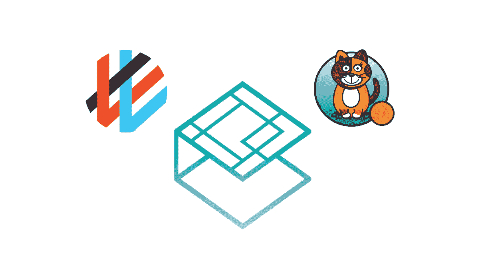

# 关于 Kubernetes 的 CNI 插件

> 原文：<https://betterprogramming.pub/about-kubernetes-cni-plugins-f0bcd60b5629>

## 揭秘 CNI 插件的使用



设置 Kubernetes 集群时，必须安装网络插件，集群才能运行。为了简单起见，网络插件的作用是建立网络连接，以便集群中不同节点上运行的 Pods 可以相互通信。根据插件的不同，可以提供不同的网络解决方案:覆盖(vxlan，IP-in-IP)或非覆盖。

为了简化网络插件的使用，Kubernetes 公开了容器网络接口(又名 CNI ),因此任何实现该接口的网络插件都可以使用。

Kubernetes 还允许使用非 CNI 网络插件 kubenet T1。这个是基本的，功能有限。

如果我们使用托管集群(有很多:[亚马逊 EKS](https://docs.aws.amazon.com/eks/latest/userguide/clusters.html) 、[谷歌 GKE](https://cloud.google.com/kubernetes-engine) 、[数字海洋 DOKS](https://www.digitalocean.com/products/kubernetes/) 、 [OVH 托管 Kubernetes](https://www.ovhcloud.com/en/public-cloud/kubernetes/) 、 [Scaleway Kapsule](https://www.scaleway.com/en/kubernetes-kapsule/) )，CNI 网络插件已经从许多现有的解决方案中选出并为我们安装。但是如果我们安装自己的集群，我们需要手动选择和安装插件。不过，一些外部工具，如 [Rancher](https://rancher.com/products/rancher/) ，让这个过程变得非常简单。

在这篇文章中，我们将介绍 CNI，看看一个网络插件是如何安装，配置和使用的。我们将遵循以下步骤:

*   集装箱网络接口快速介绍(CNI)
*   使用 Calico 插件设置 k0s 集群
*   用编织网插件建立一个 k0s 集群

# CNI——快速介绍


## 什么是 CNI？

根据[官方定义](https://github.com/containernetworking/cni)，

> “CNI (Container Network Interface)，一个[云本地计算基金会](https://cncf.io/)项目，包括一个规范和用于编写插件的库，以配置 Linux 容器中的网络接口，以及许多支持的插件。CNI 只关心容器的网络连通性，并在删除容器时移除分配的资源

CNI 是一个规范，也是该规范的一些参考实现。

CNI 规范目前版本为 0 . 4 . 0(2021 年 1 月)，可从官方 [GitHub 库](https://github.com/containernetworking/cni/blob/spec-v0.4.0/SPEC.md)获得。

CNI 插件(遵循 CNI 规范的网络插件)主要负责:

*   将网络接口插入容器
*   给这个接口分配一个 IP
*   删除容器时删除此接口

在幕后，插件是一个可执行文件，它必须实现几个方法(在未来的版本中可能会添加更多):

*   添加:向网络添加容器
*   DEL:从网络中删除容器
*   检查:确保容器的网络正常工作
*   版本:提供当前版本

## 一些参考实现

容器网络团队还维护了一组被分成几个类别的[参考实现](https://www.cni.dev/plugins):

*   创建几种类型的网络接口的主要插件
*   专用于 IP 地址分配的 IPAM 插件
*   更具体的插件

其中一些被其他 CNI 网络插件使用。

## 实施 CNI 规范的第三方网络插件

在参考实现之上，还有几个第三方 CNI 插件。其中最著名的有:

*   [印花棉布](https://www.projectcalico.org/)
*   [纤毛](https://cilium.io)
*   [编织网](https://www.weave.works/docs/net/latest/overview/)
*   [法兰绒](https://github.com/coreos/flannel)

更完整的列表可在 [Kubernetes 文档](https://kubernetes.io/docs/concepts/cluster-administration/addons/)中找到。

每个集群都需要安装一个第三方插件

每个插件都有自己的一套功能。根据工作负载要求(Kubernetes 网络策略的使用、数据平面的加密、低延迟等),这有时会使选择变得非常困难。).然而，这篇由 [CNI 规范](https://medium.com/u/56f781522ec8#network-configuration)，并且该文件中引用的任何 CNI 插件必须存在于/opt/cni/bin 中。Kubelet 负责读取 CNI 配置文件，并按照指定的方式调用插件二进制文件，因此它可以为每个 Pod 设置网络。

在下一部分中，我们将创建一个单节点 Kubernetes 集群，并在其上安装 Calico CNI 插件。

# 使用 Calico 运行 k0s


在[之前的一篇文章](https://medium.com/better-programming/k0s-kubernetes-in-a-single-binary-224bb43f4520)中，我们已经展示了 [k0s](https://k0sproject.io/) ，一个由multipass exec node1 sudo cat /var/lib/k0s/pki/admin.conf > k0s.cfg# Replace IP address
NODE_IP=$(multipass info node1 | grep IP | awk '{print $2}')
sed -i '' "s/localhost/$NODE_IP/" k0s.cfg# Configure local kubectl
export KUBECONFIG=$PWD/k0s.cfg

然后，我们可以检查群集单个节点的状态。

```
**$ kubectl get no** NAME    STATUS   ROLES    AGE    VERSION
node1   Ready    <none>   101m   v1.20.1-k0s1
```

节点的状态为 Ready，这意味着一切运行良好:Calico 网络插件已经正确配置和安装。

我们现在将仔细看看网络插件。在集群的每个节点上(在我们的示例中只有一个节点)，文件夹 `/etc/cni/net.d`包含一个描述网络配置的文件。正如我们在下面看到的，还有一个`kubeconfig`文件，它允许 calico 进程与 API 服务器通信。

```
**# ls /etc/cni/net.d/** 10-calico.conflist  calico-kubeconfig
```

如果我们看一下`.conflist`文件，我们可以看到它引用了几个插件:

```
**# cat /etc/cni/net.d/10-calico.conflist** {
  "name": "k8s-pod-network",
  "cniVersion": "0.3.1",
  "plugins": [
    {
      "type": "**calico**",
      "log_level": "info",
      "log_file_path": "/var/log/calico/cni/cni.log",
      "datastore_type": "kubernetes",
      "nodename": "node1",
      "mtu": 1450,
      "ipam": {
          "type": "**calico-ipam**"
      },
      "policy": {
          "type": "k8s"
      },
      "kubernetes": {
          "kubeconfig": "/etc/cni/net.d/calico-kubeconfig"
      }
    },
    {
      "type": "**portmap**",
      "snat": true,
      "capabilities": {"portMappings": true}
    },
    {
      "type": "**bandwidth**",
      "capabilities": {"bandwidth": true}
    }
  ]
}
```

在这些插件中，有两个被引用的实现可以在官方的 GitHub CNI 库中找到:[https://github.com/containernetworking/plugins](https://github.com/containernetworking/plugins)

*   **portmap** 将流量从主机上的一个或多个端口转发到容器(详细信息见文档[https://www.cni.dev/plugins/meta/portmap/](https://www.cni.dev/plugins/meta/portmap/))
*   **带宽**提供了一种使用和配置 Linux 流量控制(TC)子系统的方法(详细信息见文档[https://www.cni.dev/plugins/meta/bandwidth/](https://www.cni.dev/plugins/meta/bandwidth/)

另外两个插件来自 Calico 项目:[https://github.com/projectcalico/cni-plugin](https://github.com/projectcalico/cni-plugin)

*   **calico** 是顶级的 Calico CNI 插件
*   **calico-ipam** 控制 IP 地址如何分配给集群中的 pod

这个文件基本上定义了网络配置，并告诉 kubelet(读取这个配置的进程)需要调用哪些插件，以及必须如何调用。在`plugins`列表中的插件被顺序调用。

默认情况下，kubelet 从`/opt/cni/bin`文件夹中访问这些插件。列出我们单个节点上可用的插件，有一些在上面的配置文件中没有提到(法兰绒、主机本地、调优等等)。这些插件也由 Calico 提供(端口映射和带宽插件也是如此),因为如果不同的配置文件需要它们，它们可能会被使用。

```
**# ls /opt/cni/bin/** bandwidth
calico
calico-ipam
flannel
host-local
install
loopback
portmap
tuning
```

至于所有的 Kubernetes 网络插件，Calico 作为 DaemonSet 部署在集群上。上面列出的 CNI 网络插件是由这个守护进程中的一个`initContainer`安装的。感谢 Jussi Nummelin 指出这一点。

注意:在安装 Calico 之前，节点上既没有`/etc/cni/net.d`也没有`/opt/cni/bin`目录。

通过网络配置，kubelet 知道需要使用的 CNI 插件以及在哪里可以找到它们。每次运行一个新的 Pod 时，kubelet 调用专用插件将一个网络接口连接到 Pod，并为该接口分配一个 IP 地址。当一个 Pod 被删除时，kubelet 调用插件来释放 IP 地址并删除该 Pod 的网络接口。

在下一部分中，我们将再次使用 k0s 来创建一个单节点 Kubernetes 集群，但是这次我们将安装 Weave Net CNI 网络插件。

# 使用编织网运行 k0s


在这一部分中，我们遵循与上面相同的步骤:我们首先创建一个名为 node2 的新 VM，并在该 VM 上获得最新的 k0s 版本。

接下来，在运行单节点 k0s 集群之前，我们创建一个配置文件来告诉 k0s 不要安装 Calico，因为我们将在后面的步骤中安装 Weave Net 插件。我们在`.spec.network.provider`属性中设置值`custom`，并将该配置文件保存为`k0s.yaml`。

```
apiVersion: k0s.k0sproject.io/v1beta1
kind: Cluster
metadata:
  name: k0s
spec:
  api:
    address: 192.168.64.12
    sans:
    - 192.168.64.12
  network:
    provider: custom
```

注意:192.168.64.12 是使用多通道创建的虚拟机的 IP 地址。

如果 k0s 找到一个名为`k0s.yaml`的配置文件，它会自动使用这个文件，所以我们在命令行上运行集群时不需要指定它。

```
$ sudo k0s server --enable-worker
```

接下来，我们检查群集单个节点的状态:

```
**$ kubectl get no**
NAME    STATUS     ROLES    AGE   VERSION
node1   **NotReady**   <none>   18s   v1.20.1-k0s1
```

节点显示为`NotReady`，因为尚未安装 CNI 网络插件。我们可以在节点描述中获得更详细的错误消息:

```
**$ kubectl describe node node2** ...
Conditions:
  **Ready            False   Fri, 08 Jan 2021 14:05:17 +0100   Fri, 08 Jan 2021 14:04:47 +0100   KubeletNotReady              runtime network not ready: NetworkReady=false reason:NetworkPluginNotReady message:Network plugin returns error: cni plugin not initialized
...**
```

为了解决这个问题，我们将安装一个网络插件。在本例中，我们选择了编织网。根据文档，安装是通过运行以下命令完成的，该命令:

*   创建一个`ServiceAccount`
*   通过使用`Role` / `RoleBinding`和`ClusterRole` / `ClusterRoleBinding`赋予其一些权限
*   以恶魔集的身份运行编织网

```
**$ kubectl apply -f "https://cloud.weave.works/k8s/net?k8s-version=$(kubectl version | base64 | tr -d '\n')"**
serviceaccount/weave-net created
clusterrole.rbac.authorization.k8s.io/weave-net created
clusterrolebinding.rbac.authorization.k8s.io/weave-net created
role.rbac.authorization.k8s.io/weave-net created
rolebinding.rbac.authorization.k8s.io/weave-net created
daemonset.apps/weave-net created
```

Weave Net 的安装会在 `/etc/cni/net.d`的主机文件系统上自动创建一个配置文件。

```
# find /etc/cni/
/etc/cni/
/etc/cni/net.d
/etc/cni/net.d/10-weave.conflist
```

`/etc/cni/net.d/10-weave.conflist`文件定义了编织网网络插件的配置。如果我们仔细看看，我们可以看到它引用了几个插件:

```
# cat /etc/cni/net.d/10-weave.conflist
{
    "cniVersion": "0.3.0",
    "name": "weave",
    "plugins": [
        {
            "name": "weave",
            "type": "**weave-net**",
            "hairpinMode": true
        },
        {
            "type": "**portmap**",
            "capabilities": {"portMappings": true},
            "snat": true
        }
    ]
}
```

*   **编织网**是顶级编织网 CNI 插件
*   **端口映射**将主机上一个或多个端口的流量转发到容器(详细信息见文档[https://www.cni.dev/plugins/meta/portmap/](https://www.cni.dev/plugins/meta/portmap/)

Weave Net DaemonSet 的安装还会在主机文件系统的`/opt/cni/bin`中创建一些 CNI 二进制文件:

```
# find /opt/cni/
/opt/cni/
/opt/cni/bin
/opt/cni/bin/weave-plugin-2.7.0
/opt/cni/bin/weave-net
/opt/cni/bin/weave-ipam
```

注意:`weave-net`和`weave-ipam`是两个指向 weave-plugin-2.7.0 的符号链接。

有些二进制文件似乎丢失了——例如，`conflist`文件中引用的 portmap——但也有一些其他被间接使用的文件(例如 loopback)。后果就是所有非 DaemonSet 的豆荚还是`Pending`。

```
**$ kubectl get po -A** NAMESPACE     NAME                     READY STATUS  RESTARTS   AGE
kube-system   coredns-5c98d7d4d8-5pxs8 1/1   **Pending** 0          2m
kube-system   konnectivity-agent-gghlv 1/1   **Pending** 0          1m
kube-system   kube-proxy-557gw         1/1   Running 0          2m
kube-system   metrics-server-...       1/1   **Pending** 0          2m
```

如果我们仔细看看 dns pod，我们会发现这个问题的原因:环回插件丢失了。

```
**$ kubectl describe po -l k8s-app=kube-dns -n kube-system** ...
Warning  FailedCreatePodSandBox  8s (x11 over 2m17s)   kubelet            (combined from similar events): Failed to create pod sandbox: rpc error: code = Unknown desc = failed to setup network for sandbox "fcbf107aea021ba123c25ee746dbb59f37a3bc9687ac49287295ec805edc80f4": failed to find plugin "**loopback**" in path [/opt/cni/bin]
```

我仍然不确定谁应该负责运送 Weave Net 正常工作所需的插件。这应该是运行 Weave Net DaemonSet 时初始化步骤的一部分(如安装 Calico 时所做的)还是 k0s 应该确保的先决条件(如`kubeadm`所做的)？我认为第一种选择似乎更符合逻辑。

与此同时，我们可以通过从官方 GitHub 库获取插件并将其提取到`/opt/cni/bin`中来轻松解决这个问题。

[](https://github.com/containernetworking/plugins/releases) [## 包含网络/插件的版本

### 欢迎来到 CNI 社区插件的 v0.9.0。感谢@fedepaol，我们有了 VRF 链接插件，它将创建…

github.com](https://github.com/containernetworking/plugins/releases) 

注意:在这个例子中，我们复制了所有的插件，即使其中一些不一定被 Weave Net 使用。

```
# Get cni plugins
root@node2:~# curl -sSL -o cni.tgz https://github.com/containernetworking/plugins/releases/download/v0.9.0/cni-plugins-linux-amd64-v0.9.0.tgz# Extract the plugins into the /opt/cni/bin folder
root@node2:~# tar xvf cni.tgz -C /opt/cni/bin/
```

几秒钟后，我们可以验证 pod 是否正常运行。

```
**$ kubectl get po -A** NAMESPACE     NAME                     READY STATUS  RESTARTS   AGE
kube-system   coredns-5c98d7d4d8-5pxs8 1/1   Running 0          6m
kube-system   konnectivity-agent-gghlv 1/1   Running 0          5m
kube-system   kube-proxy-557gw         1/1   Running 0          6m
kube-system   metrics-server-...       1/1   Running 0          6m
kube-system   weave-net-pw9mz          2/2   Running 0          1m
```

# 结论

我希望这篇文章中的例子有助于揭开 CNI 插件的神秘面纱。不去探究插件是如何实现的细节(有这么多实现)，我认为重要的是看看这些插件是如何发布的，配置是如何提供给 kubelet 的，以及它们是如何被调用的。