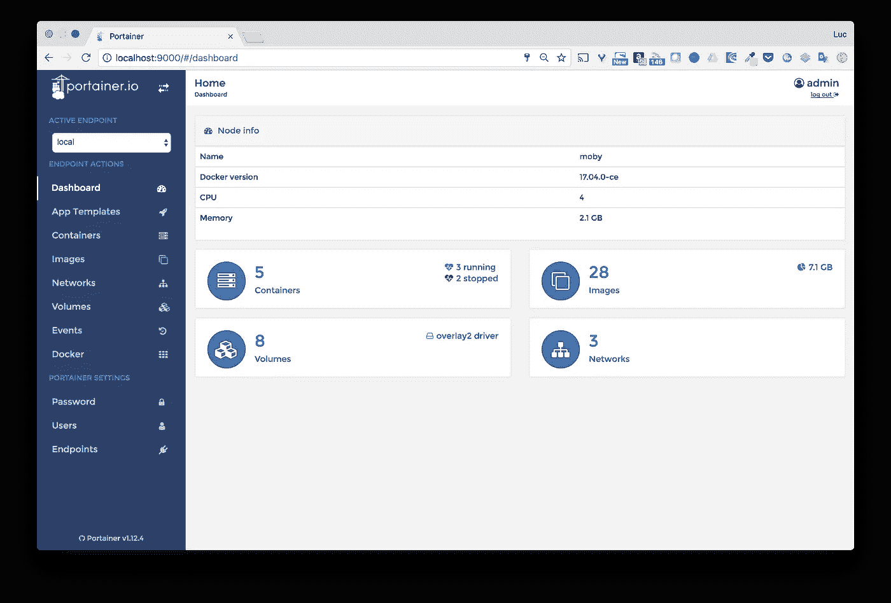

# Docker 提示:about /var/run/docker.sock

> 原文：<https://betterprogramming.pub/about-var-run-docker-sock-3bfd276e12fd>

## 从容器内与 Docker 守护进程通信


图片修改自[http://blog . honey badger . io](http://blog.honeybadger.io/how-unicorn-talks-to-nginx-an-introduction-to-unix-sockets-in-ruby/)

您可能已经从 Docker Hub 运行过容器，并注意到其中一些容器需要绑定挂载`/var/run/docker.sock`文件。这个文件是什么，为什么它有时被容器使用？简而言之:它是 Docker 守护进程默认监听的 Unix 套接字，可以用来从容器内部与守护进程通信。

让我们考虑一下 [Portainer](http://portainer.io/) ，一个用于管理 Docker 主机或 Swarm 集群的开源管理接口。如果用来管理本地 Docker 主机 Portainer 可以用下面的命令运行，绑定挂载主机的 Docker 的 Unix 套接字。

```
$ docker container run -d \
  -p 9000:9000 \
  -v /var/run/docker.sock:/var/run/docker.sock portainer/portainer
```

该界面在端口 9000 上可用，并允许您管理容器、映像、卷等。



为了完成所有这些管理操作，Portainer 通过绑定挂载访问的`/var/run/docker.sock`文件与本地 Docker 守护进程通信。

# **Docker 守护程序 API**

当 Docker 平台安装在主机上时，Docker 守护进程默认监听`/var/run/docker.sock` Unix 套接字。这可以从提供给守护进程的选项中看出；它应包含以下条目:

`-H unix:///var/run/docker.sock`

> 注意:可以为守护进程提供额外的 *-H* 选项，这样它也可以监听 tcp 主机/端口或其他 unix 套接字。

在 [Docker engine API v1.27](https://docs.docker.com/engine/api/v1.27) (最新版本)中定义的所有 HTTP 端点都可以通过这个 unix 套接字使用。

# **容器创建**

使用 Portainer UI，我们可以轻松地运行容器。在幕后，HTTP 请求通过`docker.sock`被发送到 Docker 守护进程。让我们用 [*curl*](https://curl.haxx.se/) *来说明这一点并创建一个 NGINX 容器。*

> 注意:使用 HTTP API 时，运行容器需要 2 个步骤:首先需要创建容器，然后才能启动它。

## *创建一个 NGINX 容器*

下面的命令使用 curl 通过 unix 套接字将`*{“Image”:”nginx”}*`有效负载发送到 Docker 守护进程的`*/containers/create*`端点。这将创建一个基于 NGINX 的容器，并返回其 ID。

```
$ curl -XPOST --unix-socket /var/run/docker.sock -d '{"Image":"nginx"}' -H 'Content-Type: application/json' [http://localhost/containers/create](http://localhost/containers/create){"Id":"fcb65c6147efb862d5ea3a2ef20e793c52f0fafa3eb04e4292cb4784c5777d65","Warnings":null}
```

## *启动容器*

使用上面提供的 ID，我们可以定位`*/containers/<ID>/start*`端点来启动新创建的容器。

```
$ curl -XPOST --unix-socket /var/run/docker.sock [http://localhost/containers/fcb6...7d65/start](http://localhost/containers/fcb65c6147efb862d5ea3a2ef20e793c52f0fafa3eb04e4292cb4784c5777d65/start)
```

我们现在可以验证 nginx 容器已经启动并正在运行。

```
$ docker container ls
CONTAINER ID IMAGE COMMAND CREATED STATUS PORTS NAMES
fcb65c6147ef nginx “nginx -g ‘daemon …” 5 minutes ago Up 5 seconds 80/tcp, 443/tcp ecstatic_kirch
...
```

这说明了如何使用 Docker 插座从容器内容易地在罩后创建容器。显然，不会使用 curl 来创建容器，但是您已经明白了。

# **来自 Docker 守护进程的流事件**

Docker API 还公开了`*/events*`端点，可以用来获取守护进程生成的所有事件的流。例如，负载平衡器可以使用它来获取容器的创建或删除事件，这样它就可以动态地更新其配置。

让我们运行一个简单的容器，并检查如何使用 Docker 守护进程事件。

# *运行阿尔卑斯山集装箱*

以下命令以交互模式运行 Alpine 容器，并绑定挂载`docker.sock`。

`$ docker run -v /var/run/docker.sock:/var/run/docker.sock -ti alpine sh`

## *监听来自 Docker 守护进程的事件*

从 Alpine 容器中，我们首先使用 apk 包管理器安装 **curl** 实用程序。

`# apk update && apk add curl`

然后，我们可以通过 Docker 套接字向`*/events*`端点发送 HTTP 请求。该命令挂起，等待来自守护进程的新事件。每个新事件都将从守护进程中流出。

`$ curl --unix-socket /var/run/docker.sock http://localhost/events`

# *观察事件*

然后，我们基于 NGINX 映像创建一个新容器，并通过 Alpine 容器标准输出来观察 Docker 守护进程生成的事件。

`$ docker container run -p 8080:80 -d nginx`

我们可以观察到前一个请求接收了几个事件。

基本上，发生了三件事:

*   容器的创建
*   到默认桥接网络的连接
*   容器的起点

# **总结**

我希望这个简短的解释能让你更好地理解`/var/run/docker.sock`文件，以及当 bind 装入容器时如何使用它。显然，使用这个套接字的应用程序不会使用 curl，而是使用专用的库来向守护进程发送 HTTP 请求。

注意:绑定安装 Docker 守护进程套接字赋予容器很大的权力，因为它可以控制守护进程。必须小心使用，并且只能使用我们可以信任的容器。