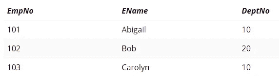
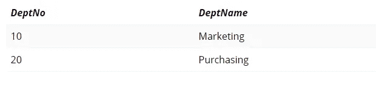
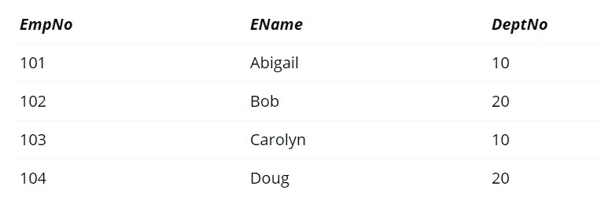

# SQL 初学者绝对指南

> 原文：<https://betterprogramming.pub/absolute-beginners-guide-to-sql-601aad53f6c9>

## 只需 10 分钟就能学会 SQL 的绝对基础知识


在 [Unsplash](https://unsplash.com/search/photos/woman-at-computer?utm_source=unsplash&utm_medium=referral&utm_content=creditCopyText) 上由[米米·蒂安](https://unsplash.com/@mimithian?utm_source=unsplash&utm_medium=referral&utm_content=creditCopyText)拍摄的照片

SQL 是最受欢迎的技能之一，不仅在 IT 行业，在银行和金融行业也是如此。这篇文章是为那些想了解数据库概念的人，或者那些只想在 SQL 世界中漫步并在简历中添加一项新技能的人准备的。

我们会学到什么？

1.  **数据库和 SQL**
2.  **SQL 风格**
3.  **SQL 查询**

所有这一切都在不到 10 分钟的时间内完成。

# 数据库和 SQL

数据超越了我们在这个时代感知技术的方式。据说每天都会产生大约 2.5 万亿字节的数据。万亿是一个大得难以理解的数字。仅在你的手机中产生的数据就非常庞大:关于电话、信息、脸书聊天、WhatsApp 信息、位置信息等等的信息构成了我们作为个人产生的所有数据的主体。再加上 **IOT，**目前最热门的技术，每秒钟就会产生数十亿字节的实时数据。这证明处理数据变得非常重要，这也是数据库发挥作用的地方。


来源:[https://www.usmaritimedata.com/fenthion-import-data-us](https://www.usmaritimedata.com/fenthion-import-data-us)

我们知道数据来自不同的地方，而且很可能是随机的。数据库是存储这些数据的地方，但是是有组织的结构。组织数据给了我们什么？易于管理！

> 数据库是一个允许数据被容易地存储、组织和管理的系统。

既然我们知道了什么是数据库，我们现在可以把重点放在 SQL 上了。它是**结构化查询语言的缩写。顾名思义，它仅仅是一种查询数据库的语言。**

在某种程度上，SQL 是与数据库接口的标准。它可以追溯到 20 世纪 70 年代，当时它最初是由 IBM 开发的。它最初被称为 SEQUEL(结构化英语查询语言)，因为它易于阅读和理解。它经过多年的发展，现在仍然是与数据库交互的最主要的方法。

> SQL 是与数据库通信的手段。

要掌握 SQL 的工作方式，需要对数据库有一个基本的了解。最简单地说，数据库由**行**和**列**组成，类似于电子表格，但是它更强大，有大量的特性。数据被分类并以表格的形式存储。例如:一家公司可能有一个包含两个表的数据库，一个表用于员工，另一个表用于部门。

一个**表**中的每一行被称为一个**记录**，一个**字段**列描述该行。在雇员表中，每一行都是一个独特的人，姓名、地址、部门等字段描述了这个特定的雇员。

## 关系数据库

关系数据库是数据库的一种结构形式，它将数据存储在表中，这些表可以以某种方式相互链接。在我们公司数据库的例子中，雇员表可以链接到部门表。这里的**关系**是员工属于一个部门。

在传统的关系数据库中，员工和部门数据可以表示为下面的两个表，其中 *DeptNo* 与部门表相关。



员工表



部门表

这里显而易见的优势是，如果采购部门决定将自己重命名为投资，只需要在一个地方进行重命名。

# SQL 的风格

SQL 已被广泛接受为数据管理语言，不同的供应商对这种语言及其功能有许多不同的实现。

以下是这些实现的简短列表:

T SQL :由微软开发，这是微软 SQL Server 中使用的专有过程语言。

**PL/SQL:** 是 Oracle 使用的过程语言。

**PL/pgSQL:** 是 PostgreSQL 使用的过程语言。

这些过程化语言旨在为 SQL 的现有功能添加更多功能，但是无论您选择什么，为了符合 ANSI 标准，基本的 SQL 查询在所有实现中都保持不变。

# SQL 查询

查询可以分为 DML(数据操作语言)和 DDL(数据定义语言)。

## **DML**查询

**选择:**该查询用于显示记录的集合。它相当于编程语言中的“打印”语句。

```
Select * from Employee — get all the records from employee table
```

**插入:**用于将数据插入表格。

```
Insert into Employee (EmpNo,EName,DeptNo)Values (104,'Doug',20)
```



添加新员工“Doug”后的员工表

**Update:** 更新表中现有值的语句。以下更新查询更改了名为 Doug 的雇员的部门:

```
Update Employee set DeptNo = 10 where EName  = 'Doug'
```

**Delete:** 如您所料，Delete 用于从表中删除记录。看来我们公司不太喜欢**道格:**

```
Delete from Employee where EName = 'Doug' - **he's fired**.
```

DML 查询在数据级别上操作。仅仅通过使用上面显示的四个 SQL 查询，您就可以非常详细地探索数据库。

## **DDL 查询**

**Create:** 用于在特定的数据库中创建一个新表。下面的查询创建了一个新表:Interns。也许道格还有机会。

```
Create table Interns (StudentId int ,Name varchar(50)) -creates new table Interns
```

**Alter:** Alter 是一个多功能语句，可以添加列、删除列、修改列、重命名列或重命名表。

```
Alter table Interns Add (DeptNo int) -adds new column DeptNo
```

**删除:**用于删除表格定义中包括**在内的所有**数据。下面的查询不需要解释。

```
Drop table Interns - O**ops!! Sorry Doug.**
```

与 DML 相反，DDL 查询在对象级别上操作，用于修改、添加或删除表和其他对象的定义。除了这两类，还有很多，像 DCL(数据控制语言)和 TCL(事务控制语言)。

本系列的下一篇文章将介绍一个使用 SQLite 的实践练习——请密切关注它！