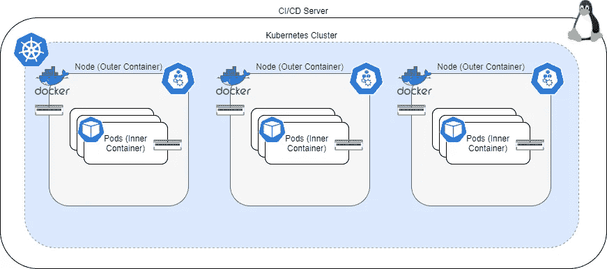
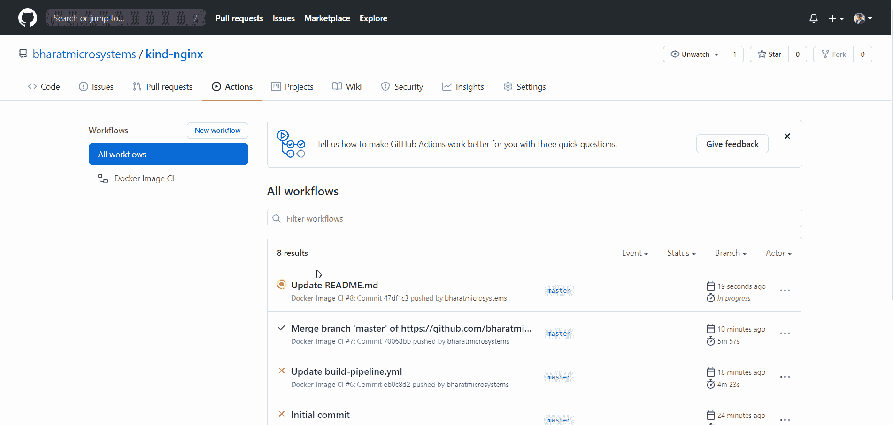

# 利用 Docker 中的 Kubernetes(KinD)加速您的 CI/CD 渠道

> 原文：<https://betterprogramming.pub/accelerate-your-ci-cd-pipelines-with-kubernetes-in-docker-kind-109a67b39c82>

## 通过一个实际操作的例子来理解亲切


由[克里斯·甘地](https://unsplash.com/@illxshutter?utm_source=medium&utm_medium=referral)在 [Unsplash](https://unsplash.com?utm_source=medium&utm_medium=referral) 上拍摄。

随着时间的推移，建立一个 Kubernetes 集群变得越来越简单。市场上有多种交钥匙解决方案，目前还没有人能做到这一点！

值得注意的是， [Minikube](https://kubernetes.io/docs/setup/learning-environment/minikube/) 已经成为开发人员快速开始开发和测试其容器的首选集群之一。虽然 Minikube 目前支持处于试验阶段的多节点集群，但它还没有正式发布。

因此，这成为集成和组件测试的一个限制，大多数组织依赖基于云的托管 Kubernetes 服务。

将 Kubernetes 集成到 CI/CD 管道中并进行测试需要多种工具，例如 Terraform，它是对云提供商的依赖，当然还需要一种 CI/CD 工具，例如 Jenkins、GitLab 或 GitHub。

虽然这些对于有预算的大规模公司来说是可行的选择，但开发人员通常会寻找一些可以让他们快速起步的东西。在云上启动 Kubernetes 集群也需要一些时间(大约 10 分钟)，这对于 CI 来说可能是一个障碍，因为您需要快速构建。

Docker 中的 Kubernetes，或 [KinD](https://kind.sigs.k8s.io/) ，是 Kubernetes 的 Docker-in-Docker (DinD)方法的一个实现。这个工具创建容器来充当 Kubernetes 节点，您所需要的就是在您的机器上安装 Docker。

它允许您在几分钟内启动一个多节点集群，而不依赖任何其他工具或云提供商。这使得它不仅对地方发展有用，而且对 CI/CD 也有用。

# 善良的建筑

Docker 中的 Kubernetes 使用 Docker-in-Docker (DinD)方法来运行 Kubernetes 集群。它旋转多个 Docker 容器作为 Kubernetes 节点。Docker 容器将`docker.sock`卷安装到运行在您机器上的 Docker 上，以允许与底层容器运行时进行交互。



善良的建筑(作者摄)。

KinD 使用 Kubeadm 来引导集群，并通过了 CNCF 的一致性测试和认证。它还为您用来引导集群的用户生成 Kube 配置文件，这允许您使用`kubectl`与集群进行交互。其他 Kubernetes 本地组件，如 Helm 和 Istio，在同类集群中也能很好地工作。

KinD 的一个缺点是它不能与`LoadBalancer`服务一起工作，因此你必须使用`NodePort`来对外公开你的服务。

另外，DinD 目前还不是一个非常安全的解决方案，所以不要在本地开发机器和 CI/CD 管道之外的任何地方使用 KinD 集群。千万不要在生产中使用实物！

# 安装类型

KinD 包含一个简单的命令行实用程序，您可以下载并移动到您的路径。然后，您可以使用`kind`命令与 KinD 交互:

```
sudo curl -sL [https://kind.sigs.k8s.io/dl/v0.9.0/kind-linux-amd64](https://kind.sigs.k8s.io/dl/v0.9.0/kind-linux-amd64) -o /usr/local/bin/kind
sudo chmod +x /usr/local/bin//kind
```

然后，您可以使用下面的命令创建集群:

```
kind create cluster --wait 10m
```

此命令将创建一个单节点集群。但是，如果您想要定义一个多节点集群，您可以使用如下所示的集群配置文件:

然后使用以下命令使用配置文件创建集群:

```
kind create cluster --wait 10m --config kind-config.yaml
```

您还可以通过在节点部分指定多个控制平面角色来创建多控制平面集群。

由于 KinD 会自动创建一个 Kube 配置文件，因此您可以像使用任何其他集群一样使用`kubectl`命令。

摆脱一个善良的集群也很简单。运行:

```
kind delete cluster
```

# 亲自动手

事不宜迟，让我们动手看看一个实际使用 KinD 的 CI/CD 管道。我们将使用 GitHub Actions 作为我们的 CI/CD 工具，因为它使用简单，不需要额外的基础设施，任何人只要有笔记本电脑和互联网连接就可以运行它。

让我们构建一个简单的 [NGINX](https://www.nginx.com/) 应用程序，它会说:“你好，世界。”

我们将执行以下操作:

1.  创建应用程序的开发版本。
2.  在 KinD 集群中运行组件测试。
3.  如果测试成功，我们会将映像升级为发布版本，并推送到 Docker Hub。

# 先决条件

*   GitHub 账户
*   码头中心账户

# 快速启动

1.  叉[这个](https://github.com/bharatmicrosystems/kind-nginx)仓库。
2.  去仓库创建两个秘密:`DOCKER_USER`和`DOCKER_PW`。这些秘密应该分别包含您的 Docker Hub 用户名和密码。
3.  转到 GitHub 操作并重新运行作业。或者，您可以对`README.md`文件进行修改，并推动它来触发动作。

# 长篇版本

让我们看看 GitHub Actions `build-pipeline.yml`文件来理解它的作用:

构建管道文件按顺序运行三个作业:

1.  `build-docker-image`作业构建 dev Docker 映像，并在成功构建后将其推送到 Docker Hub。您可以在此作业中运行您的单元测试。
2.  `kubernetes-component-test`作业建立一个 KinD 集群，并为应用程序运行一个组件测试。
3.  `promote-and-push-docker-image`作业提取开发映像，将其标记为发布版本，并将发布版本推送到 Docker Hub。

让我们看看 docker 文件，了解它在构建什么:

第二步是关键，运行一个 shell 脚本`build-test.sh`。现在让我们来看看 shell 脚本:

shell 脚本:

1.  在 CI 服务器中下载并安装`kind`实用程序、`kubectl`和`helm`。
2.  使用`kind-config.yaml`文件创建多节点集群。
3.  使用`docker build`构建开发 Docker 映像。
4.  在种类群集中加载 Docker 图像。加载意味着确保映像对所有种类的节点都可用，这样它们就不需要从 Docker Hub 获取映像。
5.  将容器作为部署进行部署，并将它们作为`NodePort`服务公开。
6.  获取节点 IP 和节点端口，并运行测试来检查应用程序是否返回“Hello World”
7.  如果测试成功，删除该类集群，回显“组件测试成功”，并返回一个成功代码。如果测试失败，将删除该种类群集并返回一个失败代码。

# 结果

当我们触发管道时，GitHub Actions 将自动运行整个管道:



毫无疑问，这是一次升级，是与 Docker 和 Kubernetes 进行持续集成和部署的无缝方式。Docker 中的 Kubernetes 不仅简化了我们进行本地开发的方式，而且也是一个优秀的 CI/CD 工具。

感谢阅读！我希望你喜欢这篇文章！