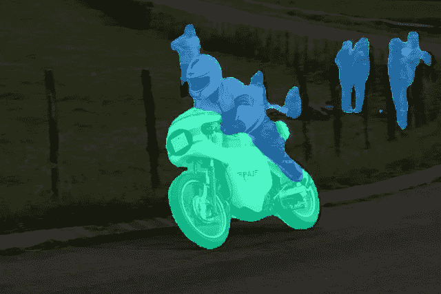
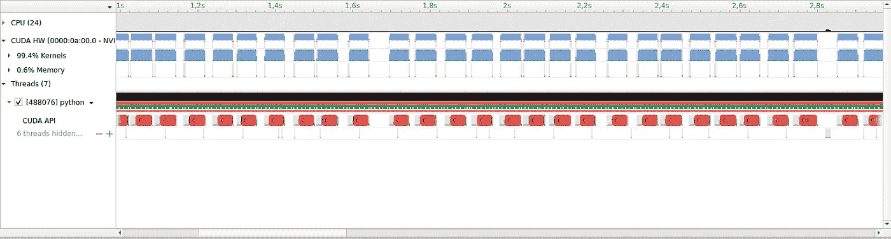
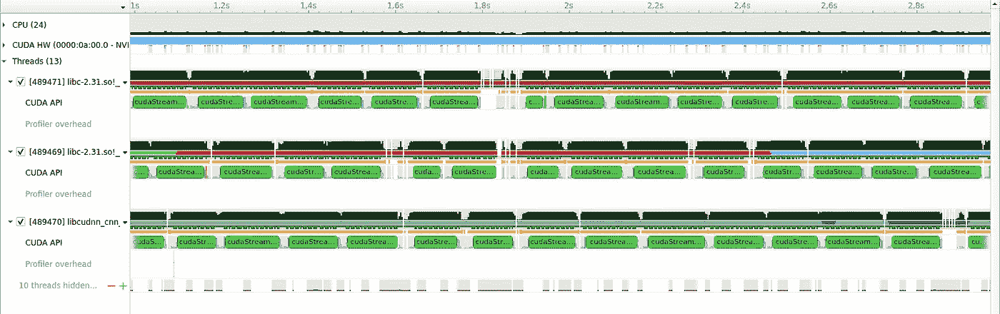

# 加速 CPU 和 GPU 异构 PyTorch 工作负载

> 原文：<https://betterprogramming.pub/accelerating-cpu-gpu-heterogenous-pytorch-workloads-dfc0744f2c6e>

## *…通过流水线处理 CPU 和 GPU 的工作*

照片由[约瑟夫·格雷夫](https://unsplash.com/@lime517?utm_source=medium&utm_medium=referral)在 [Unsplash](https://unsplash.com?utm_source=medium&utm_medium=referral) 拍摄

深度学习管道涉及在神经阶段产生的结果上运行的 CPU 操作并不罕见，通常在 GPU 上运行。无论是度量计算或其他自定义操作尚未移植到 GPU，甚至不适合 GPU。这种异构性给高效运行此类工作负载带来了额外的挑战。

这样的工作负载可能是在给定图像中寻找具有最大单个实例的语义类别，其中单个实例被定义为 2D 连通分量。该方法包括两个步骤:在 GPU 上运行语义分割网络，随后在 CPU 上通过其连接的组件对输出进行聚类。出于演示的目的，我们将假设集群部分还没有移植到 GPU，我们将使用 [skimage](https://scikit-image.org/) 。

作者更改了图像

以上是取自 [COCO 2017](https://cocodataset.org/) 数据集的一些图像示例，这些图像叠加了相应的语义分割遮罩。顶部图像中唯一检测到的对象类别是飞机，因此这是具有最大单个实例的类别。最下面一个，人比狗大，所以`person`是单个实例最大的类别。

这个比较棘手。虽然人很多，但没有一个人比摩托车大。

现在，让我们看看如何使用 PyTorch 和 skimage 解决这个问题。

我们首先实例化一个预训练的 DeepLabV3 模型，以及它相应的转换:

并定义一个函数来寻找给定类别图中最大连通分量的类别，其中每个单元对应于由模型为相应图像像素预测的类别 id:

我们分两步处理图像:首先，我们通过 DeepLabV3 传递图像，并将结果调整为原始大小。我将这个步骤称为 GPU 步骤，因为模型是在 GPU 上运行的。之后，我们将类别图复制到 CPU，并检测。同样，我将把这个步骤称为 CPU 步骤:

最后，我们使用 [Ignite](https://pytorch.org/ignite/index.html) 对整个数据集运行我们的逻辑:

这种方法行得通。然而，我的测试环境导致 GPU 利用率徘徊在 80%左右，因此有很大一部分计算机能力没有得到利用。使用 Nsight 分析脚本揭示了问题所在:

当 Ignite 为数据集中的每个项目按顺序运行 GPU 和 CPU 步骤时，GPU 处于空闲状态，而 CPU 正在处理 GPU 输出，蓝色条中表示 GPU 利用率的规则中断就是证明。我们可以通过使用多个 CUDA 流和 Python 线程来解决这个问题，以便 GPU 可以在完成当前批处理后立即开始处理下一批，同时 CPU 在其上运行连接组件集群。

为此，我们放弃 Ignite 引擎，开始使用自定义引擎，这可以在我在底部链接的源代码中找到:

其余的代码保持不变。让我们看看分析器时间轴是如何变化的。

那看起来好多了。GPU 现在被完全利用，如连续的蓝色条所示。注意这个脚本是如何使用多个 Python 线程的。

总体而言，在采用 NVIDIA GeForce RTX 2080 Ti 的系统上，这一变化在不改变输出的情况下将吞吐量提高了 45%。一个缺点是 GPU 内存使用量增加。在我的设置中，它从 2.4 GB 增加到 4.2 GB，所以如果你的 GPU 内存已经很低，这个技巧可能不可用。

你可以在这里找到完整的源代码。