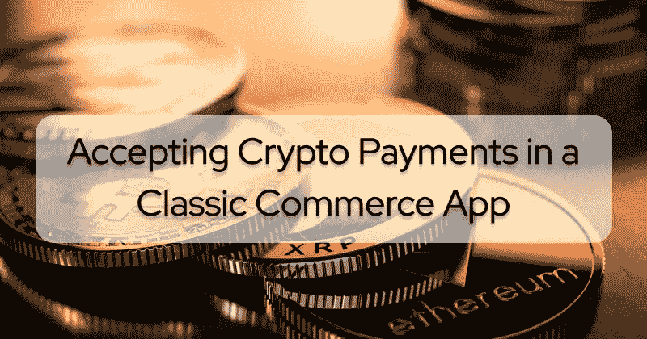
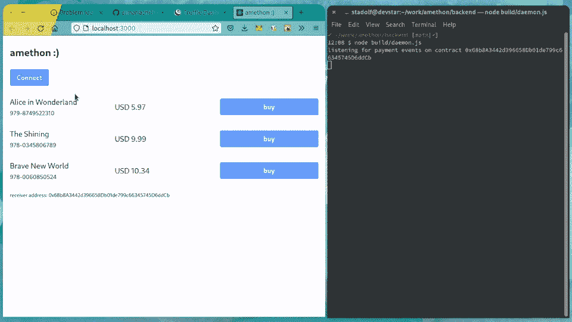
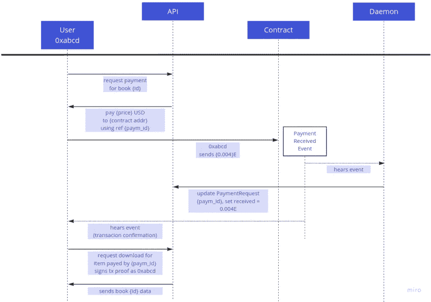
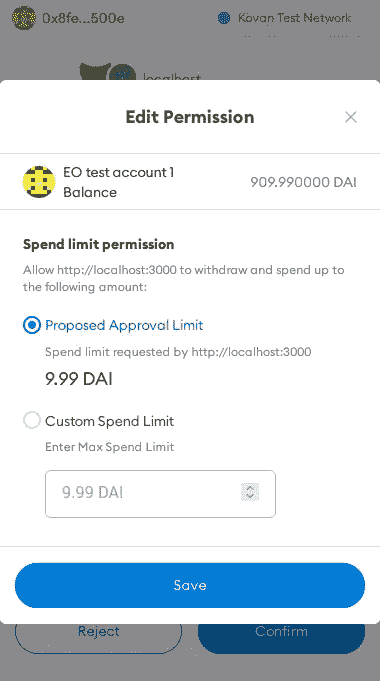
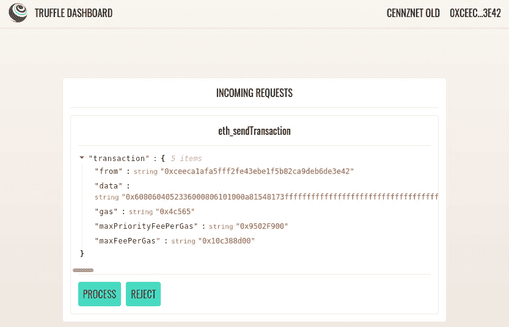
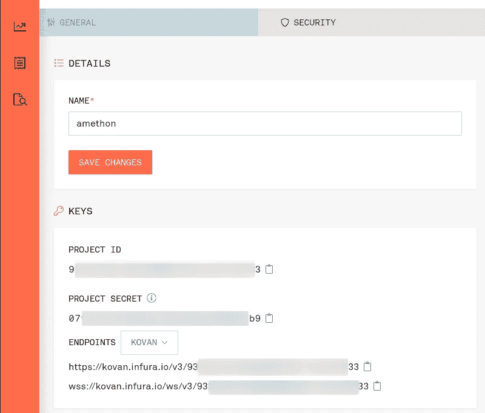
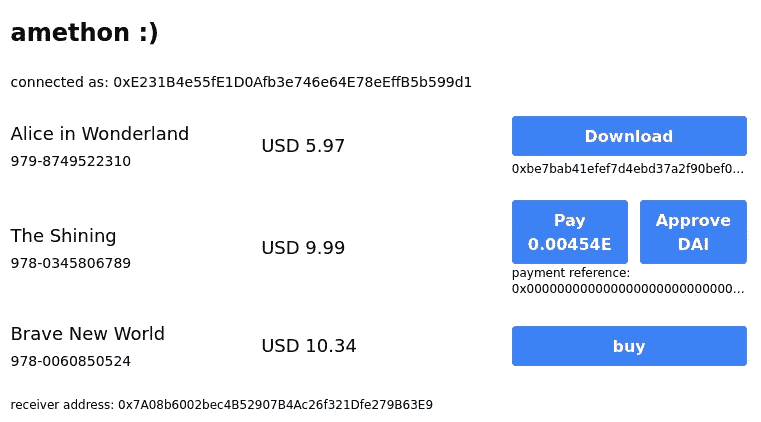
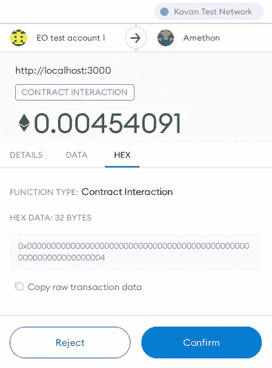
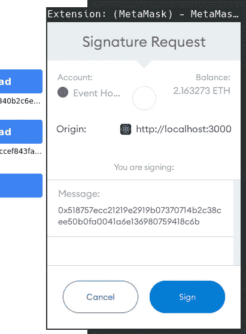

# 在经典商务应用中集成加密支付

> 原文：<https://betterprogramming.pub/accepting-crypto-payments-in-a-classic-commerce-app-6fcb64a968ce>

## 如何在不依赖第三方服务的情况下，在任何在线商店上集成定制的安全加密支付方法



电子商务商店在向顾客提供加密支付方式方面进展缓慢。加密支付插件或支付网关集成通常不可用，或者它们依赖第三方托管人来收集、交换和分发资金。考虑到加密货币的拥有率和实验率不断增长，一个“用加密支付”按钮可能会极大地推动销售。

本文演示了如何在不依赖第三方服务的情况下，将自定义的安全加密支付方法集成到任何在线商店中。编码和维护智能合同需要相当多的幕后工作，我们将这项工作移交给 Truffle suite，这是区块链建筑商常用的工具链。为了在开发期间和应用程序后端提供对区块链节点的访问，我们依赖 Infura 节点，这些节点以慷慨的免费层提供对以太网的访问。一起使用这些工具将使开发过程更加容易。

# 场景:阿梅顿书店

目标是建立一个可下载电子书的店面，接受以太坊区块链的本地货币(“以太”)和 ERC20 stablecoins(与美元挂钩的支付令牌)作为支付方式。从现在开始我们称它为“Amethon”。

完整的实现可以在附带的 [GitHub monorepo](https://github.com/elmariachi111/amethon) 上找到。所有代码都是用 TypeScript 编写的，可以使用包的`yarn build`或`yarn dev`命令编译。

我们将一步一步地引导您完成这个过程，但是熟悉智能合约、以太坊以及 Solidity 编程语言的少量知识可能会对您的阅读有所帮助。我们建议您先阅读一些基础知识，以熟悉生态系统的基本概念。



## 应用程序结构

商店后端是作为一个 CRUD API 构建的，它本身没有连接到任何区块链。它的前端触发该 API 上的支付请求，客户使用他们的加密钱包完成支付。

Amethon 被设计为一个“传统的”电子商务应用程序，它处理业务逻辑，除了支付本身之外，不依赖任何链上数据。在结帐过程中，后端发布带有唯一标识符(如“发票号”)的`PaymentRequest`对象，用户将该标识符附加到他们的支付交易中。

后台守护程序监听相应的合同事件，并在检测到付款时更新商店的数据库。



*Amethon 支付结算*

# 付款接收方合同

在 Amethon 的中心,`PaymentReceiver`智能合同代表店面所有者接受和支付款项。

每当用户向`PaymentReceiver`合同发送资金时，就会发出一个`PaymentReceived`事件，其中包含支付来源(客户的以太坊账户)、总价值、使用的 ERC20 令牌合同地址以及引用后端数据库条目的`paymentId`等信息。

```
event PaymentReceived(
    address indexed buyer,
    uint256 value,
    address token,
    bytes32 paymentId
  );
```

以太坊合约的行为类似于基于用户(又名“外部所有”/ EOA)的账户，并在部署时获得自己的账户地址。接收本地以太货币需要实现`receive`和`fallback`函数，当有人将以太资金转移到合同时调用这两个函数，并且没有其他函数签名与该调用匹配:

```
receive() external payable {
    emit PaymentReceived(msg.sender, msg.value, ETH_ADDRESS, bytes32(0));
  } fallback() external payable {
    emit PaymentReceived(
      msg.sender, msg.value, ETH_ADDRESS, bytes32(msg.data));
  }
```

[正式固化文档](https://docs.soliditylang.org/en/v0.8.11/contracts.html?highlight=receive#special-functions)指出了这些函数之间的细微差别:`receive`在传入的事务不包含附加数据时被调用，否则`fallback`被调用。以太坊的原生货币本身不是 ERC20 令牌，除了作为计数单位之外没有任何效用。然而，它有一个可识别的地址`(0xEeeeeEeeeEeEeeEeEeEeeEEEeeeeEeeeeeeeEEeE)`，我们用它在我们的`PaymentReceived`事件中发出以太支付的信号。

然而，以太传输有一个主要缺点:接收时允许的计算量极低。顾客发送的气体仅仅允许我们发出一个事件，但不能将资金重定向到店主的原始地址。因此，收货人合同保留所有进货乙醚，并允许店主随时将它们发放到自己的账户:

```
function getBalance() public view returns (uint256) {
  return address(this).balance;
}function release() external onlyOwner {
  (bool ok, ) = _owner.call{value: getBalance()}("");
  require(ok, "Failed to release Eth");
}
```

由于历史原因，接受 ERC20 代币作为付款稍微困难一些。2015 年，[初始规范](https://eips.ethereum.org/EIPS/eip-20)的作者无法预测即将到来的需求，并尽可能保持 ERC20 标准的接口简单。最值得注意的是，ERC20 契约不能保证通知接收者有关转移的信息，所以当 ERC20 令牌被转移给我们的`PaymentReceiver`时，它无法执行代码。

ERC20 生态系统已经发展，现在包括更多规格。例如， [EIP 1363](https://eips.ethereum.org/EIPS/eip-1363) 标准解决了这个问题。不幸的是，你不能依赖主要的 stablecoin 平台来实现它。

因此 Amethon 必须以“经典”方式接受 ERC20 代币支付。合同不是在不知情的情况下在上面“丢下”代币，而是代表客户处理转账。这要求用户首先*允许*合同处理他们一定数量的资金。这不方便地要求用户在与真正的支付方法交互之前，首先将`Approval`交易传输到 ERC20 令牌合同。EIP-2612 可能会改善这种情况，但是，我们暂时还得按老规矩来。

```
function payWithErc20(
    IERC20 erc20,
    uint256 amount,
    uint256 paymentId
  ) external {
    erc20.transferFrom(msg.sender, _owner, amount);
    emit PaymentReceived(
      msg.sender,
      amount,
      address(erc20),
      bytes32(paymentId)
    );
  }
```



## 编译、部署和可变安全

一些工具链允许开发人员编译、部署以太坊智能合约并与之交互，但最先进的工具链之一是 [Truffle Suite](https://trufflesuite.com/) 。它带有一个基于 [Ganache](https://trufflesuite.com/ganache/) 的内置开发区块链，以及一个允许您自动化和安全运行合同部署的迁移概念。

在“真正的”区块链基础设施上部署契约，比如以太坊测试网，需要两件事:一个连接到区块链节点的以太坊提供者，一个账户的私钥/钱包助记符，或者一个可以代表账户签署交易的钱包连接。该帐户还需要有一些(测试网)醚，以支付部署期间的汽油费。

元掩码完成了这项工作。创建一个除了部署之外没有其他用途的新帐户(它将成为合同的“所有者”)，并使用您首选的 testnet 水龙头为其注入一些乙醚(我们推荐[范式](https://faucet.paradigm.xyz/))。通常，您现在会导出该帐户的私钥(“Account Details”>“Export Private Key”)，并将其与您的开发环境连接起来，但为了规避该工作流隐含的所有安全问题，Truffle 附带了一个专用的仪表板网络和 web 应用程序，可用于在浏览器中使用 Metamask 签署合同部署等交易。要启动它，在一个新的终端窗口中执行`truffle dashboard`,并使用带有活动元掩码扩展的浏览器访问[http://localhost:24012/](http://localhost:24012/)。



使用 truffle 的仪表板在不暴露私钥的情况下签署交易

Amethon 项目也依赖于各种秘密设置。注意，由于`dotenv-flow`的工作方式，`.env`文件包含样本或公开可见的设置，它们会被 gitignored `.env.local`文件覆盖。将包子目录中的所有`.env`文件复制到`.env.local`并覆盖它们的值。

要将您的本地环境连接到以太网，请访问同步的区块链节点。虽然您当然可以下载众多客户端中的一个，并等待它在您的机器上同步，但是将您的应用程序连接到作为服务提供的以太坊节点要方便得多，最著名的是 [Infura](https://infura.io/) 。他们的免费层为您提供三个不同的访问密钥和每月 100k RPC 请求，支持广泛的以太坊网络。

注册后，记下您的 Infura 密钥，并将其作为`INFURA_KEY`放入您的`contracts .env.local`中。



如果您想与合同进行交互，例如在 Kovan 网络上，只需将相应的 truffle 配置和一个`--network kovan`选项添加到所有的`truffle`命令中。您甚至可以启动一个交互式控制台:`yarn truffle console --network kovan.`本地测试合同不需要任何特殊的设置过程。为了简化我们的生活，我们使用 Metamask 通过 truffle dashboard 提供者注入的提供者和签名者。

转到`contracts`文件夹并运行`yarn truffle develop.`这将启动一个有预充值账户的本地区块链，并在其上打开一个连接的控制台。要将元掩码 wallet 连接到开发网络，请使用 [http://localhost:9545](http://localhost:9545/) 作为其 RPC 端点来创建一个新网络。记录链开始时列出的帐户:您可以将他们的私钥导入您的 Metamask 钱包，代表他们在您当地的区块链发送交易。

键入`compile`一次编译所有契约，并将它们部署到本地链。使用`migrate.`您可以通过请求它们当前部署的实例来与契约交互，并像这样调用它的函数:

```
pr = await PaymentReceiver.deployed()
balance = await pr.getBalance()
```

一旦您对结果感到满意，您就可以将它们部署在公共测试网(或 mainnet)上，也可以:

```
yarn truffle migrate --interactive --network dashboard
```

# 后端

## 商店 API / CRUD

我们的后端提供了一个 JSON API 来与支付实体进行高级交互。我们已经决定使用 [TypeORM](https://typeorm.io/) 和一个本地 SQLite 数据库来支持`Books`和`PaymentRequests`的实体。书籍代表了我们商店的主要实体，有一个零售价，以美元美分表示。要在数据库中植入书籍，可以使用附带的`seed.ts`文件。编译完文件后，您可以通过调用`node build/seed.js.`来执行它

```
//backend/src/entities/Book.ts
import { Entity, Column, PrimaryColumn, OneToMany } from "typeorm";
import { PaymentRequest } from "./PaymentRequest";@Entity()
export class Book {
  @PrimaryColumn()
  ISBN: string; @Column()
  title: string; @Column()
  retailUSDCent: number; @OneToMany(
    () => PaymentRequest,
    (paymentRequest: PaymentRequest) => paymentRequest.book
  )
  payments: PaymentRequest[];
}
```

注意:在任何计算机系统上，强烈建议不要将货币值存储为浮点值[，因为对浮点值进行操作肯定会引入精度误差。这也是为什么所有加密令牌都使用 18 位十进制数字，而 Solidity 甚至没有浮点数据类型。1 以太实际上代表最小的以太单位“1000000000000000000】卫。](https://stackoverflow.com/questions/3730019/why-not-use-double-or-float-to-represent-currency)

对于打算*从 Amethon 购买*一本书的用户，首先通过调用`/books/:isbn/order`路线为他们的商品创建一个单独的`PaymentRequest`。这将创建一个新的唯一标识符，该标识符必须随每个请求一起发送。

我们在这里使用普通整数，但是，对于真实世界的用例，您将使用更复杂的东西。唯一的限制是 id 的二进制长度必须适合 32 个字节(`uint256`)。每个`PaymentRequest`继承了图书的零售价值(单位为美分),并带有客户地址，`fulfilledHash`和`paidUSDCent`将在购买过程中确定。

```
//backend/src/entities/PaymentRequest.ts
@Entity()
export class PaymentRequest {
  @PrimaryGeneratedColumn()
  id: number; @Column("varchar", { nullable: true })
  fulfilledHash: string | null; @Column()
  address: string; @Column()
  priceInUSDCent: number; @Column("mediumint", { nullable: true })
  paidUSDCent: number; @ManyToOne(() => Book, (book) => book.payments)
  book: Book;
}
```

创建一个`PaymentRequest`实体的初始订单请求如下所示:

```
POST http://localhost:3001/books/978-0060850524/order
Content-Type: application/json{
  "address": "0xceeca1AFA5FfF2Fe43ebE1F5b82ca9Deb6DE3E42"
}
--->
{
  "paymentRequest": {
    "book": {
      "ISBN": "978-0060850524",
      "title": "Brave New World",
      "retailUSDCent": 1034
    },
    "address": "0xceeca1AFA5FfF2Fe43ebE1F5b82ca9Deb6DE3E42",
    "priceInUSDCent": 1034,
    "fulfilledHash": null,
    "paidUSDCent": null,
    "id": 6
  },
  "receiver": "0x7A08b6002bec4B52907B4Ac26f321Dfe279B63E9"
}
```

## 区块链监听器后台服务

查询区块链的状态树不会耗费客户端任何精力，但是节点仍然需要计算。当这些操作变得计算量过大时，它们可能会超时。对于实时交互，强烈建议不要轮询链状态，而是监听事务发出的事件。这需要使用支持 WebSocket 的提供者，所以确保使用以`wss://`开头的 Infura 端点作为后端的`PROVIDER_RPC`环境变量的 URL 方案。然后您可以启动后端的`daemon.ts`脚本并监听任何链上的`PaymentReceived`事件:

```
//backend/src/daemon.ts
  const web3 = new Web3(process.env.PROVIDER_RPC as string);
  const paymentReceiver = new web3.eth.Contract(
    paymentReceiverAbi as AbiItem[],
    process.env.PAYMENT_RECEIVER_CONTRACT as string
  ); const emitter = paymentReceiver.events.PaymentReceived({
    fromBlock: "0",
  }); emitter.on("data", handlePaymentEvent);
})();
```

注意我们是如何用一个[应用程序二进制接口](https://docs.soliditylang.org/en/v0.8.11/abi-spec.html)实例化`Contract`实例的。Solidity 编译器生成 ABI，并包含 RPC 客户端关于如何编码事务以调用和解码智能合约上的函数、事件或参数的信息。

一旦实例化，您就可以在契约的`PaymentReceived`日志上挂钩一个监听器(从块 0 开始)并在收到后处理它们。

由于 Amethon 支持 Ether 和 stable coin(“USD”)支付，守护程序的`handlePaymentEvent`方法首先检查用户支付中使用了哪种令牌，并在需要时计算其美元值:

```
//backend/src/daemon.ts
const ETH_USD_CENT = 2_200 * 100;
const ACCEPTED_USD_TOKENS = (process.env.STABLECOINS as string).split(",");
const NATIVE_ETH = "0xEeeeeEeeeEeEeeEeEeEeeEEEeeeeEeeeeeeeEEeE";const handlePaymentEvent = async (event: PaymentReceivedEvent) => {
  const args = event.returnValues;
  const paymentId = web3.utils.hexToNumber(args.paymentId);
  const decimalValue = web3.utils.fromWei(args.value);
  const payment = await paymentRepo.findOne({ where: { id: paymentId } });
  let valInUSDCents;
  if (args.token === NATIVE_ETH) {
    valInUSDCents = parseFloat(decimalValue) * ETH_USD_CENT;
  } else {
    if (!ACCEPTED_USD_TOKENS.includes(args.token)) {
      return console.error("payments of that token are not supported");
    }
    valInUSDCents = parseFloat(decimalValue) * 100;
  } if (valInUSDCents < payment.priceInUSDCent) {
    return console.error(`payment [${paymentId}] not sufficient`);
  } payment.paidUSDCent = valInUSDCents;
  payment.fulfilledHash = event.transactionHash;
  await paymentRepo.save(payment);
};
```

# 前端

我们书店的前端建立在官方的 [Create React App](https://create-react-app.dev/) 模板上，支持 Typescript，并使用 [Tailwind](https://tailwindcss.com/) 作为基本样式。它支持所有已知的 CRA 脚本，所以在你创建了自己的`.env.local`文件后，你可以通过`yarn start`在本地启动它，该文件包含你之前创建的收款人和稳定币合同地址。

注意:CRA5 将其 webpack 依赖关系升级到一个不再支持浏览器中节点聚合填充的版本。这打破了今天几乎所有以太坊相关项目的构建。避免弹出的一个常见解决方法是挂钩到 CRA 构建过程。我们正在使用 [react-app-rewired](https://github.com/timarney/react-app-rewired) 但是你可以简单地停留在 CRA4 直到社区提出一个更好的解决方案。

## 连接 Web3 钱包

任何 Dapp 的关键部分是连接到用户的钱包。您可以尝试按照[官方元掩码文档](https://docs.metamask.io/guide/getting-started.html)手动连接该流程，但是我们强烈建议使用合适的 React 库。我们发现诺亚·辛斯梅斯特的 web3-react 是最好的。检测和连接一个 web3 客户端归结为这个代码`(ConnectButton.tsx):`

```
//frontend/src/components/ConnectButton.ts
import { useWeb3React } from "@web3-react/core";
import { InjectedConnector } from "@web3-react/injected-connector";
import React from "react";
import Web3 from "web3";export const injectedConnector = new InjectedConnector({
  supportedChainIds: [42, 1337, 31337], //Kovan, Truffle, Hardhat
});export const ConnectButton = () => {
  const { activate, account, active } = useWeb3React<Web3>(); const connect = () => {
    activate(injectedConnector, console.error);
  }; return active ? (
    <div className="text-sm">connected as: {account}</div>
  ) : (
    <button className="btn-primary" onClick={connect}>
      Connect
    </button>
  );
};
```

通过将`App`的代码包装在`<Web3ReactProvider getLibrary={getWeb3Library}>`上下文中，您可以从任何组件使用`useWeb3React`钩子访问 web3 提供者、帐户和连接状态。由于 Web3React 对于正在使用的 web3 库( [Web3.js](https://www.npmjs.com/package/web3) 或 [ethers.js](https://www.npmjs.com/package/ethers) )是不可知的，所以您必须提供一个回调来生成一个连接的“库”:

```
//frontend/src/App.tsx
import Web3 from "web3";
function getWeb3Library(provider: any) {
  return new Web3(provider);
}
```

# 支付流程

从 Amethon 后端加载可用的书籍后，`<BookView>`组件首先检查该用户的付款是否已经处理，然后显示捆绑在`<PaymentOptions>`组件中的所有支持的付款选项。



## 用 ETH 支付

`<PayButton>`负责向`PaymentReceiver`合同发起直接以太网传输。因为这些调用不直接与契约的接口交互，所以我们甚至不需要初始化契约实例:

```
//frontend/src/components/PayButton.tsx
const weiPrice = usdInEth(paymentRequest.priceInUSDCent);const tx = web3.eth.sendTransaction({
  from: account, //the current user
  to: paymentRequest.receiver.options.address, //the PaymentReceiver contract address
  value: weiPrice, //the eth price in wei (10**18)
  data: paymentRequest.idUint256, //the paymentRequest's id, converted to a uint256 hex string
});
const receipt = await tx;
onConfirmed(receipt);
```

如前所述，由于新事务带有一个`msg.data`字段，Solidity 的约定触发`PaymentReceiver's fallback() external payable`函数，该函数用 Ether 的令牌地址发出一个`PaymentReceived`事件。这由后台化的链监听器获取，该监听器相应地更新后端的数据库状态。



静态助手函数负责将当前的美元价格转换为以太值。在现实世界的场景中，从像 [Coingecko](https://www.coingecko.com/en/api) 这样的可信第三方或者像 [Uniswap](https://docs.uniswap.org/sdk/guides/fetching-prices) 这样的 DEX 查询汇率。这样做允许您扩展 Amethon 以接受任意令牌作为支付。

```
//frontend/src/modules/index.ts
const ETH_USD_CENT = 2_200 * 100;
export const usdInEth = (usdCent: number) => {
  const eth = (usdCent / ETH_USD_CENT).toString();
  const wei = Web3.utils.toWei(eth, "ether");
  return wei;
};
```

## 用 ERC20 Stablecoins 支付

由于前面提到的原因，从用户的角度来看，ERC20 代币支付稍微复杂一些，因为人们不能简单地在合同中放弃代币。像几乎所有有类似用例的人一样，我们必须首先请求用户给他们的*许可*让我们的`PaymentReceiver`契约转移他们的资金，并调用代表用户转移所请求资金的实际`payWithEerc20`方法。

下面是`PayWithStableButton`的代码，用于授予对所选 ERC20 令牌的权限:

```
//frontend/src/components/PayWithStableButton.tsx
const contract = new web3.eth.Contract(
  IERC20ABI as AbiItem[],
  process.env.REACT_APP_STABLECOINS
);const appr = await coin.methods
  .approve(
    paymentRequest.receiver.options.address, //receiver contract's address
    price // USD value in wei precision (1$ = 10^18wei)
  )
  .send({
    from: account,
  });
```

注意，设置 ERC20 令牌的`Contract`实例所需的 ABI 接收通用 IERC20 ABI。我们使用从 [OpenZeppelin 的官方库](https://docs.openzeppelin.com/contracts/4.x/api/token/erc20#IERC20)生成的 ABI，但是任何其他生成的 ABI 都可以完成这项工作。批准转账后，我们可以开始付款:

```
//frontend/src/components/PayWithStableButton.tsx
const contract = new web3.eth.Contract(
  PaymentReceiverAbi as AbiItem[],
  paymentRequest.receiver.options.address
);
const tx = await contract.methods
  .payWithErc20(
    process.env.REACT_APP_STABLECOINS, //identifies the ERC20 contract
    weiPrice, //price in USD (it's a stablecoin)
    paymentRequest.idUint256 //the paymentRequest's id as uint256
  )
  .send({
    from: account,
  });
```

# 签署下载请求

最后，我们的客户可以下载他们的电子书。但是有一个问题:由于我们没有“登录”用户，我们如何确保只有真正为内容付费的用户才能调用我们的下载路径？答案是加密签名。在将用户重定向到我们的后端之前，`<DownloadButton>`组件允许用户签署一条独特的消息，作为帐户控制的证明提交:

```
//frontend/src/components/DownloadButton.tsx
const download = async () => {
  const url = `${process.env.REACT_APP_BOOK_SERVER}/books/${book.ISBN}/download`; const nonce = Web3.utils.randomHex(32);
  const dataToSign = Web3.utils.keccak256(`${account}${book.ISBN}${nonce}`); const signature = await web3.eth.personal.sign(dataToSign, account, ""); const resp = await (
    await axios.post(
      url,
      {
        address: account,
        nonce,
        signature,
      },
      { responseType: "arraybuffer" }
    )
  ).data;
  // present that buffer as download to the user...
};
```



后端的`download`路由可以恢复签名者的地址，方法是以与用户之前相同的方式组装消息，并使用消息和提供的签名调用 crypto suite 的`ecrecover`方法。如果恢复的地址与我们数据库中的一个已履行的`PaymentRequest`相匹配，我们知道我们可以允许访问所请求的电子书资源:

```
//backend/src/server.ts
app.post(
  "/books/:isbn/download",
  async (req: DownloadBookRequest, res: Response) => {
    const { signature, address, nonce } = req.body; //rebuild the message the user created on their frontend
    const signedMessage = Web3.utils.keccak256(
      `${address}${req.params.isbn}${nonce}`
    ); //recover the signer's account from message & signature
    const signingAccount = await web3.eth.accounts.recover(
      signedMessage,
      signature,
      false
    ); if (signingAccount !== address) {
      return res.status(401).json({ error: "not signed by address" });
    } //deliver the binary content...
  }
);
```

这里提供的帐户所有权的证明仍然不是绝对可靠的。任何知道所购买物品的有效签名的人都可以成功地呼叫下载路线。最后的解决办法是首先在后端创建随机消息，并让客户签字批准。由于用户无法理解他们应该签署的乱码，他们不知道我们是否会欺骗他们签署另一个可能危及他们账户的有效交易。

虽然我们已经通过使用 web3 的`eth.personal.sign`方法避免了这种攻击，但是以一种人类友好的方式显示要签名的消息更好。这就是 [EIP-712](https://eips.ethereum.org/EIPS/eip-712) 所实现的——meta mask 已经支持的标准[。](https://docs.metamask.io/guide/signing-data.html)

# 结论和下一步措施

对于开发者来说，在电子商务网站上接受支付从来都不是一件容易的事情。虽然 web3 生态系统允许店面接受数字货币，但独立于服务的插件解决方案的可用性仍然不足。本文展示了一种安全、简单和定制的方式来请求和接收加密支付。

这种方法还有进一步发展的空间。以太坊主网上 ERC20 传输的天然气成本远远超过了我们的账面价格。低价商品的加密支付在像 [Gnosis Chain](https://www.xdaichain.com/) (他们的“本地”以太货币是戴，所以你甚至不用担心这里稳定的货币转移)或 [Arbitrum](https://arbitrum.io/) 这样的天然气友好型环境中是有意义的。您还可以使用购物车结帐扩展后端，或者使用 DEXes 将任何传入的 ERC20 令牌交换为您喜欢的货币。

毕竟，web3 的承诺是允许没有中间人的直接货币交易，并为希望吸引精通密码的客户的在线商店增加巨大价值。