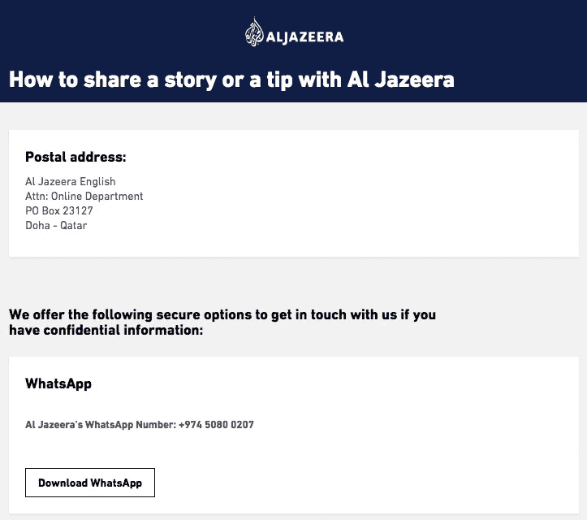
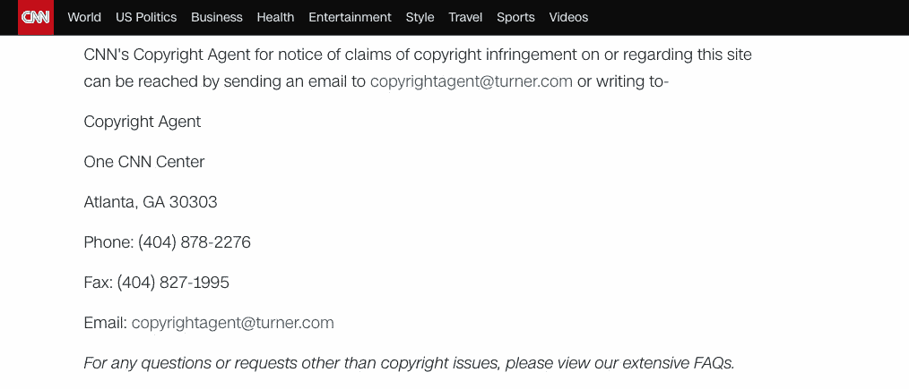
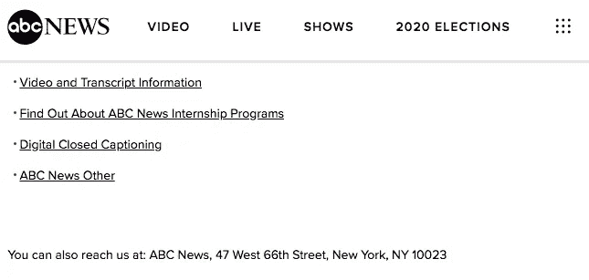
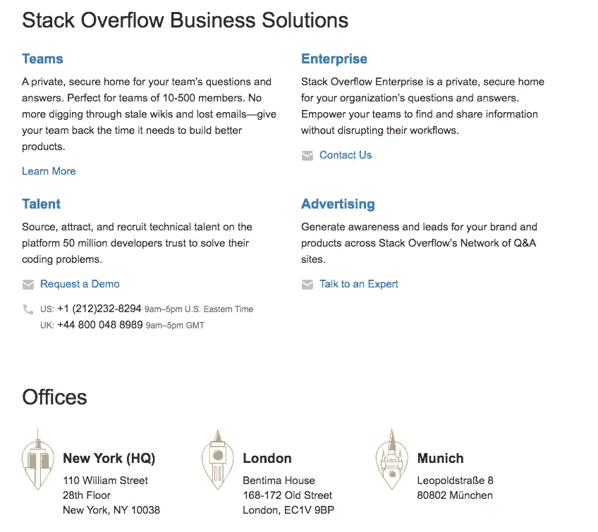
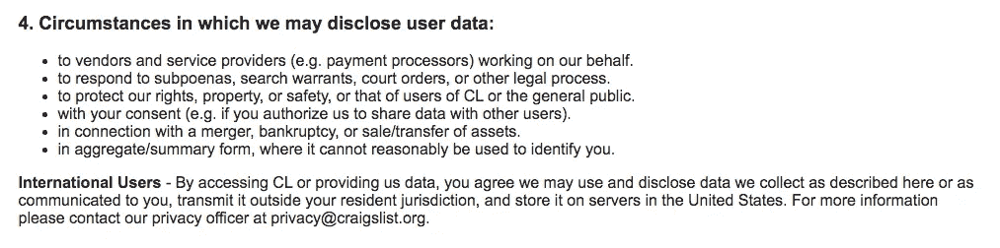

# 可访问性:地址、电话和其他不可访问的链接，以及在哪里可以找到它们

> 原文：<https://betterprogramming.pub/accessibility-addresses-telephones-and-other-inaccessible-links-and-where-to-find-them-b002cbff6c29>

## 链接是网站的核心，但是大多数链接在需要的地方没有被充分利用


# 什么是不可访问的链接？

链接是网站的主要元素，但许多网站没有充分利用它们的潜力。

提供电子邮件或电话，甚至地点或地址的链接会增加你网站的可用性，但更重要的是，它会增加你页面的可访问性！

人们不需要使用屏幕阅读器复制和粘贴文本，他们将能够自动跟随链接到达正确的位置，而无需更多的输入。

# 链接不可访问的著名网站

这些例子来自世界上一些最著名的网站，每天都有数百万甚至数十亿人使用。



半岛电视台上没有可访问的地址或 Whatsapp 号码



CNN 上没有可访问的电话号码



ABC 新闻上没有可访问的地址



堆栈溢出时没有可访问的电话号码和地址



Craigslist 上没有可用的电子邮件

在这个简短的介绍之后，我们将讨论你应该尝试使用的所有不同类型的链接，以提高你的 HTML 内容或页面的可访问性。

# 基本链接

链接到内部锚点或外部页面。你可以在这里阅读更多关于链接和按钮[](https://medium.com/better-programming/accessibility-web-links-should-be-links-and-web-buttons-should-be-buttons-182ff042d087#internalAnchor<!-- -->)

[](https://medium.com/better-programming/accessibility-web-links-should-be-links-and-web-buttons-should-be-buttons-182ff042d087#internalAnchor<!-- -->)

# [电子邮件链接](https://medium.com/better-programming/accessibility-web-links-should-be-links-and-web-buttons-should-be-buttons-182ff042d087#internalAnchor<!-- -->)

[它是第二种最常用的链接类型，提供了一种简单的发送电子邮件的方式，它已经被大多数开发者所熟知，但是在任何情况下:](https://medium.com/better-programming/accessibility-web-links-should-be-links-and-web-buttons-should-be-buttons-182ff042d087#internalAnchor<!-- -->)

```
<a href="myname@domain.com">Send me an email!</a>
```

[](https://medium.com/better-programming/accessibility-web-links-should-be-links-and-web-buttons-should-be-buttons-182ff042d087#internalAnchor<!-- -->)

# [电话线路](https://medium.com/better-programming/accessibility-web-links-should-be-links-and-web-buttons-should-be-buttons-182ff042d087#internalAnchor<!-- -->)

[以下是手机用户或使用 Skype 或类似软件的 PC 用户拨打电话号码的最快方法。](https://medium.com/better-programming/accessibility-web-links-should-be-links-and-web-buttons-should-be-buttons-182ff042d087#internalAnchor<!-- -->)

[前缀`tel`表示`telephone-uri`或电话用户 ID。](https://medium.com/better-programming/accessibility-web-links-should-be-links-and-web-buttons-should-be-buttons-182ff042d087#internalAnchor<!-- -->)

[你只需要记得加上前缀`tel:`。](https://medium.com/better-programming/accessibility-web-links-should-be-links-and-web-buttons-should-be-buttons-182ff042d087#internalAnchor<!-- -->)

```
<a href="tel:+447700900328">Call me at this number!</a>
```

[](https://medium.com/better-programming/accessibility-web-links-should-be-links-and-web-buttons-should-be-buttons-182ff042d087#internalAnchor<!-- -->)

# [短信链接](https://medium.com/better-programming/accessibility-web-links-should-be-links-and-web-buttons-should-be-buttons-182ff042d087#internalAnchor<!-- -->)

[这个链接和电话链接的格式一样，但是它是用来发送短信的。你甚至可以](https://medium.com/better-programming/accessibility-web-links-should-be-links-and-web-buttons-should-be-buttons-182ff042d087#internalAnchor<!-- -->)[自动在短信正文](http://thenewcode.com/856/Send-a-SMS-Text-From-A-Link)添加一些文字！

```
<a href="sms:+447700900328">Send me an SMS like the old times!</a>
```

# Whatsapp 链接

[Whatsapp](https://www.whatsapp.com/) 通过他们的子域名 wa.me 提供了一个直接链接，其中包含你的电话号码，但没有“+”，在这种情况下，是一个前缀为“39”的意大利号码。

```
<a href="https://wa.me/390123456789">Send me a message on Whatsapp!</a>
```

# 地址或地点链接

对于地址或位置，我们仍然没有一个合适的标准，但在许多情况下，提供一个指向谷歌地图网页的链接就足够了，对于无法使用这项服务的国家，如中国，您可以提供类似百度地图的替代链接。

标准的方法是使用纬度和经度坐标，因为它们可以在所有常见的地图提供商上使用。

[谷歌地图](https://www.google.com/maps)使用经纬度:

```
<a href="https://www.google.com/maps/place/80.145752,33.390435">
Came visit me on Svalbard!
</a>
```

对于百度来说，由于 mainland China 内部使用的不同标准，我们不能使用纬度和经度，奇怪的偏移仍然与冷战有关。

建议你打开[百度地图](https://map.baidu.com)，找到一个位置，复制你会在地址栏看到的网址，类似于:“[https://map . Baidu . com/@ 1580909.4439028562，5303807.420056639，6.99z](https://map.baidu.com/@12657184.502428884,3451822.87191514,13.57z) ”。

```
<a href="https://map.baidu.com/@1580909.4439028562,5303807.420056639,6.99z"> Came visit me in China! </a>
```

# 测试您的网站的可访问性问题！

有许多定制产品可以做到这一点，如 [Husable](http://bit.ly/accessibility_test_blind) 将为您的网站提供[真实的人工测试评估](http://bit.ly/accessibility_test_blind)，以发现自动工具不会发现或发现的真正问题，因为您只需要[人工](http://bit.ly/accessibility_test_blind)！

# 参考资料和资源

*   [https://www.w3schools.com/tags/tryit.asp?filename = try html _ link _ mailto](https://www.w3schools.com/tags/tryit.asp?filename=tryhtml_link_mailto)
*   [https://tools.ietf.org/html/rfc2806](https://tools.ietf.org/html/rfc2806)
*   [http://thenewcode.com/856/Send-a-SMS-Text-From-A-Link](http://thenewcode.com/856/Send-a-SMS-Text-From-A-Link)
*   [https://www.google.com/maps/place/80.145752,33.390435](https://www.google.com/maps/place/80.145752,33.390435)
*   [https://map . Baidu . com/@ 1580909.4439028562，5303807.420056639，6.99z](https://map.baidu.com/@12657184.502428884,3451822.87191514,13.57z)
*   [易访问性:网页链接应该是链接，网页按钮应该是按钮。](https://medium.com/better-programming/accessibility-web-links-should-be-links-and-web-buttons-should-be-buttons-182ff042d087)