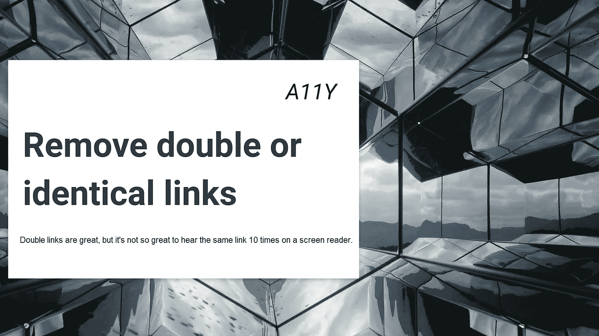
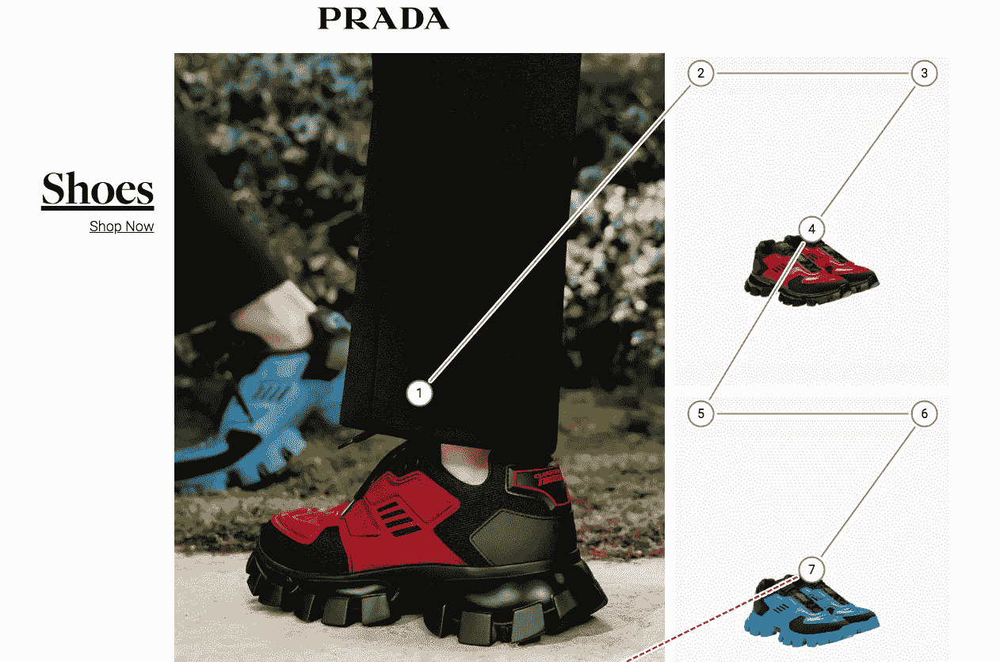
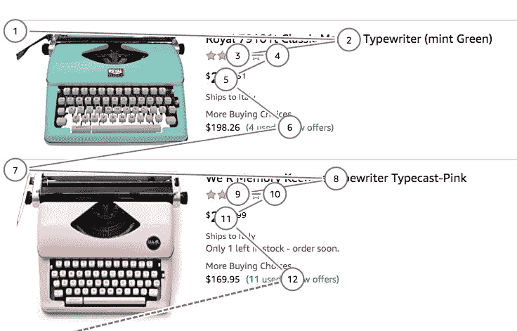

# 可访问性:你遇到过双重或三重链接吗？

> 原文：<https://betterprogramming.pub/accessibility-have-you-ever-encountered-double-or-triple-links-25fb5f4c3d66>

## 双链接对于普通用户来说很棒，但是如果你使用屏幕阅读器，它们就没那么有趣了



背景图片由 [drmakete la](https://unsplash.com/@drmakete) b 在 [Unsplash](https://unsplash.com/photos/hsg538WrP0Y) 上

# 双重链接的问题是

屏幕阅读器用户将使用页面的链接作为他们的主要导航点。提供简洁的链接，而不是两个或三个链接到同一个页面，这将有助于你的用户浏览网站。

一个正常的产品列表页面将显示 50 个产品。对于每个产品，假设有三个链接指向产品页面:一个链接指向产品标题，一个链接指向价格，一个链接指向评论。

如果我们将这三个链接乘以 50 个产品，我们会得到大约 150 个链接，我们的用户将不得不通过循环来找到正确的产品。他们会连续三次被同一个名字狂轰滥炸。



普拉达有每种产品的三个链接

许多电子商务网站都有这种行为。如普拉达网站顶部所示，每个数字都是你在屏幕阅读器上看到的一个链接。

同样的事情也会发生在像亚马逊这样的大型网站上，合并或禁用指向产品页面同一部分的几个链接会减少六个相同的链接。



亚马逊每种产品都有六个链接

# 如何修复双链接

你有两种简单的方法可以选择:

1.  禁用相邻图像和文本链接的`tabindex`
2.  组合相邻的图像和文本链接

# 禁用相邻图像和文本链接的 tabindex

要用 tab 键从一个元素的可选元素中删除一个链接，您必须添加代码`tabindex="-1"`。

```
<a href="http://foo.bar" tabindex="-1">inaccessible by tab link</a>
```

如果`tabindex`的值是一个负整数**，**用户代理必须设置元素的`tabindex`焦点标志，但是不应该允许使用顺序焦点导航到达元素，在 HTML5 规范中写[。](https://html.spec.whatwg.org/multipage/interaction.html#attr-tabindex)

# 组合相邻的图像和文本链接

许多链接都有彼此相邻的文本和图标——只是呈现在单独的`a`元素中。

从视觉上看，它们似乎是单个链接，但许多用户会将它们视为相邻的相同链接。对于键盘用户来说，浏览冗余链接是很乏味的。

对于辅助技术的用户来说，遇到连续的相同链接可能会感到困惑。当图标的替代文本是链接文本的副本时，它是重复的，因为屏幕阅读器会阅读描述两次。

您可以通过以下方式转换代码:

```
<a href="http://dope.dope">DOPE Shoe Red</a>
<a href="http://dope.dope"></a>
<a href="http://dope.dope">Learn more about Dope Shoe Red</a>
```

到只有一个[单链接](https://www.w3.org/TR/WCAG20-TECHS/H2.html)的更容易理解的版本:

```
<a href="http://dope.dope">
  <span>DOPE Shoe Red</span>
  
  <p>Learn more about Dope Shoe Red</p>
</a>
```

# 测试您的网站的可访问性问题！

有许多定制产品可以做到这一点，如 [Husable](http://bit.ly/accessibility_test_blind) 将为您的网站提供[真人测试评估](http://bit.ly/accessibility_test_blind)，以发现自动工具无法发现或发现的真正问题，因为[您只需要一个人](http://bit.ly/accessibility_test_blind)！

# 参考资料和资源

*   [https://html . spec . whatwg . org/multipage/interaction . html # attr-tabindex](https://html.spec.whatwg.org/multipage/interaction.html#attr-tabindex)
*   [https://www.w3.org/TR/WCAG20-TECHS/H2.html](https://www.w3.org/TR/WCAG20-TECHS/H2.html)